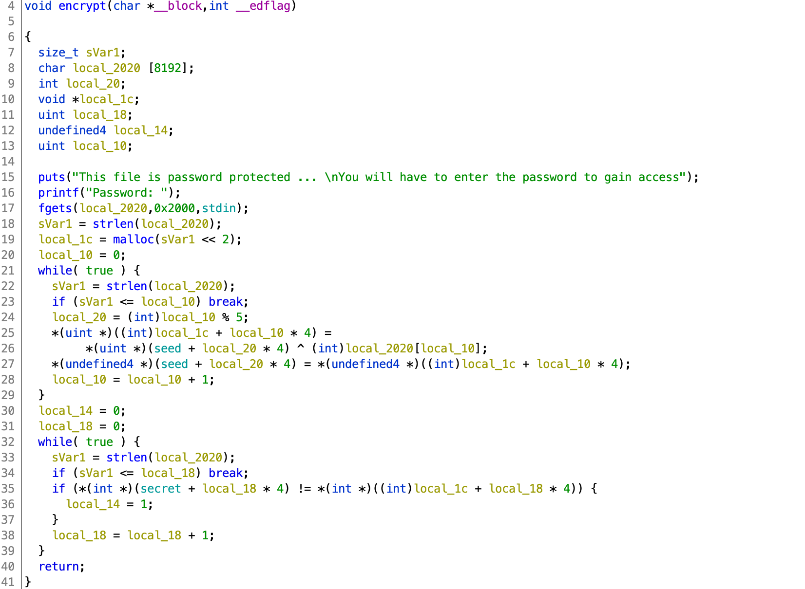

# AUCTF 2020

## Purple Socks

> 960
>
> We found this file hidden in a comic book store. Do you think you can reverse engineer it?
>
> We think it's been encrypted but we aren't sure.
>
> Author: nadrojisk
>
> 
> [purple_socks](purple_socks)

Tags: _rev_

### Solve

`purple_socks` is an "encrypted" binary.

Examining with `hexdump -C purple_socks | head -1`:

```
00000000  31 0b 02 08 4f 4f 4f 00  00 00 00 00 00 00 00 00  |1...OOO.........|
```

Three of the same bytes followed by zeros, smells like an ELF binary (also a safe assumption), e.g. `hexdump -C ../remote-school/online | head -1`:

```
00000000  7f 45 4c 46 01 01 01 00  00 00 00 00 00 00 00 00  |.ELF............|
```

Assuming single byte xor "encryption", to decode the key:

```
# echo $((0x4f ^ 0x01))
78
```

`78`, however, the `00`s appear to not be encrypted.

Decrypt:

```
#!/usr/bin/env python3

from itertools import cycle

binary = 'purple_socks'
f = open(binary,'rb')
encrypted = f.read()
f.close()

decrypted = [ a ^ b if not a == 0 else a for (a,b) in zip(encrypted,cycle([78])) ]

binary = 'purple_socks_elf'
f = open(binary,'wb')
f.write(bytearray(decrypted))
f.close()
```

Test with `file`:

```
# file purple_socks_elf
purple_socks_elf: ELF 32-bit LSB pie executable, Intel 80386, version 1 (SYSV),
dynamically linked, interpreter /lib/ld-linux.so.2, not stripped
```

Looks good, give it a go:

```
# ./purple_socks_elf
Please Login:
username: foo
password: bar
Error: Incorrect login credentials
```

Hmmmm.... `strings`, could it be that easy?  Yep:

```
URL: challenges.auctf.com, PORT: 30049
bucky:longing, rusted, seventeen, daybreak, furnace, nine, benign, homecoming, one, freight car
```

Looks like there's a remote server as well:

```
# nc challenges.auctf.com 30049
Please Login:
username: bucky
password: longing, rusted, seventeen, daybreak, furnace, nine, benign, homecoming, one, freight car
Welcome bucky

> [? for menu]: ?
    "help: Print help menu",
    "read <filename>: read filename",
    "ls: list current directory",
    "quit: Exit Terminal",
> [? for menu]: read flag.txt
This file is password protected ...
You will have to enter the password to gain access
Password: 
```

Ok, decompile with Ghidra and look for something interesting with the string `This file is password protected`:



`encrypt` just takes a password, then runs a transformation xoring `seed[index % 5]` while updating `seed[index % 5]` with the result of the xor.  A second loop compares this transformation with `secret`.

Brute-force it:

```
#!/usr/bin/env python3

secret = [0x0E,0x05,0x06,0x1A,0x39,0x7D,0x60,0x75,0x7B,0x54,0x18,0x6A]
seed = [0x61,0x75,0x63,0x74,0x66]

for i in range(len(secret)):
    for j in range(0x20,0x7F):
        bar = seed[i%5] ^ j
        if bar == secret[i]:
            print(chr(j), end='')
            seed[i%5] = bar
            break

print()
```

Password: `open_sesame`

Get the flag:

```
# nc challenges.auctf.com 30049
Please Login:
username: bucky
password: longing, rusted, seventeen, daybreak, furnace, nine, benign, homecoming, one, freight car
Welcome bucky

> [? for menu]: read flag.txt
This file is password protected ...
You will have to enter the password to gain access
Password: open_sesame
auctf{encrypti0n_1s_gr8t_12921}
```

Flag: `auctf{encrypti0n_1s_gr8t_12921}`