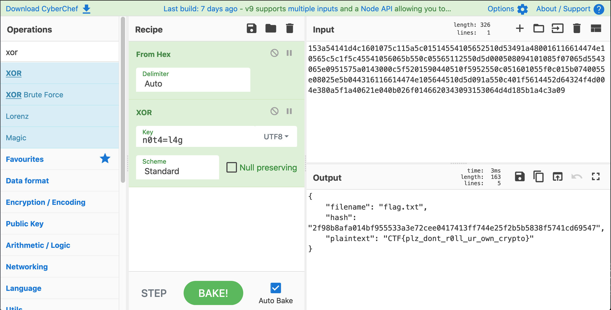

# BSidesSF 2020 CTF

## decrypto-1

> [Kerckhoffs's principle](https://en.wikipedia.org/wiki/Kerckhoffs%27s_principle) states that "A cryptosystem should be secure even if everything about the system, except the key, is public knowledge." So here's our unbreakable cipher.
>
> (author: matir)
>
> [`flag.txt.enc`](flag.txt.enc)<br />[`decrypto.py`](decrypto.py)

Tags: _crypto_, _101_

### Analysis

A quick scan of [`decrypto.py`](decrypto.py) reveals a simple XOR cipher (last line):

```
def encrypt(self, buf):
    if not isinstance(buf, bytes):
        raise TypeError('buf must be of type bytes!')
    stream = self.get_bytes(len(buf))
    return bytes(a ^ b for a, b in zip(buf, stream))
```

#### Perform a quick test:

Create a file `foo` with the contents `ABCD` and then type:

```
python decrypto.py 1234 foo bar
```

#### Instrument the code and print out `buf` and `stream`:

Before `return bytes...`:

`buf` = `b'{\n    "filename": "foo",\n    "hash": "e12e115acf4552b2568b55e93cbd39394c4ef81c82447fafc997882a02d23677",\n    "plaintext": "ABCD"\n}'` and the key (`stream`) = `b'1234123412341234123412341234123412341234123412341234123412341234123412341234123412341234123412341234123412341234123412341234123412'`

The output file `bar` is just `buf` XOR `stream` byte for byte.

The vulnerability is that the plain text for the first 16 (and possibly more) bytes are predictable.

Given:

_plaintext ^ key = ciphertext_

then:

_key = plaintext ^ ciphertext_ and _plaintext = ciphertext ^ key_

To get the key, XOR the encrypted flag text with the known text `{\n "filename": "flag.txt",\n "hash": ` and hope the key is shorter than that.

### Get Key

```
#include <stdio.h>

int main()
{
    char *s = "{\n    \"filename\": \"flag.txt\",\n    \"hash\": ";
    FILE *fp = fopen("flag.txt.enc","r");

    while(*s)
        putchar(*s++ ^ fgetc(fp));

    return 0;
}
```

Output:

```
n0t4=l4gn0t4=l4gn0t4=l4gn0t4=l4gn0t4=l4gn0
```

Clearly the key is `n0t4=l4g`, but this is not the flag.

### Get Flag: Be lazy and decrypt with CyberChef

First convert the encrypted text to hex:

```
xxd -p <flag.txt.enc | tr -d '\n'
```

Output:

```
153a54141d4c1601075c115a5c01514554105652510d53491a480016116614474e10565c5c1f5c45
541056065b550c05565112550d5d000508094101085f07065d5543065e0951575a0143000c5f5201
590440510f5952550c051601055f0c015b0740055e08025e5b044316116614474e105644510d5d09
1a550c401f5614452d64324f4d004e380a5f1a40621e040b026f0146620343093153064d4d185b1a
4c3a09
```

Cut/paste that into CyberChef and use the _From Hex_ and _XOR_ operations to decrypt and get the flag:



Flag: `CTF{plz_dont_r0ll_ur_own_crypto}`
