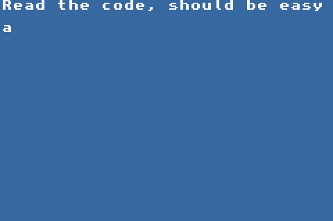
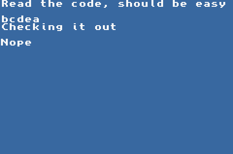

# DEF CON CTF Qualifier 2022

## not-so-advanced

[`not-so-advanced.gba`](not-so-advanced.gba)

Tags: _arm_ _arm32_ _gba_ _rom_ _rev_


## Summary

GBA, _groan..._

> I spend more time tooling up for these type of challenges than actually solving them.

With the help of teammate [dobs](https://github.com/dobsonj) I didn't have to do too much researching on tooling; [dobs](https://github.com/dobsonj) set me up with a Ghidra plugin [GhidraGBA](https://github.com/SiD3W4y/GhidraGBA) and found the functions of interest.  However, we still lost time finding GBA emulators and getting debuggers working with them.  I guess we could have just _Read the code, should be easy_, but I prefer to noodle my way through with a debugger to check my assumptions.  I ended up using [mGBA](https://mgba.io/) with its internal debugger (GDB had numerous problems with a stable and useful remote connection).


## Analysis

### Give it a go



From here you up/down/left/right to input a string of lowercase letters and underscores then enter with _start_ (or _return_ if not using a controller).

Then a check function, checks it out:




### Decompile with Ghidra

```
longlong main(void)
{
  int iVar1;
  uint in_lr;
  undefined auStack268 [256];
  undefined uStack12;
  
  FUN_080009cc();
  FUN_08000e74("Read the code, should be easy\n");
  uStack12 = 0;
  FUN_08000340(auStack268);
  FUN_08000e74("Checking it out\n");
  iVar1 = checkit(auStack268);
  if (iVar1 == 0x12e1) {
    FUN_08000e74("That works");
  }
  else {
    FUN_08000e74(&DAT_08005ce4);
  }
  return (ulonglong)in_lr << 0x20;
}
```

`main` does very little, just gets your input and passes to `checkit`, if `checkit` return `0x12e1`, then you've solve it.

```
undefined8 checkit(int param_1)
{
  int iVar1;
  ushort extraout_r1;
  ushort extraout_r1_00;
  uint uVar2;
  undefined4 in_lr;
  uint local_18;
  ushort local_14;
  ushort local_12;
  
  iVar1 = FUN_08001148(param_1);
  local_12 = 1;
  local_14 = 0;
  if (iVar1 == 9) {
    for (local_18 = 0; local_18 < 9; local_18 = local_18 + 1) {
      thunk_FUN_08000cc8((uint)local_12 + (uint)*(byte *)(param_1 + local_18),0xfff1);
      thunk_FUN_08000cc8((uint)local_14 + (uint)extraout_r1,0xfff1);
      local_14 = extraout_r1_00;
      local_12 = extraout_r1;
    }
    uVar2 = (uint)(local_14 ^ local_12);
  }
  else {
    uVar2 = 0xffffffff;
  }
  return CONCAT44(in_lr,uVar2);
}
```

Clearly we can tell from the loop that the input must be `9` in length, but then ...

_I got lazy_

`thunk_FUN_08000cc8` calls `FUN_08000ba0` (not shown) and that looked like a lot of work, so instead I set two break points with mGBA's debugger where `local_12` and `local_14` were being updated:

```
b 0x80002FA
b 0x800030C
```

Then looked at the values on stack:

```
r/2 0x03007DDE
r/2 0x03007DDC
```

It was easy to see a pattern:

```
local_12 += (uint)*(byte *)(param_1 + local_18) // input byte
local_14 += local_12
```

## Solve

```python3
#!/usr/bin/env python3

from itertools import product

for i in product('abcdefghijklmnopqrstuvwxyz_', repeat = 9):
    local_12 = 1
    local_14 = 0
    for j in i:
        local_12 += ord(j)
        local_14 += local_12
    if local_12 ^ local_14 == 0x12e1:
        print(''.join(i))
        break
```

Output:

```
aaaaaanzb
```

Check:


BTW, this is just one of 1000s that works, just remove the `break` from the solve above and see for yourself.
