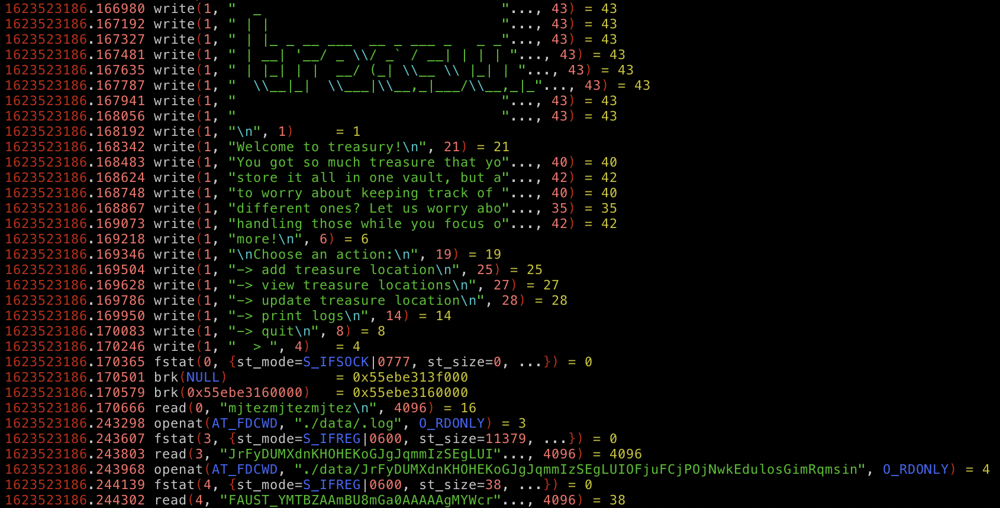

# FAUST CTF 2021

## /srv/treasury

This was an [Attack/Defense](https://2021.faustctf.net/information/attackdefense-for-beginners/) CTF.  There's no task description or Jeopardy-style scoring.  Just, attack, defend, and maintain SLAs.

Tags: _x86-64_ _a/d_ _rev_ _reflection_ _shameless_


## Summary

This service was taking me sometime to find an exploit, and before I could find it, we started to hemorrhage flags.

**Plan B: Stop the hemorrhage and reflect the attack.**

For a proper writeup checkout [https://ubcctf.github.io/2021/06/faustctf-treasury/](https://ubcctf.github.io/2021/06/faustctf-treasury/); writeup closing statement:

> _Unfortunately, this is also pretty much trivially reflectable by anyone paying attention to their incoming traffic, and there’s not much we can do to obfuscate this exploit, so we just decided to throw it quickly and hope to get a round or two before people started copying the exploit._

_Paying attention_ to our incoming traffic is precisely what we did, however the statement, _and there’s not much we can do to obfuscate this exploit_, is not entirely correct; we were able to mitigate this.


## Snooping the Hack

Snooping on this was trivial, just edit `/etc/systemd/system/treasury@.service`.

Change:

```
ExecStart=-/usr/bin/stdbuf -o0 /srv/treasury/treasury
```

to:

```
ExecStart=-/usr/bin/strace -ttt -f -ff -o /strace/treasurypwns /usr/bin/stdbuf -o0 /srv/treasury/treasury
```

and then restart with:

```bash
systemctl daemon-reload
```

This enables `strace` on the service and produces one discrete easy to follow file per PID:

```bash
# ls -l treasurypwns.* | head -5
-rw-r--r--      1 treasury  treasury     41811 Jun 12 09:44 treasurypwns.110935
-rw-r--r--      1 treasury  treasury     41811 Jun 12 09:44 treasurypwns.111793
-rw-r--r--      1 treasury  treasury     41811 Jun 12 09:44 treasurypwns.112414
-rw-r--r--      1 treasury  treasury     14711 Jun 12 09:45 treasurypwns.116262
-rw-r--r--      1 treasury  treasury     14018 Jun 12 09:45 treasurypwns.116379
...
```

Checking out the longer files reveals the input as describe in the aforementioned writeup, `mpteympteymptey`; however, it was not the only input; `mjtezmjtezmjtez` was a solution as well:



With this in hand, getting other's flags was now trivial.


## Mitigation

Without understanding exactly how this hack worked, mitigation was going to be a bit crude.

First we changed the service to listen to port `6790` from the original `6789`, then simply ran:

```
socat -ls tcp6-listen:6789,reuseaddr,fork system:/srv/treasury/fuckyou.sh
```

to listen to port `6789` with the following (`fuckyou.sh`) script to filter out the input:

```
sed -u 's/mpteympteymptey/fuckyou/g; s/mjtezmjtezmjtez/fuckyoutoo/g;' | nc -w15 :: 6790
```

That stopped 'em.
