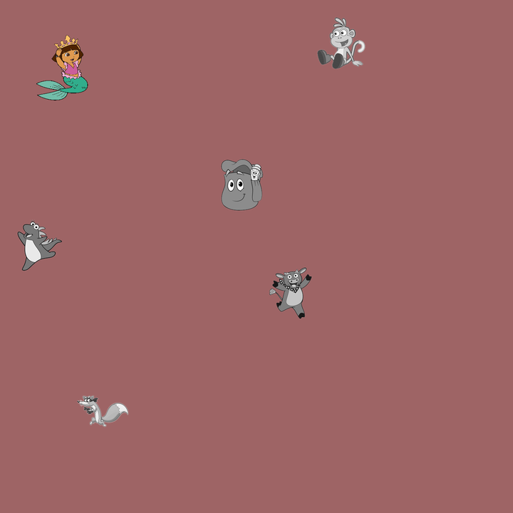

# nullcon HackIM 2020

## dora

```
Guess what? Dora is back and you'll have to find her to get the flag.

nc misc.ctf.nullcon.net 8000
```

Tags: _misc_, _computer vision_, _programming_

## Overview

On connection to the server you are greeted with:

`Where's Dora? 1 for upper right, 2 for upper left, 3 for lower left, 4 for lower right`

Followed by a base64 string and then a prompt for a number.

After base64 decoding and checking the output with _file_, you will end up with a 720x720 PNG, and with the exception of the last image, they will all be the same size, e.g.:

`base64 -d <`[`dora1.base64`](dora1.base64)` | file -`

`/dev/stdin: PNG image data, 720 x 720, 8-bit/color RGBA, non-interlaced`

[_dora1.png_](dora1.png):



Clearly Dora is in the _upper left_, so you enter `2`, get the next base64/png, and repeat until the 801th image which happens to be the flag (_NOTE: my team solved this before the "800" hint_ :-).


### Research

One of my teammates (_chrod_) quickly created an "app", or game, kind of like _wack a mole_, and quickly amassed the first 140 images.  The rest of us started to wonder if this was going to be a never ending quest, and was there something else to consider, so we looked at the raw base64, tried steg, etc... for about 15 min or so and eventually we just decided to automate this and assume this was the correct path.

After analyzing a random sample of the 140 cache of images, the following was apparent:

* The background color changed from image to image.
* Dora's location and form changed from image to image.
* Dora's furry friends did _not_ change form from image to image, and all five were present, but in different locations.
* Dora was not always in color.
* Dora's furry friends were never in color.


## Solution

### Prep

1. Take the first image, convert the background to red (no reason for that color), and then cut out the furries (this was done once (manually):

	
	
	
	
	

	_NOTE: Notice the antialiasing.  My first thought was to write my own Q&D image matching, but decided this problem (template matching) had already be solved, so I'd just used that._

### Loop

1. Get image, save a copy for debugging.
2. Convert background to red to help with template matching (unsure if that really makes a difference).
3. For each furry find them with OpenCV template matching and replace the bounding box with red.
4. Cut up the image into quads, and report the image that is not solid red as Dora's location.
5. Goto 1.

### Code

[`dora.py`](dora.py)

This code uses [pwnlib](https://docs.pwntools.com/en/stable/about.html#module-pwnlib) for the I/O and [opencv-python](https://pypi.org/project/opencv-python/) for the template matching and should be fairly easy to follow.

Start up, connect to server, wait for greeting:

```
#!/usr/bin/env python

from pwn import *
import base64
from PIL import Image
import numpy as np
import cv2

p = remote('misc.ctf.nullcon.net',8000)
p.recvuntil('Where\'s Dora? 1 for upper right, 2 for upper left, 3 for lower left, 4 for lower right',timeout=1)

count=0
doralog = open("dora.log","w")
```

Start of main loop, check for failure, save `dora.png` for debugging:

```
while 1:
    count=count+1
    p.recvline()
    image = p.recvline()

    if image.strip() == 'No flag for you':
        sys.exit(1)

    # save it for debug
    f = open("dora.png","w")
    f.write(base64.decodestring(image))
    f.close()
```

Read in image, convert to red background:

```
    # read image
    im = Image.open("dora.png")
    # get pixels
    px = im.load()

    # create cv image
    im = im.convert('RGBA')
    data = np.array(im)
    r, g, b, a = data.T

    # change bg to red
    bg = (r == px[0,0][0]) & (g == px[0,0][1]) & (b == px[0,0][2])
    data[...,:-1][bg.T] = (255, 0, 0)

    # new image with background red
    im = Image.fromarray(data)
```

Wipe out the furries by replacing them with red bounding rect:

```
    # the furries
    notdora = ["dora-bag.png","dora-cow.png","dora-dino.png","dora-fox.png","dora-monkey.png"]
    method = cv2.TM_SQDIFF_NORMED

    large_image = cv2.cvtColor(np.array(im), cv2.COLOR_RGB2BGR)

    # wipe out furries
    for i in notdora:
        small_image = cv2.imread(i)
        result = cv2.matchTemplate(large_image, small_image, method)
        mn,_,mnLoc,_ = cv2.minMaxLoc(result)
        MPx,MPy = mnLoc
        trows,tcols = small_image.shape[:2]
        #cv2.rectangle(large_image, (MPx,MPy),(MPx+tcols,MPy+trows),(0,0,255),-1)
        #cv2.rectangle(large_image, (MPx-2,MPy-2),(MPx+tcols+4,MPy+trows+4),(0,0,255),-1)
        # needed larger rect
        cv2.rectangle(large_image, (MPx-17,MPy-17),(MPx+tcols+17,MPy+trows+17),(0,0,255),-1)
```

> _NOTE: a few times OpenCV returned a smaller rect than what was required.  The hack was to just make it larger by 17 pixels, however if this had failed again, then I was going to replace with a loop that just expanded the rect until all sides were on red, but I got lucky, so I did not worry about it._

Create a blank red square to compare with and split up the image in to quads:

```
    # quads
    q = [0,0,0,0,0]
    border=5

    # blank red compare image
    q[0] = np.zeros((360-(border*2),360-(border*2),3),np.uint8)
    q[0][:] = (0,0,255)

    # quad up the image without furries
    q[1] = large_image[0+border:360-border,360+border:720-border]
    q[2] = large_image[0+border:360-border,0+border:360-border]
    q[3] = large_image[360+border:720-border,0+border:360-border]
    q[4] = large_image[360+border:720-border,360+border:720-border]
```

> _NOTE: the `border` (or margin) was added to do the matching within the quad to eliminate the "edge" case of where Dora's antialias bled into a 2nd quad.  As long as Dora was > 5 pixels, no worries._

Compare each quad with the reference quad (`q[0]`) above:

```
    # search for no match
    for i in range(1,5):
        diff = cv2.subtract(q[0],q[i])
        b, g, r = cv2.split(diff)
        if cv2.countNonZero(b) != 0 or cv2.countNonZero(g) != 0 or cv2.countNonZero(r) != 0:
            dora=i
            break
```

Log the results (for this writeup), and send Dora's location to the server for the next tile:

```
    line = "count: " + str(count) + " " + "dora: " + str(dora)
    doralog.write(line + '\n')
    print line
    p.sendline(str(dora))
```

Attribution:

The following was a huge time saver (_I apologize for other's missed, I cranked through this in ~2 hours, my notes were not that great_):

* [https://stackoverflow.com/questions/7853628/how-do-i-find-an-image-contained-within-an-image](https://stackoverflow.com/questions/7853628/how-do-i-find-an-image-contained-within-an-image)
* [https://opencv-python-tutroals.readthedocs.io/en/latest/py_tutorials/py_imgproc/py_template_matching/py_template_matching.html#template-matching](https://opencv-python-tutroals.readthedocs.io/en/latest/py_tutorials/py_imgproc/py_template_matching/py_template_matching.html#template-matching)


### Getting the flag

We had no idea if the flag was going to be text or an image.  I had removed the _save all output_ code before we got the flag, and since an image, I didn't bother putting it back in.

**The ugly stuff:**

```
OpenCV Error: Assertion failed (_img.size().height <= _templ.size().height && _img.size().width <= _templ.size().width) in matchTemplate, file /build/opencv-L2vuMj/opencv-3.2.0+dfsg/modules/imgproc/src/templmatch.cpp, line 1093
Traceback (most recent call last):
  File "./dora.py", line 60, in <module>
    result = cv2.matchTemplate(large_image, small_image, method)
cv2.error: /build/opencv-L2vuMj/opencv-3.2.0+dfsg/modules/imgproc/src/templmatch.cpp:1093: error: (-215) _img.size().height <= _templ.size().height && _img.size().width <= _templ.size().width in function matchTemplate

[*] Closed connection to misc.ctf.nullcon.net port 8000
```

That's pretty much how the run ended.  There was no `No flag for you` error, so my code just bombed out on the hard coded geometry values that did not apply to the flag image:


With more time, the code could have been less _result oriented_, but this _was_, a _time-constrained hacking competition_.

Runtime:

```
real    12m48.745s
user    4m50.059s
sys     0m40.848s
```

## Epilogue

Fun challenge, good points for little work.

I archived an entire run of images (800 Dora + 1 Flag) if you are interested in doing this yourself: [`dora_run.tgz`](dora_run.tgz), however, the organizers have release the [source](https://github.com/nullcon/hackim-2020/tree/master/misc/dora), so that may be a better path (thanks nullcon!).

I also included the output [`dora.log`](dora.log) that matches the images.  I was going to analyze Dora's movements for hidden messages or to check if truly random:

```
$ awk '{print $NF}' dora.log | sort | uniq -c

 220 1
 186 2
 189 3
 205 4
```

You decide.  Dora seems to be leaning to the _right_. :-)
 
Lastly you will find [`foo.py`](foo.py) here--this was my debug program.  Basically when I got `No flag for you`, I'd run `foo.py` and it would create all the intermediate images and quads for my visual inspection, then I'd change `foo.py` parameters until it passed `foo.py`, update `dora.py` and rerun.  I used `foo.py` 3 times (2x for bounding rect tuning, and once for margin hack).

Oh yeah, so, had the _hint_ of 800 steps been sooner, we'd have kocked this out using chrod's _wack-a-mole_ game, but since we didn't know, well ...  IOW, _hints_ matter.
