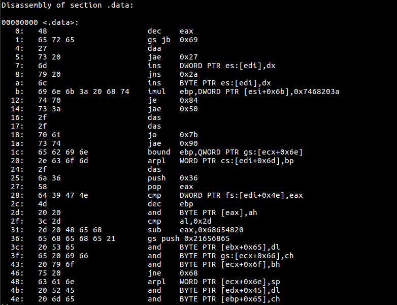

# pbctf 2020

## Not-stego

> 26
>
> Hallmark of a good CTF is inclusion of Steganography. You asked and we delivered, or didn't we?
>
> By: theKidOfArcrania
> 
> [profile.png](profile.png)

Tags: _rev_


## Solve



Just type in the bytes, and while typing them, notice they are all printable ASCII:

```
48
65 72 65
27
73 20
6d
79 20
6c
69 6e 6b 3a 20 68 74
74 70
73 3a
2f
2f
70 61
73 74
65 62 69 6e
2e 63 6f 6d
2f
6a 36
58
64 39 47 4e
4d
20 20
3c 2d
2d 20 48 65 68
65 68 65 68 65 21
20 53 65
65 20 69 66
20 79 6f
75 20
63 61 6e
20 52 45
20 6d 65
```

Then:

```bash
# cat bytes | xargs | xxd -r -p
Here's my link: https://pastebin.com/j6Xd9GNM  <-- Hehehehe! See if you can RE me

# curl https://pastebin.com/raw/j6Xd9GNM
Here's a flag for your efforts: pbctf{3nc0d1ng_w1th_ass3mbly}.
```


