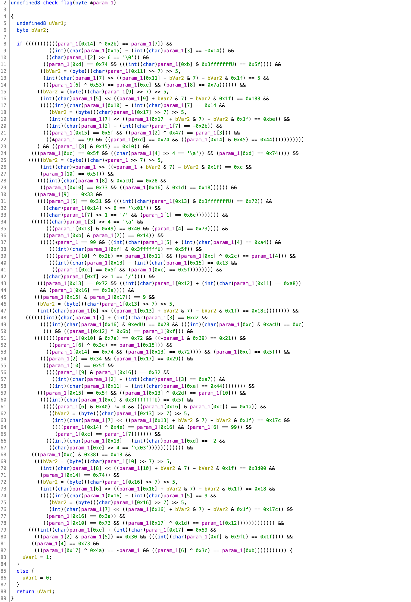
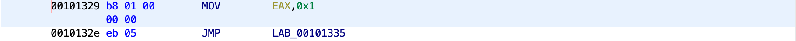

# SharkyCTF 2020

## z 3 r o b o t w a v e s

> 188
>
> I made a robot that can only communicate with "z3". He locked himself and now he is asking me for a password !
> 
> z 3 w a v e s
> 
> Creator : Nofix
>
> [z3_robot](z3_robot)

Tags: _rev_ _x86-64_ _angr_


## Summary

Textbook [angr.io](angr.io) solve.


## Analysis

### Checksec

### Decompile with Ghidra



That looks like a lot to reverse--let's not.

Clearly line 83 is our goal.  Line 83 disassembly:



> Target address is `0x401329` (angr will load x86-64 PIE code with a base address of `0x400000` whereas Ghidra defaults to `0x100000`).

## Solve

```
#!/usr/bin/python3

import angr, time, io

FIND_ADDR=0x401329
t=time.time()
binary = open('./z3_robot','rb').read()
proj = angr.Project(io.BytesIO(binary),auto_load_libs=False)
state = proj.factory.entry_state()
simgr = proj.factory.simulation_manager(state)
simgr.use_technique(angr.exploration_techniques.DFS())
simgr.explore(find=FIND_ADDR)
print(simgr.found[0].posix.dumps(0))
print(time.time() - t,end="")
print(" seconds")
```

This is textbook angr, just set `FIND_ADDR` and go.

> Read the [angr docs](https://docs.angr.io/) for more info.

Output:

```
# ./sol.py
WARNING | 2020-05-29 03:26:51,407 | cle.loader | The main binary is a position-independent executable. It is being loaded with a base address of 0x400000.
b'cl4ss1c_z3___t0_st4rt_:)'
4.874553680419922 seconds
root@dbd0c5265977:/pwd/datajerk/sharkyctf2020/z3robot# ./z3_robot
      \_/
     (* *)
    __)#(__
   ( )...( )(_)
   || |_| ||//
>==() | | ()/
    _(___)_
   [-]   [-]   Z3 robot says :z3 Z3Z3z3 Zz3 zz33 3Z Passz3rd? Zz3 zZ3 3Z Z3Z3z
-> cl4ss1c_z3___t0_st4rt_:)
      \_/
     (* *)
    __)#(__
   ( )...( )(_)
   || |_| ||//
>==() | | ()/
    _(___)_
   [-]   [-]   Z3 robot says :
Well done, valdiate with shkCTF{cl4ss1c_z3___t0_st4rt_:)}
```

Flag in less than 5 seconds:

[](https://asciinema.org/a/BmsSNR1oIh9U4LNIZmidsNfaK)