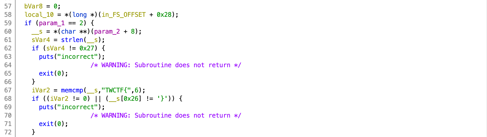
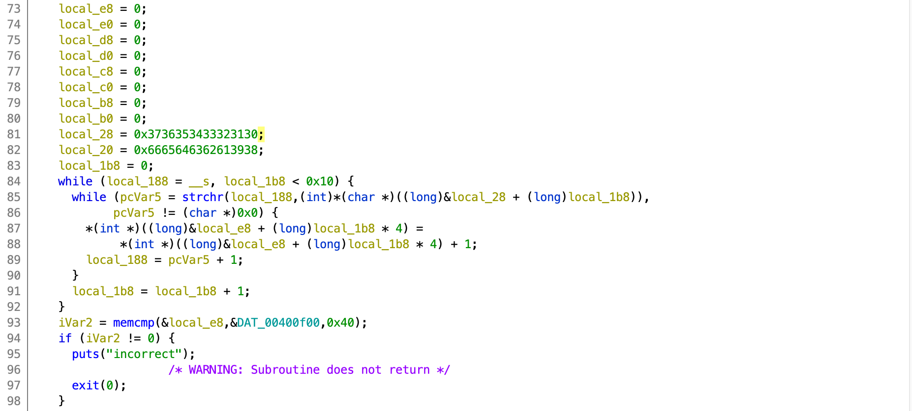
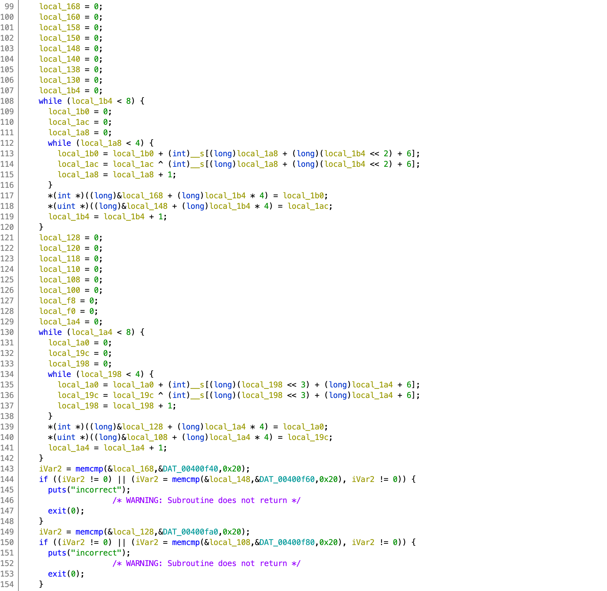
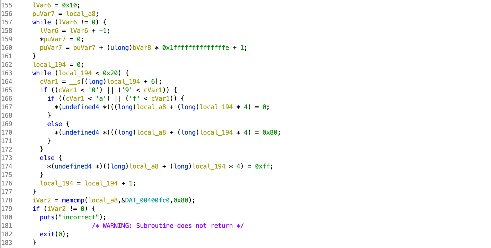
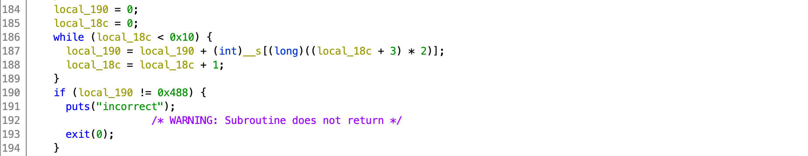
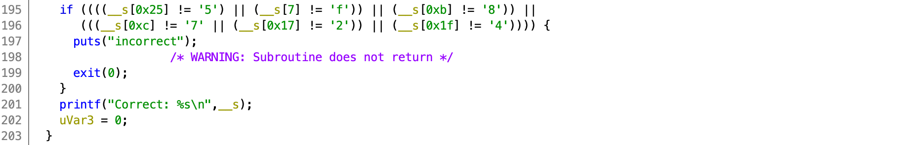

## Easy Crack Me

_Cracking is easy for you._

[`easy_crack_me`](easy_crack_me)

Tags: _rev_ _z3_

### Preamble

Props: Liveoverflow's [Z3 video](https://youtu.be/TpdDq56KH1I)

This _crackme_ takes a single argument, runs it through 8 constraints, and if all 8 pass, you have the flag.  _There is only one flag._

In the interest of brevity, I will show each constraint as unmodified Ghidra decompiled output, my attempt to _clean_ it up for readability/portability ([foo.c](foo.c) and [bar.h](bar.h)), and the section of Python/Z3 code that represents the constraint (for constraints 4-8), before disclosing the entire solution and the flag.

To get started, watch your favorite [Ghidra](https://www.nsa.gov/resources/everyone/ghidra/) [video](https://vimeo.com/335158460), create a project, import the binary, and ignore any suggestions to _disable printing of type casts_--this will yield code that may not compile, or compile with warning, and/or give incorrect results.

### Solution

> If you just want the answer, the code, and prefer to learn that way (I highly support that way of learning), then jump to the end.
> 
> If you want to follow my thought process, read on.

Within Ghidra the function of interest is `FUN_00400747`.  It is too long to inline here, click [`easy_crack_me.c`](easy_crack_me.c) to view.

#### Constraints 1 and 2

##### Ghidra



> Frequently in Ghidra decompiled output there will be `+ 8` and `+ 4`.  This usually indicates and array.  The `param_2 + 8` is `argv[1]`.

You can ignore `FS_OFFSET` at the start and the end the code, this is just for the stack canary.

The 1st constraint is that the flag must be `0x27` (39) characters in length.

The 2nd constraint is that the flag start with `TWCTF{` and end with `}`.  So, we need to find the enclosing 32 characters.

#### Constraint 3

##### Ghidra



Literals are another Ghidra decompiler challenge.  After looking at the code, `local_e8` is really a `uint32_t` array with 16 elements.  And `local_28` a character array.  The (not shown) `undefined8` in the variable declaration at the top of code is just a catch all.  This is why you want to leave the type casts in the decompiled output to help figure this out.

##### `foo.c`

```
    uint32_t pass1_check[] = { 0, 0, 0, 0, 0, 0, 0, 0, 0, 0, 0, 0, 0, 0, 0, 0 };
    char valid_chars[] = "0123456789abcdef";    // 0x3736353433323130; // 0x6665646362613938;
```
```
        loop_counter1 = 0;
        while (char_pointer = flag, loop_counter1 < 16) {
            while (pcVar5 = strchr(char_pointer, (int) *(char *) ((long) &valid_chars + (long) loop_counter1)), pcVar5 != (char *) 0x0) {
                pass1_check[loop_counter1] += 1;
                char_pointer = pcVar5 + 1;
            }
            loop_counter1 = loop_counter1 + 1;
        }
```
```
        iVar2 = memcmp(&pass1_check, &DAT_00400f00, 64);
        if (iVar2 != 0) {
            puts("incorrect 3 does not have the correct number of each 0..f");
            exit(0);
        }
```

`foo` with correct sized argument output:

```
0  1  3
1  2  2
2  1  2
3  0  0
4  2  3
5  2  2
6  0  1
7  2  3
8  3  3
9  1  1
a  2  1
b  4  3
c  2  1
d  2  2
e  2  2
f  4  3
try: TWCTF{00011224445567778889abbbcddeefff}
{0, 0, 0, 1, 1, 2, 2, 4, 4, 4, 5, 5, 6, 7, 7, 7, 8, 8, 8, 9, a, b, b, b, c, d, d, e, e, f, f, f, }
incorrect 3 does not have the correct number of each 0..f
```

This constraint checks for the right number of `0`,`1`,...`f` characters by comparing the counters with the `DAT_00400f00` table.  That is 176243969782620087828480000000 permutations.  I checked, just in case this was brute forcible at this point. :-)

The table `DAT_00400f00` has to be pulled from the Ghidra disassembly listing (see [bar.h](bar.h)):

```
uint32_t DAT_00400f00[]={
0x03,
0x02,
0x02,
0x00,
0x03,
0x02,
0x01,
0x03,
0x03,
0x01,
0x01,
0x03,
0x01,
0x02,
0x02,
0x03,
};
```

If you rerun `foo` with the suggested (`try`) argument, you'll pass this constraint but fail on the next.


##### Python/Z3

I could not think of a quick way to code up this constraint in Z3.  With the limited time for this CTF (all CTFs :-), I decided to focus on all the other constraints, then see if I could generate a list of candidates to reduce the search surface and bruce force.  I was correct in my assumption, there are only 84 solutions that satisfy all the other constraints.


#### Constraints 4 and 5

##### Ghidra



There are two computation blocks and two comparison blocks.

`locals` `168`, `148`, `128`, and `108` are 8 element `uint_32t` arrays.

##### `foo.c`

I moved the checks with the computation for easier explanation.

```
    uint32_t pass2_check_a[] = { 0, 0, 0, 0, 0, 0, 0, 0 };
    uint32_t pass2_check_b[] = { 0, 0, 0, 0, 0, 0, 0, 0 };
    uint32_t pass3_check_a[] = { 0, 0, 0, 0, 0, 0, 0, 0 };
    uint32_t pass3_check_b[] = { 0, 0, 0, 0, 0, 0, 0, 0 };
```
```
        loop_counter2 = 0;
        while (loop_counter2 < 8) {
            local_1b0 = 0;
            local_1ac = 0;
            local_1a8 = 0;
            while (local_1a8 < 4) {
                local_1b0 = local_1b0 + (int) flag[(long) local_1a8 + (long) (loop_counter2 << 2) + 6];
                local_1ac = local_1ac ^ (int) flag[(long) local_1a8 + (long) (loop_counter2 << 2) + 6];
                local_1a8 = local_1a8 + 1;
            }
            pass2_check_a[loop_counter2] = local_1b0;
            pass2_check_b[loop_counter2] = local_1ac;
            loop_counter2 = loop_counter2 + 1;
        }

        iVar2 = memcmp(&pass2_check_a, &DAT_00400f40, 32);
        if ((iVar2 != 0) || (iVar2 = memcmp(&pass2_check_b, &DAT_00400f60, 32), iVar2 != 0)) {
            puts("incorrect 4");
            exit(0);
        }
```

The above creates 8 sums and 8 repeated xor with the following indexes:

```
0 1 2 3
4 5 6 7
8 9 10 11
12 13 14 15
16 17 18 19
20 21 22 23
24 25 26 27
28 29 30 31
```

Below is the same, however with these indexes:

```
0 8 16 24
1 9 17 25
2 10 18 26
3 11 19 27
4 12 20 28
5 13 21 29
6 14 22 30
7 15 23 31
```

```
        loop_counter3 = 0;
        while (loop_counter3 < 8) {
            local_1a0 = 0;
            local_19c = 0;
            local_198 = 0;
            while (local_198 < 4) {
                local_1a0 = local_1a0 + (int) flag[(long) (local_198 << 3) + (long) loop_counter3 + 6];
                local_19c = local_19c ^ (int) flag[(long) (local_198 << 3) + (long) loop_counter3 + 6];
                local_198 = local_198 + 1;
            }
            pass3_check_a[loop_counter3] = local_1a0;
            pass3_check_b[loop_counter3] = local_19c;
            loop_counter3 = loop_counter3 + 1;
        }

        iVar2 = memcmp(&pass3_check_a, &DAT_00400fa0, 32);
        if ((iVar2 != 0) || (iVar2 = memcmp(&pass3_check_b, &DAT_00400f80, 32), iVar2 != 0)) {
            puts("incorrect 5");
            exit(0);
        }
```

After the computation the arrays are compared with `DAT_00400f40`, `DAT_00400f60`, `DAT_00400fa0`, and `DAT_00400f80`.

The `DAT_` tables are just bytes.  Based on what is being compared, they need to be transformed.  IIRC, in all cases the tables were `uint32_t`. 

##### Python/Z3

```
# check 4 row sum/xor

DAT_00400f40 = [
0x5e + 256 * 0x01,
0xda + 256 * 0x00,
0x2f + 256 * 0x01,
0x31 + 256 * 0x01,
0x00 + 256 * 0x01,
0x31 + 256 * 0x01,
0xfb + 256 * 0x00,
0x02 + 256 * 0x01
]

s.add(m[0]  +  m[1] +  m[2] +  m[3] == DAT_00400f40[0])
s.add(m[4]  +  m[5] +  m[6] +  m[7] == DAT_00400f40[1])
s.add(m[8]  +  m[9] + m[10] + m[11] == DAT_00400f40[2])
s.add(m[12] + m[13] + m[14] + m[15] == DAT_00400f40[3])
s.add(m[16] + m[17] + m[18] + m[19] == DAT_00400f40[4])
s.add(m[20] + m[21] + m[22] + m[23] == DAT_00400f40[5])
s.add(m[24] + m[25] + m[26] + m[27] == DAT_00400f40[6])
s.add(m[28] + m[29] + m[30] + m[31] == DAT_00400f40[7])

DAT_00400f60 = [ 0x52, 0x0c, 0x01, 0x0f, 0x5c, 0x05, 0x53, 0x58 ]

s.add(m[0]  ^  m[1] ^  m[2] ^  m[3] == DAT_00400f60[0])
s.add(m[4]  ^  m[5] ^  m[6] ^  m[7] == DAT_00400f60[1])
s.add(m[8]  ^  m[9] ^ m[10] ^ m[11] == DAT_00400f60[2])
s.add(m[12] ^ m[13] ^ m[14] ^ m[15] == DAT_00400f60[3])
s.add(m[16] ^ m[17] ^ m[18] ^ m[19] == DAT_00400f60[4])
s.add(m[20] ^ m[21] ^ m[22] ^ m[23] == DAT_00400f60[5])
s.add(m[24] ^ m[25] ^ m[26] ^ m[27] == DAT_00400f60[6])
s.add(m[28] ^ m[29] ^ m[30] ^ m[31] == DAT_00400f60[7])


# check 5 row sum/xor

DAT_00400fa0 = [
0x29 + 256 * 0x01,
0x03 + 256 * 0x01,
0x2b + 256 * 0x01,
0x31 + 256 * 0x01,
0x35 + 256 * 0x01,
0x0b + 256 * 0x01,
0xff + 256 * 0x00,
0xff + 256 * 0x00
]

s.add(m[0] +  m[8] + m[16] + m[24] == DAT_00400fa0[0])
s.add(m[1] +  m[9] + m[17] + m[25] == DAT_00400fa0[1])
s.add(m[2] + m[10] + m[18] + m[26] == DAT_00400fa0[2])
s.add(m[3] + m[11] + m[19] + m[27] == DAT_00400fa0[3])
s.add(m[4] + m[12] + m[20] + m[28] == DAT_00400fa0[4])
s.add(m[5] + m[13] + m[21] + m[29] == DAT_00400fa0[5])
s.add(m[6] + m[14] + m[22] + m[30] == DAT_00400fa0[6])
s.add(m[7] + m[15] + m[23] + m[31] == DAT_00400fa0[7])

DAT_00400f80 = [ 0x01, 0x57, 0x07, 0x0d, 0x0d, 0x53, 0x51, 0x51 ]

s.add(m[0] ^  m[8] ^ m[16] ^ m[24] == DAT_00400f80[0])
s.add(m[1] ^  m[9] ^ m[17] ^ m[25] == DAT_00400f80[1])
s.add(m[2] ^ m[10] ^ m[18] ^ m[26] == DAT_00400f80[2])
s.add(m[3] ^ m[11] ^ m[19] ^ m[27] == DAT_00400f80[3])
s.add(m[4] ^ m[12] ^ m[20] ^ m[28] == DAT_00400f80[4])
s.add(m[5] ^ m[13] ^ m[21] ^ m[29] == DAT_00400f80[5])
s.add(m[6] ^ m[14] ^ m[22] ^ m[30] == DAT_00400f80[6])
s.add(m[7] ^ m[15] ^ m[23] ^ m[31] == DAT_00400f80[7])
```

The logic here should be apparent and inline with `foo.c` and the explanation above.  I did not have time to figure out the better Python/Z3 way to dynamically generate the constraints, so I created a small script to generate the Python code.


#### Constraint 6

##### Ghidra



This was pretty easy to work out.  Basically its a check for alpha or digit.  I did not bother cleaning up this code.

##### Python/Z3

```
def is_valid_alpha(x):
    return And(
        (x >= ord('a')),
        (x <= ord('f')))

def is_valid_digit(x):
    return And(
        (x >= ord('0')),
        (x <= ord('9')))

DAT_00400fc0 = [
0x80, 0x80, 0xff, 0x80, 0xff, 0xff, 0xff, 0xff,
0x80, 0xff, 0xff, 0x80, 0x80, 0xff, 0xff, 0x80,
0xff, 0xff, 0x80, 0xff, 0x80, 0x80, 0xff, 0xff,
0xff, 0xff, 0x80, 0xff, 0xff, 0xff, 0x80, 0xff
]

for i in range(0,flag_len):
    if DAT_00400fc0[i] == 0x80:
        s.add(is_valid_alpha(m[i]))
    else:
        s.add(is_valid_digit(m[i]))
```


#### Constraint 7

##### Ghidra



Again, easy to work out.  The sum of the ASCII values of every other character of the flag = `0x488`.

##### Python/Z3

```
s.add(m[0]+m[2]+m[4]+m[6]+m[8]+m[10]+m[12]+m[14]+m[16]+m[18]+m[20]+m[22]+m[24]+m[26]+m[28]+m[30] == 0x488)
```

#### Constraint 8

##### Ghidra



This basically tells you exactly what and where 6 of the characters are.

##### Python/Z3

```
s.add(m[0x25-6] == ord('5'))
s.add(m[0x07-6] == ord('f'))
s.add(m[0x0b-6] == ord('8'))
s.add(m[0x0c-6] == ord('7'))
s.add(m[0x17-6] == ord('2'))
s.add(m[0x1f-6] == ord('4'))
```

#### The Main Loop

```
while s.check() == z3.sat:
    model = s.model()
    nope = []

    flag = 'TWCTF{'
    for i in m:
        if model[i] != None:
            flag+=chr(model[i].as_long()&0xff)
            nope.append(i!=model[i])
    flag+='}'

    print flag
    popen = Popen(["./easy_crack_me", flag],stderr=STDOUT,stdout=PIPE)
    output = popen.stdout.readline()
    if output.find('incorrect') == 0:
        popen.terminate()
        s.add(Or(nope)) # exclude from search
        continue

    print output
    break
```

After all the constraints are defined, then let Z3 do its magic.  This loop will continue to run if there is a solution that satisfies the constraints but is _not_ the correct flag, by testing with the [`easy_crack_me`](easy_crack_me) binary.

If you remove the check, this code will produce all 84 possible solutions that satisfy all constraints.

Run it:

`time `[`solve.py`](solve.py)

```
TWCTF{df2b4877e72ad91c02f8ef6004a684a5}
TWCTF{df2b5876a74cd91c42b8df6104c484a5}
TWCTF{df2b5876a74cd93a42b8df4304c484a5}
TWCTF{df2b5876e70cd91c02f8df6104c484a5}
TWCTF{df2b4877e70cd91c02f8ef6004c484a5}
TWCTF{df2b4877e71bd91c02f8ef6004b584a5}
Correct: TWCTF{df2b4877e71bd91c02f8ef6004b584a5}

real    0m0.224s
user    0m0.110s
sys     0m0.050s
```

